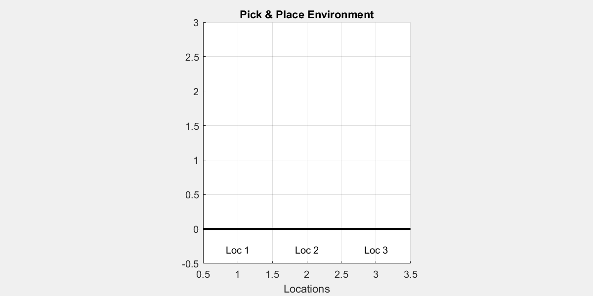
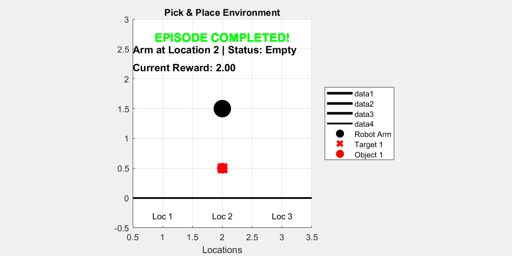
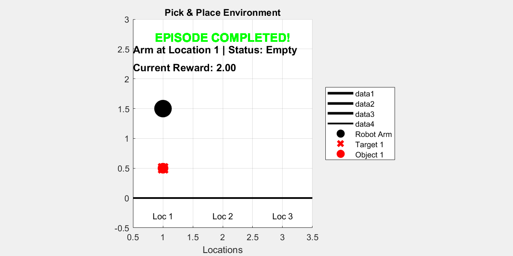
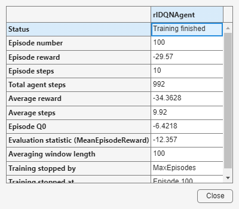
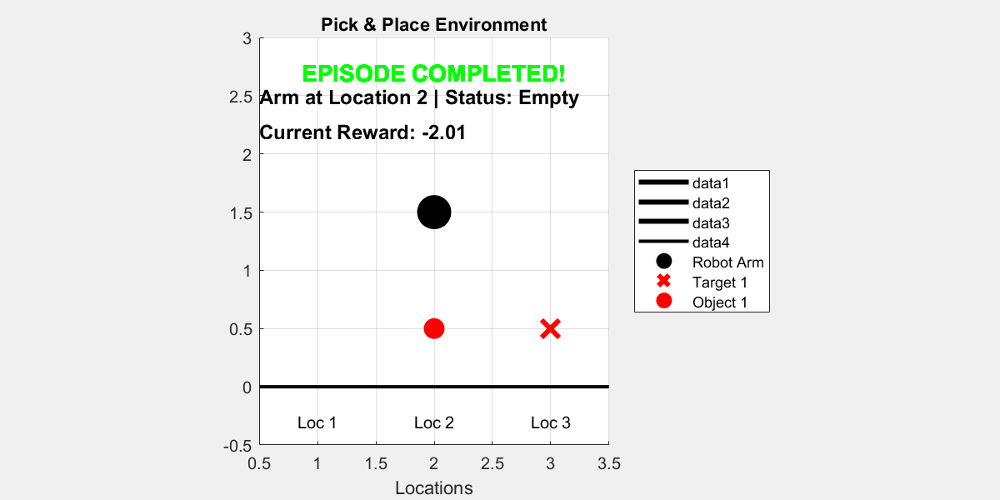

# Reinforcement Learning for task planning

**Reinforcement Learning** is a machine learning paradigm where an **agent** learns by interacting with an **environment**, receiving **rewards** (feedback) based on the consequences of its actions.


In reinforcement learning, the environment is typically modeled as a **Markov Decision Process (MDP)**. This means that the probability of transitioning to the next state depends only on the current state and action, not on the full history of past states. This is known as the **Markov property**, and it implies that the current state contains all the necessary information for optimal decision\-making, **simplifying the computation**.


At each time step $t$ , the agent:

-  Observes a state $s_t$  
-  Chooses an action $a_t$ 
-  Receives a reward $r_{t+1}$ 
-  Transitions to a new state $s_{t+1}$ 

The goal is to learn a  **policy** $\pi \left(a|s\right)$  that maximizes the **cumulative future rewards**.


The training process involves the agent exploring the environment by trying different actions and observing the outcomes. Using this experience, the agent updates its policy to favor actions that lead to higher rewards. This is often done through algorithms that estimate the expected return of actions, such as Q\-learning or policy gradient methods.


To succeed, an agent must balance the tradeoff between **exploration** —trying unfamiliar actions to discover their effects—and **exploitation** —choosing actions known to yield high reward.


 **Why Use Reinforcement Learning for Task Planning in** ***Pick and Place*****?**


In robotic tasks like *pick and place*, the robot needs to make decisions step by step to move an object from one location to another. It may have to avoid obstacles, act precisely, and adapt to changing conditions in the environment. Reinforcement learning (RL) offers several advantages for this kind of task planning:

1.   **It can handle noise in sensors or actions:** In a real\-world environment, cameras may produce inaccurate images, detections might be noisy, and the robotic arm might not execute actions exactly as intended. Reinforcement learning allows the robot to learn how to act effectively even when its observations or actions are imperfect.
2. **It can adapt efficiently to failures:** If the robot tries to grasp an object and fails, or if the object slips and falls, a traditional planner might need to recompute a full new plan. In contrast, an agent trained with reinforcement learning follows a learned policy that allows it to respond dynamically and take another action without re\-planning from scratch.
3. **It is well suited for stochastic environments:** In robotics, actions are often not deterministic: moving the arm to a certain position may result in different outcomes depending on the environment (e.g., if other objects are moving, or if external forces are present). RL is specifically designed to learn in environments where actions do not always produce the same result.
4. **It makes step\-by\-step decisions and is efficient at execution time:** Once trained, the agent does not need to compute a complete plan at every step. It simply observes the current state and chooses the best action according to its policy. This allows the robot to act quickly and efficiently in real time, without heavy computation during execution.

**Lesson Goal**


In this lesson, the student will implement the core components of the `PickPlaceDiscreteEnv` environment, which simulates a robotic arm tasked with moving objects to target positions along a discrete one\-dimensional grid.


The agent will be trained using the **DQN algorithm**, and later enhanced with **Hindsight Experience Replay (HER)** to improve learning in sparse\-reward scenarios.

# Installation

**Install Reinforcement Learning Toolbox**


To complete this lesson, you need the **Reinforcement Learning Toolbox**™.


If you haven't installed it yet, follow these steps:

1.  Open MATLAB.
2. Go to the **Home** tab.
3. Click on **Add\-Ons > Get Add\-Ons**.
4. Search for **"Reinforcement Learning Toolbox**™**"** and click **Install**.

**Verify Installation in Code**


You can run the following code to check whether the toolbox is installed:

```matlab
toolboxTable = matlab.addons.installedAddons;
if ~any(contains(toolboxTable.Name, "Reinforcement Learning Toolbox"))
    error(['Reinforcement Learning Toolbox is not installed.\n' ...
           'Please install it via Add-On Explorer (Home > Add-Ons > Get Add-Ons).']);
else
    disp("✅ Reinforcement Learning Toolbox is installed.");
end
```

```matlabTextOutput
✅ Reinforcement Learning Toolbox is installed.
```


# Creating an environment
## Exercise 1 \- Initializing the Environment State:

In this first exercise, you will implement a function that resets the environment state and returns an initial observation.


The state of our environment is composed of **four elements**, which represent what the reinforcement learning agent "sees" at each time step:


 **1.** **`this.arm_pos`** **— Robot Arm Position** 


Indicates the current position of the robotic arm.


Its value is an integer between `1` and `num_locations`.


At the beginning of each episode, this value is randomly selected from that range.


 **2.** **`this.arm_state`** **— Arm Holding State** 


Indicates whether the robot arm is holding an object.


Its value ranges from `0` to `num_objects`:

-  `0` means the arm is empty. 
-  `1` means it is holding **object 1**, 
-  `2` means it is holding **object 2**, and so on.The arm always starts empty, so the default value is `0`. 

 **3.** **`this.objects_pos`** **— Current Object Positions** 


An array that indicates the current position of each object.

-  `objects_pos(1)` is the position of **object 1**, 
-  `objects_pos(2)` is the position of **object 2**, and so on. 

These positions are assigned randomly at the beginning, but **must meet two conditions**:

-  No two objects can be placed at the same location. 
-  No object can start in the same location as the robot arm. 

 **4.** **`this.target_pos`** **— Target Positions for the Objects** 


An array that indicates the **goal position** for each object:

-  `target_pos(1)` is the goal for **object 1**, 
-  `target_pos(2)` is the goal for **object 2**, and so on. 

These target positions are also random but must satisfy:

-  No two objects can share the same goal location. 
-  An object’s target position cannot be the same as its **initial** position. 

**Task**


Your goal is to write the logic that generates the initial state for these four variables (`arm_pos`, `arm_state`, `objects_pos`, and `target_pos`) following the constraints described above.


This initial state will be returned by the `reset()` function of the environment.


**Hints**


You may find the following MATLAB functions useful for implementing this exercise:

-  `randi` – to generate random integers within a range. 
-  `randperm` – to generate random permutations. 
-  `setdiff` – to remove specific values from a set . 

```matlab
 %Reset environment to initial state and output initial observation
 function [this, InitialObservation] = resetFunc(this)

    % Randomize initial arm position (1-based indexing)

    % Generate valid positions for objects (excluding arm position)

    % Ensure enough valid positions for all objects
   

    % Generate target positions (each different from its corresponding object position)
    this.target_pos = zeros(this.num_objects, 1);
    assigned_targets = [];  % Keep track of already assigned targets to avoid repetitions

    % Build initial observation vector
    InitialObservation = [this.arm_pos;this.arm_state;this.objects_pos; this.target_pos];
    this.State = InitialObservation;

end
```

```matlab
% Reset environment to initial state and output initial observation
function [this, InitialObservation] = resetFuncSolution(this)
    this.arm_state = 0; % 0 = empty, >0 = holding object

    % Randomize initial arm position (1-based indexing)
    this.arm_pos = randi([1,this.num_locations]);

    % Generate valid positions for objects (excluding arm position)
    valid_positions = setdiff(1:this.num_locations, this.arm_pos);

     % Initialize map of objects (all locations empty)
     this.map_objects = zeros(this.num_locations, 1);

    % Ensure enough valid positions for all objects
    if length(valid_positions) >= this.num_objects
        % Select random positions for objects (no overlap, not at arm)
        selected_indices = randperm(length(valid_positions), this.num_objects);
        this.objects_pos = valid_positions(selected_indices)';
        for i = 1:this.num_objects
            this.map_objects(this.objects_pos(i)) = i;
        end
    else
        error('Not enough valid positions for objects');
    end

    % Generate target positions (each different from its corresponding object position)
    this.target_pos = zeros(this.num_objects, 1);
    assigned_targets = [];  % Keep track of already assigned targets to avoid repetitions

    for i = 1:this.num_objects
        % Valid target positions exclude the current object position and already assigned targets
        valid_targets = setdiff(1:this.num_locations, [this.objects_pos(i), assigned_targets]);
        % Select random target from valid positions
        selected_index = randperm(length(valid_targets), 1);
        this.target_pos(i) = valid_targets(selected_index);
        % Add this target to assigned targets
        assigned_targets = [assigned_targets, this.target_pos(i)];
    end

    % Build initial observation vector
    InitialObservation = [this.arm_pos;this.arm_state;this.objects_pos; this.target_pos];
    this.State = InitialObservation;

end
```

### Testing Reset Function
```matlab
test = tests.TestResetFuncPickPlaceEnv;
test.ResetFuncHandle = @resetFuncSolution;
result = run(test);
```

```matlabTextOutput
Running tests.TestResetFuncPickPlaceEnv
.....
Done tests.TestResetFuncPickPlaceEnv
__________
```

## **Exercise 2 – Implementing the Step Function:**

In this exercise, you will implement the **step function** for the environment, which defines how the environment transitions from one state to another in response to an action taken by the agent.


The agent interacts with the environment using discrete actions:


 **Action 1: Pick** 


The robot arm attempts to pick up an object at its current position.


This action is only valid if:

-  The arm is empty. 
-  There is an object at the arm’s position. 

**Action 2: Place**


The robot arm attempts to place the currently held object at its current position.


This action is only valid if:

-  The arm is holding an object. 
-  The target position is empty. 

**Actions 3 and above: Move to Location**


The robot arm moves to a new location.


These actions map to moving the arm to a specific location. However, since actions `1` and `2` are already reserved for **pick** and **place**, the location index must be derived by subtracting an offset of `2` from the action value.

-  For example: 
-  `Action 3` → move to `location 1` 
-  `Action 4` → move to `location 2` 
-  `Action 5` → move to `location 3` 

**Task**


Your goal is to write the logic of the `step()` function that performs the following:

-  Executes the action specified by the input `Action` 
-  Updates the internal state of the environment accordingly 
-  Returns the new state 

**Hints**

-  Use  "`Action - 2"` to compute the target location index for movement actions. 
```matlab
function [this, Observation, Reward, IsDone, Info] = stepFucntion(this, Action)

    % Handle pick action
    if Action == 1 
       
    % Handle place action
    elseif Action == 2

     % Handle move to location action
    elseif Action > 2 
       

    end


    % Build new observation vector
    Observation = [this.arm_pos;this.arm_state;this.objects_pos; this.target_pos];

    % Compute reward using external reward function
    Reward = RewardFunc({this.State}, {Action}, {Observation});
    % Store the current reward for visualization
    this.CurrentReward = Reward;
    % Check if episode is done using external function
    IsDone = IsDoneFunc({this.State}, {Action}, {Observation});
    % Update system states
    this.State = Observation;
    Info = [];

    % Update internal done flag
    this.IsDone = IsDone;
    
end
```

```matlab
function [this, Observation, Reward, IsDone, Info] = stepFuncSolution(this, Action)

    % Handle pick action
    if Action == 1 % pick
        % Arm must be empty and there must be an object at the arm's position
        if this.arm_state == 0 && this.map_objects(this.arm_pos) > 0
            obj_index = this.map_objects(this.arm_pos);
            % Pick up the object
            this.arm_state = obj_index;
            this.map_objects(this.arm_pos) = 0;
            this.objects_pos(obj_index) = 0; % 0 means object is being carried
        end

        % Handle place action
    elseif Action == 2 % place
        % Arm must be holding an object and the location must be empty
        if this.arm_state > 0 && this.map_objects(this.arm_pos) == 0
            obj_index = this.arm_state;
            new_obj_pos = this.arm_pos;
            current_target_pos = this.target_pos(obj_index);
            % Place the object at the current arm position
            this.map_objects(new_obj_pos) = obj_index;
            this.objects_pos(obj_index) = new_obj_pos;
            this.arm_state = 0; % Arm is now empty
        end

        % Handle move to location action
    elseif Action > 2 % move to location
        is_holding_obj = this.arm_state > 0;
        obj_index = this.arm_state;

        new_location = Action - 2; % Actions 3,4,5,... map to locations 1,2,3,...
        % Move the arm to the new location
        this.arm_pos = new_location;

    end

    % Build new observation vector
    Observation = [this.arm_pos;this.arm_state;this.objects_pos; this.target_pos];

    % Compute reward using external reward function
    Reward = RewardFunc({this.State}, {Action}, {Observation});
    % Store the current reward for visualization
    this.CurrentReward = Reward;
    % Check if episode is done using external function
    IsDone = IsDoneFunc({this.State}, {Action}, {Observation});
    % Update system states
    this.State = Observation;
    Info = [];

    % Update internal done flag
    this.IsDone = IsDone;

    
end
```

### Testing Step Function
```matlab
test = tests.TestStepFuncPickPlaceEnv;
test.StepFuncHandle = @stepFuncSolution;
result = run(test);
```

```matlabTextOutput
Running tests.TestStepFuncPickPlaceEnv
........
Done tests.TestStepFuncPickPlaceEnv
__________
```

## **Exercise 3 – Implementing the IsDone Function:**

In this **short** exercise (only one line of code), you will implement a function that checks whether the task has been successfully completed. This function will be called at every time step and should return `true` if the goal has been achieved, and `false` otherwise.


This logic is useful for signaling the end of an episode in reinforcement learning.


In this task, we assume there is **only one object** in the environment.


**Hint**


You can access the state values using `NextState{1}`. For example, to access the first value, use `NextState{1}(1)`.


```matlab
function isdone = IsDoneFunc(State, Action, NextState)
    %isdone = .... you only need to complete this line
    isdone = IsDoneFuncSolution(State, Action, NextState);
end

```

```matlab
function isdone = IsDoneFuncSolution(State, Action, NextState)
    isdone = NextState{1}(3) == NextState{1}(4);
end
```

### Testing IsDone Function
```matlab
test = tests.TestIsDoneFuncPickPlaceEnv;
test.IsDoneFuncHandle = @IsDoneFuncSolution;
result = run(test);
```

```matlabTextOutput
Running tests.TestIsDoneFuncPickPlaceEnv
..
Done tests.TestIsDoneFuncPickPlaceEnv
__________
```

## Understanding Reward Function

The reward function is designed to guide the learning agent step by step toward completing the task, while penalizing unproductive or invalid actions. It provides both **positive feedback for progress** and **penalties for mistakes**, effectively shaping the agent's behavior over time.


At the beginning of each step, the agent receives a **penalty of \-2 for each object that is not yet in its target position**. This encourages the agent to reduce the number of misplaced objects as quickly as possible.


To incentivize progress, small positive rewards are added for every subgoal achieved:

-  **+0.5** for moving the arm toward an object that is not in its goal location. 
-  **+1** for picking up such an object (provided it is not already correctly placed). 
-  **+1.5** for moving the object toward its goal location. 
-  **Final reward of +2** is granted when the task is fully completed (i.e., all objects are in their target locations). 

**Penalties for Invalid Actions**


To discourage poor behavior, the agent is penalized:

-  **−5** for invalid actions such as: 
-  Trying to pick an object when there’s none. 
-  Trying to pick when already holding something. 
-  Trying to place an object where another one already exists. 
-  **−0.01** for inefficient or redundant movements, such as moving to the same location. 

**Overall Purpose**


The goal of this reward function is to serve as a kind of **heuristic distance to the goal**. By providing intermediate rewards and penalties, it helps the reinforcement learning agent understand **which actions bring it closer to the objective**, and which ones are wasteful or harmful. This structured feedback is essential for effective learning in complex environments.

```matlab
function reward = RewardFunc(State, Action, NextState)

    % Check if the task has been completed
    isdone = IsDoneFunc(State, Action, NextState);
    
    if isdone
        % If the task is done, give a high positive reward
        reward = 2;
    else
        % Start from zero reward and adjust based on the action
        reward = 0;
        
        % Extract current state information
        arm_pos = State{1}(1);            % Current position of the robotic arm
        arm_state = State{1}(2);          % Whether the arm is holding an object
        objects_pos = State{1}(3);      % Current positions of the two objects
        target_pos = State{1}(4);       % Target positions of the two objects
        
        Action = Action{1};               % Extract the scalar action value

        % Action 1: Pick an object
        if Action == 1
            % Check if there is an object at the arm's position
            [hasObject, idx] = hasObjectAtPosition(objects_pos, arm_pos);

            % Valid pick: arm is empty and there's an object to pick
            if arm_state == 0 && hasObject
                % Positive reward if the object is not already at its target
                if target_pos(idx) ~= arm_pos 
                    reward = reward + 1;
                else
                    % Penalty for picking an object that is already in its goal location
                    reward = reward - 5;
                end
            else
                % Invalid pick (either arm is not empty or no object present)
                reward = reward - 5;
            end

        % Action 2: Place an object
        elseif Action == 2
            [hasObject, idx] = hasObjectAtPosition(objects_pos, arm_pos);
            
            % Valid place: arm is holding an object and location is empty
            if arm_state > 0 && ~hasObject
                obj_index = arm_state;  % Object being held
                % No extra reward added here, reward handled below if state becomes "done"
            else
                % Invalid place (trying to place on an occupied position or while arm is empty)
                reward = reward - 5;
            end

        % Action > 2: Move the arm to another location
        elseif Action > 2
            is_holding_obj = arm_state > 0;
            obj_index = arm_state;
            new_location = Action - 2;  % Convert action number to location index

            [hasObject, idx] = hasObjectAtPosition(objects_pos, new_location);

            if arm_pos == new_location
                % Penalize unnecessary movement to the current position
                reward = reward - 0.01;

            elseif is_holding_obj && new_location == target_pos(obj_index)
                % Reward for moving directly toward the goal with the object
                reward = reward + 1.5;

            elseif ~is_holding_obj && hasObject && target_pos(idx) ~= new_location
                % Reward for moving toward an object that needs to be picked
                reward = reward + 0.5;

            else
                % Slight penalty for other types of movement
                reward = reward - 0.01;
            end
        end

        % Final penalty for any objects that are not at their target positions
        objects_pos = NextState{1}(3);
        target_pos = NextState{1}(4);

        for i = 1:length(objects_pos)
            if objects_pos(i) ~= target_pos(i)
                reward = reward - 2;
            end
        end
    end
end

function [hasObject, idx] = hasObjectAtPosition(objects_pos, position)
    % Check if there's any object at the specified position
    % objects_pos: array containing object positions [obj1_pos, obj2_pos, ...]
    % position: position to check
    % Returns: hasObject (true if there's an object at the position, false otherwise)
    %          idx (index of the object if found, -1 otherwise)

    idx = find(objects_pos == position, 1); % Encuentra el primer índice
    if ~isempty(idx)
        hasObject = true;
    else
        hasObject = false;
        idx = -1;
    end
end
```

# Training a model

**Fix Random Number Stream for Reproducibility**


The example code might involve computation of random numbers at various stages. Fixing the random number stream at the beginning of various sections in the example code preserves the random number sequence in the section every time you run it, and increases the likelihood of reproducing the results. For more information, see [Results Reproducibility](https://es.mathworks.com/help/reinforcement-learning/ug/train-reinforcement-learning-agents.html#mw_cfb4600e-9d19-4e4e-89c8-2749894fee3a).


Fix the random number stream with seed `0` and random number algorithm Mersenne Twister. For more information on controlling the seed used for random number generation, see [`rng`](https://es.mathworks.com/help/matlab/ref/rng.html).

```matlab
previousRngState = rng(0,"twister");
```


**Creating an instance of the environment**


This line creates an instance of a custom pick\-and\-place environment.

```matlab
env_pick_place = PickPlaceDiscreteEnv2(1, 3, @stepFuncSolution, @resetFuncSolution);
```




**Creating a DQN Agent**


Here, we define the agent that will learn to interact with the environment.

-  `obsInfo` and `actInfo` provide the structure of the observation and action spaces, respectively. 
-  `rlDQNAgent` creates a Deep Q\-Network (DQN) agent, which approximates the optimal Q\-value function using a neural network. 
```matlab
obsInfo = getObservationInfo(env_pick_place);
actInfo = getActionInfo(env_pick_place);
dqnAgent = rlDQNAgent(obsInfo,actInfo);
```


**Configuring Agent Parameters**


These settings control the behavior and learning dynamics of the agent:

-  **Epsilon\-greedy exploration**: Starts with full exploration (`Epsilon = 1.0`) and gradually reduces it to encourage exploitation as learning progresses. 
-  **Mini\-batch size**: Number of experiences sampled from the replay buffer during each training step. 
-  **Learning rate**: Controls how quickly the critic network updates. 
-  **Gradient threshold**: Prevents exploding gradients during training by setting a limit on the magnitude. 
```matlab
dqnAgent.AgentOptions.EpsilonGreedyExploration.Epsilon = 1.0;
dqnAgent.AgentOptions.EpsilonGreedyExploration.EpsilonMin = 0.01;
dqnAgent.AgentOptions.EpsilonGreedyExploration.EpsilonDecay = .0001;
dqnAgent.AgentOptions.MiniBatchSize = 32;
dqnAgent.AgentOptions.CriticOptimizerOptions.LearnRate = 5e-4;
dqnAgent.AgentOptions.CriticOptimizerOptions.GradientThreshold = 10;
```


**Configuring Training Parameters**


These options define how the training will be carried out:

-  The agent will be trained for up to 100 episodes, each lasting at most 29 steps. 
-  Training will automatically stop early if the average score exceeds 1.9. 
```matlab
maxEpisodes = 100;
maxStepsPerEpisode = 20;
trainOpts = rlTrainingOptions(...
    MaxEpisodes=maxEpisodes, ...
    MaxStepsPerEpisode=maxStepsPerEpisode, ...
    Verbose=false, ...
    ScoreAveragingWindowLength=100,...
    Plots="training-progress",...
    StopTrainingCriteria="EvaluationStatistic",...
    StopTrainingValue=1.9);   
```


An evaluation policy is added to periodically test the agent’s performance in a deterministic way:

-  Every 50 episodes, the agent is evaluated over 10 episodes using fixed random seeds. 
```matlab
evaluator = rlEvaluator( ...
    EvaluationFrequency=50, ...
    NumEpisodes=10, ...
    RandomSeeds=101:110);
```

**Starting training**

```matlab
trainingStats = train(dqnAgent, env_pick_place, trainOpts, Evaluator=evaluator);
```




**Visualize the trained agent interacting with the environment**

```matlab
 
plot(env_pick_place)

for i = 1:10
    rng();
    simOptions = rlSimulationOptions(MaxSteps=15);
    sim(env_pick_place, agent, simOptions);
    
    pause(1); 
end
```

```matlabTextOutput
ans = struct with fields:
     Type: 'twister'
     Seed: 0
    State: [625x1 uint32]

ans = struct with fields:
     Type: 'twister'
     Seed: 0
    State: [625x1 uint32]

ans = struct with fields:
     Type: 'twister'
     Seed: 0
    State: [625x1 uint32]

ans = struct with fields:
     Type: 'twister'
     Seed: 0
    State: [625x1 uint32]

ans = struct with fields:
     Type: 'twister'
     Seed: 0
    State: [625x1 uint32]

ans = struct with fields:
     Type: 'twister'
     Seed: 0
    State: [625x1 uint32]

ans = struct with fields:
     Type: 'twister'
     Seed: 0
    State: [625x1 uint32]

ans = struct with fields:
     Type: 'twister'
     Seed: 0
    State: [625x1 uint32]

ans = struct with fields:
     Type: 'twister'
     Seed: 0
    State: [625x1 uint32]

ans = struct with fields:
     Type: 'twister'
     Seed: 0
    State: [625x1 uint32]

```




**Saving the model**

```matlab
save('dqn_1_object.mat', 'dqnAgent');
```


**Loading the model**

```matlab
load('dqn_1_object.mat', 'dqnAgent');
```
# Using HER to train a model

In reinforcement learning (RL), *sparse reward settings* present a major challenge. In these environments, agents receive non\-zero rewards only when they achieve very specific goal states. This means that during training, the agent may perform many actions without receiving any meaningful feedback, making it difficult to learn effective policies.


**Hindsight Experience Replay (HER** is a powerful technique to address this problem. The main idea behind HER is to *reinterpret failed episodes as if they were successful*, by changing the goal during replay. For example, suppose the agent was trying to reach goal **g** but ended up in a different final state **s′**. Instead of discarding this trajectory as a failure, HER allows us to relabel the experience by pretending that the agent’s goal was actually **g′ = s′**, the final state it did reach.


By doing this, the agent can still learn something useful from the episode, even if it didn't reach the original goal. This dramatically increases the number of informative training examples, especially in environments with sparse rewards.


In MATLAB, HER can be implemented by modifying the replay buffer to store alternative goals and generate additional training data during experience replay.


[Her documentation](https://es.mathworks.com/help/reinforcement-learning/ref/rl.replay.rlhindsightreplaymemory.html)


**Creating a DQN Agent**

```matlab
obsInfo = getObservationInfo(env_pick_place);
actInfo = getActionInfo(env_pick_place);
herAgent = rlDQNAgent(obsInfo,actInfo);
```


**Configuring Agent Parameters**

```matlab
herAgent.AgentOptions.EpsilonGreedyExploration.Epsilon = 1.0;
herAgent.AgentOptions.EpsilonGreedyExploration.EpsilonMin = 0.01;
herAgent.AgentOptions.EpsilonGreedyExploration.EpsilonDecay = 0.0001;
herAgent.AgentOptions.MiniBatchSize = 32;
herAgent.AgentOptions.CriticOptimizerOptions.LearnRate = 5e-4;
herAgent.AgentOptions.CriticOptimizerOptions.GradientThreshold = 10;

```

### **Adding Hindsight Experience Replay (HER)**

To integrate **Hindsight Experience Replay (HER)** in MATLAB's Reinforcement Learning Toolbox, there are a few important components you must define:


&nbsp;&nbsp;&nbsp;&nbsp;&nbsp;&nbsp;&nbsp;&nbsp; 1. A custom **reward function** with the following format:

```
function reward = RewardFunc(State, Action, NextState)
```

This function calculates the scalar reward given the current `State`, the executed `Action`, and the resulting `NextState`. These inputs must be passed **as cell arrays**, for example:


`State     = {[``1` `,` `0` `,` `1` `,` `3``]};`


`Action    = {1``};`


`NextState = {[1` `,` `1` `,` `0` `,` `3``]};`


This format is required by HER because it extracts subgoals and checks conditions using explicit indexing.


&nbsp;&nbsp;&nbsp;&nbsp;&nbsp;&nbsp;&nbsp;&nbsp; 2. A **terminal condition functio** n to determine whether an episode has ended:

```
function isdone = IsDoneFunc(State, Action, NextState)

```

This function should return `true` if the goal is considered achieved or the episode is otherwise over. Like the reward function, it also uses cell arrays as input.


 *In this case, both* *`RewardFunc`* *and* *`IsDoneFunc`* ***were already implemented correctly*** *beforehand.*


&nbsp;&nbsp;&nbsp;&nbsp;&nbsp;&nbsp;&nbsp;&nbsp; 3. Specify what the **goal condition** looks like so that HER can replace the real goal with a hindsight goal in the replay buffer.

```matlab
% State = [arm_pos, arm_state, obj_pos, target_pos]
% We define the goal as "obj_pos == target_pos"
% Channel = 1 (because we have one observation vector)
% Indices = 3 (object position), 4 (target position)

goalConditionInfo = {{1, [3], 1, [4]}};
```

 This means: in channel 1, the elements at index 3 (object position) should match the elements at index 4 (target position) in channel 1.


```matlab
rewardFcn = @RewardFunc;
isDoneFcn = @IsDoneFunc;
bufferLength = 5e4;
herAgent.ExperienceBuffer = rlHindsightReplayMemory(obsInfo,actInfo,...
    rewardFcn,isDoneFcn,goalConditionInfo,bufferLength);
```


**Configuring Training Parameters**

```matlab
maxEpisodes = 100;
maxStepsPerEpisode = 20;
trainOpts = rlTrainingOptions(...
    MaxEpisodes=maxEpisodes, ...
    MaxStepsPerEpisode=maxStepsPerEpisode, ...
    Verbose=false, ...
    ScoreAveragingWindowLength=100,...
    Plots="training-progress",...
    StopTrainingCriteria="EvaluationStatistic",...
    StopTrainingValue=1.9);   
```

```matlab
evaluator = rlEvaluator( ...
    EvaluationFrequency=50, ...
    NumEpisodes=10, ...
    RandomSeeds=101:110);
```

**Start Training**

```matlab
trainingStats = train(herAgent, env_pick_place, trainOpts, Evaluator=evaluator);
```




**Visualize the trained agent interacting with the environment**

```matlab
plot(env_pick_place)

for i = 1:10
    rng();
    simOptions = rlSimulationOptions(MaxSteps=15);
    sim(env_pick_place, herAgent, simOptions);
    
    pause(1); 
end
```




In this simple example with **only one object**, using **DQN with or without Hindsight Experience Replay (HER)** does **not show a significant difference** in performance. 


However, when training with **two objects**, the task becomes more complex and rewards are sparser. In this case:

-  **DQN alone** struggles to learn. 
-  **DQN with HER** learns significantly faster and more reliably. 

HER helps by transforming failed episodes into useful experiences.


**Saving the model**

```matlab
save('dqn_her_1_object.mat', 'herAgent');
```

**Loading the model**

```matlab
load('dqn_her_1_object.mat', 'herAgent');
```
# Two objects with HER 

In this section, we extend the previous implementation of **Hindsight Experience Replay (HER)** to handle **two objects** in a discrete pick\-and\-place environment. 


We start by defining a new environment with **2 objects** and **6 positions**:

```matlab
env_pick_place = PickPlaceDiscreteEnv2(2, 6, @stepFuncSolution, @resetFuncSolution);
```


**Creating a DQN Agent**

```matlab
obsInfo = getObservationInfo(env_pick_place);
actInfo = getActionInfo(env_pick_place);
herv2Agent = rlDQNAgent(obsInfo,actInfo);
```


**Configuring Agent Parameters**

```matlab
herv2Agent.AgentOptions.EpsilonGreedyExploration.Epsilon = 1.0;
herv2Agent.AgentOptions.EpsilonGreedyExploration.EpsilonMin = 0.005;
herv2Agent.AgentOptions.EpsilonGreedyExploration.EpsilonDecay = 0.0008;
herv2Agent.AgentOptions.MiniBatchSize = 32;
herv2Agent.AgentOptions.CriticOptimizerOptions.LearnRate = 5e-4;
herv2Agent.AgentOptions.CriticOptimizerOptions.GradientThreshold = Inf;

```

## Adding Hindsight Experience Replay (HER)

To enable HER with **two objects**, we need to modify the reward function, terminal condition (`IsDoneFunc`), and the goal condition information.


**Reward function**


In the reward function, we only need to change this code:


Original for one object:

```
objects_pos = State{1}(3);
target_pos = State{1}(4);
```

Updated for two objects:

```
objects_pos = State{1}(3:4);
target_pos = State{1}(5:6);
```

**IsDone function**


Original

```
function isdone = PickPlaceIsDoneFunc(State, Action, NextState)
    isdone = NextState{1}(3) == NextState{1}(4) ;
end
```

Updated:

```
function isdone = PickPlaceIsDoneFunc(State, Action, NextState)
    isdone = NextState{1}(3) == NextState{1}(5) && NextState{1}(4) == NextState{1}(6);
end
```

**Goal condition**


We define the goal condition using `goalConditionInfo`, which specifies how HER recognizes when a goal is achieved:

```matlab
% State = [arm_pos, arm_state, obj1_pos, obj2_pos, target1_pos, target2_pos]
% Goal condition: both object positions must match their targets

goalConditionInfo = {{1, [3, 4], 1, [5, 6]}};
```

```matlab
rewardFcn = @twoObjects.PickPlaceRewardFunc;
isDoneFcn = @twoObjects.PickPlaceIsDoneFunc;
bufferLength = 5e4;
herv2Agent.ExperienceBuffer = rlHindsightReplayMemory(obsInfo,actInfo,...
    rewardFcn,isDoneFcn,goalConditionInfo,bufferLength);
```


**Configuring Training Parameters**

```matlab
maxEpisodes = 3000;
maxStepsPerEpisode = 45;
trainOpts = rlTrainingOptions(...
    MaxEpisodes=maxEpisodes, ...
    MaxStepsPerEpisode=maxStepsPerEpisode, ...
    Verbose=false, ...
    ScoreAveragingWindowLength=100,...
    Plots="training-progress",...
    StopTrainingCriteria="EvaluationStatistic",...
    StopTrainingValue=1.9);   
```

```matlab
evaluator = rlEvaluator( ...
    EvaluationFrequency=50, ...
    NumEpisodes=10, ...
    RandomSeeds=101:110);
```

**Start Training**


**Warning**: Training the model with these parameters can take around 8 hours.

```matlab
trainingStats = train(herv2Agent, env_pick_place, trainOpts, Evaluator=evaluator);
```


**Visualize the trained agent interacting with the environment**

```matlab
plot(env_pick_place)

for i = 1:10
    rng();
    simOptions = rlSimulationOptions(MaxSteps=15);
    sim(env_pick_place, herAgent, simOptions);
    
    pause(1); 
end
```

**Saving the model**

```matlab
save('dqn_her_2_object.mat', 'herv2Agent');
```

**Loading the model**

```matlab
load('dqn_her_2_object.mat', 'herv2Agent');
```

