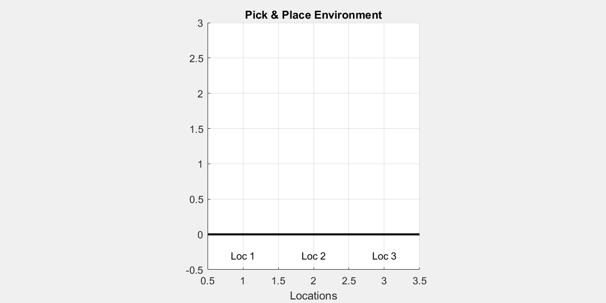
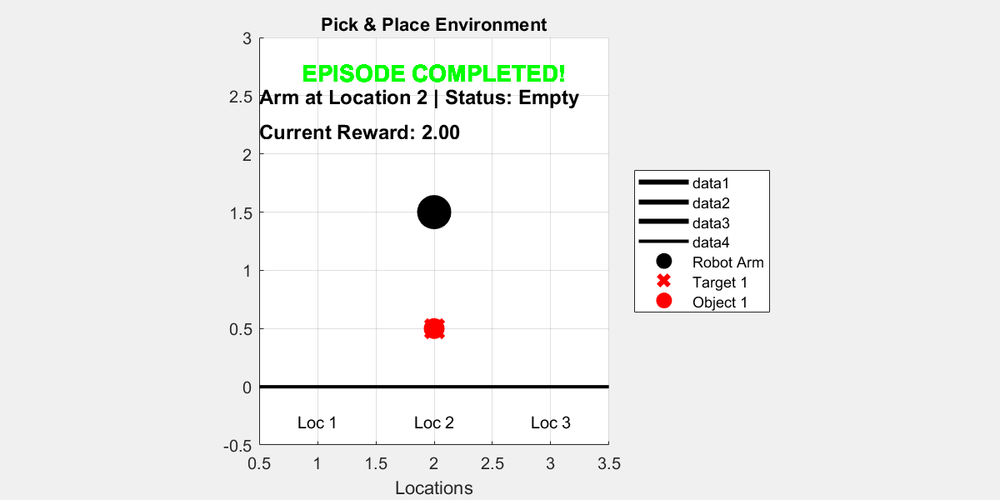
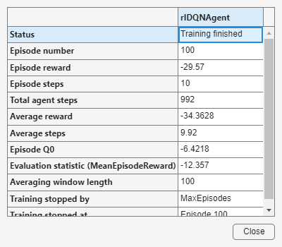

# Reinforcement Learning per a la planificació de tasques

El **Reinforcement Learning** (Aprenentatge per Reforç) és un paradigma d'aprenentatge automàtic on un **agent** aprèn interactuant amb un **entorn**, rebent **recompenses** (feedback) basades en les conseqüències de les seves accions.


En el Reinforcement Learning, l'entorn es modela normalment com un **Procés de Decisió de Markov (MDP)**. Això significa que la probabilitat de transició al següent estat depèn només de l'estat i l'acció actuals, no pas de tot l'historial d'estats passats. Aquest concepte es coneix com la **propietat de Markov**, i implica que l'estat actual conté tota la informació necessària per a la presa de decisions òptima, **simplificant-ne el càlcul**.


En cada interval de temps $t$ , l'agent:

-  Observa un estat $s_t$  
-  Tria una acció $a_t$ 
-  Rep una recompensa $r_{t+1}$ 
-  Transita cap a un nou estat $s_{t+1}$ 

L'objectiu és aprendre una **política** $\pi \left(a|s\right)$  que maximitzi les **recompenses futures acumulades**.


El procés d'entrenament consisteix en què l'agent explori l'entorn provant diferents accions i observant-ne els resultats. A partir d'aquesta experiència, l'agent actualitza la seva política per afavorir les accions que condueixen a recompenses més altes. Sovint, això es fa mitjançant algorismes que estimen el retorn esperat de les accions, com ara el Q-learning o els mètodes de policy gradient.


Per tenir èxit, un agent ha de trobar un equilibri entre l'**exploració** —provar accions desconegudes per descobrir-ne els efectes— i l'**explotació** —triar aquelles accions que se sap que generen una gran recompensa.


 **Per què fer servir el Reinforcement Learning per a la planificació de tasques en** ***Pick and Place*****?**


En tasques robòtiques com ara *pick and place* (agafar i col·locar), el robot ha de prendre decisions pas a pas per moure un objecte d'una ubicació a una altra. Pot ser que hagi d'esquivar obstacles, actuar de manera precisa i adaptar-se als canvis de l'entorn. El Reinforcement Learning (RL) ofereix diversos avantatges per a aquest tipus de planificació de tasques:

1. **Pot gestionar soroll en els sensors o en les accions:** En un entorn del món real, les càmeres poden produir imatges inexactes, les deteccions poden tenir soroll, i el braç robòtic pot no executar les accions exactament tal com es preveia. El Reinforcement Learning permet al robot aprendre a actuar de manera efectiva fins i tot quan les seves observacions o accions són imperfectes.
2. **Es pot adaptar de manera eficient a les errades:** Si el robot intenta agafar un objecte i falla, o si l'objecte rellisca i cau, un planificador tradicional pot necessitar recalcular un pla complet de nou. En canvi, un agent entrenat amb Reinforcement Learning segueix una política apresa que li permet respondre dinàmicament i prendre una acció alternativa sense haver de planificar des de zero.
3. **Està ben adaptat als entorns estocàstics:** En la robòtica, les accions sovint no són deterministes: moure el braç cap a una certa posició pot donar resultats diferents depenent de l'entorn (p. ex., si altres objectes s'estan movent, o si hi ha forces externes). El RL està dissenyat específicament per aprendre en entorns on les accions no produeixen sempre el mateix resultat.
4. **Pren decisions pas a pas i és eficient durant el temps d'execució:** Un cop entrenat, l'agent no necessita calcular un pla complet a cada pas. Simplement observa l'estat actual i escull la millor acció segons la seva política. Això permet que el robot actuï ràpidament i de manera eficient en temps real, sense càlculs feixucs durant l'execució.

**Objectiu de la lliçó**


En aquesta lliçó, l'estudiant implementarà els components principals de l'entorn `PickPlaceDiscreteEnv`, que simula un braç robòtic encarregat de moure objectes cap a posicions objectiu al llarg d'una quadrícula unidimensional i discreta.


L'agent s'entrenarà fent servir l'**algorisme DQN**, i més endavant millorat amb **Hindsight Experience Replay (HER)** per millorar l'aprenentatge en escenaris de recompensa escassa (sparse-reward).

# Instal·lació

**Instal·lar el Reinforcement Learning Toolbox**


Per completar aquesta lliçó, necessites el **Reinforcement Learning Toolbox**™.


Si encara no l'has instal·lat, segueix aquests passos:

1. Obre MATLAB.
2. Vés a la pestanya **Home**.
3. Clica a **Add-Ons > Get Add-Ons**.
4. Cerca **"Reinforcement Learning Toolbox**™**"** i clica **Install**.

**Verificar la instal·lació des del codi**


Pots executar el següent codi per comprovar si el toolbox està instal·lat:

```matlab
toolboxTable = matlab.addons.installedAddons;
if ~any(contains(toolboxTable.Name, "Reinforcement Learning Toolbox"))
    error(['Reinforcement Learning Toolbox is not installed.\n' ...
           'Please install it via Add-On Explorer (Home > Add-Ons > Get Add-Ons).']);
else
    disp("✅ Reinforcement Learning Toolbox is installed.");
end
```

```matlabTextOutput
✅ Reinforcement Learning Toolbox is installed.
```


# Creació d'un entorn
## Exercici 1 - Inicialització de l'estat de l'entorn:

En aquest primer exercici, implementaràs una funció que reinicia (reset) l'estat de l'entorn i retorna una observació inicial.


L'estat del nostre entorn està compost per **quatre elements**, que representen el que l'agent de Reinforcement Learning "veu" en cada interval de temps:


 **1.** **`this.arm_pos`** **— Posició del braç robòtic** 


Indica la posició actual del braç robòtic.


El seu valor és un enter entre `1` i `num_locations`.


A l'inici de cada episodi, aquest valor se selecciona de manera aleatòria en aquell rang.


 **2.** **`this.arm_state`** **— Estat de subjecció del braç** 


Indica si el braç del robot està subjectant o no algun objecte.


El seu valor pren valors entre `0` i `num_objects`:

-  `0` vol dir que el braç està buit. 
-  `1` vol dir que està subjectant l'**objecte 1**, 
-  `2` vol dir que està subjectant l'**objecte 2**, i així successivament. El braç sempre comença buit, de manera que el valor per defecte és `0`. 

 **3.** **`this.objects_pos`** **— Posicions actuals dels objectes** 


Un array que indica la posició actual de cada objecte.

-  `objects_pos(1)` és la posició de l'**objecte 1**, 
-  `objects_pos(2)` és la posició de l'**objecte 2**, i així successivament. 

Aquestes posicions s'assignen de forma aleatòria al principi, però **han de complir dues condicions**:

-  Dos objectes no poden estar a la mateixa ubicació. 
-  Un objecte no ha de poder començar a la mateixa ubicació que el braç robòtic. 

 **4.** **`this.target_pos`** **— Posicions objectiu de cada objecte** 


Un array que indica la **posició objectiu** de cada objecte:

-  `target_pos(1)` és l'objectiu de l'**objecte 1**, 
-  `target_pos(2)` és l'objectiu de l'**objecte 2**, i així successivament. 

Aquestes posicions objectiu també són aleatòries però han de satisfer que:

-  Dos objectes no poden compartir la mateixa posició objectiu.
-  La posició objectiu d'un objecte no pot ser la mateixa que la seva posició **inicial**. 

**Tasca**


El teu objectiu és escriure la lògica que genera l'estat inicial per a aquestes quatre variables (`arm_pos`, `arm_state`, `objects_pos` i `target_pos`) seguint les restriccions descrites prèviament.


Aquest estat inicial serà el que retornarà la funció `reset()` de l'entorn.


**Pistes**


Pots trobar útils les següents funcions de MATLAB per implementar aquest exercici:

-  `randi` – per generar enters aleatoris dins d'un rang. 
-  `randperm` – per generar permutacions aleatòries. 
-  `setdiff` – per eliminar valors específics d'un conjunt. 

```matlab
 % Reinicia l'entorn a l'estat inicial i retorna l'observació inicial
 function [this, InitialObservation] = resetFunc(this)

    % Aleatoritza la posició inicial del braç (índex basat en 1)

    % Genera posicions vàlides per als objectes (excloent la posició del braç)

    % Assegura't de tenir prou posicions vàlides per a tots els objectes
   

    % Genera posicions objectiu (cada una diferent de la posició del seu objecte corresponent)
    this.target_pos = zeros(this.num_objects, 1);
    assigned_targets = [];  % Fes un seguiment dels objectius ja assignats per evitar repeticions

    % Construeix el vector d'observació inicial
    InitialObservation = [this.arm_pos;this.arm_state;this.objects_pos; this.target_pos];
    this.State = InitialObservation;

end
```

```matlab
% Reinicia l'entorn a l'estat inicial i retorna l'observació inicial
function [this, InitialObservation] = resetFuncSolution(this)
    this.arm_state = 0; % 0 = buit, >0 = subjectant objecte

    % Aleatoritza la posició inicial del braç (índex basat en 1)
    this.arm_pos = randi([1,this.num_locations]);

    % Genera posicions vàlides per als objectes (excloent la posició del braç)
    valid_positions = setdiff(1:this.num_locations, this.arm_pos);

     % Inicialitza el mapa d'objectes (totes les ubicacions buides)
     this.map_objects = zeros(this.num_locations, 1);

    % Assegura't de tenir prou posicions vàlides per a tots els objectes
    if length(valid_positions) >= this.num_objects
        % Selecciona posicions aleatòries per als objectes (sense superposicions, i on no hi ha el braç)
        selected_indices = randperm(length(valid_positions), this.num_objects);
        this.objects_pos = valid_positions(selected_indices)';
        for i = 1:this.num_objects
            this.map_objects(this.objects_pos(i)) = i;
        end
    else
        error('Not enough valid positions for objects');
    end

    % Genera posicions objectiu (cada una diferent de la posició del seu objecte corresponent)
    this.target_pos = zeros(this.num_objects, 1);
    assigned_targets = [];  % Fes un seguiment dels objectius ja assignats per evitar repeticions

    for i = 1:this.num_objects
        % Les posicions objectiu vàlides exclouen la posició actual de l'objecte i els objectius ja assignats
        valid_targets = setdiff(1:this.num_locations, [this.objects_pos(i), assigned_targets]);
        % Selecciona un objectiu aleatori de les posicions vàlides
        selected_index = randperm(length(valid_targets), 1);
        this.target_pos(i) = valid_targets(selected_index);
        % Afegeix aquest objectiu als objectius assignats
        assigned_targets = [assigned_targets, this.target_pos(i)];
    end

    % Construeix el vector d'observació inicial
    InitialObservation = [this.arm_pos;this.arm_state;this.objects_pos; this.target_pos];
    this.State = InitialObservation;

end
```

### Provant la funció Reset
```matlab
test = tests.TestResetFuncPickPlaceEnv;
test.ResetFuncHandle = @resetFuncSolution;
result = run(test);
```

```matlabTextOutput
Running tests.TestResetFuncPickPlaceEnv
.....
Done tests.TestResetFuncPickPlaceEnv
__________
```

## **Exercici 2 – Implementació de la funció Step:**

En aquest exercici, implementaràs la funció de pas (**step function**) per a l'entorn, que defineix la manera com l'entorn transita d'un estat a un altre en resposta a l'acció presa per l'agent.


L'agent interactua amb l'entorn mitjançant accions discretes:


 **Acció 1: Pick (Agafar)** 


El braç robòtic intenta agafar un objecte de la seva posició actual.


Aquesta acció només és vàlida si:

-  El braç està buit. 
-  Hi ha un objecte a la posició actual del braç. 

**Acció 2: Place (Col·locar)**


El braç robòtic intenta col·locar l'objecte que subjecta actualment a la seva posició actual.


Aquesta acció només és vàlida si:

-  El braç està subjectant un objecte. 
-  La posició objectiu està buida. 

**Accions 3 i superiors: Moure's a una Ubicació**


El braç robòtic es desplaça cap a una nova ubicació.


Aquestes accions s'associen amb moure el braç cap a una ubicació concreta. De tota manera, com que les accions `1` i `2` ja estan reservades per al **pick** i **place**, l'índex d'ubicació s'ha de derivar restant-ne `2` del valor de l'acció.

-  Per exemple: 
-  `Acció 3` → mou-te a `location 1` 
-  `Acció 4` → mou-te a `location 2` 
-  `Acció 5` → mou-te a `location 3` 

**Tasca**


El teu objectiu és escriure la lògica de la funció `step()` que dugui a terme el següent:

-  Executar l'acció especificada pel paràmetre d'entrada `Action`. 
-  Actualitzar adequadament l'estat intern de l'entorn. 
-  Retornar el nou estat. 

**Pistes**

-  Fes servir "`Action - 2"` per calcular l'índex de la posició objectiu per a les accions de moviment. 
```matlab
function [this, Observation, Reward, IsDone, Info] = stepFucntion(this, Action)

    % Gestiona l'acció Pick
    if Action == 1 
       
    % Gestiona l'acció Place
    elseif Action == 2

     % Gestiona l'acció de moure a ubicació
    elseif Action > 2 
       

    end


    % Construeix el nou vector d'observació
    Observation = [this.arm_pos;this.arm_state;this.objects_pos; this.target_pos];

    % Calcula la recompensa fent servir la funció de recompensa externa
    Reward = RewardFunc({this.State}, {Action}, {Observation});
    % Guarda la recompensa actual per a la visualització
    this.CurrentReward = Reward;
    % Comprova si l'episodi ha acabat fent servir la funció externa
    IsDone = IsDoneFunc({this.State}, {Action}, {Observation});
    % Actualitza els estats del sistema
    this.State = Observation;
    Info = [];

    % Actualitza la flag interna done
    this.IsDone = IsDone;
    
end
```

```matlab
function [this, Observation, Reward, IsDone, Info] = stepFuncSolution(this, Action)

    % Gestiona l'acció Pick
    if Action == 1 % pick
        % El braç ha d'estar buit i hi ha d'haver un objecte a la posició del braç
        if this.arm_state == 0 && this.map_objects(this.arm_pos) > 0
            obj_index = this.map_objects(this.arm_pos);
            % Agafa l'objecte
            this.arm_state = obj_index;
            this.map_objects(this.arm_pos) = 0;
            this.objects_pos(obj_index) = 0; % 0 significa que l'objecte està sent transportat
        end

        % Gestiona l'acció Place
    elseif Action == 2 % place
        % El braç ha d'estar subjectant un objecte i la ubicació ha d'estar buida
        if this.arm_state > 0 && this.map_objects(this.arm_pos) == 0
            obj_index = this.arm_state;
            new_obj_pos = this.arm_pos;
            current_target_pos = this.target_pos(obj_index);
            % Col·loca l'objecte a la posició actual del braç
            this.map_objects(new_obj_pos) = obj_index;
            this.objects_pos(obj_index) = new_obj_pos;
            this.arm_state = 0; % El braç ara està buit
        end

        % Gestiona l'acció de moure a ubicació
    elseif Action > 2 % move to location
        is_holding_obj = this.arm_state > 0;
        obj_index = this.arm_state;

        new_location = Action - 2; % Les accions 3,4,5,... s'assignen a les ubicacions 1,2,3,...
        % Mou el braç a la nova ubicació
        this.arm_pos = new_location;

    end

    % Construeix el nou vector d'observació
    Observation = [this.arm_pos;this.arm_state;this.objects_pos; this.target_pos];

    % Calcula la recompensa fent servir la funció de recompensa externa
    Reward = RewardFunc({this.State}, {Action}, {Observation});
    % Guarda la recompensa actual per a la visualització
    this.CurrentReward = Reward;
    % Comprova si l'episodi ha acabat fent servir la funció externa
    IsDone = IsDoneFunc({this.State}, {Action}, {Observation});
    % Actualitza els estats del sistema
    this.State = Observation;
    Info = [];

    % Actualitza la flag interna done
    this.IsDone = IsDone;

    
end
```

### Provant la funció Step
```matlab
test = tests.TestStepFuncPickPlaceEnv;
test.StepFuncHandle = @stepFuncSolution;
result = run(test);
```

```matlabTextOutput
Running tests.TestStepFuncPickPlaceEnv
........
Done tests.TestStepFuncPickPlaceEnv
__________
```

## **Exercici 3 – Implementació de la funció IsDone:**

En aquest exercici **curt** (tan sols una línia de codi), implementaràs una funció que verifica si la tasca ha estat completada satisfactòriament. Aquesta funció serà cridada un cop en cada interval de temps, i ha de retornar `true` si l'objectiu s'ha aconseguit, i `false` si en cas contrari.


Aquesta lògica és particularment útil per assenyalar el final de l'episodi d'aprenentatge en el Reinforcement Learning.


En aquesta tasca, assumirem que només hi ha **un únic objecte** en l'entorn.


**Pista**


Pots accedir al valor de l'estat fent servir `NextState{1}`. Per exemple, per accedir al primer valor, pots fer servir `NextState{1}(1)`.


```matlab
function isdone = IsDoneFunc(State, Action, NextState)
    % isdone = .... només necessites completar aquesta línia
    isdone = IsDoneFuncSolution(State, Action, NextState);
end

```

```matlab
function isdone = IsDoneFuncSolution(State, Action, NextState)
    isdone = NextState{1}(3) == NextState{1}(4);
end
```

### Provant la funció IsDone
```matlab
test = tests.TestIsDoneFuncPickPlaceEnv;
test.IsDoneFuncHandle = @IsDoneFuncSolution;
result = run(test);
```

```matlabTextOutput
Running tests.TestIsDoneFuncPickPlaceEnv
..
Done tests.TestIsDoneFuncPickPlaceEnv
__________
```

## Entenent la funció de Recompensa

La funció de recompensa està dissenyada per guiar l'agent d'aprenentatge pas a pas cap a la finalització de la tasca, penalitzant alhora les accions improductives o invàlides. Proporciona tant **reforç positiu pel progrés** com **penalitzacions per als errors**, modelant de manera efectiva el comportament de l'agent al llarg del temps.


Al començament de cada pas, l'agent rep una **penalització de -2 per cada objecte que encara no es troba en la seva posició objectiu**. Això fomenta que l'agent redueixi el nombre d'objectes mal col·locats el més ràpidament possible.


Per incentivar l'avenç, s'afegeixen petites recompenses positives per cada subobjectiu assolit:

-  **+0.5** per moure el braç cap a un objecte que no es troba a la seva posició objectiu. 
-  **+1** per agafar un d'aquests objectes (sempre i quan no estigui ja col·locat correctament). 
-  **+1.5** per moure l'objecte cap a la seva posició objectiu. 
-  **Recompensa final de +2** s'atorga quan la tasca s'ha completat totalment (és a dir, tots els objectes estan a les seves posicions objectiu). 

**Penalitzacions per Accions Invàlides**


Per desincentivar els mals comportaments, l'agent és penalitzat:

-  **−5** per accions invàlides com ara: 
-  Intentar agafar un objecte quan no n'hi ha cap. 
-  Intentar agafar quan ja està subjectant alguna cosa. 
-  Intentar col·locar un objecte on ja n'hi ha un altre. 
-  **−0.01** per moviments ineficients o redundants, com ara moure's cap a la mateixa ubicació on ja es troba. 

**Propòsit General**


L'objectiu d'aquesta funció de recompensa és servir com una mena de **distància heurística cap a l'objectiu**. Proporcionant recompenses intermèdies i penalitzacions, ajuda a l'agent de Reinforcement Learning a entendre **quines accions l'apropen cap a l'objectiu**, i quines accions són inútils o perjudicials. Aquest retorn estructurat és essencial per a un aprenentatge efectiu en entorns complexos.

```matlab
function reward = RewardFunc(State, Action, NextState)

    % Comprova si la tasca s'ha completat
    isdone = IsDoneFunc(State, Action, NextState);
    
    if isdone
        % Si la tasca està completada, dona una recompensa alta positiva
        reward = 2;
    else
        % Comença des de la recompensa zero i ajusta segons l'acció
        reward = 0;
        
        % Extreu la informació de l'estat actual
        arm_pos = State{1}(1);            % Posició actual del braç robòtic
        arm_state = State{1}(2);          % Si el braç subjecta un objecte
        objects_pos = State{1}(3);      % Posicions actuals dels dos objectes
        target_pos = State{1}(4);       % Posicions objectiu dels dos objectes
        
        Action = Action{1};               % Extreu el valor escalar de l'acció

        % Acció 1: Agafar un objecte
        if Action == 1
            % Comprova si hi ha un objecte a la posició del braç
            [hasObject, idx] = hasObjectAtPosition(objects_pos, arm_pos);

            % Pick vàlid: el braç està buit i hi ha un objecte per agafar
            if arm_state == 0 && hasObject
                % Recompensa positiva si l'objecte encara no és al seu objectiu
                if target_pos(idx) ~= arm_pos 
                    reward = reward + 1;
                else
                    % Penalització per agafar un objecte que ja és a la seva posició objectiu
                    reward = reward - 5;
                end
            else
                % Pick invàlid (o bé el braç no està buit o no hi ha objecte present)
                reward = reward - 5;
            end

        % Acció 2: Col·locar un objecte
        elseif Action == 2
            [hasObject, idx] = hasObjectAtPosition(objects_pos, arm_pos);
            
            % Place vàlid: el braç subjecta un objecte i la ubicació està buida
            if arm_state > 0 && ~hasObject
                obj_index = arm_state;  % Objecte que s'està subjectant
                % No s'afegeix cap recompensa extra aquí, la recompensa es gestiona a sota si l'estat esdevé "done"
            else
                % Place invàlid (intent de col·locar a una posició ocupada o mentre el braç està buit)
                reward = reward - 5;
            end

        % Acció > 2: Moure el braç a una altra ubicació
        elseif Action > 2
            is_holding_obj = arm_state > 0;
            obj_index = arm_state;
            new_location = Action - 2;  % Converteix el número d'acció a índex de la ubicació

            [hasObject, idx] = hasObjectAtPosition(objects_pos, new_location);

            if arm_pos == new_location
                % Penalitza moviments innecessaris a la posició actual
                reward = reward - 0.01;

            elseif is_holding_obj && new_location == target_pos(obj_index)
                % Recompensa per moure's directament a l'objectiu amb l'objecte
                reward = reward + 1.5;

            elseif ~is_holding_obj && hasObject && target_pos(idx) ~= new_location
                % Recompensa per moure's cap a un objecte que necessita ser agafat
                reward = reward + 0.5;

            else
                % Petita penalització per a altres tipus de moviment
                reward = reward - 0.01;
            end
        end

        % Penalització final per qualsevol objecte que no sigui a la seva posició objectiu
        objects_pos = NextState{1}(3);
        target_pos = NextState{1}(4);

        for i = 1:length(objects_pos)
            if objects_pos(i) ~= target_pos(i)
                reward = reward - 2;
            end
        end
    end
end

function [hasObject, idx] = hasObjectAtPosition(objects_pos, position)
    % Comprova si hi ha cap objecte a la posició especificada
    % objects_pos: array que conté les posicions dels objectes [obj1_pos, obj2_pos, ...]
    % position: posició a comprovar
    % Retorna: hasObject (true si hi ha un objecte a la posició, fals en altre cas)
    %          idx (índex de l'objecte si es troba, -1 en altre cas)

    idx = find(objects_pos == position, 1); % Troba el primer índex
    if ~isempty(idx)
        hasObject = true;
    else
        hasObject = false;
        idx = -1;
    end
end
```

# Entrenar un model

**Fixar la Secuència de Nombres Aleatoris per a la Reproduïbilitat**


El codi de l'exemple pot involucrar el càlcul de nombres aleatoris en diverses fases. Fixar el flux de nombres aleatoris al principi de diverses seccions del codi de l'exemple preserva la seqüència de nombres aleatoris cada vegada que l'executes, i augmenta la probabilitat de reproduir-ne correctament els resultats. Per a més informació, consulta [Results Reproducibility](https://es.mathworks.com/help/reinforcement-learning/ug/train-reinforcement-learning-agents.html#mw_cfb4600e-9d19-4e4e-89c8-2749894fee3a).


Fixa la font de nombres aleatoris amb la llavor `0` i l'algorisme de generació aleatòria Mersenne Twister. Per obtenir més informació sobre com controlar la llavor utilitzada per a la generació de nombres aleatoris, vés a [`rng`](https://es.mathworks.com/help/matlab/ref/rng.html).

```matlab
previousRngState = rng(0,"twister");
```


**Creació d'una instància de l'entorn**


Aquesta línia crea una instància d'un entorn personalitzat de pick-and-place.

```matlab
env_pick_place = PickPlaceDiscreteEnv2(1, 3, @stepFuncSolution, @resetFuncSolution);
```




**Creant un Agent DQN**


Aquí definirem l'agent que aprendrà a interactuar amb l'entorn.

-  `obsInfo` i `actInfo` proveeixen l'estructura dels espais d'observació i d'accions, respectivament. 
-  `rlDQNAgent` crea un agent Deep Q-Network (DQN), el qual aproxima la funció òptima del Q-value a través de l'ús d'una xarxa neuronal. 
```matlab
obsInfo = getObservationInfo(env_pick_place);
actInfo = getActionInfo(env_pick_place);
dqnAgent = rlDQNAgent(obsInfo,actInfo);
```


**Configuració dels Paràmetres de l'Agent**


Aquests paràmetres controlen el comportament i les dinàmiques d'aprenentatge de l'agent:

-  **Exploració Epsilon-greedy (Epsilon-greedy exploration)**: Comença amb exploració total (`Epsilon = 1.0`) i de mica en mica es redueix per poder afavorir l'explotació a mesura que avança l'aprenentatge. 
-  **Mida de l'entrenament en lots (Mini-batch size)**: Nombre d'experiències extretes de la capa de reproducció durant cada pas de l'entrenament. 
-  **Taxa d'aprenentatge (Learning rate)**: Controla amb quina rapidesa la xarxa s'actualitza. 
-  **Límit de gradient (Gradient threshold)**: Prevé l'explosió de gradients durant l'entrenament establint un límit de magnitud. 
```matlab
dqnAgent.AgentOptions.EpsilonGreedyExploration.Epsilon = 1.0;
dqnAgent.AgentOptions.EpsilonGreedyExploration.EpsilonMin = 0.01;
dqnAgent.AgentOptions.EpsilonGreedyExploration.EpsilonDecay = .0001;
dqnAgent.AgentOptions.MiniBatchSize = 32;
dqnAgent.AgentOptions.CriticOptimizerOptions.LearnRate = 5e-4;
dqnAgent.AgentOptions.CriticOptimizerOptions.GradientThreshold = 10;
```


**Configuració dels Paràmetres d'Entrenament**


Aquestes opcions defineixen la manera com es realitzarà l'entrenament:

-  L'agent serà entrenat com a màxim 100 episodis, cadascun d'ells durant fins a 29 passos. 
-  L'entrenament finalitzarà immediatament si la puntuació mitjana supera 1.9. 
```matlab
maxEpisodes = 100;
maxStepsPerEpisode = 20;
trainOpts = rlTrainingOptions(...
    MaxEpisodes=maxEpisodes, ...
    MaxStepsPerEpisode=maxStepsPerEpisode, ...
    Verbose=false, ...
    ScoreAveragingWindowLength=100,...
    Plots="training-progress",...
    StopTrainingCriteria="EvaluationStatistic",...
    StopTrainingValue=1.9);   
```


S'afegeix una política d'avaluació per testejar periòdicament el rendiment de l'agent de manera determinista:

-  Cada 50 episodis, l'agent s'avalua en 10 episodis fent servir valors aleatoris com a llavors estables. 
```matlab
evaluator = rlEvaluator( ...
    EvaluationFrequency=50, ...
    NumEpisodes=10, ...
    RandomSeeds=101:110);
```

**Inici d'Entrenament**

```matlab
trainingStats = train(dqnAgent, env_pick_place, trainOpts, Evaluator=evaluator);
```




**Visualitza l'agent ja entrenat interactuant amb l'entorn**

```matlab
 
plot(env_pick_place)

for i = 1:10
    rng();
    simOptions = rlSimulationOptions(MaxSteps=15);
    sim(env_pick_place, agent, simOptions);
    
    pause(1); 
end
```

```matlabTextOutput
ans = struct with fields:
     Type: 'twister'
     Seed: 0
    State: [625x1 uint32]

ans = struct with fields:
     Type: 'twister'
     Seed: 0
    State: [625x1 uint32]

ans = struct with fields:
     Type: 'twister'
     Seed: 0
    State: [625x1 uint32]

ans = struct with fields:
     Type: 'twister'
     Seed: 0
    State: [625x1 uint32]

ans = struct with fields:
     Type: 'twister'
     Seed: 0
    State: [625x1 uint32]

ans = struct with fields:
     Type: 'twister'
     Seed: 0
    State: [625x1 uint32]

ans = struct with fields:
     Type: 'twister'
     Seed: 0
    State: [625x1 uint32]

ans = struct with fields:
     Type: 'twister'
     Seed: 0
    State: [625x1 uint32]

ans = struct with fields:
     Type: 'twister'
     Seed: 0
    State: [625x1 uint32]

ans = struct with fields:
     Type: 'twister'
     Seed: 0
    State: [625x1 uint32]

```


**Guardant el model**

```matlab
save('dqn_1_object.mat', 'dqnAgent');
```


**Carregant el model**

```matlab
load('dqn_1_object.mat', 'dqnAgent');
```
# Fent servir HER per entrenar un model

En l'Aprenentatge per Reforç (RL), els *escenaris de recompensa esparsa (sparse reward settings)* representen un repte majúscul. En aquests entorns, els agents reben recompenses diferents de zero només quan arriben a estats objectiu molt concrets. Això significa que durant l'entrenament, l'agent pot realitzar moltes accions sense rebre cap feedback significatiu, cosa que dificulta aprendre polítiques efectives.


L'**Hindsight Experience Replay (HER)** és una tècnica potent per tractar aquest problema. La idea darrere de HER consisteix en *reinterpretar episodis fracassats com si fossin exitosos*, canviant l'objectiu durant el replay. Per exemple, suposa que l'agent estava tractant d'assolir l'objectiu **g** però va acabar en un estat final diferent **s'**. En comptes de descartar la trajectòria considerant-la un fracàs, HER permet reetiquetar l'experiència assumint que l'objectiu de l'agent era en realitat **g' = s'**, l'estat final on realment va acabar.


En fer això, l'agent pot extreure un aprenentatge útil de l'episodi, fins i tot en el cas d'haver fallat en relació amb l'objectiu original. Aquesta tècnica incrementa dràsticament la quantitat d'exemples d'entrenament formatius, especialment en aquells entorns amb recompenses escasses.


En MATLAB, HER es pot implementar modificant el buffer de memòria (replay buffer) per emmagatzemar objectius alternatius i generar dades d'entrenament addicionals en el moment de reexecutar (replay) les experiències.


[Documentació d'Her](https://es.mathworks.com/help/reinforcement-learning/ref/rl.replay.rlhindsightreplaymemory.html)


**Creant un Agent DQN**

```matlab
obsInfo = getObservationInfo(env_pick_place);
actInfo = getActionInfo(env_pick_place);
herAgent = rlDQNAgent(obsInfo,actInfo);
```


**Configuració dels Paràmetres de l'Agent**

```matlab
herAgent.AgentOptions.EpsilonGreedyExploration.Epsilon = 1.0;
herAgent.AgentOptions.EpsilonGreedyExploration.EpsilonMin = 0.01;
herAgent.AgentOptions.EpsilonGreedyExploration.EpsilonDecay = 0.0001;
herAgent.AgentOptions.MiniBatchSize = 32;
herAgent.AgentOptions.CriticOptimizerOptions.LearnRate = 5e-4;
herAgent.AgentOptions.CriticOptimizerOptions.GradientThreshold = 10;

```

### **Afegint Hindsight Experience Replay (HER)**

Per integrar **Hindsight Experience Replay (HER)** al Reinforcement Learning Toolbox de MATLAB, hi ha uns quants components importants que has de definir:


&nbsp;&nbsp;&nbsp;&nbsp;&nbsp;&nbsp;&nbsp;&nbsp; 1. Una **funció de recompensa** personalitzada amb el format següent:

```
function reward = RewardFunc(State, Action, NextState)
```

Aquesta funció calcula la recompensa escalar donat un `State` actual, l'`Action` executada, i l'estat resultant `NextState`. Aquests valors d'entrada han de passar-se **com a cell arrays**, per exemple:


`State     = {[``1` `,` `0` `,` `1` `,` `3``]};`


`Action    = {1``};`


`NextState = {[1` `,` `1` `,` `0` `,` `3``]};`


Aquest format és requerit per a HER perquè extreu els subobjectius i verifica les condicions fent ús de l'indexatge explícit.


&nbsp;&nbsp;&nbsp;&nbsp;&nbsp;&nbsp;&nbsp;&nbsp; 2. Una **funció de condició terminal** per determinar si un episodi ha finalitzat:

```
function isdone = IsDoneFunc(State, Action, NextState)

```

Aquesta funció ha de retornar `true` si es considera que l'objectiu ha estat assolit o si l'episodi, altrament, ja s'ha donat per finalitzat. Així com passa amb la funció de recompensa, també fa ús de cell arrays com a paràmetres d'entrada.


 *En aquest cas, tant el* *`RewardFunc`* *com l'* *`IsDoneFunc`* ***ja estaven implementats correctament*** *d'abans.*


&nbsp;&nbsp;&nbsp;&nbsp;&nbsp;&nbsp;&nbsp;&nbsp; 3. Especificar quina forma té la **condició objectiu** perquè HER pugui reemplaçar l'objectiu real amb un objectiu retrospectiu (hindsight goal) a l'historial (replay buffer).

```matlab
% Estat = [arm_pos, arm_state, obj_pos, target_pos]
% Definim l'objectiu com "obj_pos == target_pos"
% Canal = 1 (perquè tenim un sol vector d'observació)
% Índexs = 3 (posició de l'objecte), 4 (posició objectiu)

goalConditionInfo = {{1, [3], 1, [4]}};
```

 Això vol dir el següent: al canal 1, els elements a l'índex 3 (posició de l'objecte) haurien de coincidir amb els elements situats a l'índex 4 (posició objectiu) al mateix canal 1.


```matlab
rewardFcn = @RewardFunc;
isDoneFcn = @IsDoneFunc;
bufferLength = 5e4;
herAgent.ExperienceBuffer = rlHindsightReplayMemory(obsInfo,actInfo,...
    rewardFcn,isDoneFcn,goalConditionInfo,bufferLength);
```


**Configuració dels Paràmetres d'Entrenament**

```matlab
maxEpisodes = 100;
maxStepsPerEpisode = 20;
trainOpts = rlTrainingOptions(...
    MaxEpisodes=maxEpisodes, ...
    MaxStepsPerEpisode=maxStepsPerEpisode, ...
    Verbose=false, ...
    ScoreAveragingWindowLength=100,...
    Plots="training-progress",...
    StopTrainingCriteria="EvaluationStatistic",...
    StopTrainingValue=1.9);   
```

```matlab
evaluator = rlEvaluator( ...
    EvaluationFrequency=50, ...
    NumEpisodes=10, ...
    RandomSeeds=101:110);
```

**Inici d'Entrenament**

```matlab
trainingStats = train(herAgent, env_pick_place, trainOpts, Evaluator=evaluator);
```




**Visualitza l'agent ja entrenat interactuant amb l'entorn**

```matlab
plot(env_pick_place)

for i = 1:10
    rng();
    simOptions = rlSimulationOptions(MaxSteps=15);
    sim(env_pick_place, herAgent, simOptions);
    
    pause(1); 
end
```


En aquest exemple simple on **només hi ha un objecte**, utilitzar **DQN amb o sense Hindsight Experience Replay (HER)** **no mostra una diferència significativa** pel que fa al seu rendiment. 


De tota manera, al moment d'entrenar amb **dos objectes**, la tasca esdevé més complexa i les recompenses encara esdevenen més escasses. En aquest cas:

-  **DQN en solitari** pateix força complicacions per aprendre. 
-  **DQN configurat amb HER** aprèn de manera bastant més ràpida i fiable. 

L'ús d'HER proporciona clars beneficis que ajuden a rendibilitzar fins i tot els episodis fallits establint-los després en experiències realment adients i útils.


**Guardant el model**

```matlab
save('dqn_her_1_object.mat', 'herAgent');
```

**Carregant el model**

```matlab
load('dqn_her_1_object.mat', 'herAgent');
```
# Dos objectes fent servir HER 

En aquesta nova secció, ampliem el que hem implementat al darrer exercici d'**Hindsight Experience Replay (HER)** per treballar amb **dos objectes** tot això representat per un entorn pick-and-place totalment discret. 

Comencem definint un nou entorn que contindrà **2 objectes** i **6 posicions possibles**:

```matlab
env_pick_place = PickPlaceDiscreteEnv2(2, 6, @stepFuncSolution, @resetFuncSolution);
```


**Creant un Agent DQN**

```matlab
obsInfo = getObservationInfo(env_pick_place);
actInfo = getActionInfo(env_pick_place);
herv2Agent = rlDQNAgent(obsInfo,actInfo);
```


**Configuració dels Paràmetres de l'Agent**

```matlab
herv2Agent.AgentOptions.EpsilonGreedyExploration.Epsilon = 1.0;
herv2Agent.AgentOptions.EpsilonGreedyExploration.EpsilonMin = 0.005;
herv2Agent.AgentOptions.EpsilonGreedyExploration.EpsilonDecay = 0.0008;
herv2Agent.AgentOptions.MiniBatchSize = 32;
herv2Agent.AgentOptions.CriticOptimizerOptions.LearnRate = 5e-4;
herv2Agent.AgentOptions.CriticOptimizerOptions.GradientThreshold = Inf;

```

## Afegint Hindsight Experience Replay (HER)

Per habilitar HER amb **dos objectes**, cal modificar la funció de recompensa, la condició terminal ('IsDoneFunc') i la informació que defineix la condició objectiu.


**Funció de Recompensa**


En la funció de recompensa, només cal modificar aquestes línies:

Versió base per un sol tipus i model donat sobre un únic objecte:

```
objects_pos = State{1}(3);
target_pos = State{1}(4);
```

En el cas de dos objectes, han de quedar així:

```
objects_pos = State{1}(3:4);
target_pos = State{1}(5:6);
```

**Funció IsDone**


Original

```
function isdone = PickPlaceIsDoneFunc(State, Action, NextState)
    isdone = NextState{1}(3) == NextState{1}(4) ;
end
```

Actualitzada:

```
function isdone = PickPlaceIsDoneFunc(State, Action, NextState)
    isdone = NextState{1}(3) == NextState{1}(5) && NextState{1}(4) == NextState{1}(6);
end
```

**Condició objectiu**

Definim aquestes consideracions fent servir el paràmetre `goalConditionInfo`, que ens permet especificar de manera explícita quina és la condició objectiu dins del sistema. Mitjançant aquest paràmetre, indiquem quins elements de l’estat s’han de comparar perquè HER pugui determinar quan es considera que l’objectiu s’ha assolit correctament. D’aquesta manera, `goalConditionInfo` estableix la referència que el mecanisme d’Hindsight Experience Replay utilitza per reconèixer si una experiència pot interpretar-se com un cas d’èxit respecte de la fita o objectiu final definit per a la tasca.


```matlab
% Estat = [arm_pos, arm_state, obj1_pos, obj2_pos, target1_pos, target2_pos]
% Condició d'objectiu: les dues posicions dels objectes han de coincidir amb els seus objectius

goalConditionInfo = {{1, [3, 4], 1, [5, 6]}};
```

```matlab
rewardFcn = @twoObjects.PickPlaceRewardFunc;
isDoneFcn = @twoObjects.PickPlaceIsDoneFunc;
bufferLength = 5e4;
herv2Agent.ExperienceBuffer = rlHindsightReplayMemory(obsInfo,actInfo,...
    rewardFcn,isDoneFcn,goalConditionInfo,bufferLength);
```


**Configuració dels Paràmetres d'Entrenament**

```matlab
maxEpisodes = 3000;
maxStepsPerEpisode = 45;
trainOpts = rlTrainingOptions(...
    MaxEpisodes=maxEpisodes, ...
    MaxStepsPerEpisode=maxStepsPerEpisode, ...
    Verbose=false, ...
    ScoreAveragingWindowLength=100,...
    Plots="training-progress",...
    StopTrainingCriteria="EvaluationStatistic",...
    StopTrainingValue=1.9);   
```

```matlab
evaluator = rlEvaluator( ...
    EvaluationFrequency=50, ...
    NumEpisodes=10, ...
    RandomSeeds=101:110);
```

**Inici d'Entrenament**


**Advertència**: entrenar el model amb aquests paràmetres pot trigar unes 8 hores.

```matlab
trainingStats = train(herv2Agent, env_pick_place, trainOpts, Evaluator=evaluator);
```


**Visualitza l'agent ja entrenat interactuant amb l'entorn**

```matlab
plot(env_pick_place)

for i = 1:10
    rng();
    simOptions = rlSimulationOptions(MaxSteps=15);
    sim(env_pick_place, herAgent, simOptions);
    
    pause(1); 
end
```

**Guardant el model**

```matlab
save('dqn_her_2_object.mat', 'herv2Agent');
```

**Carregant el model**

```matlab
load('dqn_her_2_object.mat', 'herv2Agent');
```
