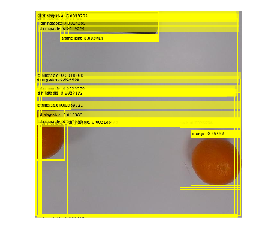

# **Instal·lació**
#  **Introducció** 

**Introducció**


Aquest mòdul mostra com detectar objectes en imatges utilitzant la xarxa d’aprenentatge profund **You Only Look Once versió 8 (YOLOv8)**.


El contingut de visió per computador es divideix en cinc lliçons:

1.   **Instal·lació:** En aquesta lliçó, instal·laràs totes les eines i biblioteques necessàries per treballar amb visió per computador a MATLAB.
2. **Entrenament de models utilitzant transfer learning:** Aquesta lliçó cobreix els conceptes bàsics de l’entrenament d’un model YOLO i explica com el transfer learning pot millorar el rendiment i reduir el temps d’entrenament.
3. **Postprocessament:** Aquesta lliçó presenta tècniques de postprocessament que milloren el rendiment del model després de l’entrenament, incloent-hi el filtratge i el refinament de les deteccions.
4. **Avaluació:** Aquesta lliçó se centra en l’avaluació de models de detecció d’objectes utilitzant mètriques estàndard i tècniques de visualització. Cobreix el càlcul d’aquestes mètriques i proporciona pautes per interpretar-les correctament.
5. **Experimentació:** Aquesta lliçó final proporciona una exploració més profunda de l’entrenament de models. Introdueix hiperparàmetres clau, mostra l’aplicació de tècniques d’augmentació de dades i explica com dissenyar experiments per avaluar diferents configuracions d’entrenament.

**Toolboxes necessàries**


Per executar aquest projecte o lliçó, es necessiten les toolboxes següents:

-  **Computer Vision Toolbox™** 
-  **Deep Learning Toolbox™** 
-  **Parallel Computing Toolbox™** 

 **Comprovar la instal·lació de toolboxes a MATLAB** 


Pots utilitzar el codi següent per comprovar automàticament si totes les toolboxes necessàries estan instal·lades:

```matlab
% Llista de toolboxes necessàries
requiredToolboxes = [
    "Computer Vision Toolbox"
    "Deep Learning Toolbox"
    "Parallel Computing Toolbox"
];

% Obtenir les toolboxes instal·lades i convertir els noms a un array de strings
toolboxTable = matlab.addons.installedAddons;
installedNames = string(toolboxTable.Name);

% Comprovar si falten toolboxes
missing = ~ismember(requiredToolboxes, installedNames);

% Informe
if any(missing)
    missingList = requiredToolboxes(missing);
    error("Missing required toolboxes:\n%s\n\nPlease install them via Home > Add-Ons > Get Add-Ons.", ...
        strjoin(missingList, newline));
else
    disp("✅ All required toolboxes are installed.");
end
```

```matlabTextOutput
✅ All required toolboxes are installed.
```


**Com instal·lar les toolboxes que falten**


Si falta alguna toolbox:

1.  Ves a la pestanya **Home** de MATLAB.
2. Fes clic a **Add\-Ons > Get Add\-Ons**.
3. Cerca la toolbox que falta pel seu nom.
4. Fes clic a **Install**.

# Instruccions de configuració

**Afegir la ruta del mòdul d’ajuda**


Afegeix la ruta al mòdul d’ajuda perquè MATLAB pugui accedir als scripts d’aquesta carpeta:

```matlab
addpath('help-module');
```

**Instal·lar Python i les biblioteques necessàries**


Utilitza la comanda següent per instal·lar Python i les biblioteques necessàries. Això pot trigar més de 5 minuts:

```matlab
yolo.installUltralytics();
```


Després d’executar aquest codi, hauria d’aparèixer *win64* en cas que estiguis utilitzant Windows; si no, *glnxa64*.

# Descarregar el dataset

Per descarregar el dataset: 


(No està actualitzat, és un altre dataset, no el descarreguis)

```matlab
%disp("download data")
```

```matlabTextOutput
download data
```

```matlab
%yolo.helper.downloadMultiClassData()
```

```matlabTextOutput
Downloading multiclass object detection dataset...
```

# Comprovar que YOLO funciona

Carrega el detector d’objectes YOLOv8 i executa la inferència:

```matlab
% Carregar el model YOLO v8
det = yolov8ObjectDetector2('yolov8s');
```

```matlabTextOutput
Pretrained yolov8s network already exists.
```

```matlab
% Llegir la imatge de prova.
I = imread(fullfile('datasets/fruits_3_4998/example','orange.jpg'));

% Carregar la xarxa YOLO v8 petita.
det = yolov8ObjectDetector2('yolov8s');
```

```matlabTextOutput
Pretrained yolov8s network already exists.
```

```matlab

% Fer la detecció utilitzant el model preentrenat.
[bboxes, scores, labels] = detect(det, I);

% Visualitzar els resultats de la detecció.
annotations = string(labels) + ': ' + string(scores);
Iout = insertObjectAnnotation(I, 'rectangle', bboxes, annotations);
figure, imshow(Iout);
```



# Configuració de YOLO

**Establir l’entorn de Python**

```matlab
if (ispc)
    pyenv(Version="win64/python/python.exe", ExecutionMode = "OutOfProcess")
else
    pyenv(Version="glnxa64/python/bin/python3", ExecutionMode = "OutOfProcess")
end
```

```matlabTextOutput
ans = 
  PythonEnvironment with properties:

          Version: "3.11"
       Executable: "C:\Users\Noel Nathan\Desktop\Universidad\8tQuadrimestre\tfg\from-code-to-robot\computer_vision\win64\python\python.exe"
          Library: "C:\Users\Noel Nathan\Desktop\Universidad\8tQuadrimestre\tfg\from-code-to-robot\computer_vision\win64\python\python311.dll"
             Home: "C:\Users\Noel Nathan\Desktop\Universidad\8tQuadrimestre\tfg\from-code-to-robot\computer_vision\win64\python"
           Status: Loaded
    ExecutionMode: OutOfProcess
        ProcessID: "30028"
      ProcessName: "MATLABPyHost"

```

```matlab

if isunix
    py.sys.setdlopenflags(int32(bitor(int64(py.os.RTLD_LAZY),int64(py.os.RTLD_DEEPBIND))));
end

```


**Configurar els paràmetres globals de YOLO**

```matlab
% setYoloSettings Estableix els paràmetres globals de YOLO mitjançant el wrapper de Python.
%
% setYoloSettings(pythonObject, option, value) estableix l’opció especificada
% de YOLO al valor indicat utilitzant el wrapper de Python.
py.trainYOLOv8Wrapper.setYoloSettings(py.str('tensorboard'), true);
```

```matlabTextOutput
settings_version 0.0.4
datasets_dir C:\Users\Noel Nathan\Desktop\Universidad\8tQuadrimestre\tfg\Lessons\from-code-to-robot\computer_vision\datasets
weights_dir C:\Users\Noel Nathan\Desktop\Universidad\8tQuadrimestre\tfg\Lessons\from-code-to-robot\computer_vision\weights
runs_dir C:\Users\Noel Nathan\Desktop\Universidad\8tQuadrimestre\tfg\Lessons\from-code-to-robot\computer_vision\runs
uuid ec83097be249f049dc01533308f726e37a20a9a11e43afb8810c32587f8ec051
sync True
api_key 
openai_api_key 
clearml True
comet True
dvc True
hub True
mlflow True
neptune True
raytune True
tensorboard True
wandb True
True
```

```matlab

runsDir = fullfile(pwd, 'runs'); % Uneix el directori actual amb la carpeta 'runs'
weightsDir = fullfile(pwd, 'weights'); % Uneix el directori actual amb la carpeta 'runs'
datasets_dir = fullfile(pwd, 'datasets');
py.trainYOLOv8Wrapper.setYoloSettings(py.str("runs_dir"), py.str(runsDir));
```

```matlabTextOutput
settings_version 0.0.4
datasets_dir C:\Users\Noel Nathan\Desktop\Universidad\8tQuadrimestre\tfg\Lessons\from-code-to-robot\computer_vision\datasets
weights_dir C:\Users\Noel Nathan\Desktop\Universidad\8tQuadrimestre\tfg\Lessons\from-code-to-robot\computer_vision\weights
runs_dir C:\Users\Noel Nathan\Desktop\Universidad\8tQuadrimestre\tfg\Lessons\from-code-to-robot\computer_vision\runs
uuid ec83097be249f049dc01533308f726e37a20a9a11e43afb8810c32587f8ec051
sync True
api_key 
openai_api_key 
clearml True
comet True
dvc True
hub True
mlflow True
neptune True
raytune True
tensorboard True
wandb True
True
```

```matlab
py.trainYOLOv8Wrapper.setYoloSettings(py.str("weights_dir"), py.str(weightsDir));
```

```matlabTextOutput
settings_version 0.0.4
datasets_dir C:\Users\Noel Nathan\Desktop\Universidad\8tQuadrimestre\tfg\Lessons\from-code-to-robot\computer_vision\datasets
weights_dir C:\Users\Noel Nathan\Desktop\Universidad\8tQuadrimestre\tfg\Lessons\from-code-to-robot\computer_vision\weights
runs_dir C:\Users\Noel Nathan\Desktop\Universidad\8tQuadrimestre\tfg\from-code-to-robot\computer_vision\runs
uuid ec83097be249f049dc01533308f726e37a20a9a11e43afb8810c32587f8ec051
sync True
api_key 
openai_api_key 
clearml True
comet True
dvc True
hub True
mlflow True
neptune True
raytune True
tensorboard True
wandb True
True
```

```matlab
py.trainYOLOv8Wrapper.setYoloSettings(py.str("datasets_dir"), py.str(datasets_dir));
```

```matlabTextOutput
settings_version 0.0.4
datasets_dir C:\Users\Noel Nathan\Desktop\Universidad\8tQuadrimestre\tfg\Lessons\from-code-to-robot\computer_vision\datasets
weights_dir C:\Users\Noel Nathan\Desktop\Universidad\8tQuadrimestre\tfg\from-code-to-robot\computer_vision\weights
runs_dir C:\Users\Noel Nathan\Desktop\Universidad\8tQuadrimestre\tfg\from-code-to-robot\computer_vision\runs
uuid ec83097be249f049dc01533308f726e37a20a9a11e43afb8810c32587f8ec051
sync True
api_key 
openai_api_key 
clearml True
comet True
dvc True
hub True
mlflow True
neptune True
raytune True
tensorboard True
wandb True
True
```