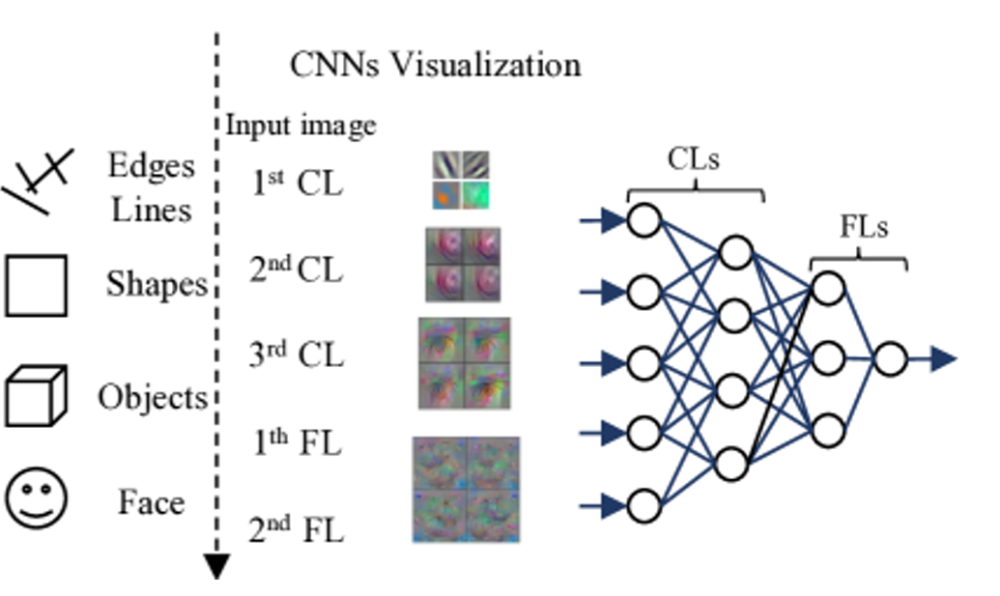
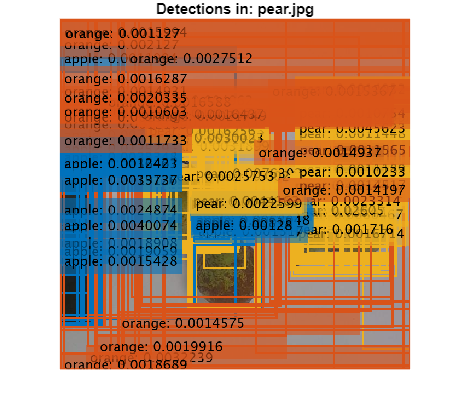
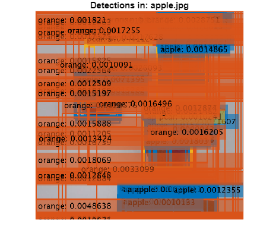
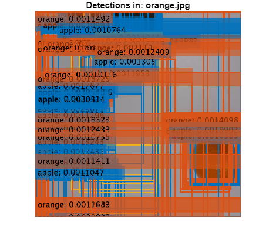

# 2. Entrenament de models utilitzant transfer learning

En aquesta lliçó, aprendrem com entrenar un model de detecció d’objectes utilitzant transfer learning. Aquestes tècniques redueixen l’esforç computacional i milloren el rendiment del model, fins i tot amb datasets petits.


Primer, afegim el mòdul d’ajuda:

```matlab
addpath('help-module');
```

# Entrenament
## **Paràmetres YOLO necessaris**

Els paràmetres següents són obligatoris quan es configura una sessió d’entrenament de YOLO:

-   **configFile** (str) **:** Ruta al fitxer de configuració, normalment en format `.yaml`, que defineix l’estructura del dataset i les classes. Aquest fitxer ha d’incloure les rutes als conjunts d’entrenament, validació i, opcionalment, test, així com la llista de noms de classes. Com a exemple, el fitxer que utilitzarem en aquest tutorial és data.yaml, que ja conté tota l’estructura definida. 
-   **baseModel** (str): Aquest paràmetre especifica quin model s’utilitzarà per a l’entrenament. Permet continuar entrenant un model entrenat prèviament o començar l’entrenament a partir d’un model YOLO preentrenat. Pots triar entre diferents versions de YOLO, tasques, per exemple detecció d’objectes, segmentació o classificació, i mides de model. Per a aquests tutorials, utilitzarem **YOLOv8 per a detecció d’objectes**. Els models preentrenats disponibles, ordenats de més petit a més gran, són: yolov8n.pt, yolov8s.pt, yolov8m.pt, yolov8l.pt, yolov8x.pt. En aquestes lliçons es recomana utilitzar models més petits, per exemple `yolov8n.pt` o `yolov8s.pt`, per tenir un entrenament i una inferència més ràpids. 
-   **`MaxEpochs`**  `(int): Aquest paràmetre` estableix el nombre màxim d’èpoques per a l’entrenament, on una època és una passada completa per totes les imatges del dataset d’entrenament. Augmentar aquest valor normalment millora el rendiment del model, però també allarga el temps d’entrenament. 
-   **`ImageSize`**  `(list[int]):` La mida, en píxels, a la qual es redimensionaran totes les imatges abans de l’entrenament. Les mides més grans poden millorar la precisió, però requereixen més recursos computacionals. 

En el codi següent, definim els valors d’aquests paràmetres necessaris. Utilitza aquests paràmetres per accelerar l’execució:

```matlab
configFile = fullfile(pwd, 'datasets', 'fruits_3_4998', 'data.yaml');
baseModel = 'yolov8s-oiv7.pt';
options.MaxEpochs = 1;
options.ImageSize = [256 256 3];
```

## Visualització de les capes de YOLO

El codi següent permet visualitzar l’arquitectura i els paràmetres d’un model YOLOv8:

```matlab
det = yolov8ObjectDetector2('yolov8s');
```

```matlabTextOutput
Pretrained yolov8s network already exists.
```

```matlab

% Analitzar el model carregat
analyzeNetwork(det.Network);
```


Aquesta comanda obre una finestra nova que mostra totes les capes i paràmetres del model YOLO que s’està utilitzant. Tingues en compte que les diferents variants de YOLOv8, per exemple `yolov8s`, `yolov8m`, etc., no només difereixen en el nombre de paràmetres, sinó també lleugerament en la seva complexitat arquitectònica.


En el cas de YOLOv8, el model normalment consta de 23 blocs principals. Aquests es poden agrupar en tres components principals:

-  **Backbone, primers 10 blocs:** Responsable d’extreure característiques de la imatge d’entrada. 
-  **Neck, 12 blocs següents:** Combina característiques a diferents escales per millorar el rendiment de la detecció. 
-  **Head, últim bloc:** Responsable de predir bounding boxes, etiquetes de classe i puntuacions de confiança. 

## **Paràmetre de congelació de capes per al transfer learning**

Un dels principals avantatges dels models YOLO és que venen **preentrenats**. Entrenar un model de detecció d’objectes des de zero normalment requereix milions d’imatges i una potència computacional considerable. Aquest problema es pot resoldre utilitzant **transfer learning**, que consisteix a agafar un model que ja ha estat entrenat amb un dataset gran i reentrenar-lo lleugerament utilitzant un conjunt molt més petit de dades noves.


El **transfer learning** és especialment efectiu en visió per computador perquè les xarxes neuronals convolucionals (CNN), que són la base de YOLO i de tots els models de detecció d’objectes, aprenen característiques de manera **jeràrquica**. Les capes inicials detecten característiques de baix nivell, com vores i textures, mentre que les capes més profundes capturen patrons més complexos i estructures d’objectes. Aquesta jerarquia fa que les capes inicials siguin altament reutilitzables en diferents tasques.





Normalment, les capes inicials responsables de l’extracció de característiques, el **backbone**, es **congelen** durant l’entrenament, cosa que significa que els seus pesos no s’actualitzen. Això permet que el model conservi les característiques visuals generals apreses a partir de datasets grans. Mentrestant, les capes posteriors es **fine-tune** amb el nou dataset per adaptar-se a la tasca específica.


En alguns escenaris, tot el model es pot fine-tune utilitzant una **taxa d’aprenentatge més baixa**, cosa que li permet adaptar-se gradualment a les dades noves mentre es minimitza el risc de sobreescriure coneixement preentrenat valuós.


Per això utilitzem YOLOv8. Ve preentrenat en datasets grans com [**COCO**](https://docs.ultralytics.com/es/datasets/detect/coco/) (per exemple, `yolov8n.pt`, `yolov8s.pt`) o [**Open Image V7**](https://docs.ultralytics.com/es/datasets/detect/open-images-v7/#open-images-v7-pretrained-models)  (per exemple, `yolov8n-oiv7.pt`, `yolov8s-oiv7.pt`). Utilitzar aquests models redueix significativament el temps d’entrenament i millora el rendiment, fins i tot amb datasets més petits.


### Triar quines capes congelar

La decisió de quantes capes de YOLOv8 congelar depèn de com de semblant sigui el teu dataset objectiu a les dades preentrenades. YOLOv8 té 22 capes congelables: les primeres 10 extreuen característiques genèriques, com vores, textures i formes, mentre que les capes posteriors s’especialitzen en detecció. Com que les nostres classes, apple, orange i pear, estan ben representades a COCO i Open Images V7, els dominis coincideixen força. Això ens permet congelar la majoria de capes per mantenir intactes les característiques generals i fine-tune només les capes de més alt nivell per a les nostres fruites, cosa que accelera l’entrenament i redueix el risc de sobreajust.


Per congelar capes específiques durant l’entrenament, utilitzem el paràmetre `freeze` de la manera següent:

```matlab
optionalArgs = {'freeze', 15};
```


**Hi ha paràmetres addicionals disponibles per configurar el model, que s’explicaran a la Lliçó 4: Experimentació.**

## Iniciar l’entrenament

A continuació, entrenem el model YOLO amb els paràmetres que hem definit anteriorment. Això pot trigar aproximadament 2 minuts.

```matlab
[yolov8Det, results] = trainYOLOv8ObjectDetector( ...
    configFile, ...
    baseModel, ...
    options, ...
    optionalArgs{:});
```

```matlabTextOutput
ans = 
  PythonEnvironment with properties:

          Version: "3.11"
       Executable: "C:\Users\Noel Nathan\Desktop\Universidad\8tQuadrimestre\tfg\from-code-to-robot\computer_vision\win64\python\python.exe"
          Library: "C:\Users\Noel Nathan\Desktop\Universidad\8tQuadrimestre\tfg\from-code-to-robot\computer_vision\win64\python\python311.dll"
             Home: "C:\Users\Noel Nathan\Desktop\Universidad\8tQuadrimestre\tfg\from-code-to-robot\computer_vision\win64\python"
           Status: Terminated
    ExecutionMode: OutOfProcess

False
is instance freeze
New https://pypi.org/project/ultralytics/8.3.174 available  Update with 'pip install -U ultralytics'
Ultralytics YOLOv8.2.66  Python-3.11.5 torch-2.7.0+cpu CPU (11th Gen Intel Core(TM) i5-1135G7 2.40GHz)
□[34m□[1mengine\trainer: □[0mtask=detect, mode=train, model=yolov8s-oiv7.pt, data=C:\Users\Noel Nathan\Desktop\Universidad\8tQuadrimestre\tfg\from-code-to-robot\computer_vision\datasets\fruits_3_4998\data.yaml, epochs=1, time=None, patience=100, batch=16, imgsz=256, save=True, save_period=-1, cache=False, device=None, workers=8, project=None, name=first, exist_ok=False, pretrained=True, optimizer=auto, verbose=True, seed=0, deterministic=True, single_cls=False, rect=False, cos_lr=False, close_mosaic=10, resume=False, amp=True, fraction=1.0, profile=False, freeze=15, multi_scale=False, overlap_mask=True, mask_ratio=4, dropout=0.0, val=True, split=val, save_json=False, save_hybrid=False, conf=None, iou=0.7, max_det=300, half=False, dnn=False, plots=True, source=None, vid_stride=1, stream_buffer=False, visualize=False, augment=False, agnostic_nms=False, classes=None, retina_masks=False, embed=None, show=False, save_frames=False, save_txt=False, save_conf=False, save_crop=False, show_labels=True, show_conf=True, show_boxes=True, line_width=None, format=torchscript, keras=False, optimize=False, int8=False, dynamic=False, simplify=False, opset=None, workspace=4, nms=False, lr0=0.01, lrf=0.01, momentum=0.937, weight_decay=0.0005, warmup_epochs=3.0, warmup_momentum=0.8, warmup_bias_lr=0.1, box=7.5, cls=0.5, dfl=1.5, pose=12.0, kobj=1.0, label_smoothing=0.0, nbs=64, hsv_h=0.015, hsv_s=0.7, hsv_v=0.4, degrees=0.0, translate=0.1, scale=0.5, shear=0.0, perspective=0.0, flipud=0.0, fliplr=0.5, bgr=0.0, mosaic=1.0, mixup=0.0, copy_paste=0.0, auto_augment=randaugment, erasing=0.4, crop_fraction=1.0, cfg=None, tracker=botsort.yaml, save_dir=C:\Users\Noel Nathan\Desktop\Universidad\8tQuadrimestre\tfg\from-code-to-robot\computer_vision\runs\detect\first
Overriding model.yaml nc=601 with nc=3

                   from  n    params  module                                       arguments                     
  0                  -1  1       928  ultralytics.nn.modules.conv.Conv             [3, 32, 3, 2]                 
  1                  -1  1     18560  ultralytics.nn.modules.conv.Conv             [32, 64, 3, 2]                
  2                  -1  1     29056  ultralytics.nn.modules.block.C2f             [64, 64, 1, True]             
  3                  -1  1     73984  ultralytics.nn.modules.conv.Conv             [64, 128, 3, 2]               
  4                  -1  2    197632  ultralytics.nn.modules.block.C2f             [128, 128, 2, True]           
  5                  -1  1    295424  ultralytics.nn.modules.conv.Conv             [128, 256, 3, 2]              
  6                  -1  2    788480  ultralytics.nn.modules.block.C2f             [256, 256, 2, True]           
  7                  -1  1   1180672  ultralytics.nn.modules.conv.Conv             [256, 512, 3, 2]              
  8                  -1  1   1838080  ultralytics.nn.modules.block.C2f             [512, 512, 1, True]           
  9                  -1  1    656896  ultralytics.nn.modules.block.SPPF            [512, 512, 5]                 
 10                  -1  1         0  torch.nn.modules.upsampling.Upsample         [None, 2, 'nearest']          
 11             [-1, 6]  1         0  ultralytics.nn.modules.conv.Concat           [1]                           
 12                  -1  1    591360  ultralytics.nn.modules.block.C2f             [768, 256, 1]                 
 13                  -1  1         0  torch.nn.modules.upsampling.Upsample         [None, 2, 'nearest']          
 14             [-1, 4]  1         0  ultralytics.nn.modules.conv.Concat           [1]                           
 15                  -1  1    148224  ultralytics.nn.modules.block.C2f             [384, 128, 1]                 
 16                  -1  1    147712  ultralytics.nn.modules.conv.Conv             [128, 128, 3, 2]              
 17            [-1, 12]  1         0  ultralytics.nn.modules.conv.Concat           [1]                           
 18                  -1  1    493056  ultralytics.nn.modules.block.C2f             [384, 256, 1]                 
 19                  -1  1    590336  ultralytics.nn.modules.conv.Conv             [256, 256, 3, 2]              
 20             [-1, 9]  1         0  ultralytics.nn.modules.conv.Concat           [1]                           
 21                  -1  1   1969152  ultralytics.nn.modules.block.C2f             [768, 512, 1]                 
 22        [15, 18, 21]  1   2117209  ultralytics.nn.modules.head.Detect           [3, [128, 256, 512]]          
YOLOv8s summary: 225 layers, 11,136,761 parameters, 11,136,745 gradients, 28.7 GFLOPs

Transferred 349/355 items from pretrained weights
□[34m□[1mTensorBoard: □[0mStart with 'tensorboard --logdir C:\Users\Noel Nathan\Desktop\Universidad\8tQuadrimestre\tfg\from-code-to-robot\computer_vision\runs\detect\first', view at http://localhost:6006/
Freezing layer 'model.0.conv.weight'
Freezing layer 'model.0.bn.weight'
Freezing layer 'model.0.bn.bias'
Freezing layer 'model.1.conv.weight'
Freezing layer 'model.1.bn.weight'
Freezing layer 'model.1.bn.bias'
Freezing layer 'model.2.cv1.conv.weight'
Freezing layer 'model.2.cv1.bn.weight'
Freezing layer 'model.2.cv1.bn.bias'
Freezing layer 'model.2.cv2.conv.weight'
Freezing layer 'model.2.cv2.bn.weight'
Freezing layer 'model.2.cv2.bn.bias'
Freezing layer 'model.2.m.0.cv1.conv.weight'
Freezing layer 'model.2.m.0.cv1.bn.weight'
Freezing layer 'model.2.m.0.cv1.bn.bias'
Freezing layer 'model.2.m.0.cv2.conv.weight'
Freezing layer 'model.2.m.0.cv2.bn.weight'
Freezing layer 'model.2.m.0.cv2.bn.bias'
Freezing layer 'model.3.conv.weight'
Freezing layer 'model.3.bn.weight'
Freezing layer 'model.3.bn.bias'
Freezing layer 'model.4.cv1.conv.weight'
Freezing layer 'model.4.cv1.bn.weight'
Freezing layer 'model.4.cv1.bn.bias'
Freezing layer 'model.4.cv2.conv.weight'
Freezing layer 'model.4.cv2.bn.weight'
Freezing layer 'model.4.cv2.bn.bias'
Freezing layer 'model.4.m.0.cv1.conv.weight'
Freezing layer 'model.4.m.0.cv1.bn.weight'
Freezing layer 'model.4.m.0.cv1.bn.bias'
Freezing layer 'model.4.m.0.cv2.conv.weight'
Freezing layer 'model.4.m.0.cv2.bn.weight'
Freezing layer 'model.4.m.0.cv2.bn.bias'
Freezing layer 'model.4.m.1.cv1.conv.weight'
Freezing layer 'model.4.m.1.cv1.bn.weight'
Freezing layer 'model.4.m.1.cv1.bn.bias'
Freezing layer 'model.4.m.1.cv2.conv.weight'
Freezing layer 'model.4.m.1.cv2.bn.weight'
Freezing layer 'model.4.m.1.cv2.bn.bias'
Freezing layer 'model.5.conv.weight'
Freezing layer 'model.5.bn.weight'
Freezing layer 'model.5.bn.bias'
Freezing layer 'model.6.cv1.conv.weight'
Freezing layer 'model.6.cv1.bn.weight'
Freezing layer 'model.6.cv1.bn.bias'
Freezing layer 'model.6.cv2.conv.weight'
Freezing layer 'model.6.cv2.bn.weight'
Freezing layer 'model.6.cv2.bn.bias'
Freezing layer 'model.6.m.0.cv1.conv.weight'
Freezing layer 'model.6.m.0.cv1.bn.weight'
Freezing layer 'model.6.m.0.cv1.bn.bias'
Freezing layer 'model.6.m.0.cv2.conv.weight'
Freezing layer 'model.6.m.0.cv2.bn.weight'
Freezing layer 'model.6.m.0.cv2.bn.bias'
Freezing layer 'model.6.m.1.cv1.conv.weight'
Freezing layer 'model.6.m.1.cv1.bn.weight'
Freezing layer 'model.6.m.1.cv1.bn.bias'
Freezing layer 'model.6.m.1.cv2.conv.weight'
Freezing layer 'model.6.m.1.cv2.bn.weight'
Freezing layer 'model.6.m.1.cv2.bn.bias'
Freezing layer 'model.7.conv.weight'
Freezing layer 'model.7.bn.weight'
Freezing layer 'model.7.bn.bias'
Freezing layer 'model.8.cv1.conv.weight'
Freezing layer 'model.8.cv1.bn.weight'
Freezing layer 'model.8.cv1.bn.bias'
Freezing layer 'model.8.cv2.conv.weight'
Freezing layer 'model.8.cv2.bn.weight'
Freezing layer 'model.8.cv2.bn.bias'
Freezing layer 'model.8.m.0.cv1.conv.weight'
Freezing layer 'model.8.m.0.cv1.bn.weight'
Freezing layer 'model.8.m.0.cv1.bn.bias'
Freezing layer 'model.8.m.0.cv2.conv.weight'
Freezing layer 'model.8.m.0.cv2.bn.weight'
Freezing layer 'model.8.m.0.cv2.bn.bias'
Freezing layer 'model.9.cv1.conv.weight'
Freezing layer 'model.9.cv1.bn.weight'
Freezing layer 'model.9.cv1.bn.bias'
Freezing layer 'model.9.cv2.conv.weight'
Freezing layer 'model.9.cv2.bn.weight'
Freezing layer 'model.9.cv2.bn.bias'
Freezing layer 'model.12.cv1.conv.weight'
Freezing layer 'model.12.cv1.bn.weight'
Freezing layer 'model.12.cv1.bn.bias'
Freezing layer 'model.12.cv2.conv.weight'
Freezing layer 'model.12.cv2.bn.weight'
Freezing layer 'model.12.cv2.bn.bias'
Freezing layer 'model.12.m.0.cv1.conv.weight'
Freezing layer 'model.12.m.0.cv1.bn.weight'
Freezing layer 'model.12.m.0.cv1.bn.bias'
Freezing layer 'model.12.m.0.cv2.conv.weight'
Freezing layer 'model.12.m.0.cv2.bn.weight'
Freezing layer 'model.12.m.0.cv2.bn.bias'
Freezing layer 'model.22.dfl.conv.weight'
C:\Users\Noel Nathan\Desktop\Universidad\8tQuadrimestre\tfg\from-code-to-robot\computer_vision\win64\python\Lib\site-packages\ultralytics\engine\trainer.py:268: FutureWarning: `torch.cuda.amp.GradScaler(args...)` is deprecated. Please use `torch.amp.GradScaler('cuda', args...)` instead.
  self.scaler = torch.cuda.amp.GradScaler(enabled=self.amp)

□[34m□[1mtrain: □[0mScanning C:\Users\Noel Nathan\Desktop\Universidad\8tQuadrimestre\tfg\from-code-to-robot\computer_vision\datasets\fruits_3_4998\train\labels.cache... 1019 images, 136 backgrounds, 13 corrupt: 100%|##########| 1019/1019 [00:00<?, ?it/s]
□[34m□[1mtrain: □[0mScanning C:\Users\Noel Nathan\Desktop\Universidad\8tQuadrimestre\tfg\from-code-to-robot\computer_vision\datasets\fruits_3_4998\train\labels.cache... 1019 images, 136 backgrounds, 13 corrupt: 100%|##########| 1019/1019 [00:00<?, ?it/s]
□[34m□[1mtrain: □[0mWARNING ⚠️ C:\Users\Noel Nathan\Desktop\Universidad\8tQuadrimestre\tfg\from-code-to-robot\computer_vision\datasets\fruits_3_4998\train\images\0510fe79-68bd-4b4a-951f-dab86920adeb.png: ignoring corrupt image/label: negative label values [  -0.047368]
□[34m□[1mtrain: □[0mWARNING ⚠️ C:\Users\Noel Nathan\Desktop\Universidad\8tQuadrimestre\tfg\from-code-to-robot\computer_vision\datasets\fruits_3_4998\train\images\0eaaca45-2f14-4cef-87e4-25c02c6bf3b2.png: ignoring corrupt image/label: negative label values [  -0.018722]
□[34m□[1mtrain: □[0mWARNING ⚠️ C:\Users\Noel Nathan\Desktop\Universidad\8tQuadrimestre\tfg\from-code-to-robot\computer_vision\datasets\fruits_3_4998\train\images\15aef5fc-3df2-4f0e-8dd8-95ea8c730407.png: ignoring corrupt image/label: negative label values [  -0.022958]
□[34m□[1mtrain: □[0mWARNING ⚠️ C:\Users\Noel Nathan\Desktop\Universidad\8tQuadrimestre\tfg\from-code-to-robot\computer_vision\datasets\fruits_3_4998\train\images\175a13d3-1a18-428a-a577-48807a5871fe.png: ignoring corrupt image/label: negative label values [  -0.083108]
□[34m□[1mtrain: □[0mWARNING ⚠️ C:\Users\Noel Nathan\Desktop\Universidad\8tQuadrimestre\tfg\from-code-to-robot\computer_vision\datasets\fruits_3_4998\train\images\23232dd4-2cb4-4229-b335-98862a76323a.png: ignoring corrupt image/label: negative label values [  -0.049029]
□[34m□[1mtrain: □[0mWARNING ⚠️ C:\Users\Noel Nathan\Desktop\Universidad\8tQuadrimestre\tfg\from-code-to-robot\computer_vision\datasets\fruits_3_4998\train\images\3d14a064-5447-4257-a19d-ab909a56da01.png: ignoring corrupt image/label: negative label values [  -0.016604]
□[34m□[1mtrain: □[0mWARNING ⚠️ C:\Users\Noel Nathan\Desktop\Universidad\8tQuadrimestre\tfg\from-code-to-robot\computer_vision\datasets\fruits_3_4998\train\images\55c845f7-6a6e-4b05-9ad6-c50cb78e9874.png: ignoring corrupt image/label: negative label values [  -0.063713]
□[34m□[1mtrain: □[0mWARNING ⚠️ C:\Users\Noel Nathan\Desktop\Universidad\8tQuadrimestre\tfg\from-code-to-robot\computer_vision\datasets\fruits_3_4998\train\images\757484cc-6ad5-4ad9-b03b-b0b4ce7ef7ee.png: ignoring corrupt image/label: negative label values [  -0.054816]
□[34m□[1mtrain: □[0mWARNING ⚠️ C:\Users\Noel Nathan\Desktop\Universidad\8tQuadrimestre\tfg\from-code-to-robot\computer_vision\datasets\fruits_3_4998\train\images\7bbc8b1d-26fb-4268-8d72-6c10bdedce90.png: ignoring corrupt image/label: negative label values [  -0.046767]
□[34m□[1mtrain: □[0mWARNING ⚠️ C:\Users\Noel Nathan\Desktop\Universidad\8tQuadrimestre\tfg\from-code-to-robot\computer_vision\datasets\fruits_3_4998\train\images\8b961909-3110-4bc8-b08f-f6bb6eee123a.png: ignoring corrupt image/label: negative label values [   -0.02139]
□[34m□[1mtrain: □[0mWARNING ⚠️ C:\Users\Noel Nathan\Desktop\Universidad\8tQuadrimestre\tfg\from-code-to-robot\computer_vision\datasets\fruits_3_4998\train\images\d402070d-cb8b-4109-aea2-7b33f01cadad.png: ignoring corrupt image/label: negative label values [  -0.015335]
□[34m□[1mtrain: □[0mWARNING ⚠️ C:\Users\Noel Nathan\Desktop\Universidad\8tQuadrimestre\tfg\from-code-to-robot\computer_vision\datasets\fruits_3_4998\train\images\f8891e69-28dd-4fc8-8a2e-4d1ad88145b8.png: ignoring corrupt image/label: negative label values [  -0.059821]
□[34m□[1mtrain: □[0mWARNING ⚠️ C:\Users\Noel Nathan\Desktop\Universidad\8tQuadrimestre\tfg\from-code-to-robot\computer_vision\datasets\fruits_3_4998\train\images\fef31132-3b8d-48f2-9493-1e522dde091c.png: ignoring corrupt image/label: negative label values [  -0.075973]
C:\Users\Noel Nathan\Desktop\Universidad\8tQuadrimestre\tfg\from-code-to-robot\computer_vision\win64\python\Lib\site-packages\torch\utils\data\dataloader.py:665: UserWarning: 'pin_memory' argument is set as true but no accelerator is found, then device pinned memory won't be used.
  warnings.warn(warn_msg)

□[34m□[1mval: □[0mScanning C:\Users\Noel Nathan\Desktop\Universidad\8tQuadrimestre\tfg\from-code-to-robot\computer_vision\datasets\fruits_3_4998\val\labels.cache... 144 images, 0 backgrounds, 0 corrupt: 100%|##########| 144/144 [00:00<?, ?it/s]
□[34m□[1mval: □[0mScanning C:\Users\Noel Nathan\Desktop\Universidad\8tQuadrimestre\tfg\from-code-to-robot\computer_vision\datasets\fruits_3_4998\val\labels.cache... 144 images, 0 backgrounds, 0 corrupt: 100%|##########| 144/144 [00:00<?, ?it/s]
Plotting labels to C:\Users\Noel Nathan\Desktop\Universidad\8tQuadrimestre\tfg\from-code-to-robot\computer_vision\runs\detect\first\labels.jpg... 
□[34m□[1moptimizer:□[0m 'optimizer=auto' found, ignoring 'lr0=0.01' and 'momentum=0.937' and determining best 'optimizer', 'lr0' and 'momentum' automatically... 
□[34m□[1moptimizer:□[0m AdamW(lr=0.001429, momentum=0.9) with parameter groups 57 weight(decay=0.0), 64 weight(decay=0.0005), 63 bias(decay=0.0)
□[34m□[1mTensorBoard: □[0mmodel graph visualization added ✅
Image sizes 256 train, 256 val
Using 0 dataloader workers
Logging results to □[1mC:\Users\Noel Nathan\Desktop\Universidad\8tQuadrimestre\tfg\from-code-to-robot\computer_vision\runs\detect\first□[0m
Starting training for 1 epochs...

      Epoch    GPU_mem   box_loss   cls_loss   dfl_loss  Instances       Size

  0%|          | 0/63 [00:00<?, ?it/s]
        1/1         0G     0.9298      3.627     0.9719         69        256:   0%|          | 0/63 [00:01<?, ?it/s]
        1/1         0G     0.9298      3.627     0.9719         69        256:   2%|1         | 1/63 [00:01<01:51,  1.79s/it]
        1/1         0G     0.9627      3.689     0.9906         73        256:   2%|1         | 1/63 [00:04<01:51,  1.79s/it]
        1/1         0G     0.9627      3.689     0.9906         73        256:   3%|3         | 2/63 [00:04<02:13,  2.19s/it]
        1/1         0G     0.9275      3.788      1.002         58        256:   3%|3         | 2/63 [00:06<02:13,  2.19s/it]
        1/1         0G     0.9275      3.788      1.002         58        256:   5%|4         | 3/63 [00:06<02:13,  2.22s/it]
        1/1         0G     0.9068      3.739     0.9966         54        256:   5%|4         | 3/63 [00:09<02:13,  2.22s/it]
        1/1         0G     0.9068      3.739     0.9966         54        256:   6%|6         | 4/63 [00:09<02:21,  2.39s/it]
        1/1         0G     0.9173      3.631      1.002         57        256:   6%|6         | 4/63 [00:12<02:21,  2.39s/it]
        1/1         0G     0.9173      3.631      1.002         57        256:   8%|7         | 5/63 [00:12<02:29,  2.57s/it]
        1/1         0G     0.9202      3.549      1.009         67        256:   8%|7         | 5/63 [00:14<02:29,  2.57s/it]
        1/1         0G     0.9202      3.549      1.009         67        256:  10%|9         | 6/63 [00:14<02:23,  2.51s/it]
        1/1         0G     0.9254      3.444       1.02         66        256:  10%|9         | 6/63 [00:16<02:23,  2.51s/it]
        1/1         0G     0.9254      3.444       1.02         66        256:  11%|#1        | 7/63 [00:16<02:09,  2.31s/it]
        1/1         0G      0.923      3.352       1.02         73        256:  11%|#1        | 7/63 [00:18<02:09,  2.31s/it]
        1/1         0G      0.923      3.352       1.02         73        256:  13%|#2        | 8/63 [00:18<01:59,  2.16s/it]
        1/1         0G     0.9153      3.242      1.015         65        256:  13%|#2        | 8/63 [00:20<01:59,  2.16s/it]
        1/1         0G     0.9153      3.242      1.015         65        256:  14%|#4        | 9/63 [00:20<01:52,  2.08s/it]
        1/1         0G     0.9033      3.136       1.01         52        256:  14%|#4        | 9/63 [00:21<01:52,  2.08s/it]
        1/1         0G     0.9033      3.136       1.01         52        256:  16%|#5        | 10/63 [00:21<01:47,  2.02s/it]
        1/1         0G     0.9005      3.025      1.012         66        256:  16%|#5        | 10/63 [00:23<01:47,  2.02s/it]
        1/1         0G     0.9005      3.025      1.012         66        256:  17%|#7        | 11/63 [00:24<01:44,  2.02s/it]
        1/1         0G     0.8889      2.926      1.007         63        256:  17%|#7        | 11/63 [00:25<01:44,  2.02s/it]
        1/1         0G     0.8889      2.926      1.007         63        256:  19%|#9        | 12/63 [00:25<01:40,  1.97s/it]
        1/1         0G     0.8769      2.819      1.004         59        256:  19%|#9        | 12/63 [00:27<01:40,  1.97s/it]
        1/1         0G     0.8769      2.819      1.004         59        256:  21%|##        | 13/63 [00:27<01:36,  1.93s/it]
        1/1         0G     0.8719      2.757      1.003         40        256:  21%|##        | 13/63 [00:29<01:36,  1.93s/it]
        1/1         0G     0.8719      2.757      1.003         40        256:  22%|##2       | 14/63 [00:29<01:35,  1.96s/it]
        1/1         0G     0.8685      2.685      1.003         84        256:  22%|##2       | 14/63 [00:31<01:35,  1.96s/it]
        1/1         0G     0.8685      2.685      1.003         84        256:  24%|##3       | 15/63 [00:31<01:34,  1.97s/it]
        1/1         0G       0.86      2.605     0.9977         76        256:  24%|##3       | 15/63 [00:33<01:34,  1.97s/it]
        1/1         0G       0.86      2.605     0.9977         76        256:  25%|##5       | 16/63 [00:33<01:31,  1.94s/it]
        1/1         0G     0.8428      2.519     0.9916         64        256:  25%|##5       | 16/63 [00:35<01:31,  1.94s/it]
        1/1         0G     0.8428      2.519     0.9916         64        256:  27%|##6       | 17/63 [00:35<01:27,  1.91s/it]
        1/1         0G     0.8388      2.441      0.992         55        256:  27%|##6       | 17/63 [00:37<01:27,  1.91s/it]
        1/1         0G     0.8388      2.441      0.992         55        256:  29%|##8       | 18/63 [00:37<01:24,  1.88s/it]
        1/1         0G       0.84      2.373     0.9888         79        256:  29%|##8       | 18/63 [00:39<01:24,  1.88s/it]
        1/1         0G       0.84      2.373     0.9888         79        256:  30%|###       | 19/63 [00:39<01:21,  1.85s/it]
        1/1         0G      0.835       2.31     0.9859         53        256:  30%|###       | 19/63 [00:40<01:21,  1.85s/it]
        1/1         0G      0.835       2.31     0.9859         53        256:  32%|###1      | 20/63 [00:40<01:19,  1.84s/it]
        1/1         0G     0.8379      2.257     0.9843         93        256:  32%|###1      | 20/63 [00:42<01:19,  1.84s/it]
        1/1         0G     0.8379      2.257     0.9843         93        256:  33%|###3      | 21/63 [00:42<01:17,  1.84s/it]
        1/1         0G     0.8338      2.203     0.9858         67        256:  33%|###3      | 21/63 [00:44<01:17,  1.84s/it]
        1/1         0G     0.8338      2.203     0.9858         67        256:  35%|###4      | 22/63 [00:44<01:14,  1.83s/it]
        1/1         0G     0.8331      2.148     0.9844         68        256:  35%|###4      | 22/63 [00:46<01:14,  1.83s/it]
        1/1         0G     0.8331      2.148     0.9844         68        256:  37%|###6      | 23/63 [00:46<01:13,  1.83s/it]
        1/1         0G     0.8254      2.099     0.9816         49        256:  37%|###6      | 23/63 [00:48<01:13,  1.83s/it]
        1/1         0G     0.8254      2.099     0.9816         49        256:  38%|###8      | 24/63 [00:48<01:10,  1.82s/it]
        1/1         0G     0.8228      2.055     0.9807         74        256:  38%|###8      | 24/63 [00:49<01:10,  1.82s/it]
        1/1         0G     0.8228      2.055     0.9807         74        256:  40%|###9      | 25/63 [00:49<01:09,  1.82s/it]
        1/1         0G     0.8168       2.01      0.977         68        256:  40%|###9      | 25/63 [00:51<01:09,  1.82s/it]
        1/1         0G     0.8168       2.01      0.977         68        256:  41%|####1     | 26/63 [00:51<01:05,  1.77s/it]
        1/1         0G     0.8111      1.967     0.9749         82        256:  41%|####1     | 26/63 [00:53<01:05,  1.77s/it]
        1/1         0G     0.8111      1.967     0.9749         82        256:  43%|####2     | 27/63 [00:53<01:02,  1.74s/it]
        1/1         0G     0.8055      1.927     0.9738         76        256:  43%|####2     | 27/63 [00:54<01:02,  1.74s/it]
        1/1         0G     0.8055      1.927     0.9738         76        256:  44%|####4     | 28/63 [00:54<01:00,  1.72s/it]
        1/1         0G     0.8027      1.896     0.9747         55        256:  44%|####4     | 28/63 [00:56<01:00,  1.72s/it]
        1/1         0G     0.8027      1.896     0.9747         55        256:  46%|####6     | 29/63 [00:56<00:58,  1.72s/it]
        1/1         0G        0.8      1.864     0.9742         72        256:  46%|####6     | 29/63 [00:58<00:58,  1.72s/it]
        1/1         0G        0.8      1.864     0.9742         72        256:  48%|####7     | 30/63 [00:58<00:56,  1.72s/it]
        1/1         0G     0.7944      1.829     0.9732         56        256:  48%|####7     | 30/63 [01:00<00:56,  1.72s/it]
        1/1         0G     0.7944      1.829     0.9732         56        256:  49%|####9     | 31/63 [01:00<00:55,  1.73s/it]
        1/1         0G     0.7917      1.795     0.9737         64        256:  49%|####9     | 31/63 [01:02<00:55,  1.73s/it]
        1/1         0G     0.7917      1.795     0.9737         64        256:  51%|#####     | 32/63 [01:02<00:58,  1.90s/it]
        1/1         0G     0.7873      1.764     0.9697         69        256:  51%|#####     | 32/63 [01:04<00:58,  1.90s/it]
        1/1         0G     0.7873      1.764     0.9697         69        256:  52%|#####2    | 33/63 [01:04<01:01,  2.04s/it]
        1/1         0G      0.787      1.738     0.9682         52        256:  52%|#####2    | 33/63 [01:06<01:01,  2.04s/it]
        1/1         0G      0.787      1.738     0.9682         52        256:  54%|#####3    | 34/63 [01:06<00:59,  2.04s/it]
        1/1         0G     0.7849      1.713     0.9681         63        256:  54%|#####3    | 34/63 [01:08<00:59,  2.04s/it]
        1/1         0G     0.7849      1.713     0.9681         63        256:  56%|#####5    | 35/63 [01:08<00:52,  1.88s/it]
        1/1         0G     0.7815      1.692      0.967         71        256:  56%|#####5    | 35/63 [01:10<00:52,  1.88s/it]
        1/1         0G     0.7815      1.692      0.967         71        256:  57%|#####7    | 36/63 [01:10<00:50,  1.86s/it]
        1/1         0G     0.7792      1.668      0.966         77        256:  57%|#####7    | 36/63 [01:11<00:50,  1.86s/it]
        1/1         0G     0.7792      1.668      0.966         77        256:  59%|#####8    | 37/63 [01:11<00:45,  1.74s/it]
        1/1         0G     0.7767      1.641     0.9655         55        256:  59%|#####8    | 37/63 [01:13<00:45,  1.74s/it]
        1/1         0G     0.7767      1.641     0.9655         55        256:  60%|######    | 38/63 [01:13<00:42,  1.69s/it]
        1/1         0G     0.7738      1.619     0.9645         59        256:  60%|######    | 38/63 [01:14<00:42,  1.69s/it]
        1/1         0G     0.7738      1.619     0.9645         59        256:  62%|######1   | 39/63 [01:14<00:40,  1.68s/it]
        1/1         0G     0.7722      1.597     0.9632         79        256:  62%|######1   | 39/63 [01:16<00:40,  1.68s/it]
        1/1         0G     0.7722      1.597     0.9632         79        256:  63%|######3   | 40/63 [01:16<00:41,  1.81s/it]
        1/1         0G     0.7683      1.577     0.9616         80        256:  63%|######3   | 40/63 [01:18<00:41,  1.81s/it]
        1/1         0G     0.7683      1.577     0.9616         80        256:  65%|######5   | 41/63 [01:18<00:39,  1.78s/it]
        1/1         0G     0.7645      1.554     0.9601         59        256:  65%|######5   | 41/63 [01:20<00:39,  1.78s/it]
        1/1         0G     0.7645      1.554     0.9601         59        256:  67%|######6   | 42/63 [01:20<00:36,  1.72s/it]
        1/1         0G     0.7644      1.541     0.9603         42        256:  67%|######6   | 42/63 [01:21<00:36,  1.72s/it]
        1/1         0G     0.7644      1.541     0.9603         42        256:  68%|######8   | 43/63 [01:21<00:34,  1.72s/it]
        1/1         0G     0.7588      1.523     0.9583         59        256:  68%|######8   | 43/63 [01:24<00:34,  1.72s/it]
        1/1         0G     0.7588      1.523     0.9583         59        256:  70%|######9   | 44/63 [01:24<00:36,  1.93s/it]
        1/1         0G     0.7553      1.506      0.956         58        256:  70%|######9   | 44/63 [01:27<00:36,  1.93s/it]
        1/1         0G     0.7553      1.506      0.956         58        256:  71%|#######1  | 45/63 [01:27<00:41,  2.31s/it]
        1/1         0G     0.7536      1.489      0.955         48        256:  71%|#######1  | 45/63 [01:30<00:41,  2.31s/it]
        1/1         0G     0.7536      1.489      0.955         48        256:  73%|#######3  | 46/63 [01:30<00:42,  2.51s/it]
        1/1         0G     0.7496      1.472     0.9532         58        256:  73%|#######3  | 46/63 [01:32<00:42,  2.51s/it]
        1/1         0G     0.7496      1.472     0.9532         58        256:  75%|#######4  | 47/63 [01:32<00:38,  2.38s/it]
        1/1         0G     0.7499      1.458     0.9536         60        256:  75%|#######4  | 47/63 [01:34<00:38,  2.38s/it]
        1/1         0G     0.7499      1.458     0.9536         60        256:  76%|#######6  | 48/63 [01:34<00:34,  2.28s/it]
        1/1         0G     0.7497      1.442     0.9519         60        256:  76%|#######6  | 48/63 [01:36<00:34,  2.28s/it]
        1/1         0G     0.7497      1.442     0.9519         60        256:  78%|#######7  | 49/63 [01:36<00:31,  2.24s/it]
        1/1         0G     0.7487      1.431     0.9503         57        256:  78%|#######7  | 49/63 [01:38<00:31,  2.24s/it]
        1/1         0G     0.7487      1.431     0.9503         57        256:  79%|#######9  | 50/63 [01:38<00:28,  2.19s/it]
        1/1         0G     0.7491      1.417     0.9517         49        256:  79%|#######9  | 50/63 [01:40<00:28,  2.19s/it]
        1/1         0G     0.7491      1.417     0.9517         49        256:  81%|########  | 51/63 [01:40<00:25,  2.11s/it]
        1/1         0G     0.7476      1.407     0.9512         62        256:  81%|########  | 51/63 [01:42<00:25,  2.11s/it]
        1/1         0G     0.7476      1.407     0.9512         62        256:  83%|########2 | 52/63 [01:42<00:23,  2.09s/it]
        1/1         0G     0.7443      1.391     0.9499         54        256:  83%|########2 | 52/63 [01:44<00:23,  2.09s/it]
        1/1         0G     0.7443      1.391     0.9499         54        256:  84%|########4 | 53/63 [01:44<00:20,  2.04s/it]
        1/1         0G     0.7434      1.377     0.9505         65        256:  84%|########4 | 53/63 [01:46<00:20,  2.04s/it]
        1/1         0G     0.7434      1.377     0.9505         65        256:  86%|########5 | 54/63 [01:46<00:18,  2.07s/it]
        1/1         0G     0.7416      1.365     0.9503         60        256:  86%|########5 | 54/63 [01:49<00:18,  2.07s/it]
        1/1         0G     0.7416      1.365     0.9503         60        256:  87%|########7 | 55/63 [01:49<00:16,  2.07s/it]
        1/1         0G     0.7406      1.354     0.9508         61        256:  87%|########7 | 55/63 [01:51<00:16,  2.07s/it]
        1/1         0G     0.7406      1.354     0.9508         61        256:  89%|########8 | 56/63 [01:51<00:14,  2.11s/it]
        1/1         0G     0.7386      1.341     0.9497         66        256:  89%|########8 | 56/63 [01:53<00:14,  2.11s/it]
        1/1         0G     0.7386      1.341     0.9497         66        256:  90%|######### | 57/63 [01:53<00:12,  2.07s/it]
        1/1         0G      0.737       1.33     0.9496         57        256:  90%|######### | 57/63 [01:55<00:12,  2.07s/it]
        1/1         0G      0.737       1.33     0.9496         57        256:  92%|#########2| 58/63 [01:55<00:10,  2.09s/it]
        1/1         0G     0.7359       1.32     0.9494         79        256:  92%|#########2| 58/63 [01:57<00:10,  2.09s/it]
        1/1         0G     0.7359       1.32     0.9494         79        256:  94%|#########3| 59/63 [01:57<00:08,  2.08s/it]
        1/1         0G     0.7359      1.309     0.9487         83        256:  94%|#########3| 59/63 [01:59<00:08,  2.08s/it]
        1/1         0G     0.7359      1.309     0.9487         83        256:  95%|#########5| 60/63 [01:59<00:06,  2.19s/it]
        1/1         0G     0.7341        1.3     0.9478         76        256:  95%|#########5| 60/63 [02:01<00:06,  2.19s/it]
        1/1         0G     0.7341        1.3     0.9478         76        256:  97%|#########6| 61/63 [02:01<00:04,  2.18s/it]
        1/1         0G      0.732      1.288     0.9469         64        256:  97%|#########6| 61/63 [02:04<00:04,  2.18s/it]
        1/1         0G      0.732      1.288     0.9469         64        256:  98%|#########8| 62/63 [02:04<00:02,  2.20s/it]
        1/1         0G     0.7312      1.277      0.946         70        256:  98%|#########8| 62/63 [02:06<00:02,  2.20s/it]
        1/1         0G     0.7312      1.277      0.946         70        256: 100%|##########| 63/63 [02:06<00:00,  2.12s/it]
        1/1         0G     0.7312      1.277      0.946         70        256: 100%|##########| 63/63 [02:06<00:00,  2.00s/it]

                 Class     Images  Instances      Box(P          R      mAP50  mAP50-95):   0%|          | 0/5 [00:00<?, ?it/s]
                 Class     Images  Instances      Box(P          R      mAP50  mAP50-95):  20%|##        | 1/5 [00:03<00:14,  3.68s/it]
                 Class     Images  Instances      Box(P          R      mAP50  mAP50-95):  40%|####      | 2/5 [00:06<00:09,  3.17s/it]
                 Class     Images  Instances      Box(P          R      mAP50  mAP50-95):  60%|######    | 3/5 [00:09<00:06,  3.04s/it]
                 Class     Images  Instances      Box(P          R      mAP50  mAP50-95):  80%|########  | 4/5 [00:12<00:02,  2.98s/it]
                 Class     Images  Instances      Box(P          R      mAP50  mAP50-95): 100%|##########| 5/5 [00:13<00:00,  2.40s/it]
                 Class     Images  Instances      Box(P          R      mAP50  mAP50-95): 100%|##########| 5/5 [00:13<00:00,  2.73s/it]
                   all        144        426      0.856      0.824      0.905      0.722

1 epochs completed in 0.041 hours.
Optimizer stripped from C:\Users\Noel Nathan\Desktop\Universidad\8tQuadrimestre\tfg\from-code-to-robot\computer_vision\runs\detect\first\weights\last.pt, 22.5MB
Optimizer stripped from C:\Users\Noel Nathan\Desktop\Universidad\8tQuadrimestre\tfg\from-code-to-robot\computer_vision\runs\detect\first\weights\best.pt, 22.5MB

Validating C:\Users\Noel Nathan\Desktop\Universidad\8tQuadrimestre\tfg\from-code-to-robot\computer_vision\runs\detect\first\weights\best.pt...
Ultralytics YOLOv8.2.66  Python-3.11.5 torch-2.7.0+cpu CPU (11th Gen Intel Core(TM) i5-1135G7 2.40GHz)
YOLOv8s summary (fused): 168 layers, 11,126,745 parameters, 0 gradients, 28.4 GFLOPs

                 Class     Images  Instances      Box(P          R      mAP50  mAP50-95):   0%|          | 0/5 [00:00<?, ?it/s]
                 Class     Images  Instances      Box(P          R      mAP50  mAP50-95):  20%|##        | 1/5 [00:02<00:09,  2.27s/it]
                 Class     Images  Instances      Box(P          R      mAP50  mAP50-95):  40%|####      | 2/5 [00:04<00:06,  2.22s/it]
                 Class     Images  Instances      Box(P          R      mAP50  mAP50-95):  60%|######    | 3/5 [00:06<00:04,  2.27s/it]
                 Class     Images  Instances      Box(P          R      mAP50  mAP50-95):  80%|########  | 4/5 [00:08<00:02,  2.20s/it]
                 Class     Images  Instances      Box(P          R      mAP50  mAP50-95): 100%|##########| 5/5 [00:10<00:00,  1.82s/it]
                 Class     Images  Instances      Box(P          R      mAP50  mAP50-95): 100%|##########| 5/5 [00:10<00:00,  2.01s/it]
                   all        144        426      0.856      0.823      0.905      0.722
                 apple         69        153      0.792      0.944      0.933      0.829
                orange         51         84      0.947      0.833      0.948      0.777
                  pear         72        189      0.829      0.692      0.834      0.561
Speed: 0.5ms preprocess, 58.1ms inference, 0.0ms loss, 1.0ms postprocess per image
Results saved to □[1mC:\Users\Noel Nathan\Desktop\Universidad\8tQuadrimestre\tfg\from-code-to-robot\computer_vision\runs\detect\first□[0m
Ultralytics YOLOv8.2.66  Python-3.11.5 torch-2.7.0+cpu CPU (11th Gen Intel Core(TM) i5-1135G7 2.40GHz)
YOLOv8s summary (fused): 168 layers, 11,126,745 parameters, 0 gradients, 28.4 GFLOPs

□[34m□[1mPyTorch:□[0m starting from 'C:\Users\Noel Nathan\Desktop\Universidad\8tQuadrimestre\tfg\from-code-to-robot\computer_vision\runs\detect\first\weights\best.pt' with input shape (1, 3, 256, 256) BCHW and output shape(s) (1, 7, 1344) (21.4 MB)

□[34m□[1mONNX:□[0m starting export with onnx 1.16.1 opset 14...
□[34m□[1mONNX:□[0m export success ✅ 1.2s, saved as 'C:\Users\Noel Nathan\Desktop\Universidad\8tQuadrimestre\tfg\from-code-to-robot\computer_vision\runs\detect\first\weights\best.onnx' (42.5 MB)

Export complete (3.3s)
Results saved to □[1mC:\Users\Noel Nathan\Desktop\Universidad\8tQuadrimestre\tfg\from-code-to-robot\computer_vision\runs\detect\first\weights□[0m
Predict:         yolo predict task=detect model=C:\Users\Noel Nathan\Desktop\Universidad\8tQuadrimestre\tfg\from-code-to-robot\computer_vision\runs\detect\first\weights\best.onnx imgsz=256  
Validate:        yolo val task=detect model=C:\Users\Noel Nathan\Desktop\Universidad\8tQuadrimestre\tfg\from-code-to-robot\computer_vision\runs\detect\first\weights\best.onnx imgsz=256 data=C:\Users\Noel Nathan\Desktop\Universidad\8tQuadrimestre\tfg\from-code-to-robot\computer_vision\datasets\fruits_3_4998\data.yaml  
Visualize:       https://netron.app
```

## Continuar un entrenament

Si el procés d’entrenament s’interromp per qualsevol motiu, es pot reprendre utilitzant l’opció `resume`. Aquesta funcionalitat carrega els pesos de l’últim model desat i també restaura l’estat de l’optimitzador, el scheduler de la taxa d’aprenentatge i el número d’època. Això permet continuar el procés d’entrenament de manera fluida des del punt on s’havia deixat.

```
model_folder = fullfile(pwd, 'runs', 'detect', 'train3', 'weights', 'best.pt');
yolov8Det = trainYOLOv8ObjectDetector( ...
    configFile, ...
    model_folder, ...
    options, ...
    'resume', true ...                    
);
```

Per a més detalls, consulta la secció **Resume Training** de la [documentació](https://docs.ultralytics.com/modes/train/#resuming-interrupted-trainings) oficial.

## Reentrenar un model

Alternativament, pots continuar entrenant un model ja entrenat utilitzant-lo com a punt de partida en comptes d’un model base com `yolov8n.pt` o `yolov8s.pt`. En aquest cas, simplement carregues els pesos del model entrenat prèviament.


Tanmateix, a diferència de l’opció `resume`, aquest enfocament **no** restaura l’estat de l’optimitzador, la planificació de la taxa d’aprenentatge ni el número d’època. Aquests paràmetres es reinicien, i l’entrenament comença des de l’època 1 amb les opcions d’entrenament actuals.


Aquest mètode és útil quan vols fine-tune encara més un model o adaptar-lo a un nou dataset, però sense continuar exactament des del punt on va quedar l’entrenament anterior.

```
model_folder = fullfile(pwd, 'runs', 'detect', 'train1', 'weights', 'best.pt');
yolov8Det = trainYOLOv8ObjectDetector( ...
    configFile, ...
    baseModel, ...
    options
    optionalArgs{:});
```

## Carregar un model

Quan s’entrena un model YOLO, els pesos entrenats normalment es desen al directori `runs/detect/train@/weights`, on `@` és un comptador incremental, per exemple `train1`, `train2`, etc., per evitar sobreescriure execucions anteriors.


Si aquesta carpeta no es crea, és probable que la configuració de YOLO no s’hagi configurat correctament durant el pas **1. Installation.md**. Per resoldre-ho, torna a executar aquesta secció i assegura’t que tot estigui configurat correctament.


Dins de la carpeta `weights`, trobaràs diversos fitxers de model, incloent-hi `last.pt`, `best.pt` i `best.onnx`. La funció `utils.loadModel` sempre carrega el model `best.onnx` de la carpeta seleccionada.


Per tant, en el codi següent, has de carregar el model del primer entrenament:

```matlab
modelPath = fullfile(pwd, 'runs', 'detect', 'first', 'weights');
configFile = fullfile(pwd, 'datasets', 'fruits_3_4998', 'data.yaml');

yolov8Det = utils.loadModel(modelPath, configFile);
```

# Predicció

En aquesta secció, utilitzem el model que hem entrenat anteriorment per detectar fruites en les imatges següents.

```matlab
utils.detectAndDisplayImage(yolov8Det, 'pear.jpg'); 
```



```matlab
utils.detectAndDisplayImage(yolov8Det, 'apple.jpg');
```



```matlab
utils.detectAndDisplayImage(yolov8Det, 'orange.jpg');
```



Com s’observa en els resultats, el model produeix un nombre excessiu de deteccions, cosa que dona lloc a una sortida de baixa precisió.


Tractarem aquest tema en detall a la pròxima lliçó.