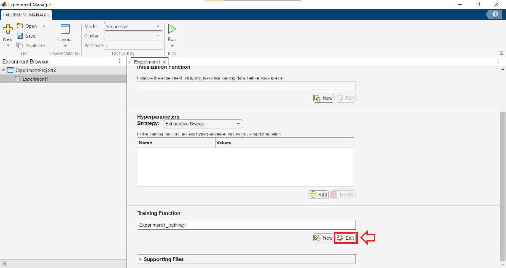
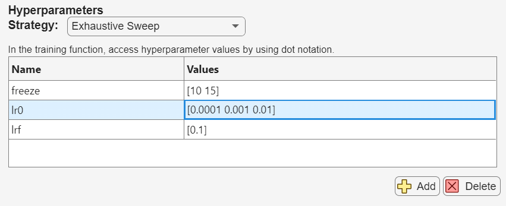
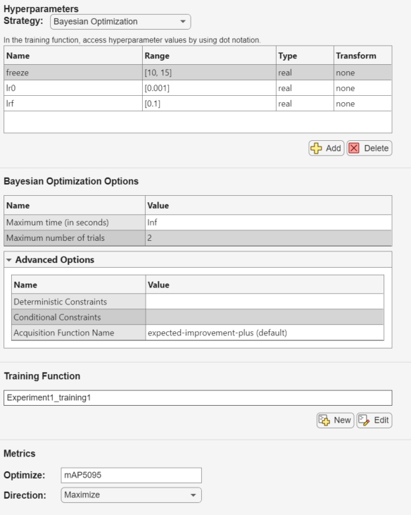
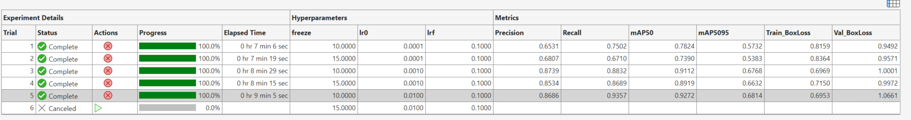
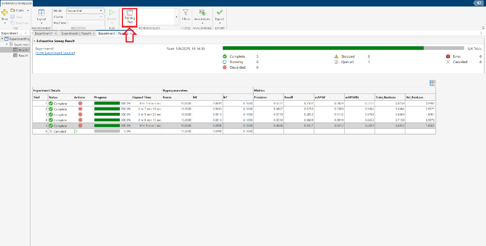

# Experimentació \- Ajust d’hiperparàmetres

A la Lliçó 2, vam aprendre com entrenar un model de detecció d’objectes YOLOv8 a MATLAB. A la Lliçó 4, vam veure com avaluar models utilitzant mètriques com la precisió, el recall, l’F1\-score i la mAP. En aquesta lliçó, explorarem com dur a terme una experimentació sistemàtica variant els hiperparàmetres del model i la configuració de data augmentation per identificar configuracions òptimes.


Al final d’aquesta sessió, seràs capaç de:

-  Identificar i aplicar **hiperparàmetres clau d’entrenament** i de **data augmentation**, entenent-ne l’impacte sobre el rendiment del model. 
-  Configurar l’**Experiment Manager de MATLAB** per executar múltiples proves utilitzant grid search o optimització bayesiana. 
# **Recapitulació**

A la Lliçó 2, vam veure que el codi següent es pot utilitzar per entrenar un model:

```
[yolov8Det, results] = trainYOLOv8ObjectDetector( ...
    configFile, ...
    baseModel, ...
    options, ...
    optionalArgs{:});
```

En aquella lliçó, només vam treballar amb el paràmetre `Freeze` de `optionalArgs`. En aquesta sessió, explorarem `optionalArgs` addicionals.


# Hiperparàmetres del model

Pots trobar la llista completa d’hiperparàmetres, els seus valors per defecte i recomanacions a l’enllaç següent: [Hiperparàmetres de Yolo](https://docs.ultralytics.com/usage/cfg/).


Aquests són alguns dels hiperparàmetres opcionals:

-  **time** (*float*): Temps màxim d’entrenament en hores. Si s’estableix, l’entrenament s’aturarà automàticament quan s’arribi a aquest límit de temps, encara que no s’hagi completat el nombre d’èpoques especificat. És útil per a entrenaments amb restriccions de temps. 
-  **optimizer** (*str*): Especifica l’optimitzador utilitzat durant l’entrenament. Les opcions habituals inclouen `'SGD'`, `'Adam'`, `'AdamW'`, `'RMSProp'` o `'auto'` per a una selecció automàtica segons el model i la tasca. L’optimitzador influeix en la velocitat i l’estabilitat de l’aprenentatge. 
-  **lr0** (*float*): Learning rate inicial que controla la velocitat amb què el model actualitza els pesos al començament de l’entrenament. Escollir un valor adequat és important per a un aprenentatge efectiu. 
-  **lrf** (*float*): Fracció final del learning rate. Defineix la fracció del learning rate inicial (`lr0`) fins a la qual decaurà el learning rate al final de l’entrenament, sovint utilitzada amb planificadors de learning rate. 
-  **momentum** (*float*): Factor de momentum utilitzat per optimitzadors com SGD o Adam, que controla la influència dels gradients passats en les actualitzacions actuals dels pesos, ajudant a estabilitzar i accelerar l’entrenament. 
-   **batch\_size** (int/ float) **:**  El batch size es pot establir de tres maneres: com un enter (per exemple, batch=16) per a una mida fixa; com \-1 per utilitzar automàticament aproximadament el 60% de la memòria de la GPU; o com una fracció entre 0 i 1 (per exemple, batch=0.70) per utilitzar aquesta fracció de la memòria de la GPU. El batch size afecta la velocitat d’entrenament i l’ús de memòria. 
-  **weight\_decay** (*float*): Coeficient de regularització L2 que penalitza pesos grans del model per reduir el sobreajustament i millorar la generalització. 
-  **patience** (*int*): Nombre d’èpoques sense millora en les mètriques de validació després del qual l’entrenament s’atura abans d’hora. Ajuda a prevenir el sobreentrenament. 

**Exemple**

```
optionalArgs = {
    'time', 1, ...
    'optimizer', 'SGD', ...
    'lr0', 0.01, ...
    'lrf', 0.0001, ...
    'momentum', 0.937, ...
    'batch', 16, ...
    'weight_decay', 0.0005, ...
    'patience', 10 ...
     'save', true, ...
};
```
# **Hiperparàmetres de data augmentation**

Fins ara, els hiperparàmetres que hem definit estaven relacionats amb la configuració del model. A continuació, explicarem i definirem els **hiperparàmetres de data augmentation**. Pots trobar la llista completa d’hiperparàmetres de data augmentation a l’enllaç següent:  [Data Augmentation Yolo](https://docs.ultralytics.com/usage/cfg/#augmentation-settings).


**El data augmentation és una tècnica fonamental en machine learning que expandeix artificialment la mida i la diversitat d’un dataset d’entrenament.** El seu propòsit principal és millorar el rendiment del model, reforçar la generalització i augmentar la robustesa introduint variacions controlades a les dades.


En el context dels models YOLO, el data augmentation consisteix a aplicar petites transformacions a les imatges originals d’entrenament per crear noves versions lleugerament modificades. Aquestes transformacions ajuden els models YOLO a adaptar-se a diferents condicions, com ara canvis d’il·luminació, escala o perspectiva, fent-los més fiables i efectius en escenaris del món real.


La llista següent descriu cada paràmetre d’augmentació, el seu paper i el seu impacte:

-   **hsv\_h** (float): Ajusta el to de la imatge per una fracció de la roda de color (0.0 \- 1.0). Introdueix variabilitat de color per ajudar el model a generalitzar en diferents condicions d’il·luminació. 
-   **hsv\_s** (float): Altera la saturació de la imatge per una fracció (0.0 \- 1.0), afectant la intensitat del color. És útil per simular diverses condicions ambientals. 
-   **hsv\_v** (float): Modifica la brillantor (valor) de la imatge per una fracció (0.0 \- 1.0), ajudant el rendiment en escenaris d’il·luminació diversos. 
-   **degrees** (float): Rota aleatòriament la imatge dins d’un rang de 0.0 a 180 graus per millorar el reconeixement d’objectes en diferents orientacions. 
-   **translate** (float): Desplaça la imatge horitzontalment i verticalment per una fracció de la seva mida (0.0 \- 1.0), ajudant a detectar objectes parcialment visibles o desplaçats. 
-   **scale** (float): Escala la imatge per un factor de guany (≥ 0.0), simulant objectes a diferents distàncies. Valor per defecte: 0.5. 
-   **shear** (float): Aplica una deformació shear a la imatge en graus de \-180 a +180, imitant diferents angles de visió. 
-  **perspective** (float): Aplica una distorsió aleatòria de perspectiva (0.0 \- 0.001) per millorar la comprensió espacial 3D. 
-   **flipud** (float): Capgira la imatge verticalment amb una probabilitat determinada (0.0 \- 1.0), augmentant la varietat de dades sense alterar les característiques de l’objecte. 
-   **fliplr** (float): Capgira la imatge d’esquerra a dreta amb una probabilitat (0.0 \- 1.0), útil per aprendre característiques simètriques i augmentar la diversitat del dataset.  
-  **mosaic** (float): Combina quatre imatges d’entrenament en una sola amb una probabilitat (0.0 \- 1.0), simulant escenes complexes i interaccions entre objectes per millorar la generalització. 


**Exemple**

```
optionalArgs = {
    'hsv_h', 0.015, ...
    'hsv_s', 0.7, ...
    'hsv_v', 0.4, ...
    'degrees', 0.0, ...
    'translate', 0.1, ...
    'scale', 0.5, ...
    'shear', 0.0, ...
    'perspective', 0.0, ...
    'flipud', 0.0, ...
    'fliplr', 0.5, ...
    'mosaic', 1.0 ...
};
```
# **Creació d’un experiment**

Per crear l’experiment, utilitzarem l’**Experiment Manager** de MATLAB.


Per obtenir més informació, consulta la documentació oficial: [Documentació d’Experiment Manager](https://es.mathworks.com/help/matlab/ref/experimentmanager-app.html) i també pots consultar aquest projecte d’exemple: [Exemple d’Experiment Manager](https://es.mathworks.com/help/deeplearning/ug/custom-training-experiment-using-parallel-workers.html).


Per llançar l’eina, podem executar l’ordre següent:

```matlab
experimentManager
```

Un cop s’obri l’eina, hem de crear un **Blank Project** amb **Custom Training**.


Després de crear el nou projecte, hauríeu de veure una interfície similar a aquesta. Feu clic per editar la funció d’entrenament:




# **Definir la funció d’entrenament**

Substitueix el codi existent per aquest.


L’únic que has de fer és definir el `workingDirectory`: l’has d’establir al directori on hem estat treballant fins ara.


Pots trobar el teu directori de treball actual executant l’ordre `pwd` (print working directory) al terminal.


A més a més, has d’especificar amb quins paràmetres vols experimentar.


En aquest exemple, experimentarem amb `freeze`, `lr0` i `lrf`.


Per afegir més paràmetres, utilitza el mateix format.

```
function output = Experiment1_training1(params,monitor)
    addpath('help-module');
    workingDirectory = "Write here the directory where you are working (pwd)";
    cd(workingDirectory)

    configFile = fullfile(workingDirectory, 'datasets', 'fruits_3_4998', 'data.yaml');
    baseModel = 'yolov8s-oiv7.pt';
    options.MaxEpochs = 10;
    options.ImageSize = [128 128 3];
    
    opts = params;

    % Specify which parameters you want to experiment with
    optionalArgs = {
        % If no optimizer is specified, one will be chosen automatically.  
        % Note that parameters such as lr0 and momentum depend on the selected optimizer and may be ignored if incompatible.

        'optimizer', 'SGD' ...
        'freeze', opts.freeze, ...
        'lr0', opts.lr0, ...
        'lrf', opts.lrf
    };

      
    [yolov8Det, results] = trainYOLOv8ObjectDetector( ...
    configFile, ...
    baseModel, ...
    options, ...
    optionalArgs{:});

    %-----------------------------------------------------------------------------
    % This section contains code to display the results
    dict = results.results_dict;

    precision = double(dict{'metrics/precision(B)'});
    recall    = double(dict{'metrics/recall(B)'});
    mAP50     = double(dict{'metrics/mAP50(B)'});
    mAP5095   = double(dict{'metrics/mAP50-95(B)'});
    
    monitor.Metrics = ["Precision", "Recall", "mAP50", "mAP5095"];
    monitor.XLabel = "Epoch";
    
    % Path to the CSV file generated by Ultralytics
    saveDirStr = char(results.save_dir.as_posix());  % or .__str__() if this doesn't work
    csvPath = fullfile(saveDirStr, 'results.csv');
    
    if isfile(csvPath)
        data = readmatrix(csvPath);
        % Columns: epoch, box_loss, obj_loss, cls_loss, precision, recall, mAP_50, mAP_50-95
        train_boxloss = data(:, 2); 
        train_cls_loss = data(:, 3);
        train_dfl_loss = data(:, 4);
        precision = data(:, 5);
        recall    = data(:, 6);
        mAP50     = data(:, 7);
        mAP5095   = data(:, 8);
        val_boxloss = data(:, 9); 
        val_cls_loss = data(:, 10);
        val_dfl_loss = data(:, 11);
        epochs = size(data, 1);

        % Añadir todas las métricas a monitor
        % monitor.Metrics = [monitor.Metrics, "Train_BoxLoss", "Train_CLSLoss", "Train_DFLLoss", "Val_BoxLoss", "Val_CLSLoss", "Val_DFLLoss"];
        monitor.Metrics = [monitor.Metrics, "Train_BoxLoss", "Val_BoxLoss" ];
        monitor.XLabel = "Epoch";

        for epoch = 1:epochs
            monitor.recordMetrics(epoch, ...
                "Precision", precision(epoch), ...
                "Recall", recall(epoch), ...
                "mAP50", mAP50(epoch), ...
                "mAP5095", mAP5095(epoch), ...
                "Train_BoxLoss", train_boxloss(epoch), ...
                "Val_BoxLoss", val_boxloss(epoch));
                %"Train_CLSLoss", train_cls_loss(epoch), ...
                %"Train_DFLLoss", train_dfl_loss(epoch), ...
                %"Val_CLSLoss", val_cls_loss(epoch), ...
                %"Val_DFLLoss", val_dfl_loss(epoch));
        end
    else
        warning('No se encontró results.csv en %s', csvPath);
    end
    output.trainedDetector = yolov8Det;
    output.metrics = results.results_dict;
    output.modelPath = saveDirStr;
end
```

# **Definir els rangs dels hiperparàmetres**

Un cop definida la funció d’entrenament, el pas següent és especificar el rang d’hiperparàmetres que es vol explorar. Això es fa dins de l’Experiment Manager.


**Important:** Els noms dels paràmetres que utilitzis aquí han de coincidir exactament amb els utilitzats a la funció d’entrenament. Per exemple:





Els noms dels paràmetres han de començar amb una lletra, seguida de lletres, dígits o guions baixos.


Exemples:

-  `distance` 
-  `a_2` 

Els valors dels paràmetres han de ser escalars o vectors. L’Experiment Manager fa una cerca exhaustiva executant una prova per a cada combinació única de valors de paràmetres especificada a la taula.


Exemples:

-  `0.01` 
-  `0.01:0.01:0.05` 
-  `[0.01 0.02 0.04 0.08]` 
-  `["alpha" "beta" "gamma"]` 

**Tipus de dades compatibles:**


`double | single | int8 | int16 | int32 | int64 | uint8 | uint16 | uint32 | uint64 | logical | string | char`

# **Escollir una estratègia**

Hi ha dos tipus d’estratègies:

-  **Exhaustive Sweep:** Executa un experiment per a cada combinació possible de tots els hiperparàmetres especificats. 
-  **Optimització bayesiana:** Especifiques hiperparàmetres amb els seus rangs de valors i el nombre d’iteracions que s’han d’executar. A cada iteració, l’algorisme selecciona les combinacions d’hiperparàmetres més prometedores basant-se en els resultats anteriors, evitant així haver de provar tot l’espai de paràmetres, que sovint és enorme. 

Quan s’utilitza l’optimització bayesiana, cal especificar el tipus de cada variable, el nombre màxim de proves (és a dir, les configuracions màximes a provar) i, opcionalment, un temps màxim d’execució. A més a més, cal especificar quina mètrica s’utilitzarà com a objectiu d’optimització. Aquesta mètrica s’ha d’enregistrar durant l’entrenament. En el nostre cas, la mètrica recomanada és **mAP5095**, ja que té en compte tant la precisió de localització de les bounding boxes com la correcció de la predicció de classe.




# **Executar l’experiment**

Un cop definida l’estratègia, pots fer clic a **RUN** per iniciar l’experiment.


A la pestanya d’entrenament, després que es completi cada iteració, pots revisar les mètriques d’aquella iteració.





A més a més, si fas clic al botó **Training Plot** situat a la part superior central, s’obrirà una finestra nova amb gràfics que mostren l’evolució de les mètriques definides a la funció d’entrenament al llarg de les èpoques per a la prova seleccionada:





Per seleccionar una prova, simplement fes-hi clic a la taula amb el ratolí.


# Tensor Board

Una altra opció per visualitzar les mètriques d’entrenament és **TensorBoard**. El pots llançar utilitzant l’ordre següent, que iniciarà un servidor local. Després, obre el navegador web i ves a l’URL següent: [http://localhost:6006/](http://localhost:6006/)

```matlab
pyInterpreter = char(getPythonInterpreter());
logdir = fullfile(pwd)

if ispc
    command = ['start "" "' pyInterpreter '" -m tensorboard.main --logdir "' logdir '"'];
else 
    command = [pyInterpreter ' -m tensorboard.main --logdir "' logdir '" &'];
end

disp(command) 
system(command); 

disp('✅ TensorBoard is running in the background (http://localhost:6006/)...');
```