# PRACTICA 2: PROCESADO LINEAL Y NO LINEAL DE LA IMAGEN DIGITAL (2ª PARTE)
# **Introducción**

En esta práctica se estudian distintos filtros de suavizado y realce aplicados a imágenes en escala de grises. El objetivo es comprender cómo actúan estos filtros, tanto a nivel matemático como visual, y analizar su comportamiento frente al ruido.

# **Manipulación básica de imágenes**

Cargamos las imágenes que se utilizarán a lo largo de la práctica y las convertimos a escala de grises cuando es necesario, para trabajar únicamente con niveles de intensidad.

```matlab
lena = imread("Imagenes\lena_gray_512.tif");

universo = imread("Imagenes\Universo.jpg");

universo = rgb2gray(universo);
```

Mostramos las imágenes cargadas para comprobar que se han leído correctamente.

```matlab
montage({lena,universo})
```

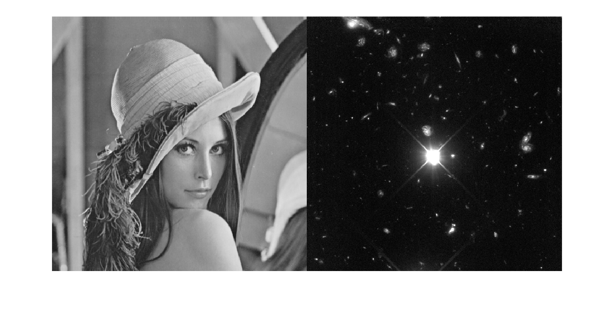
# **Filtros de suavizado**

Los filtros de suavizado reducen el ruido y las variaciones bruscas de intensidad, a costa de perder detalle fino en la imagen.


Producto de convolución. Definimos un kernel de la media 3x3, que asigna el mismo peso a todos los píxeles de la vecindad.

```matlab
w = (1./9.)*[1,1,1;1,1,1;1,1,1];
```

Aplicamos la convolución usando conv2. Esta función no gestiona automáticamente los bordes, lo que provoca artefactos visibles.

```matlab
lena_conv = conv2(lena,w);

montage({lena,uint8(lena_conv)}) % Observa los bordes
```


Filtro de la media usando imfilter. La función imfilter permite aplicar el mismo kernel, pero gestionando mejor los bordes.

```matlab
lena_media = imfilter(lena,w);

montage({lena,lena_media})
```


Padding en imfilter. Por defecto se utiliza zero\-padding, pero se pueden usar otras opciones para mejorar el resultado en los bordes.

```matlab
lena_media_r = imfilter(lena,w,'replicate');

lena_media_s = imfilter(lena,w,'symmetric');

montage({lena,lena_media,lena_media_r,lena_media_s}) % Comparar especialmente los bordes
```

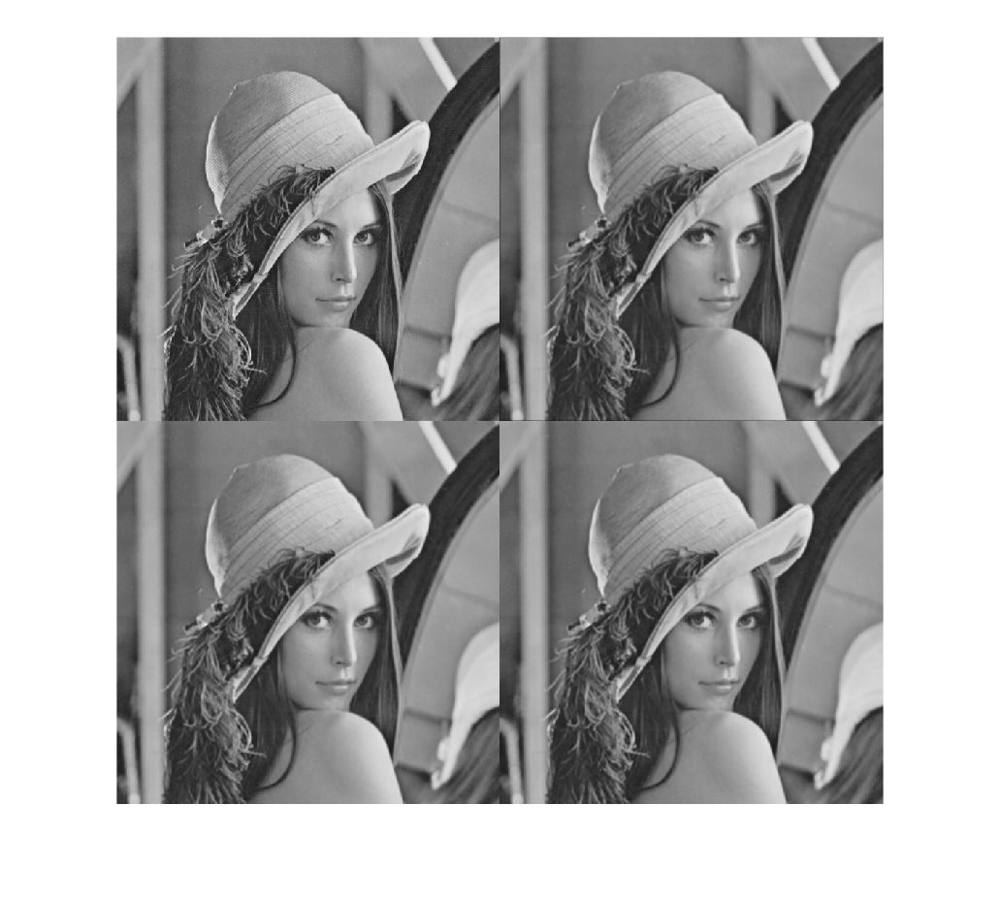

Filtro gaussiano. El filtro gaussiano asigna mayor peso al píxel central y suaviza de forma más natural.


Kernel gaussiano 3x3 con sigma = 1

```matlab
w_gaussian = (1./16.)*[1,2,1;2,4,2;1,2,1];

lena_gaussian = imfilter(lena,w_gaussian);

montage({lena,lena_gaussian})
```


Filtros gaussianos de mayor tamaño usando fspecial

```matlab
w_gaussian = fspecial("gaussian",5,5);

lena_gaussian = imfilter(lena,w_gaussian);

montage({lena,lena_gaussian})
```


Filtro de la media genérico con fspecial

```matlab
w_media = fspecial("average",5);

lena_media = imfilter(lena,w_media);

montage({lena,lena_media})
```


Aplicación del filtro de la media para reducción de ruido gaussiano. Primero añadimos ruido gaussiano y después aplicamos el filtro para observar su efecto.

```matlab
lena_ruido = imnoise(lena,"gaussian",0,0.01);

lena_ruido_fil = imfilter(lena_ruido,w_media);

montage({lena,lena_ruido,lena_ruido_fil})
```

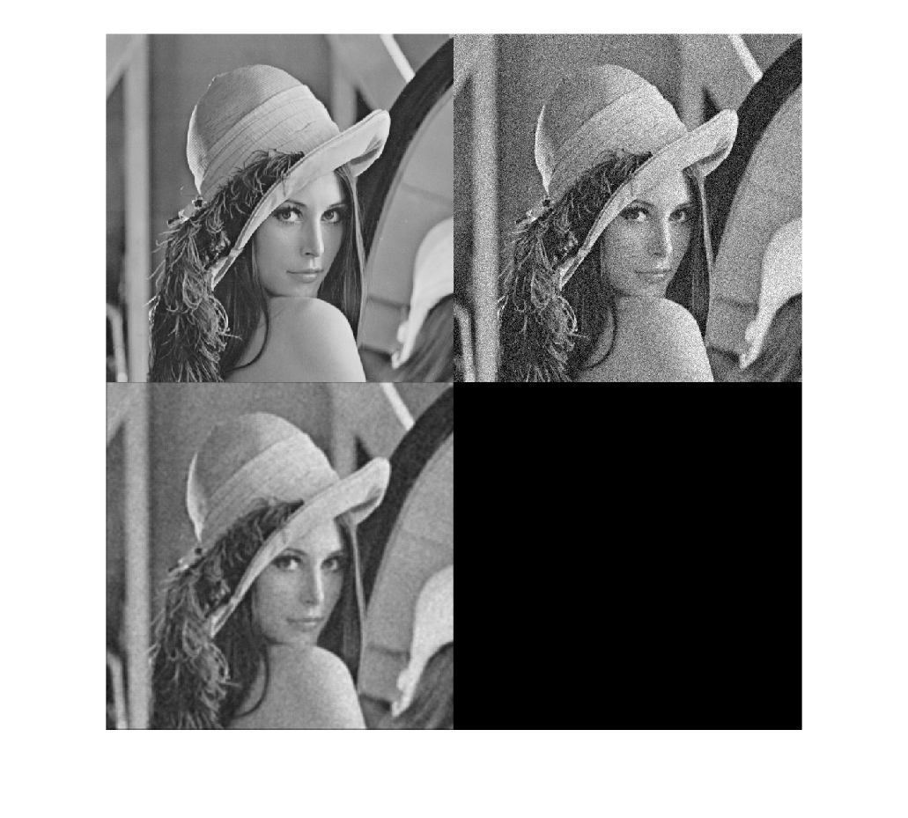

Suavizado previo para mejorar la binarización. El suavizado reduce pequeñas variaciones y facilita una binarización más estable.

```matlab
universo_bin = universo>200;

w_media = fspecial("average",25);

universo_fil = imfilter(universo,w_media);

universo_fil_bin = universo_fil>200;

montage({universo,universo_bin,universo_fil_bin})
```

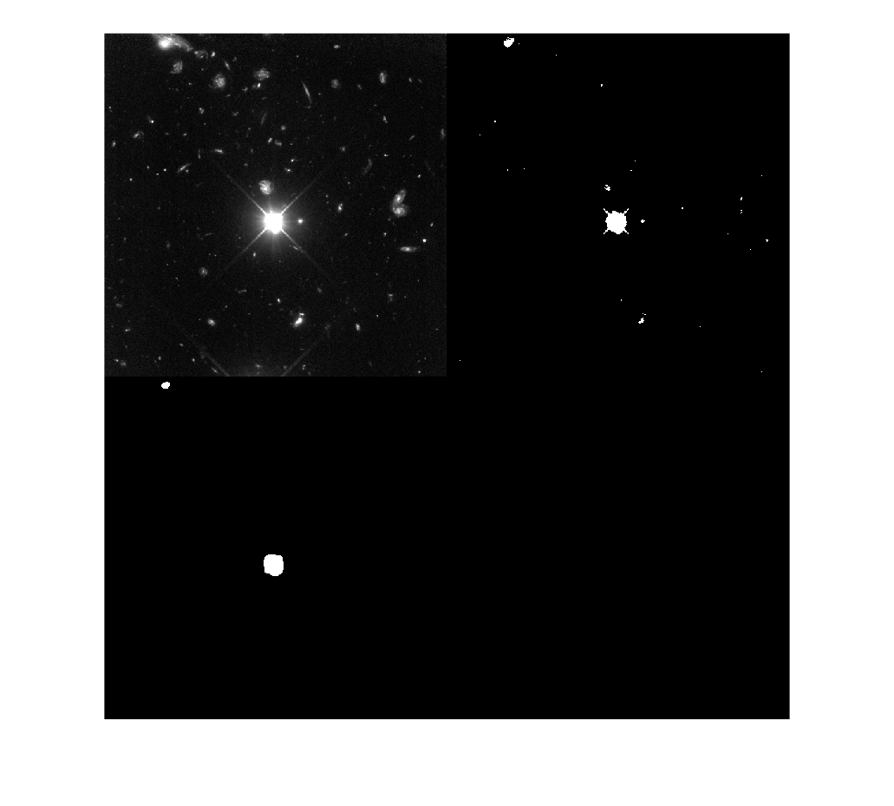

Aplicación del filtro gaussiano a la reducción de ruido

```matlab
w_gausiano = fspecial("gaussian",3,3);

lena_ruido_fil = imfilter(lena_ruido,w_gausiano);

montage({lena,lena_ruido,lena_ruido_fil})
```


**Filtros estadísticos**


Estos filtros se basan en estadísticas locales de la vecindad.


Filtro del máximo. Realza las zonas brillantes y elimina puntos oscuros aislados.

```matlab
w_estadistico = ones(3);

lena_max = ordfilt2(lena,numel(w_estadistico),w_estadistico);

montage({lena,lena_max})
```

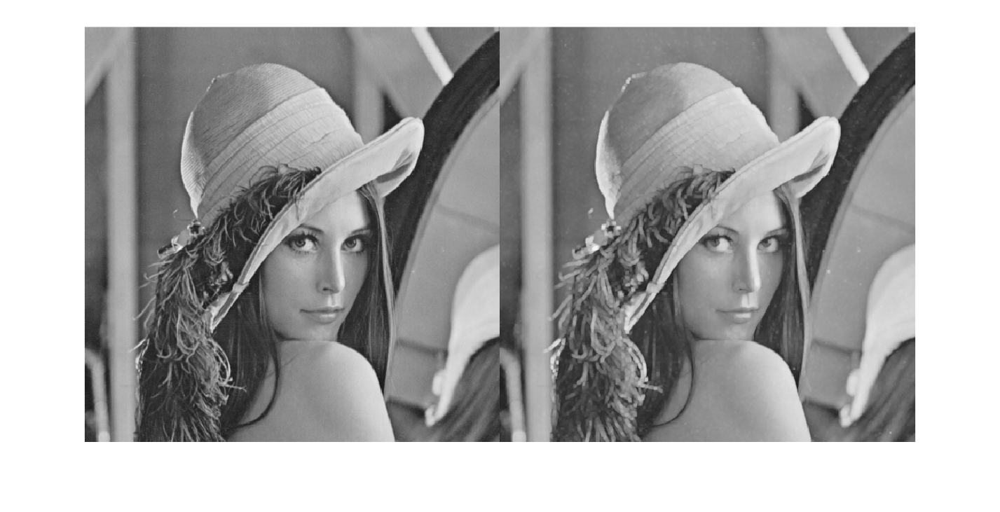

Filtro del mínimo. Realza las zonas oscuras y elimina puntos brillantes aislados.

```matlab
lena_min = ordfilt2(lena,1,w_estadistico);

montage({lena,lena_min})
```

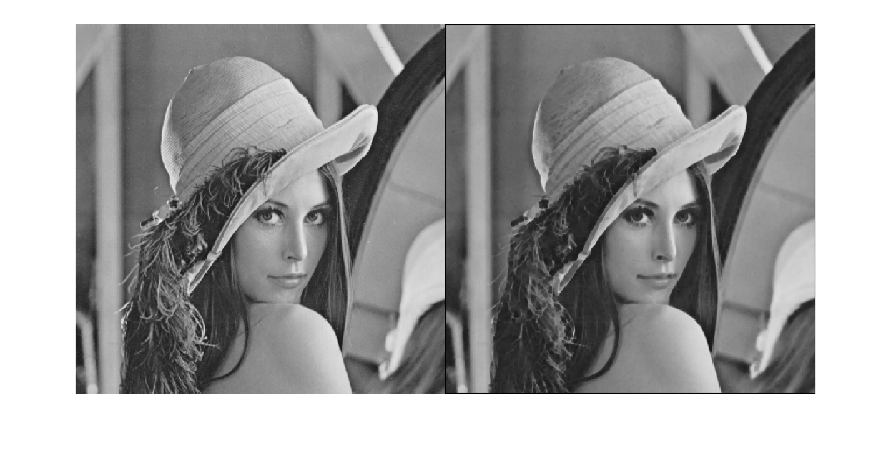

Filtro de la mediana. Es especialmente eficaz para eliminar ruido impulsional (sal y pimienta).

```matlab
lena_mediana = medfilt2(lena,size(w_estadistico));

montage({lena,lena_mediana})
```

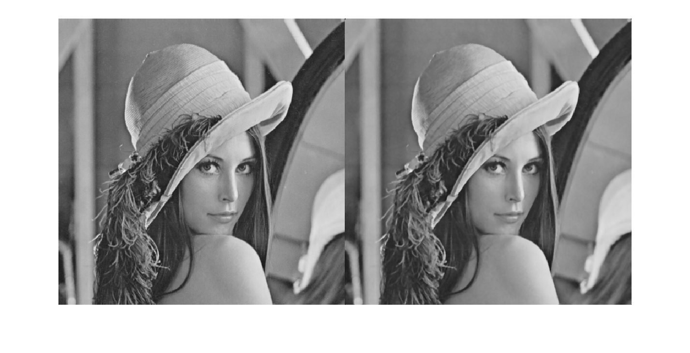

Aplicación de filtros estadísticos a ruido sal y pimienta

```matlab
probabilidad = 0.05;

ruido_impulsional = rand(size(lena));

lena_con_ruido = lena;

lena_con_ruido(ruido_impulsional < probabilidad/2) = 0;

lena_con_ruido(ruido_impulsional > 1 - probabilidad/2) = 255;

lena_max = ordfilt2(lena_con_ruido,numel(w_estadistico),w_estadistico);

lena_min = ordfilt2(lena_con_ruido,1,w_estadistico);

lena_mediana = medfilt2(lena_con_ruido,size(w_estadistico));

montage({lena,lena_con_ruido,lena_max,lena_min,lena_mediana})
```

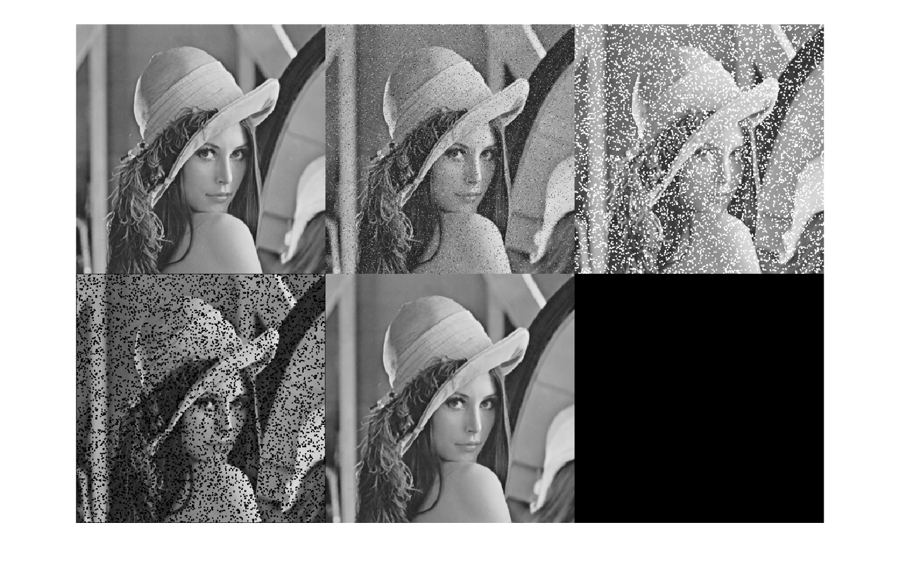
# **Filtros de realce**

Estos filtros destacan cambios bruscos de intensidad y permiten detectar bordes.


Derivada digital por definición. Se aproximan las derivadas en las direcciones x e y mediante kernels simples.

```matlab
w_dx = [0,1,0;0,-1,0;0,0,0];
w_dy = [0,0,0;1,-1,0;0,0,0];
```

Gradiente digital. Se combina la magnitud de las derivadas en ambas direcciones.

```matlab
lena_gradiente = abs(imfilter(lena,w_dx)) + abs(imfilter(lena,w_dy));

lena_negativa = 255 - lena_gradiente;

montage({lena,lena_gradiente,lena_negativa})
```


Filtros de Roberts, Sobel y Prewitt. Estos filtros calculan el gradiente usando distintas aproximaciones.


Filtro de Roberts

```matlab
wR_dx = [1,0;0,-1];
wR_dy = [0,1;-1,0];

lena_gradiente_roberts = abs(imfilter(lena,wR_dx)) + abs(imfilter(lena,wR_dy));

lena_negativa_roberts = 255 - lena_gradiente_roberts;

montage({lena,lena_gradiente_roberts,lena_negativa_roberts})
```

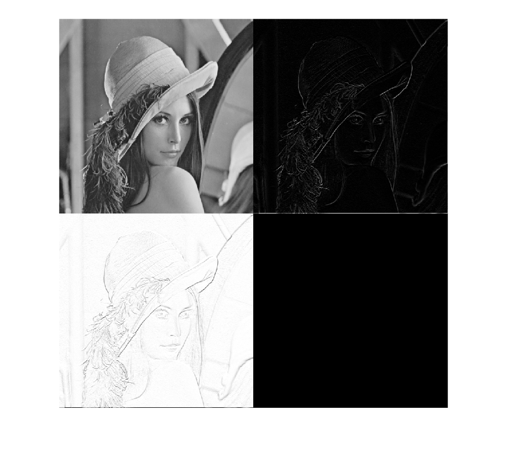

Filtro de Sobel

```matlab
w_sobel = fspecial("sobel");

lena_gradiente_sobel = abs(imfilter(lena,w_sobel)) + abs(imfilter(lena,w_sobel'));

lena_negativa_sobel = 255 - lena_gradiente_sobel;

montage({lena,lena_gradiente_sobel,lena_negativa_sobel})
```

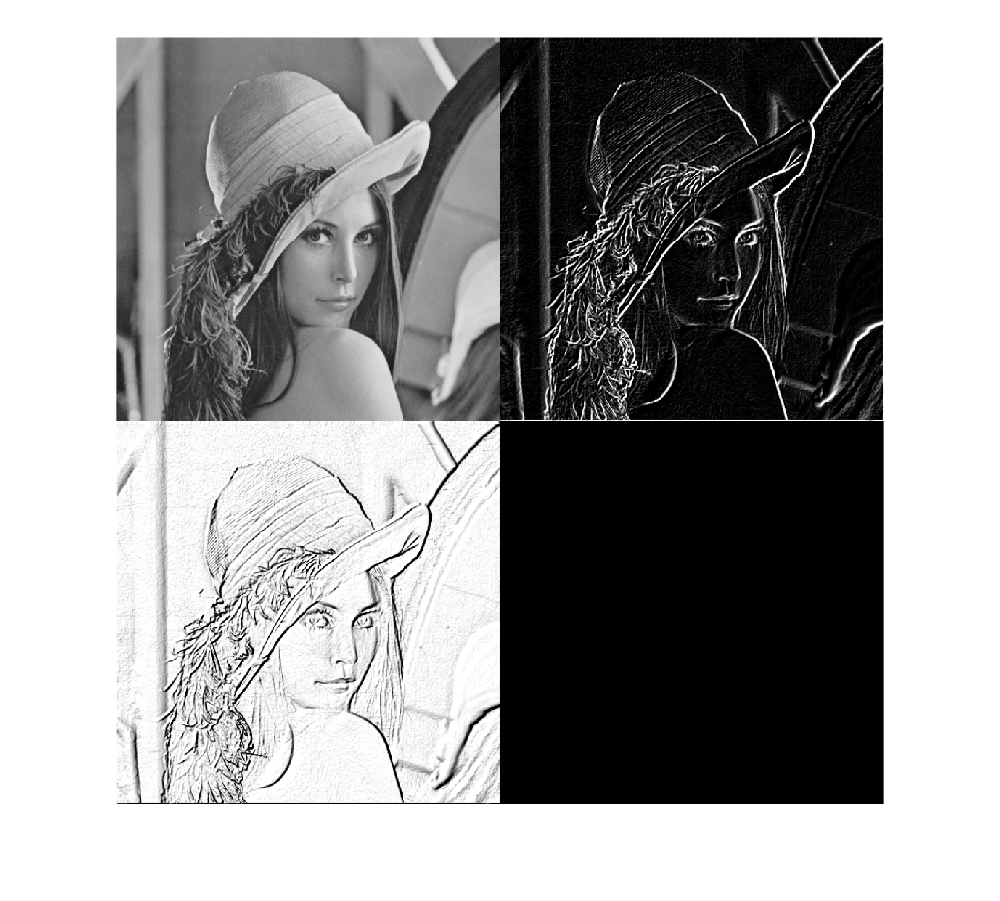

Filtro de Prewitt

```matlab
w_prewitt = fspecial("prewitt");

lena_gradiente_prewitt = abs(imfilter(lena,w_prewitt)) + abs(imfilter(lena,w_prewitt'));

lena_negativa_prewitt = 255 - lena_gradiente_prewitt;

montage({lena,lena_gradiente_prewitt,lena_negativa_prewitt})
```

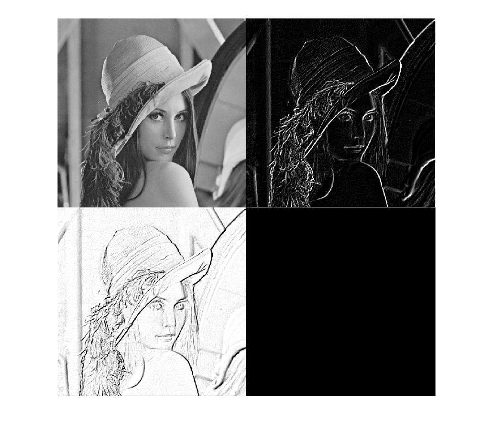

Laplaciano digital. Detecta cambios de intensidad en todas las direcciones.

```matlab
w_laplaciano = [1,1,1;1,-8,1;1,1,1];

lena_laplaciano = imfilter(lena,w_laplaciano);

lena_laplaciano_negativo = 255 - lena_laplaciano;

montage({lena,lena_laplaciano,lena_laplaciano_negativo})
```

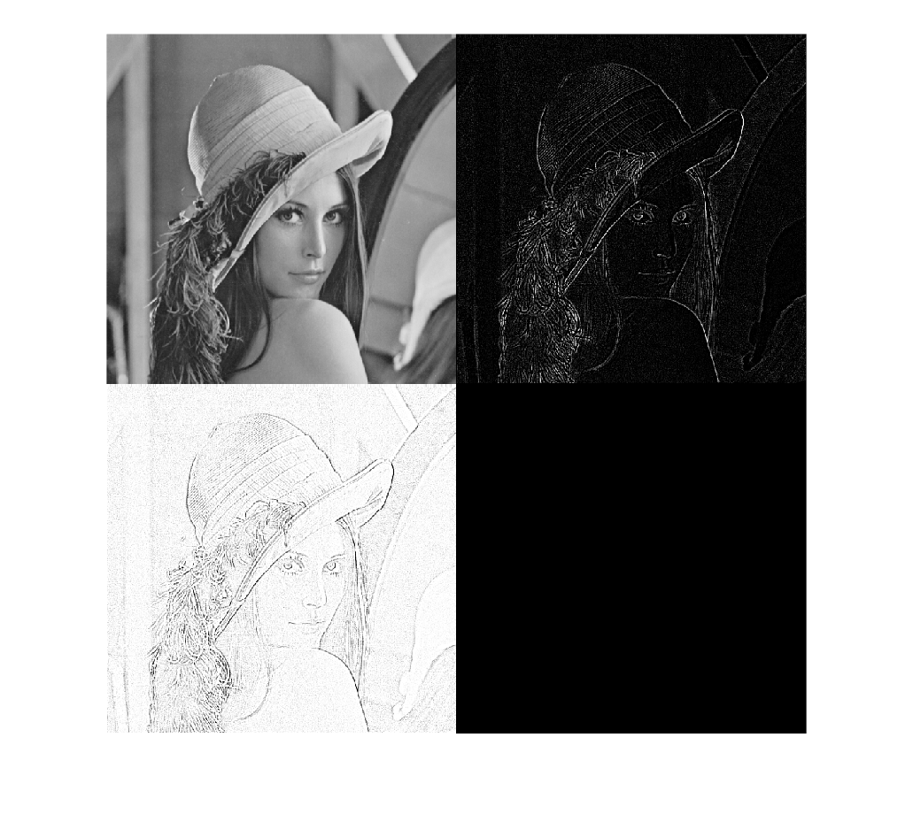

Laplacian of Gaussian (LoG). Combina suavizado gaussiano y detección de bordes.

```matlab
w_ruido_gauss = fspecial('gaussian',3,1);

lena_ruido_gauss = imfilter(lena,w_ruido_gauss);

lena_log = imfilter(lena_ruido_gauss,w_laplaciano);

lena_log_negativo = 255 - lena_log;

montage({lena,lena_laplaciano,lena_laplaciano_negativo,lena_log,lena_log_negativo})
```

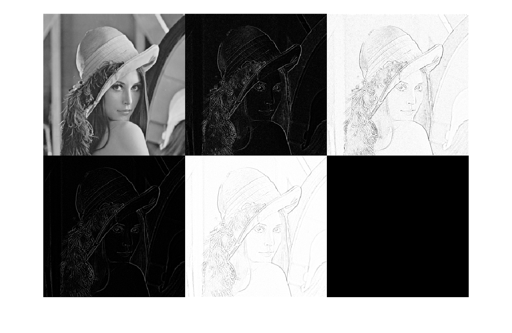

Difference of Gaussians (DoG). Se resta el resultado de dos filtros gaussianos con distinta sigma.

```matlab
sigma1 = 0.5;
sigma2 = 2;

w_gaussiano1 = fspecial('gaussian',9,sigma1);
w_gaussiano2 = fspecial('gaussian',9,sigma2);

lena_gaussiano_1 = imfilter(lena,w_gaussiano1);
lena_gaussiano_2 = imfilter(lena,w_gaussiano2);

lena_dog = lena_gaussiano_2 - lena_gaussiano_1;

lena_dog_negativa = 255 - lena_dog;

montage({lena,lena_dog,lena_dog_negativa})
```


Binarización del resultado DoG para resaltar bordes significativos

```matlab
lena_dog = lena_dog > 5;

lena_dog_negativa = lena_dog_negativa < 250;

montage({lena,lena_dog,lena_dog_negativa})
```

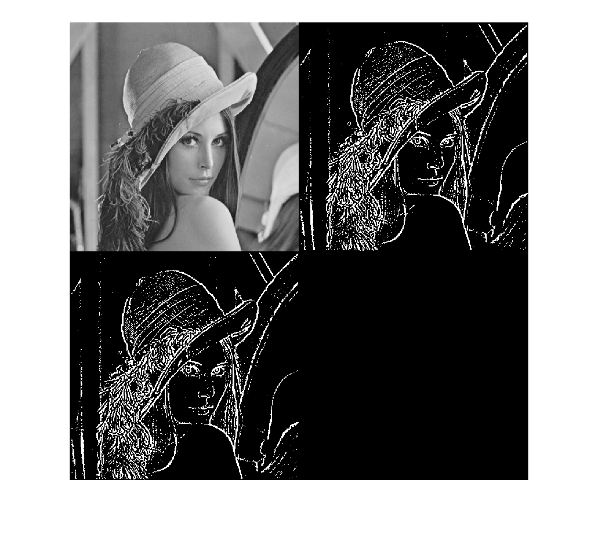

