# PRÁCTICA 3: PROCESAMIENTO MORFOLÓGICO DE IMÁGENES (1º PARTE)

Cargamos las imagenes binarias que usaremos durante la sesión práctica

```matlab
figuras = imread("Imagenes\figures.png");
head = imread("Imagenes\head.png");
agujeros = imread("Imagenes\agujeros.png");
simbolos = imread("Imagenes\Simbols.jpg");
scissors = imread("Imagenes\scissors.tif");
```

Transformamos en imagen binaria todas aquellas imagenes que no lo son

```matlab
figuras = rgb2gray(figuras);
figuras = figuras<128;

agujeros = agujeros>128;

simbolos = rgb2gray(simbolos);
simbolos = imresize(simbolos,[512,512]);
simbolos = simbolos<128;

montage({figuras,head,agujeros,simbolos,scissors})
```

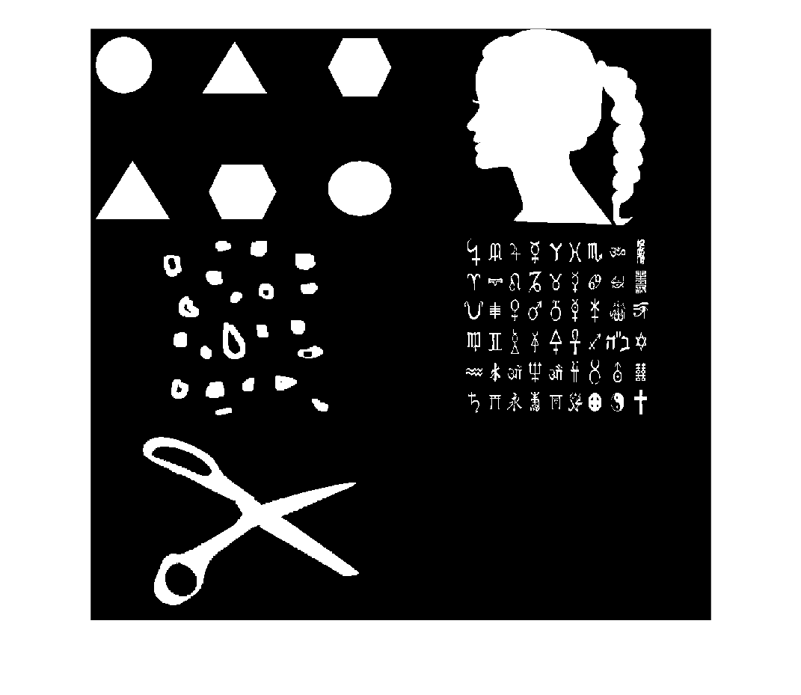
# Operadores morfológicos primarios

Definición de elementos estructurales. Se usa el comando strel, que tiene como input el tipo de elemento estructural, que puede ser de tipo disco, diamante, recta, rectangulo, cuadrado, y formas definidas por matrices.

```matlab
SE = strel("diamond",1);

```

Tipos de elementos estructurales y sus parametros:

-  diamond \-\- distancia del origen al extremo del diamante (1 para cruz) 
-  disk \-\- radio 
-  line \-\- longitud y ángulo 
-  rectangle \-\- longitud y altura (introducir como vector, es decir, \[l,a\]) 
-  square \-\- lado 
-  nhood \-\- forma definida por una matriz de 0s y 1s 

Dilatacion. Se usa el comando imdilate, que tiene como input la imagen binaria a dilatar y el elemento estructural por el que se dilata. Probar con diamante 1, cuadrado 3, disco 10.

```matlab
SE = strel("square",4);

%SE = strel("disk",10);

scissor_dilate = imdilate(scissors,SE);

montage({scissors,scissor_dilate})
```


```matlab
simbolos_dilate = imdilate(simbolos,SE);
```

El efecto será el esperado, es decir, dilatar los objetos de la imagen.

```matlab
montage({simbolos,simbolos_dilate})
```

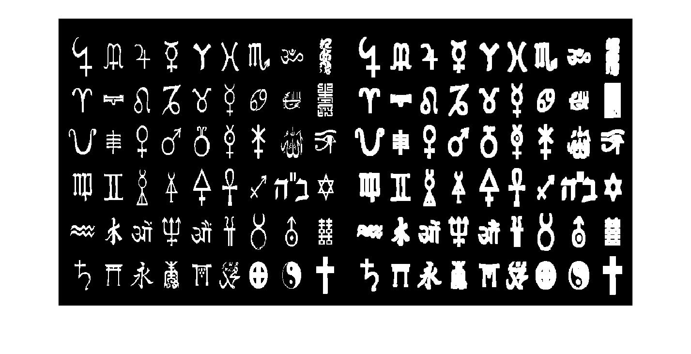

Erosion. Se usa el comando imerode, que tiene como input la imagen binaria a erosionar y el elemento estructural por el que se erosiona.

```matlab
simbolos_erode = imerode(simbolos,SE);
```

El efecto es el esperado, los objetos en la imagen se reducen.

```matlab
montage({simbolos,simbolos_erode})
```

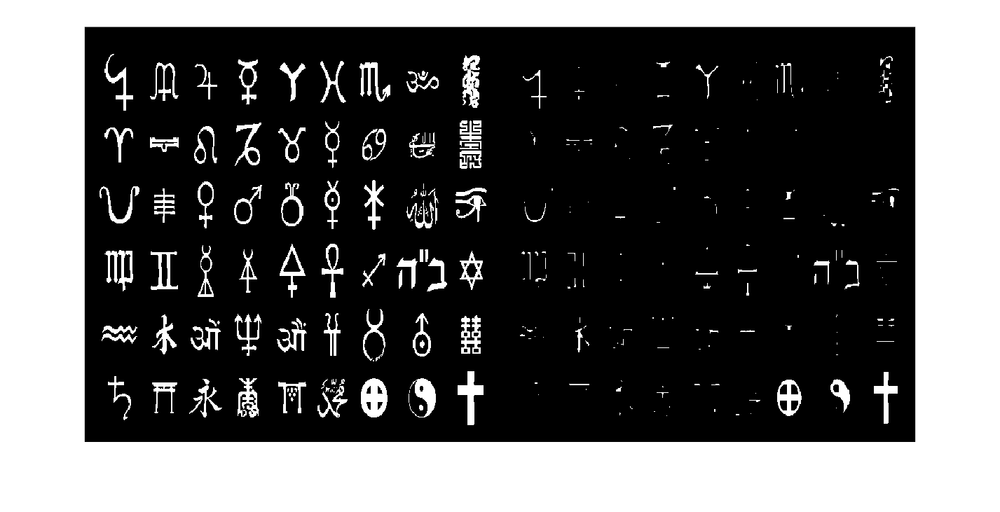

Extracción de bordes en imagenes binarias.


Forma 1: imagen\-erosion(imagen)

```matlab

head_erode = imerode(head,SE);

head_bordes = head-head_erode;

montage({head,head_bordes})
```

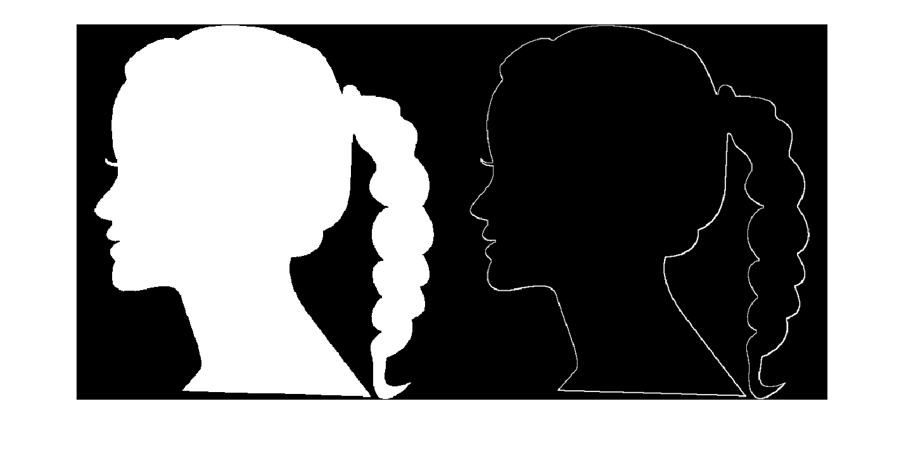

Esto se considera un borde interior (que viene de un residuo interior, que siempre se genera a partir de la erosion por un elemento estructural).


Borde exterior (residuo exterior, que siempre se genera a partir de la dilatación por un elemento estructural).

```matlab
head_dilate = imdilate(head,SE);
```

Como la dilatación de una imagen es siempre más grande que la imagen (recordar que, de hecho, contiene la imagen), en vez de hacer imagen \-dilatacion(imagen), tenemos que hacer dilatacion(imagen)\-imagen.

```matlab
head_bordes_2 = head_dilate-head;
```

Comparamos los dos tipos de bordes. Fijaos en los pequeños detalles (como las pestañas y los labios) para entender porque uno se llama borde interior y el otro exterior.

```matlab
montage({head_bordes,head_bordes_2})
```

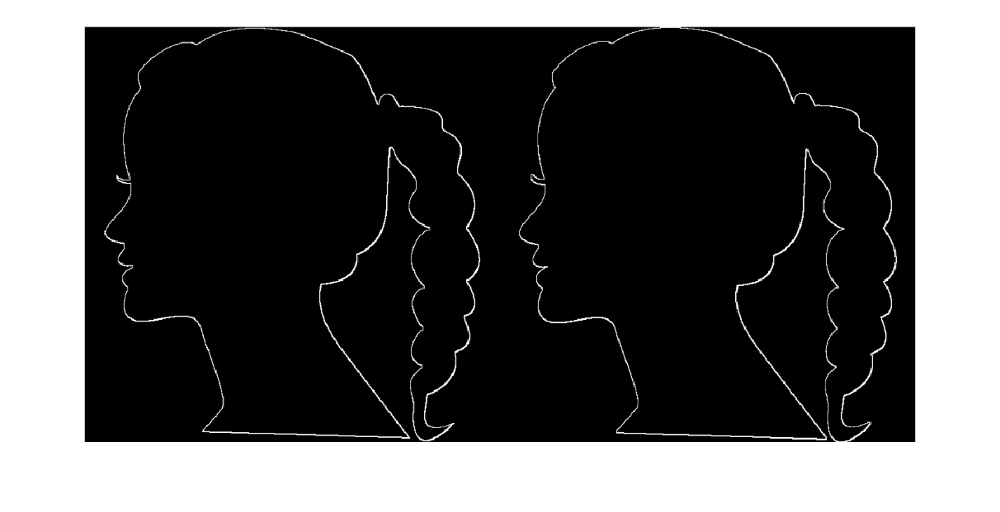

Residuo interno\-externo (es decir, ambos juntos). Se produce al restar a la dilatacion de la imagen, la erosion de la imagen.

```matlab
head_bordes_3 = head_dilate-head_erode;
```

Fijaos que este borde es siempre más grueso que el borde interior o exterior. Esto se debe a que que este borde contiene a los bordes interior y exterior, puesto que se ha calculado con los dos residuos.

```matlab
montage({head_bordes,head_bordes_2,head_bordes_3})
```

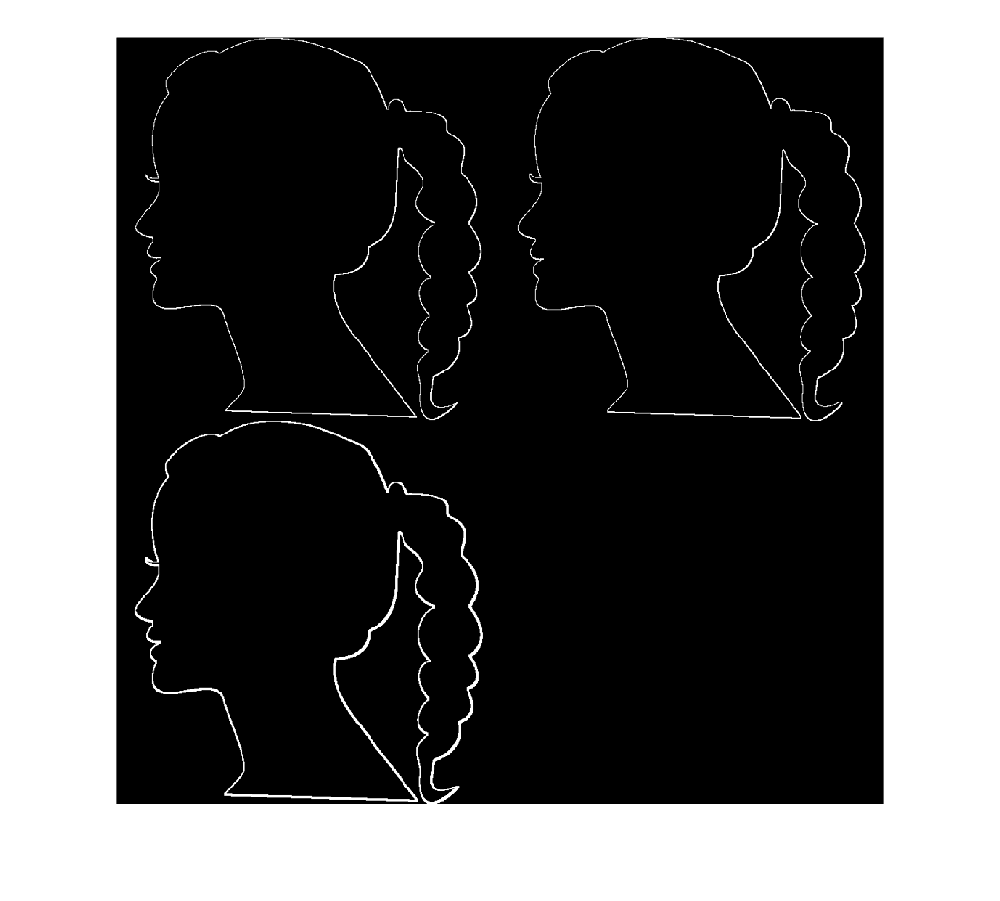

Rellanar agujeros e interiores. Se utiliza el comando imfill, donde el input es la imagen con agujeros. Hay que añadir la opción "holes".

```matlab
agujeros_fill = imfill(agujeros,"holes");
montage({agujeros,agujeros_fill})
```

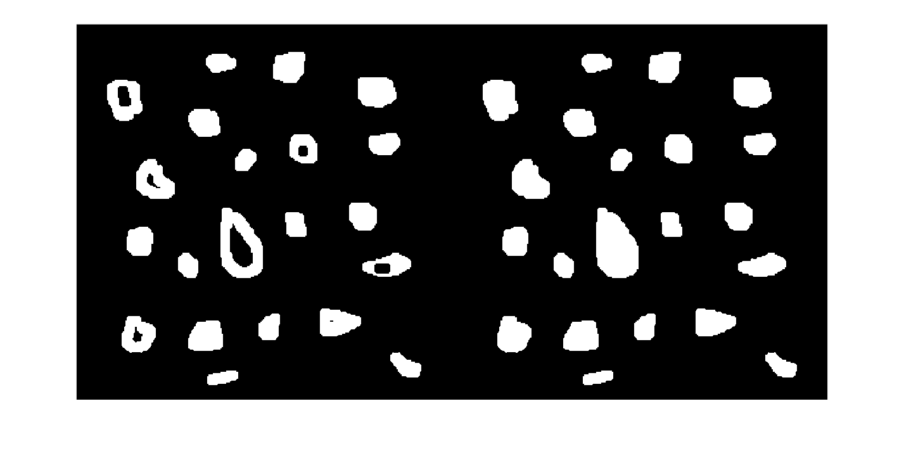

Reconstrucción de componentes conexas por dilatación.


Descomentar esta parte cuando se llegue aquí. Este comando, imprime la imagen en una pantalla independiente para que podais clicar en uno de los simbolos, que será el que reconstruyamos.

```matlab
% imshow(simbolos)
```

Este comando se queda con las coordenadas (en double) del punto marcado con el raton en la imagen simbolos. Tenemos que seleccionar un punto para recontruir la componente conexa asociada a dicho punto.

```matlab
%[x,y] = getpts;
```

Imagen binaria de zeros. El comando false crea una imagen binaria del tamaño del input. A esta imagen, en este caso del mismo tamaño que la imagen original, le cambiaremos solo el valor de un pixel, que será el valor del pixel marcado con el raton usando el comando getspts.

```matlab
%pointer = false(size(simbolos));
```

Asignamos el punto seleccionado y lo convertimos en blanco. Recordar que para hacer la reconstrucción de componentes conexas, el algoritmo empezaba con un punto que sabemos que pertenece a la componente conexa. En este caso, será el punto marcado con el raton.

```matlab
%pointer(uint16(y),uint16(x)) = 1;
```

El comando uint16 solo convierte x e y en enteros, para que sepamos que pixel es el del marcador. No usamos uint8 porque el marcador esta en una escala mayor a 255 (porque el comando getspts se puede utilizar con imagenes de cualquier tipo, en particular, de gran intensidad). Reconstruimos el objeto conexo al que pertenece el punto seleccionado. Para ello se utiliza el comando imreconstruct que tiene como parametros la imagen con el punto o puntos de las componentes conexas a reconstruir y la imagen original que servira de patron en la reconstrucción.

```matlab
%simbolos_recons = imreconstruct(pointer,simbolos);
```

Si con el raton clicais en mas de un simbolo, imreconstruct te los reconstruira todos.

```matlab
%montage({simbolos,simbolos_recons});
```
# Operadores morfológicos secundarios

Apertura. El operador apertura se aplica usando el comando imopen. Este comando tiene como parametros la imagen que se quiere abrir y el elemento estructural que se utilizará.

```matlab
SE = strel("disk",5);

figures_open = imopen(figuras,SE);
```

Fijaos que las esquinas exteriores del triangulo y el pentagono son ahora romas en vez de puntiagudas. Este es uno de los efectos tipicos de aplicar el operador apertura.

```matlab
montage({figuras,figures_open})
```

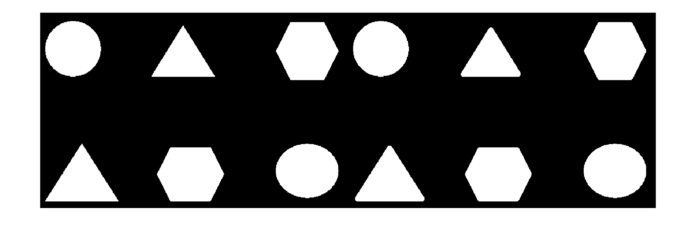

Clausura. Al igual que el operador apertura, este operador se aplica usando el comando imclose, que tiene los mismos inputs que el operador apertura.

```matlab
figures_close = imclose(figuras,SE);
```

Fijaos que en este caso no se observan cambios en la imagen. Esto se debe a que el operador clausura redondea esquinar interiores, que en este caso no estan presentes. Busquemos otro ejemplo.

```matlab
montage({figuras,figures_close})
```

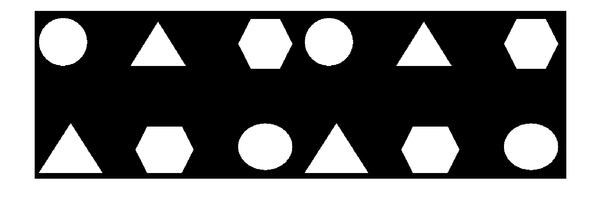

```matlab
scissors_close = imclose(scissors,SE);
```

Fijaos que en este caso, las esquinas interiores del objeto aparecen romas en vez de puntiagudas, lo que es un efecto tipico del operador clausura.

```matlab
montage({scissors,scissors_close})
```


Filtrado morfologico. Es un filtro de "suavizado" pero basado en operadores morfologicos. En particular, es muy bueno con ruido de tipo sal y/o pimienta.


Recordad \-\-> Filtrado = Clausura de la apertura de la imagen

```matlab
huellas = imread("Imagenes\Huella.jpg");
```

Binarizamos la imagen Huella

```matlab
huellas = rgb2gray(huellas);
huellas = huellas>128;

SE = strel('square',5);

huellas_open = imopen(huellas,SE);

huellas_filt = imclose(huellas_open,SE);

montage({huellas,huellas_filt})
```

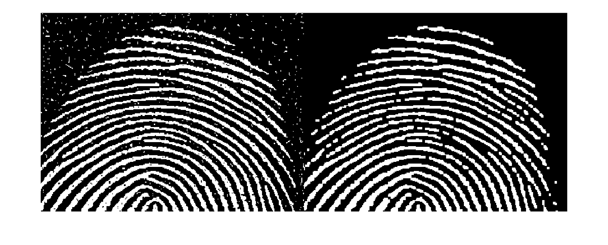

Transformada hit\-or\-miss y reconstruccion por dilatación. La transformada hit\-or\-miss toma un elemento estructural que sea igual a la componente conexa que se quiere encontrar en la imagen original, y te devuelve un % punto de la componente, para luego reconstruir como hemos visto antes. Es una forma de detectar automataticamente puntos de las componentes conexas que queremos reconstruir, sin tener que clicar con el raton.


Tomamos un elemento estructura que tenga la forma de uno de los simbolos en la imagen.

```matlab
SE1 = simbolos(25:110,285:335);

montage({simbolos,SE1})
```

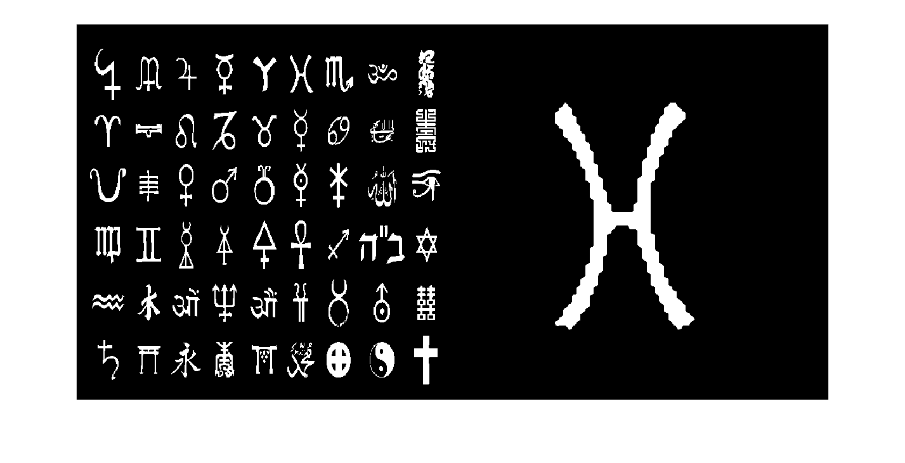

Recordad que el segundo elemento estructural ha de ser el complementario del primero.

```matlab
SE2 = not(SE1);

montage({SE1,SE2})
```

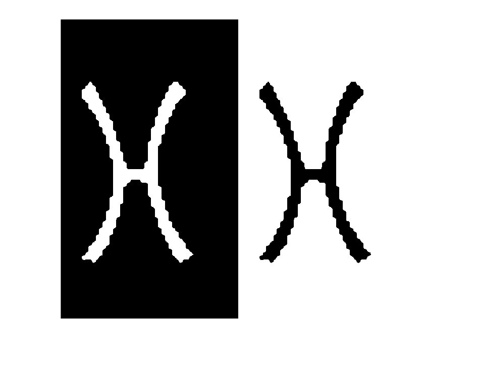

La transformada hit\-or\-miss se aplica con el comando bwhitmis que tiene como inputs la imagen original y los dos elementos estructurales.

```matlab
pointer = bwhitmiss(simbolos,SE1,SE2);
```

Una vez obtenido el punto de la componente conexa a reconstruir, reconstruimos como hemos visto antes.

```matlab
simbolos_re=imreconstruct(pointer,simbolos);

montage({simbolos,pointer,simbolos_re})
```

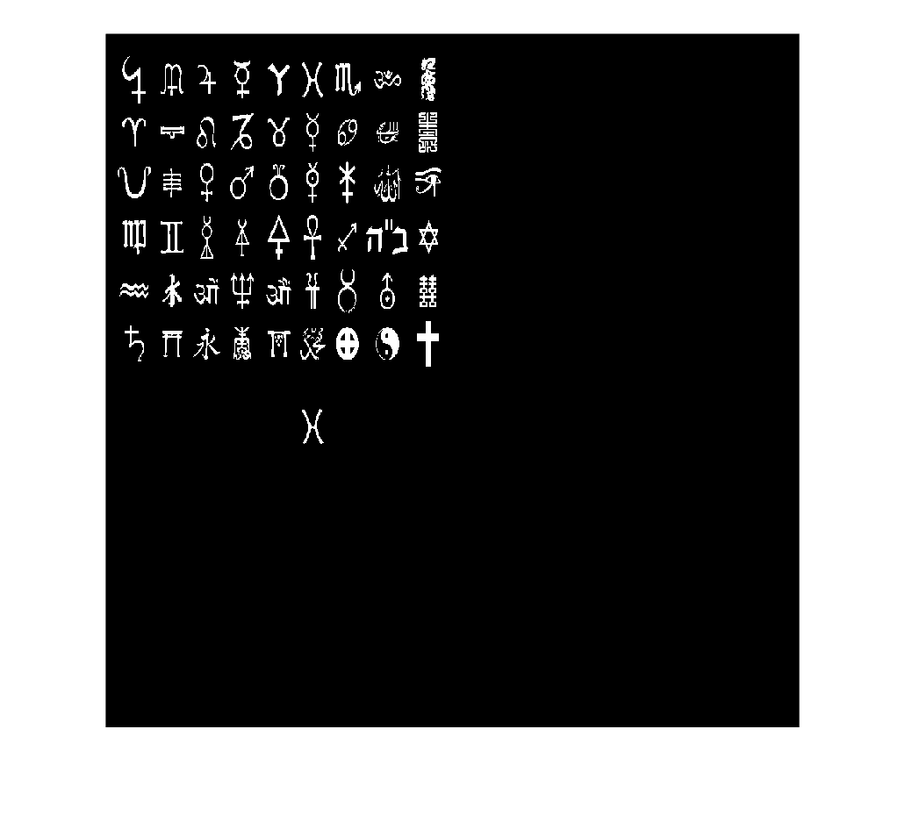

Esqueletización. Una de las aplicaciones de la transformada hit\-or\-miss, es calcular el esqueleto de los elementos en una imagen binaria. Hay principalmente dos formas.


1 forma, usando el comando bwskel, cuyo input es la imagen original.

```matlab
figures_sk = bwskel(figuras);
```

2 forma, usando el comando bwmorph, cuyos inputs son la imagen original "skel" para indicar que la transformación morfologica que queremos hacer es obtener el esqueleto e Inf, que poda elementos espurios (es decir, ramas del esqueleto que no deberían estar).

```matlab
figures_ske = bwmorph(figuras,'skel',Inf);
```

Comparamos ambas formas. Aunque parezca que bwmorph produce un mejor resultado, en general, la mejor forma de calcular el esqueleto es con bwskel. Veamos otros ejemplos.

```matlab
montage({figuras,figures_sk,figures_ske})
```

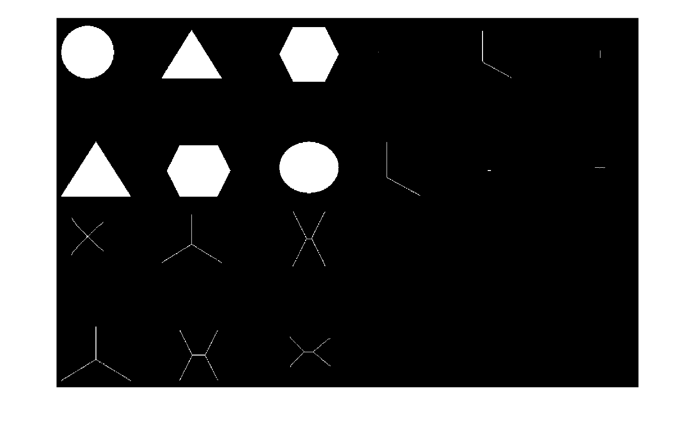

```matlab
scissors_sk = bwskel(scissors);

scissors_ske = bwmorph(scissors,'skel',Inf);
```

Aqui se observa que bwmorph produce un resultado peor (y con elementos espurios a pesar del comando Inf).

```matlab
montage({scissors,scissors_sk,scissors_ske})
```

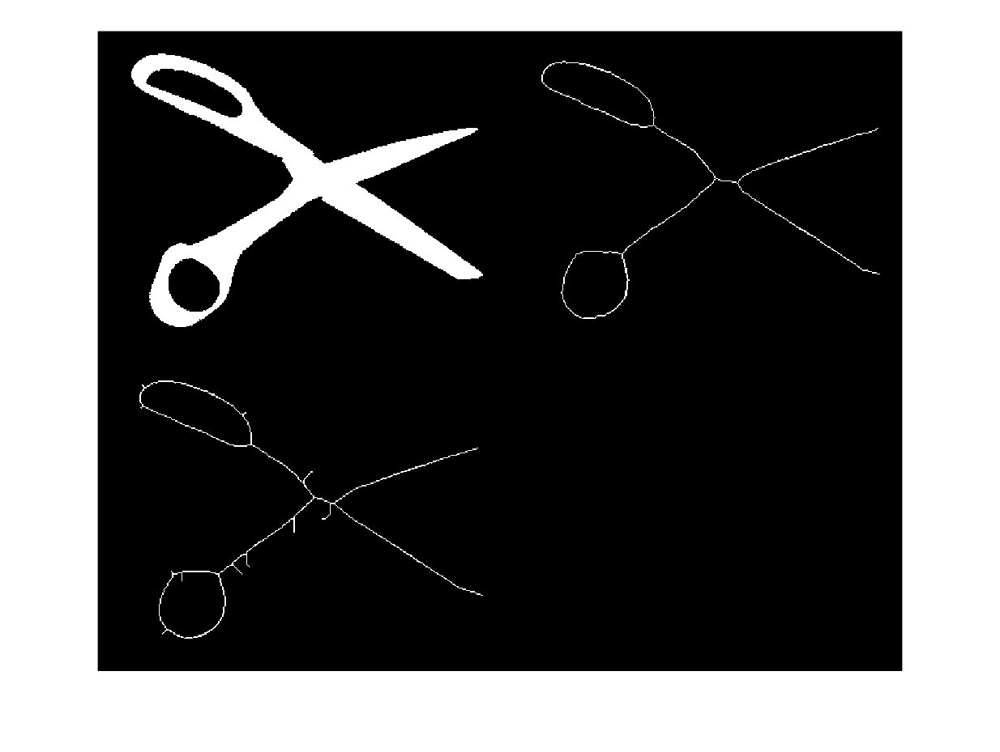

```matlab
head_sk = bwskel(head);

head_ske = bwmorph(head,'skel',Inf);
```

Mismo comentario que antes.

```matlab
montage({head,head_sk,head_ske})
```

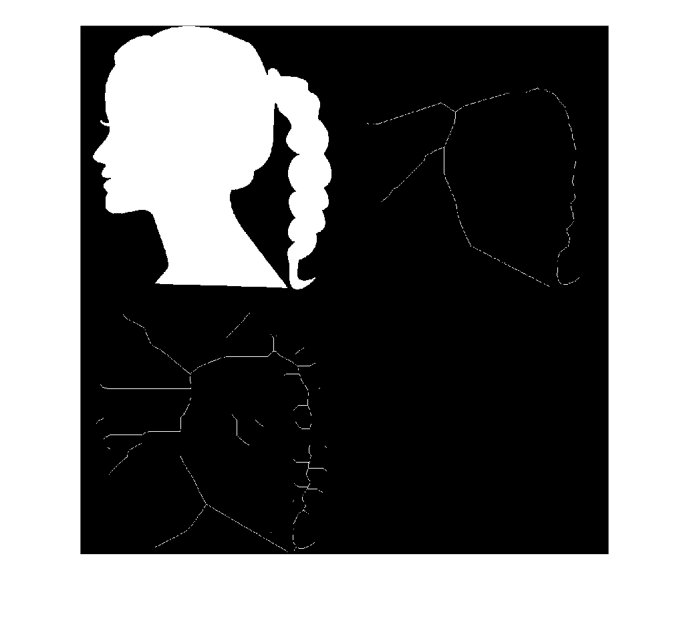

En casos como los anteriores en los que bwmorph muestra un esqueleto con elementos indeseables (espurios), hay un comando para podar aun más el esqueleto. Se trata de nuevo de bwmorph. En este caso, lo único que cambia es que en vez de pedir "skel" para que nos haga el esqueleto, pedimos "spur" para que nos pode elementos espurios.

```matlab
scissors_poda = bwmorph(scissors_ske,"spur",Inf);
head_poda = bwmorph(head_ske,"spur",Inf);
```

En ambos casos el resultado sigue siendo malo, lo que confirma que la opcion bwskel es la mejor.

```matlab
montage({scissors_ske,scissors_poda})
```

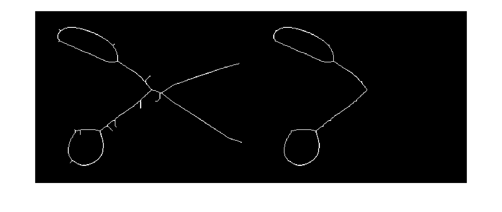

```matlab
montage({head_ske,head_poda})
```

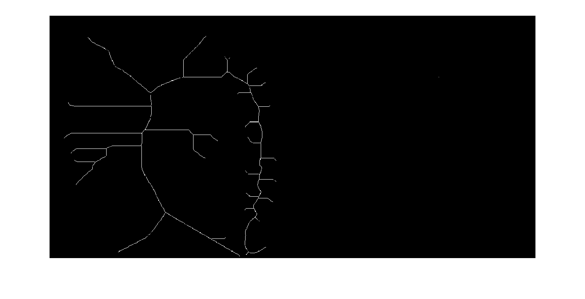

El calculo de esqueletos también se puede usar para segmentar la imagen (si es binaria). Para ello, el primer paso es hace not() de la imagen, puesto que el esqueleto siempre se calcula en la zona con pixeles de valor uno (blancos aqui).

```matlab
figuras = not(figuras);

agujero = not(agujeros_fill);

montage({figuras,agujero})
```

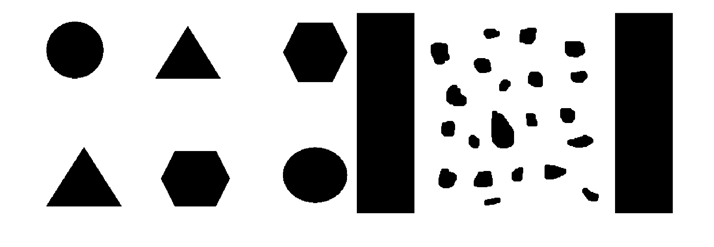

Como la imagen agujero tiene dos franjas negras alrededor, usamos un pequeño truco. Este consiste en definir un marco blanco alrededor de la imagen y aplicar el operador clausura. Este automaticamente, convertira en blanco todo el fondo que aun no lo era.


Comando para hacer que el borde exterior de la imagen sea blanco.

```matlab
agujero(1,:)=1; agujero(end,:)=1; agujero(:,1)=1; agujero(:,end)=1;

agujero = imclose(agujero,SE);
```

Resultado.

```matlab
montage(agujero)
```

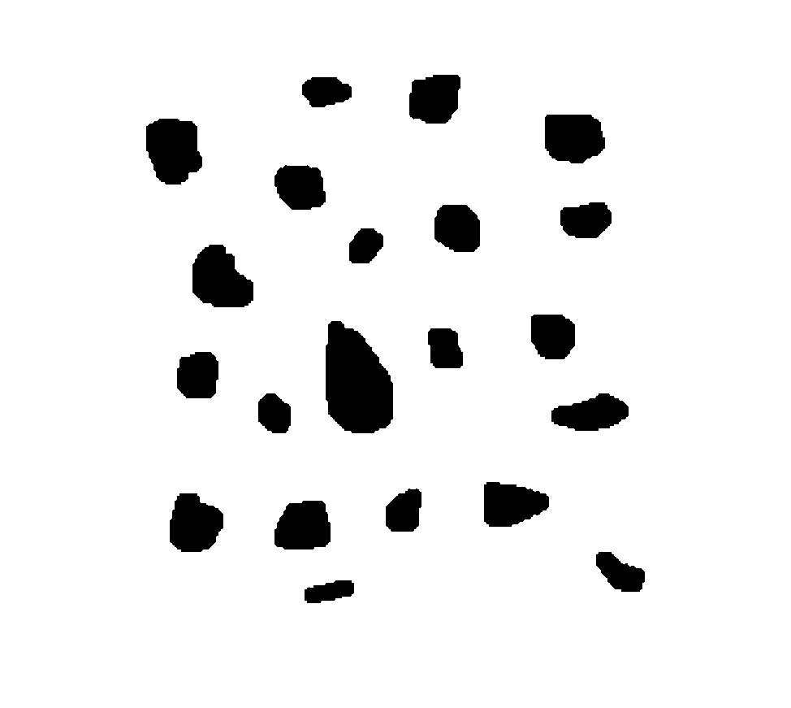

Ahora si, esqueletizamos con bwskel y vemos que nos ha delimitado las areas en las que se encuentran cada una de las figuras o cada uno de los objetos, lo que de hecho es segmentar la imagen en areas distintas, atendiento a los objetos.

```matlab
figuras_sk = bwskel(figuras);

agujero_sk = bwskel(agujero);

montage({figuras,figuras_sk})
```

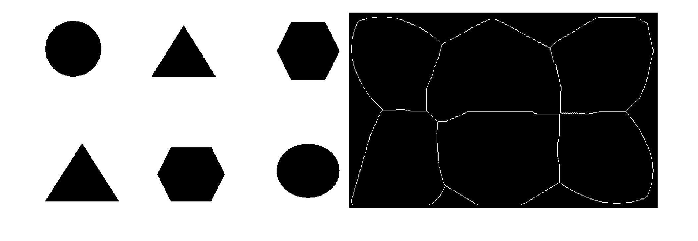

```matlab
montage({agujero,agujero_sk})
```

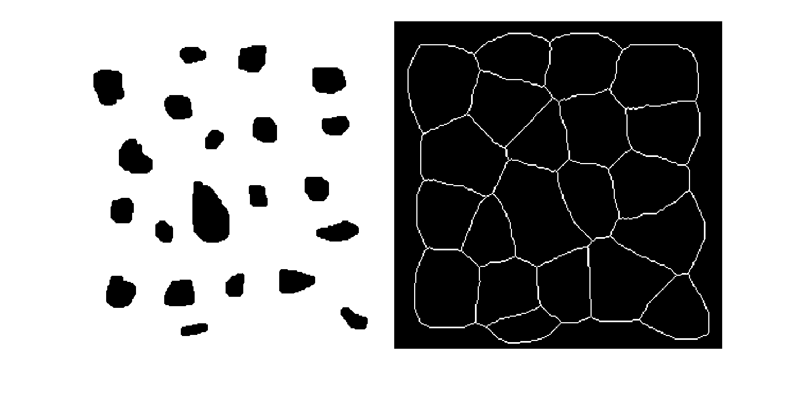

bwmorph también se puede usar para hacer todas las otras operaciones que hemos visto antes (dilatación, erosion, apertura, etc) pero solo con elementos estructurales cuadrados 3x3, por lo que en la práctica no se utiliza.


Si ahora quisieramos segmentar un imagen binaria con elementos en el borde, como la mostrada a continuación, descubririamos que la segmentación no funciones. Un truco para arreglar este problema consiste en eliminar los elementos del borde.

```matlab
test_morph = imread("Morfologia_I.jpg");

test_morph = rgb2gray(test_morph);
test_morph = test_morph > 128;

montage(test_morph)
```

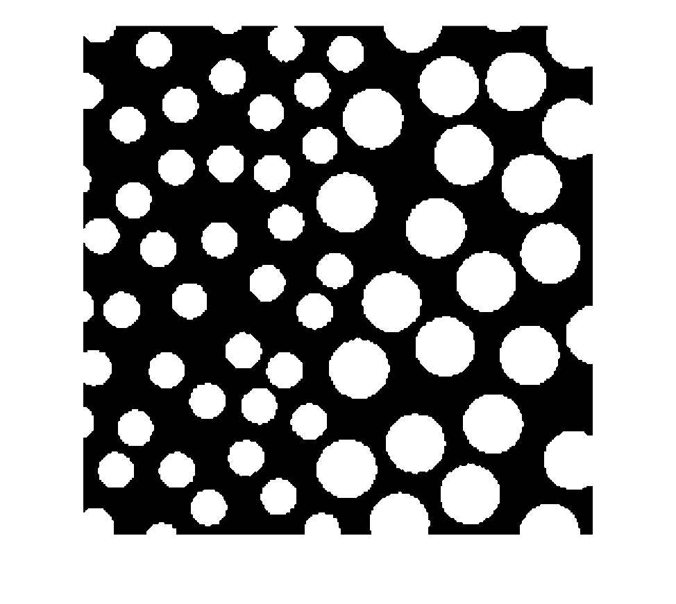

Para ello, vamos a crear una imagen binaria que solo tendrá valor blanco en el borde y la reconstruiremos basandonos en la imagen original. Esto nos dará los elementos del borde, que sinmplemente tenemos que substraer de la imagen  original.

```matlab
pointer = false(size(test_morph));
```

Definimos bordes blancos

```matlab
pointer(1,:)=1; pointer(:,1)=1; pointer(end,:)=1; pointer(:,end)=1;
```

Reconstruimos

```matlab
test_morph_recon = imreconstruct(pointer,test_morph);
```

Restamos para quedarnos con los elementos del interior.

```matlab
test_morph_no_bordes = test_morph - test_morph_recon;

montage({test_morph,test_morph_recon,test_morph_no_bordes})
```

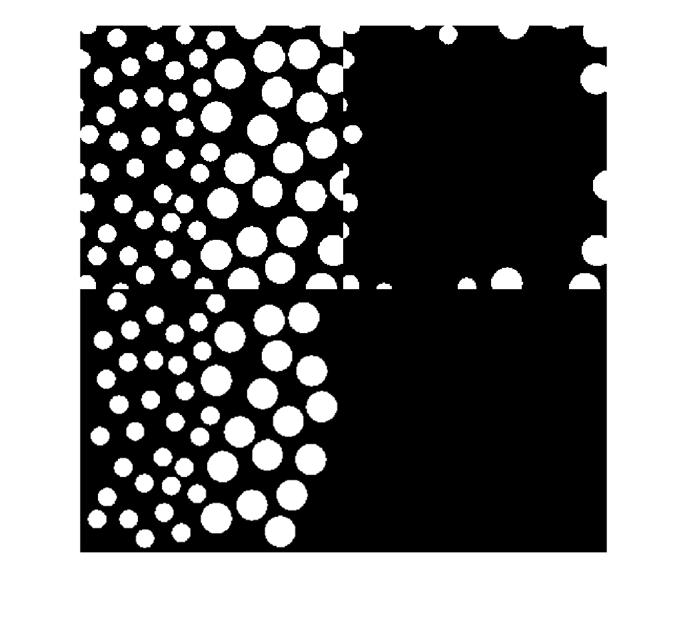
# Transformada de la distancia

Transformada de la distancia. Esta calcula la distancia al borde más cercano de cada elemento blanco de la imagen original. De esta forma, convertimos la imagen binaria, en una imagen en escala de grises. El elemento más alejado de los bordes será un 255, y así en proporción, conforme nos acercamos a los bordes.


Como queremos aplicarlo a la silueta, tenemos que convertir la silueta en blanco y el fondo en negro.

```matlab
head_neg = not(head);

imshow(head_neg)
```

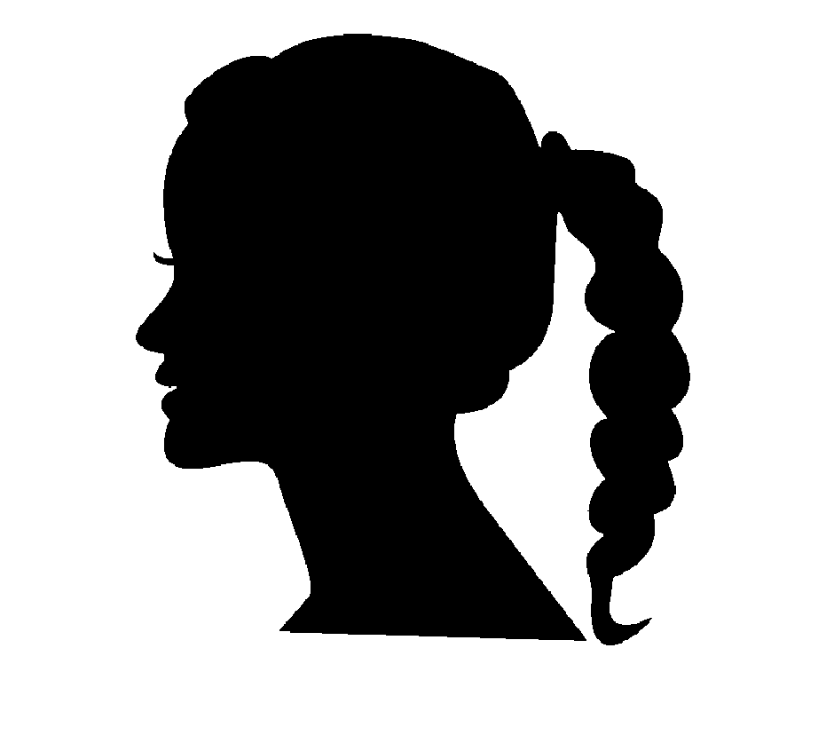

La transformada de la distancia se aplica con el comando bwdist donde el unico input es la imagen original que se quiere transformar.

```matlab
head_d = bwdist(head_neg);
```

Para ver las imagenes, necesitamos añadir \[\]

```matlab
imshow(uint8(head_d))
```

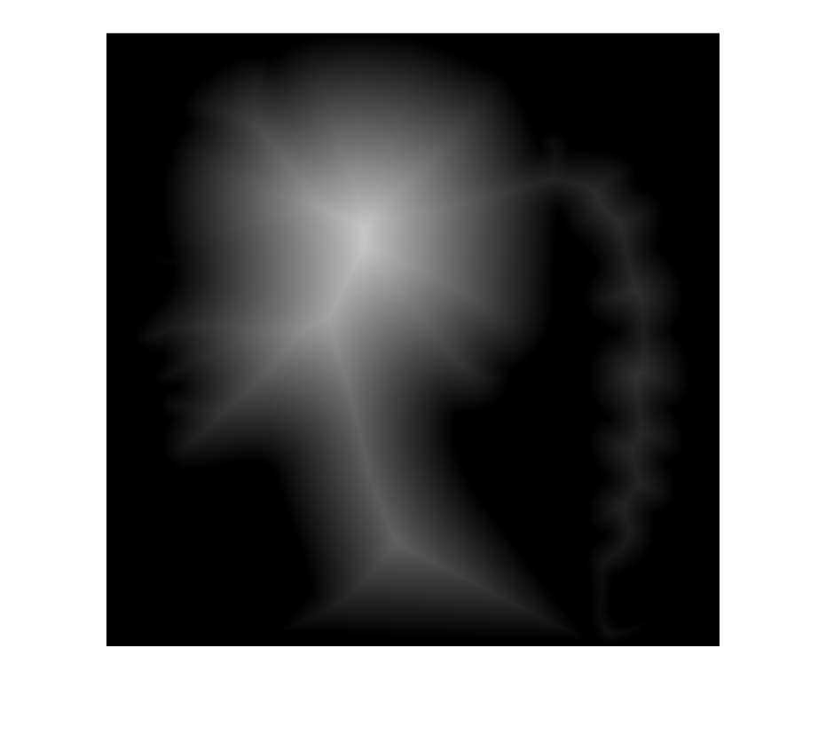

Otras distancias (cityblock \-\- Manhattan o d4, chessboard \-\- Tablero de ajedres o d8).

```matlab
head_d4 = bwdist(head_neg,"cityblock");
head_d8 = bwdist(head_neg,"chessboard");
imshow(uint8(head_d4))
```

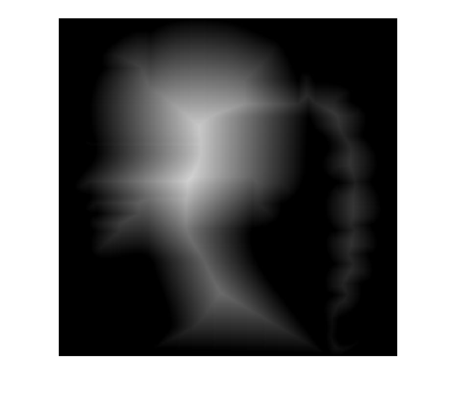

```matlab
imshow(uint8(head_d8))
```

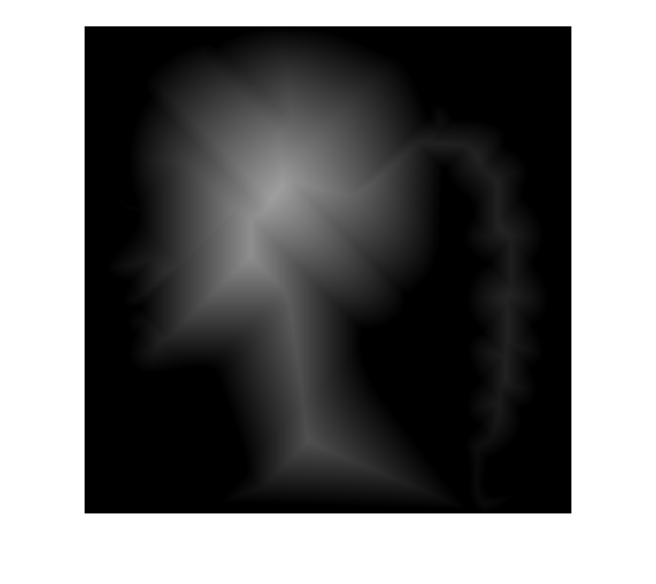

