# PRÁCTICA 4: PROCESAMIENTO MORFOLÓGICO DE LA IMAGEN (2º PARTE)

Cargamos las imágenes en escala de grises que usaremos durante la sesión práctica

```matlab
plane = imread("Imagenes\airplane.tif");
cells = imread("Imagenes\bloodcells.tif");
cameraman = imread("Imagenes\cameraman.tif");
butterfly = imread("Imagenes\mariposa.jpg");

montage({plane,cells,cameraman,butterfly})
```

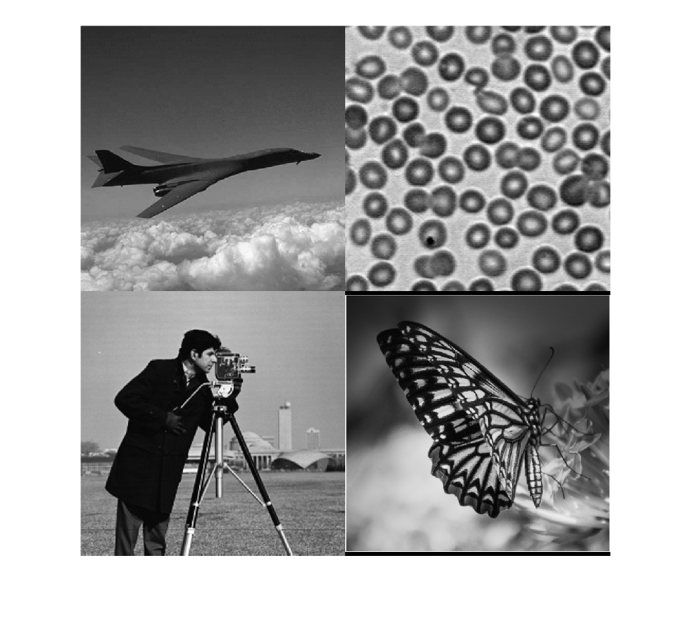
# Operadores morfológicos primarios

Definición del elemento estructural a utilizar

```matlab
SE = strel("disk",5);
```

Recordatorio! Tipos de elementos estructurales: diamond, parámetro \- distancia del origen al extremo del diamante (1 para cruz); disk, parámetro \- radio; line, parámetros \- longitud y angulo; rectangle, parámetros \- longitud y altura; square, parámetro \- lado; nhood, forma definida por una matriz de 0s y 1s.


Dilatación

```matlab
butterfly_dilate = imdilate(butterfly,SE);

montage({butterfly,butterfly_dilate})
```


```matlab
plane_dilate = imdilate(plane,SE);

montage({plane,plane_dilate})
```

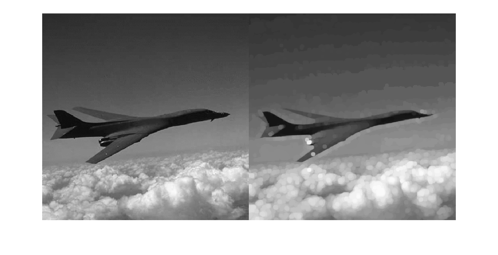

Erosión

```matlab
butterfly_erode = imerode(butterfly,SE);

montage({butterfly,butterfly_erode})
```


```matlab
plane_erode = imerode(plane,SE);

montage({plane,plane_erode})
```

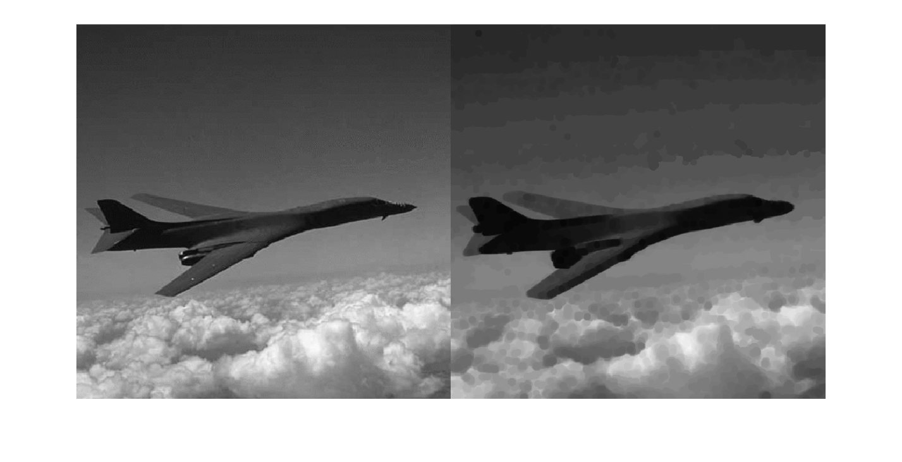
# Operadores secundarios

Apertura

```matlab
plane_open = imopen(plane,SE);

montage({plane,plane_open})
```

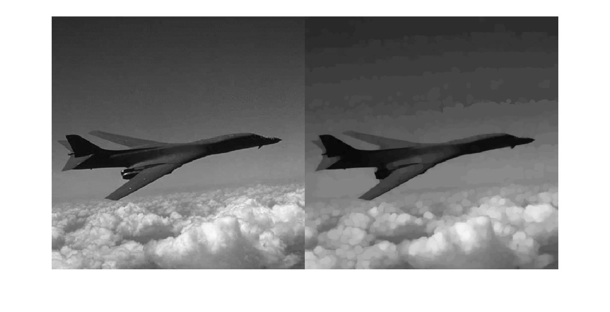

Clausura

```matlab
plane_close = imclose(plane,SE);

montage({plane,plane_close})
```

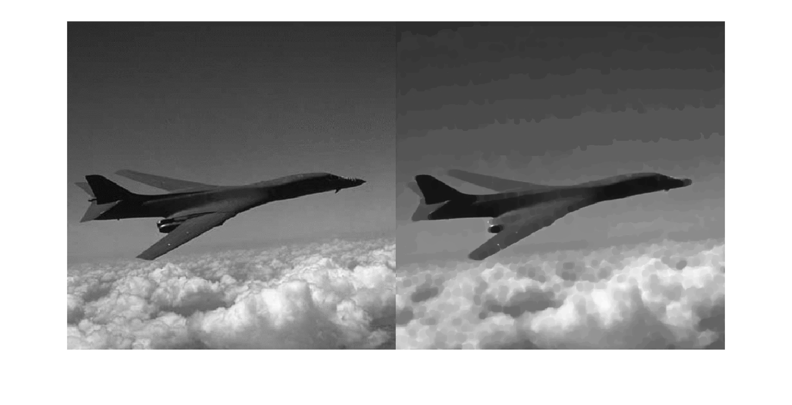

Otro ejemplo:

```matlab
cells_open = imopen(cells,SE);
cells_close = imclose(cells,SE);

montage({cells,cells_open,cells_close})
```

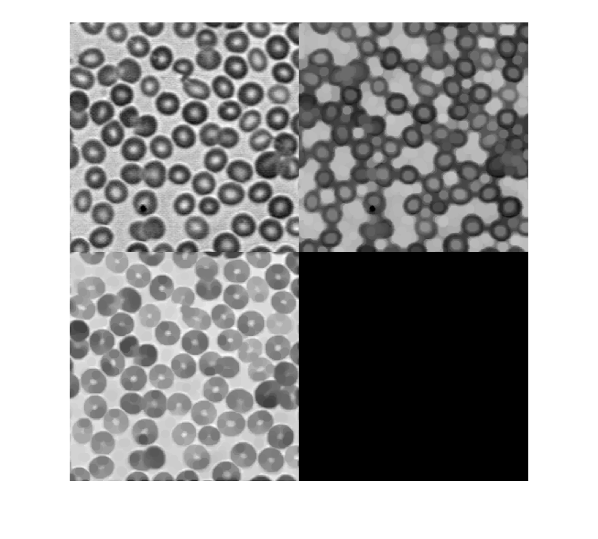

Comparacion entre apertura y erosion y entre clausura y dilatación

```matlab
montage({plane,plane_erode,plane_open})
```


```matlab
montage({plane,plane_dilate,plane_close})
```

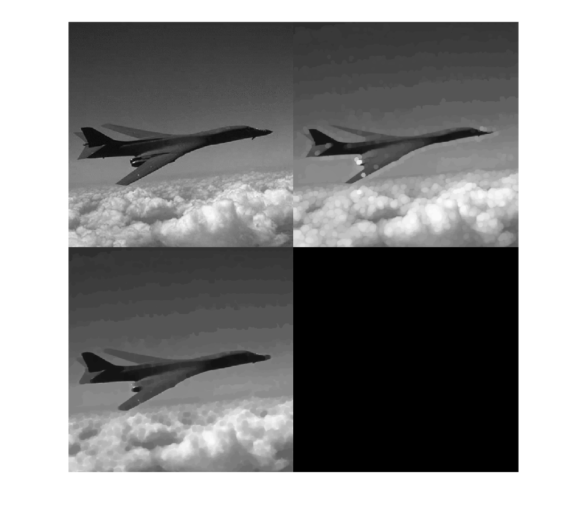

Probamos el efecto sobre elementos claros u oscuros mediante usar un elemento estructural más grande.

```matlab

SE = strel("disk",10);

cells_open = imopen(cells,SE);
cells_close = imclose(cells,SE);

montage({cells,cells_open,cells_close})
```

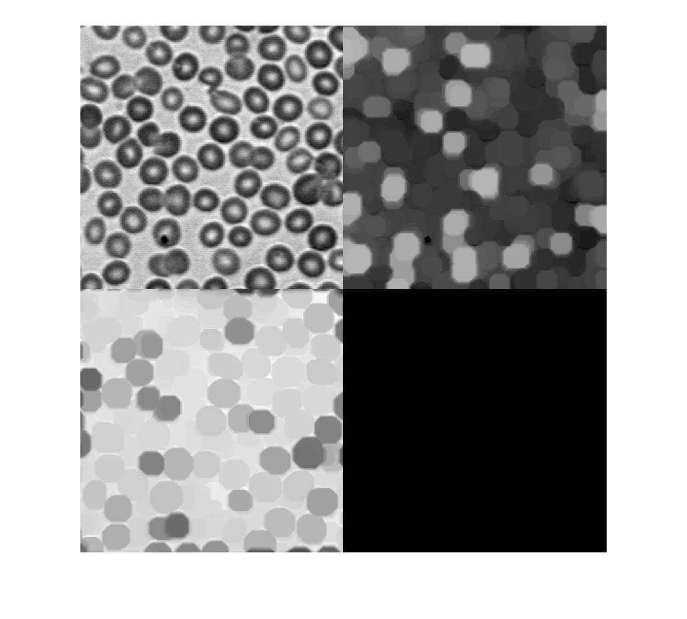
# Filtrado morfológico

Filtros de suavizado morfológico

```matlab
cameraman_sal_pimienta = imread("Imagenes\cameraman_ruido_sal_pimienta.png");

cameraman_gaussiano = imread("Imagenes\cameraman_ruido_gaussiano.png");

montage({cameraman_gaussiano,cameraman_sal_pimienta})
```

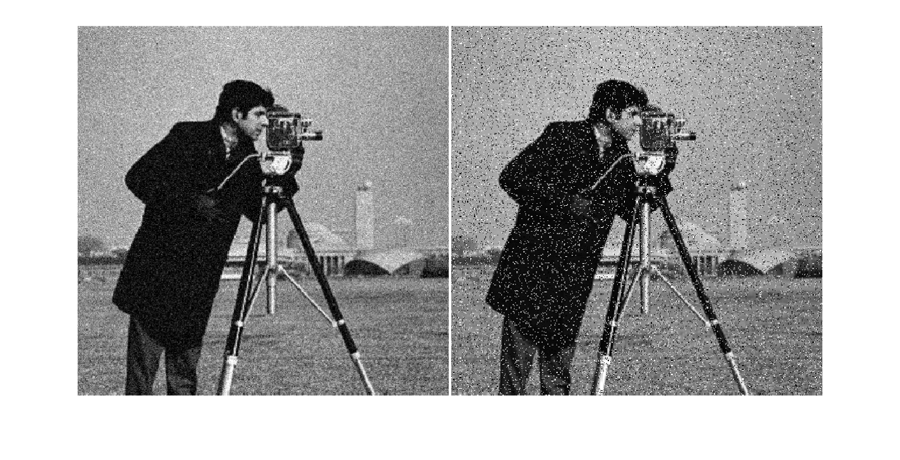

Definimos el elemento estructural más usado para este tipo de filtros

```matlab
SE1 = strel("diamond",1);
```

Recordad! Filtro de suavizado morfologico: Clausura de la apertura

```matlab
cameraman_open1 = imopen(cameraman_sal_pimienta,SE1);
cameraman_close1 = imclose(cameraman_open1,SE1);

cameraman_open2 = imopen(cameraman_gaussiano,SE1);
cameraman_close2 = imclose(cameraman_open2,SE1);

montage({cameraman_sal_pimienta,cameraman_close1})
```

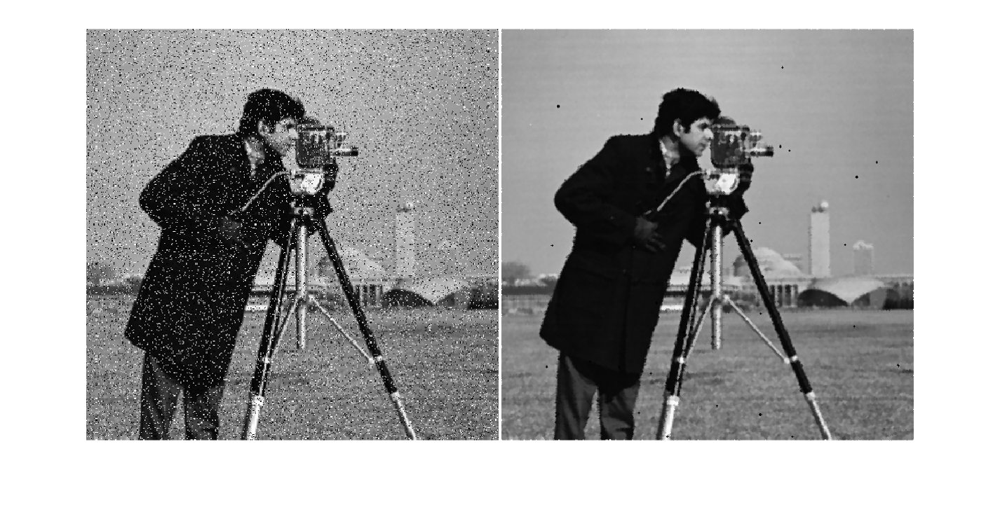

```matlab
montage({cameraman_gaussiano,cameraman_close2})
```

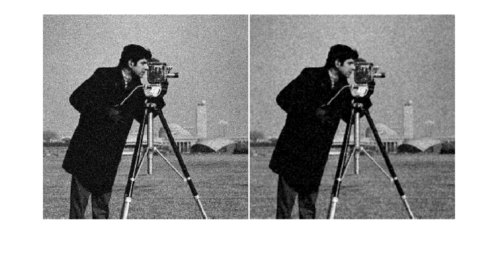

Como aun hay ruido, aplicamos la tecnica de filtrado secuencial alternante.

```matlab
SE2 = strel("diamond",2);

cameraman_close1_open = imopen(cameraman_close1,SE2);
cameraman_close1_close = imclose(cameraman_close1_open,SE2);

montage({cameraman_sal_pimienta,cameraman_close1,cameraman_close1_close})
```

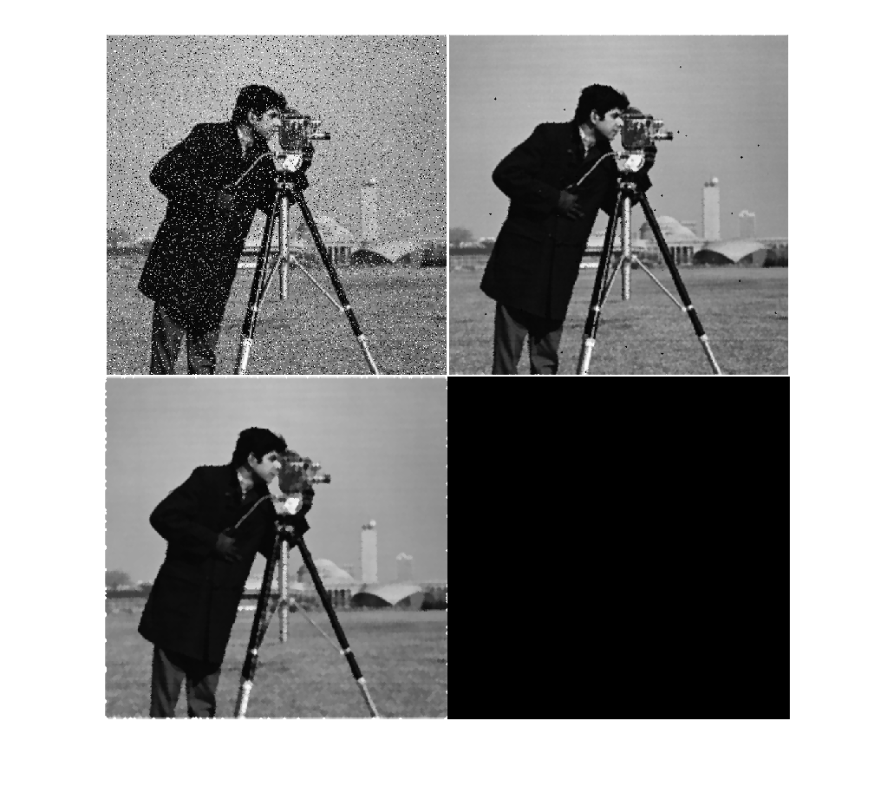
# Filtros de realce morfologico o gradiente morfologico

Definimos el elemento estructural más usado en estos casos

```matlab
SE3 = strel("square",3);
```

Primero gradiente morfologico interno

```matlab
plane_realce_i = plane - imerode(plane,SE3);
```

Luego, el gradiente morfológico externo

```matlab
plane_realce_e = imdilate(plane,SE3) - plane;
```

Y finalmente, el gradiente morfológico interno\-externo

```matlab
plane_realce = imdilate(plane,SE3)-imerode(plane,SE3);

montage({plane,plane_realce_i,plane_realce_e,plane_realce})
```

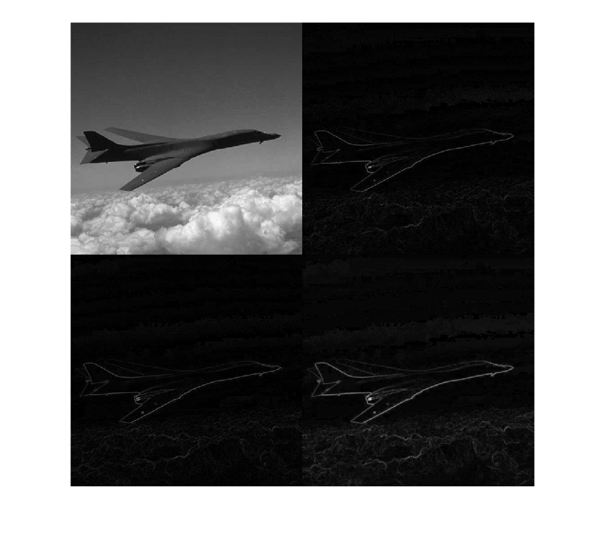

Otro ejemplo

```matlab
cells_realce_i = cells-imerode(cells,SE3);

cells_realce_e = imdilate(cells,SE3)-cells;

cells_realce = imdilate(cells,SE3)-imerode(cells,SE3);

montage({cells,cells_realce_i,cells_realce_e,cells_realce})
```

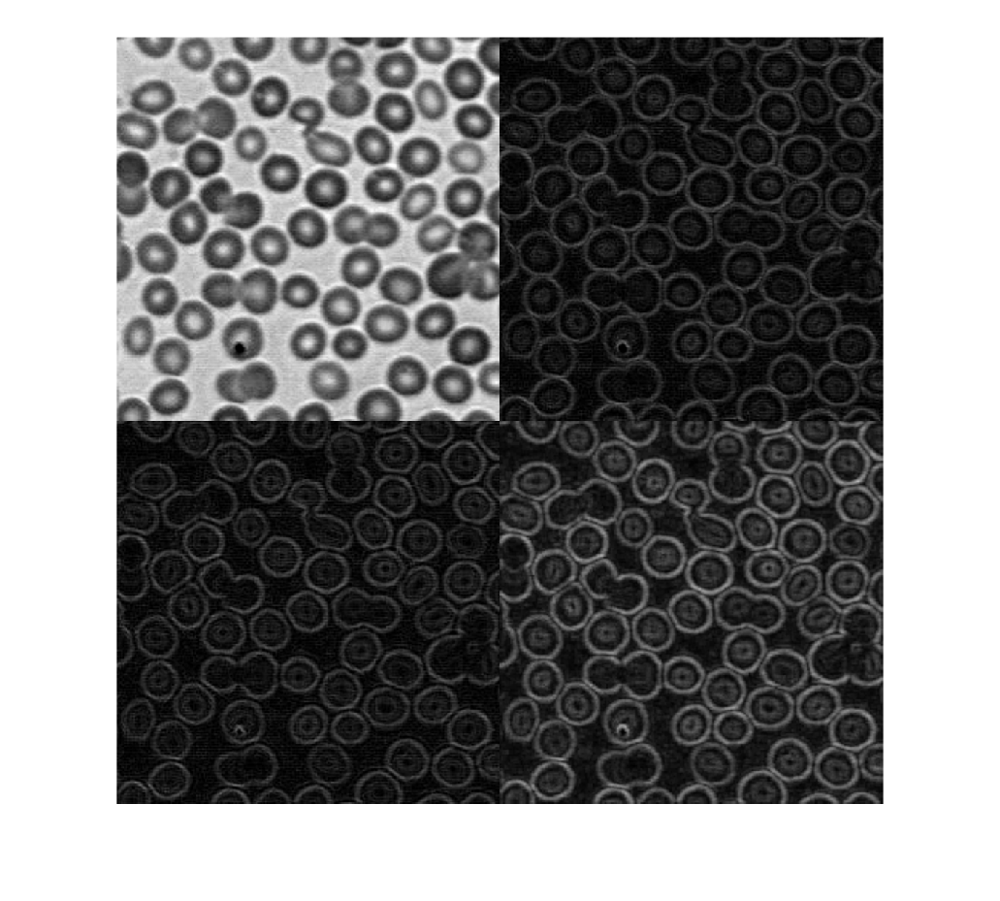

Se toma la imagen negativa para una mejor visualización

```matlab
cells_realce_i_neg = 255 - cells_realce_i;
cells_realce_e_neg = 255 - cells_realce_e;
cells_realce_neg = 255 - cells_realce;

montage({cells,cells_realce_i_neg,cells_realce_e_neg,cells_realce_neg})
```

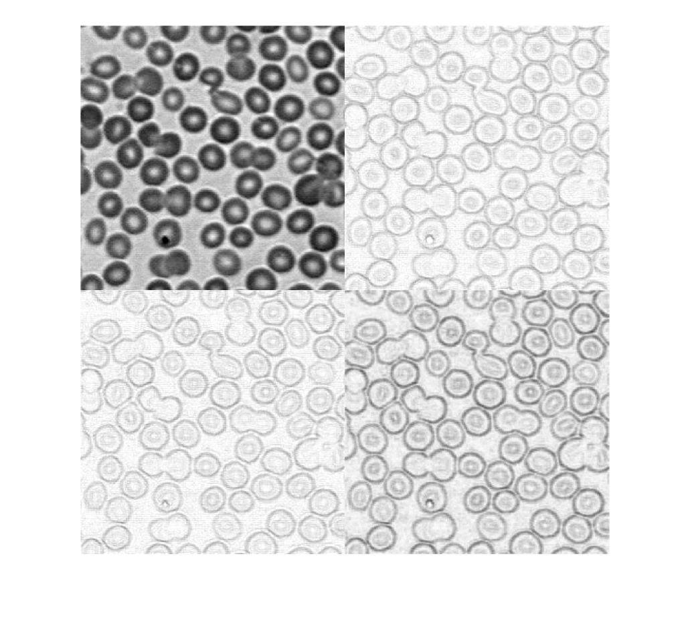
# Transformadas Top\-Hat y Bottom\-Hat
```matlab
cells = imread("Imagenes\cells_internet.jpg");

cells = rgb2gray(cells);

montage(cells)
```

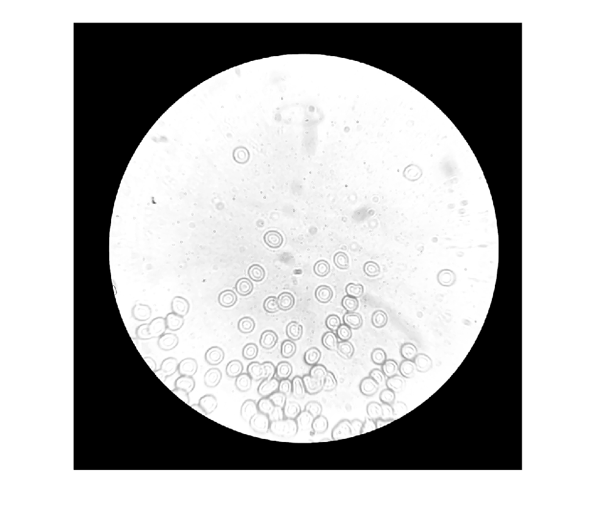

Se calcula la transformada Top\-Hat

```matlab
SE = strel("disk",30);

cells_top_hat = imtophat(cells,SE);

montage({cells,cells_top_hat})
```


Se calcula la transformada Bottom\-Hat

```matlab
cells_bot_hat = imbothat(cells,SE);

montage({cells,cells_bot_hat})
```

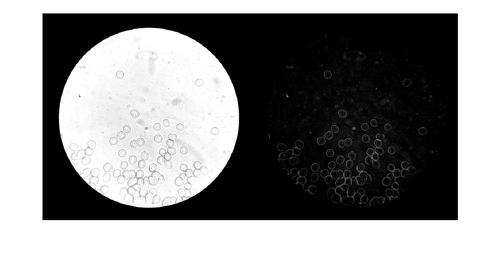

Con una clara aplicación, la binarización para el posterior etiquetado de componentes conexas

```matlab
cells_bin = imbinarize(cells);

cells_top_hat_bin = imbinarize(cells_top_hat);

cells_bot_hat_bin = imbinarize(cells_bot_hat);

montage({cells_bin,cells_top_hat_bin,cells_bot_hat_bin})
```

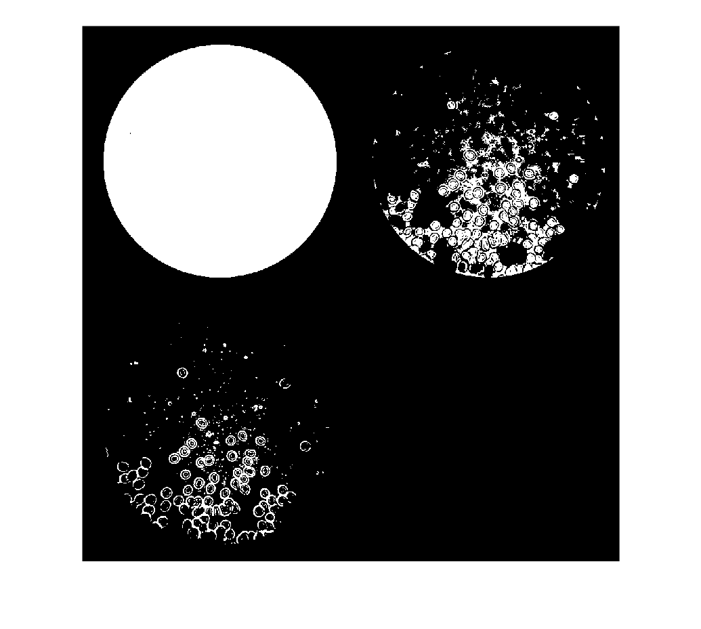


