# PRÁCTICA 5: SEGMENTACIÓN DE IMÁGENES

Cargamos las imágenes que usaremos durante esta parte de la sesión práctica.

```matlab
objetos = imread("Imagenes\objects.tif");
monedas = imread("Imagenes\coins.png");
lake = imread("Imagenes\lake.tif");
cameraman = imread("Imagenes\cameraman.tif");
```

Como lake tiene dos canales, cogemos uno!

```matlab
lake = lake(:,:,1);
```

Mostramos las imagenes

```matlab
montage({objetos,monedas,lake,cameraman})
```


# Segmentación por umbralización

Selección de umbrales mediante el estudio directo del histograma

```matlab
h_objetos = imhist(objetos);

bar(h_objetos)
```

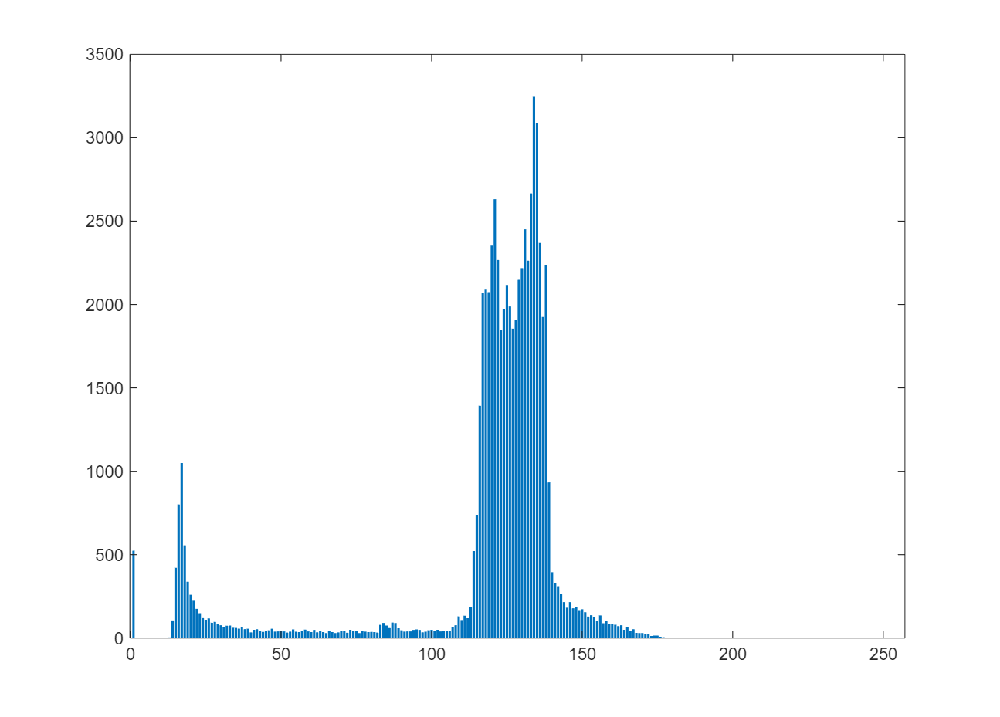

Umbral (calculado a ojo a partir del histograma)

```matlab
T=75;

objetos_bin = objetos>T;
```

Tambien se puede usar el comando imbinarize si hacemos T/255.

```matlab
montage({objetos,objetos_bin})
```

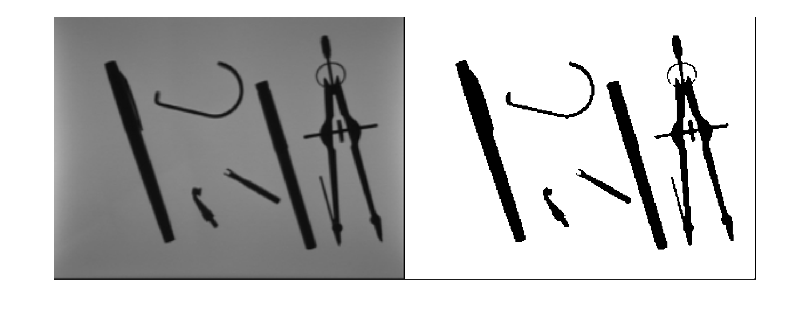

Otro ejemplo

```matlab
h_lake = imhist(lake);

bar(h_lake)
```

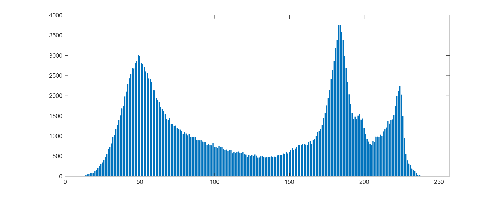

Umbrales (calculados a ojo a partir del histograma)

```matlab
T1 = 130;
T2 = 205;

lake_bin = imquantize(lake,[0,T1,T2,255]);

imshow(lake_bin,[])
```

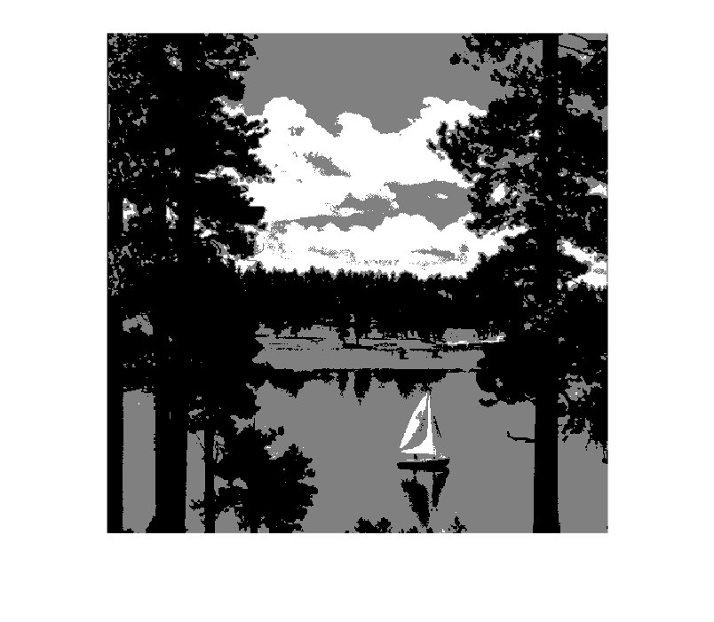

Metodo de Otsu

```matlab
T_otsu = graythresh(objetos);

objetos_bin = imbinarize(objetos,T_otsu);

montage({objetos,objetos_bin})
```


Etiquetar y colorear componentes conexas


Primero hacemos not(objetos), puesto que queremos que las componentes conexas sean blancas sobre fondo negro.

```matlab
objetos_neg = not(objetos_bin);
```

Usamos el comando bwlabel, que etiqueta las componentes conexas en una imagen binaria.

```matlab
comps_conexas = bwlabel(objetos_neg);
```

Para visualizar el resultado (lo que es totalmente opcional), hacemos label2rgb, que colorea cada componente conexa atendiendo a una paleta de colores.

```matlab
objetos_col = label2rgb(comps_conexas,"jet","k","shuffle");

montage({objetos,objetos_neg,objetos_col})
```

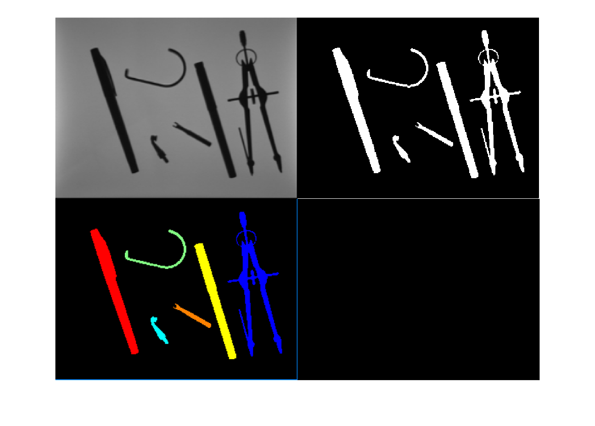
# Metodos de segmentación basados en la detección de bordes

Detección de rectas usando el Laplaciano

```matlab
lineas = imread("Imagenes\lineas.png");
lineas = rgb2gray(lineas);
```

Kernel Laplaciano para detectar rectas verticales

```matlab
w_verticales = [-1,2,-1;-1,2,-1;-1,2,-1];

lineas_filt = abs(imfilter(lineas,w_verticales));
```

Umbral para discriminar las rectas calculadas y eliminar las más débiles (que probablemente o no serán rectas o no serán rectas verticales).

```matlab
maxi = max(lineas_filt(:));

lineas_filt_bin = lineas_filt>=maxi;

montage({lineas,lineas_filt,lineas_filt_bin})
```

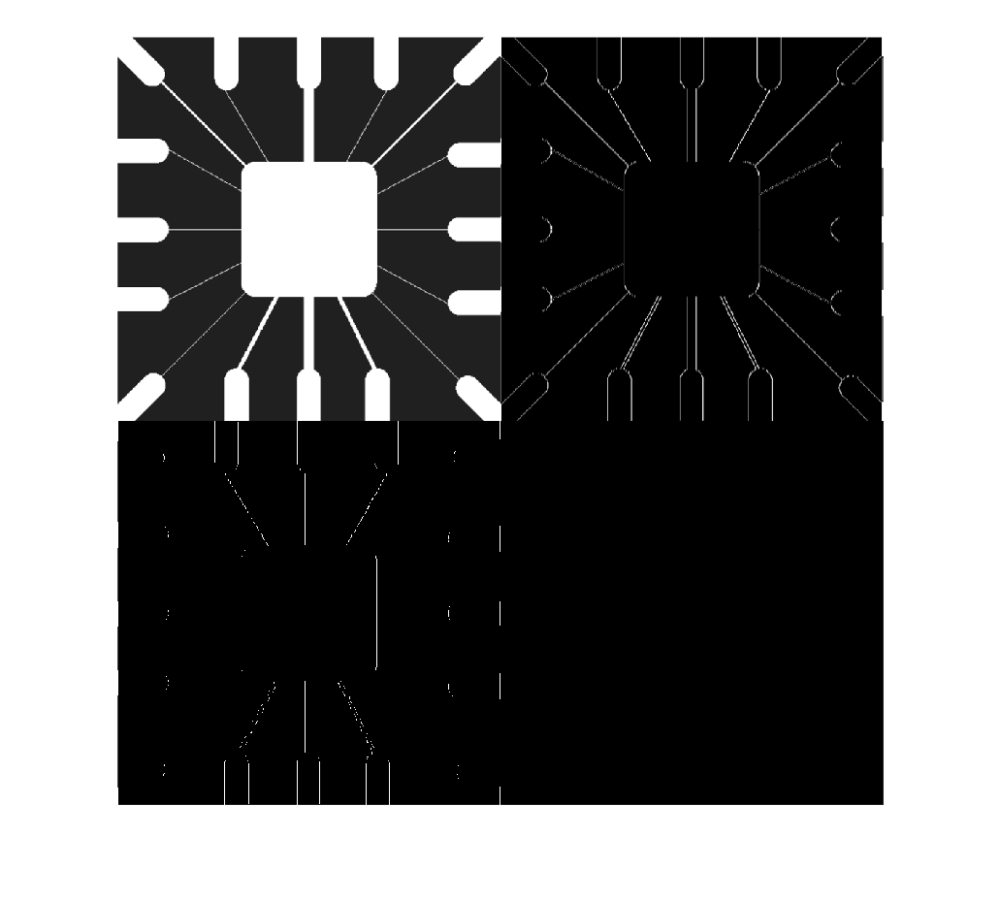

Se usa el comando edge para la detección de bordes con el gradiente digital y como alternativa a los comandos específicos de Roberts/Sobel y Prewitt que se obtenían con el comando fspecial.

```matlab
objetos_contornos_roberts = edge(objetos,"roberts");

objetos_contornos_sobel = edge(objetos,"sobel");

objetos_contornos_prewitt = edge(objetos,"prewitt");

montage({objetos,objetos_contornos_roberts,objetos_contornos_sobel,objetos_contornos_prewitt})
```

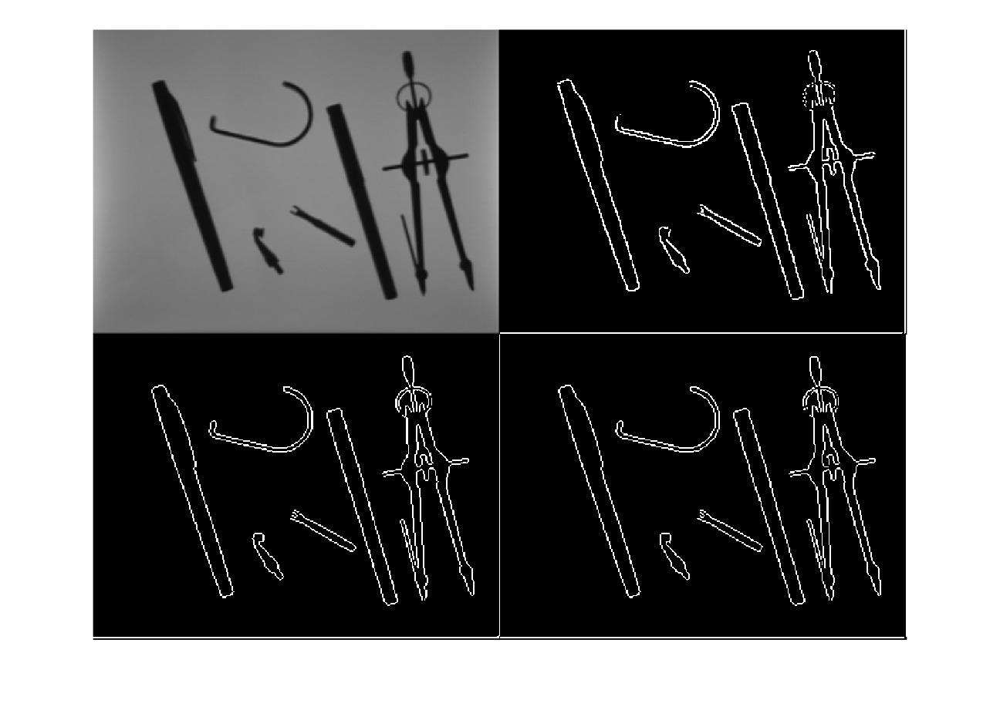

Metodo de Marr\-Hildreth o de paso por cero para detectar bordes

```matlab
house = imread("Imagenes\house.tif");
house = house(:,:,1);
w_log = fspecial("log",25,1);
```

T = 0.018 (empirico, es decir, calculado vía prueba y error).

```matlab
T = 0.018;
```

Se usa edge para MH con la opción zerocross añadiendo el umbral T y el kernel de un filtro, en este caso un filtro Laplacian of a Gaussian (LoG).

```matlab
house_contornos = edge(house,"zerocross",T,w_log);

montage({house,house_contornos})
```

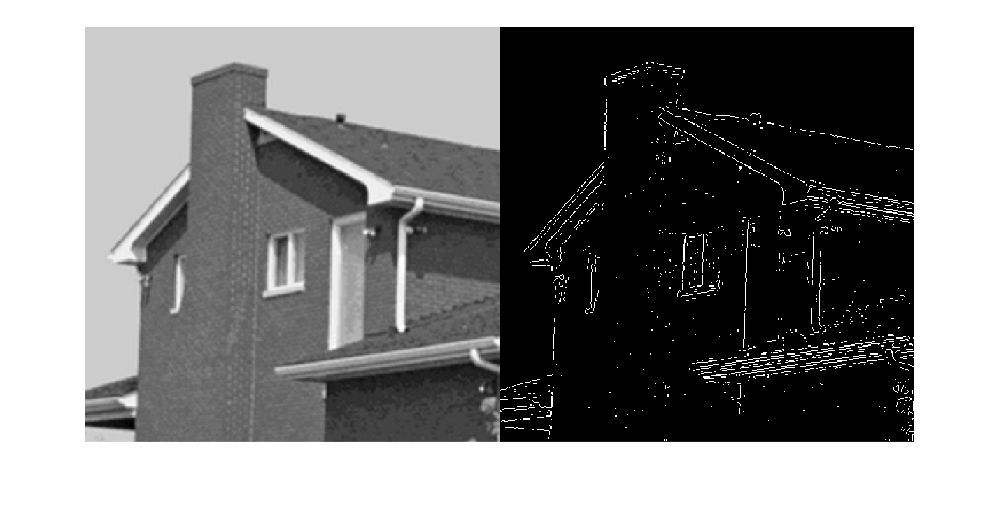

Metodo de Canny


Definimos los umbrales inferior y superior (tambien calculados empíricamente).

```matlab
T_canny = [0.04,0.2];
```

Se usa el comando edge para aplicar el método de Canny (con la opción "canny"). Como inputs extra, hay que añadir un umbral (en este caso un vector de dos umbrales (inferior y superior)) y la varianza del primer paso, que sirve para suavizar la imagen con un filtro Gaussiano.

```matlab
sigma = 4;

house_canny = edge(house,"canny",T_canny,sigma);

montage({house,house_canny})
```

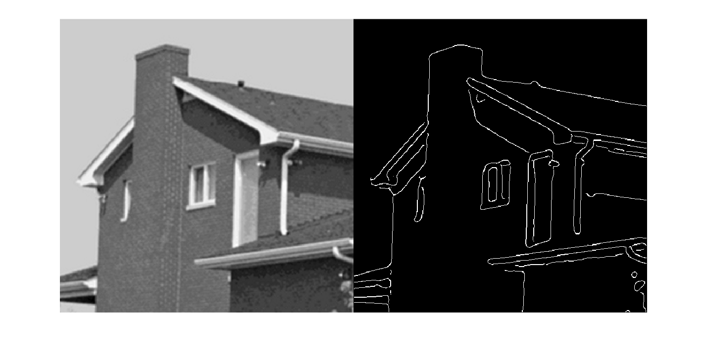

Jugamos con los umbrales inferior y superior (Importante! T1 siempre tiene que ser menor que T2 y T2<1)

```matlab
T1 = 0.01:0.03:0.07;
T2 = 0.1:0.2:0.9;
sigma = 4;

% for i = 1:length(T1)
% 
%     for j = 1:length(T2)
% 
%         if T1(i)<T2(j)
% 
%             house_canny_loop = edge(house,"canny",[T1(i),T2(j)],sigma);
% 
%             figure;
%             imshow(house_canny_loop)
% 
%         end
% 
%     end
%
% end

```
# Metodos de segmentación basados en la similitud

Cargamos la imagen que usaremos.

```matlab
monedas = imread("Imagenes\coins.png");

imshow(monedas)
```

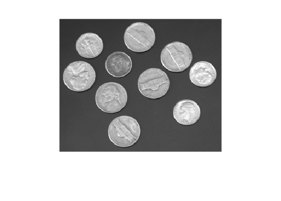

Watershed \-\-> Método de segmentación basado en un proceso de inundación de cuencas, es decir, de los distintos mínimos de la imagen, y de construcción de diques, es decir, bordes, separando las distintas regiones.

```matlab
monedas_watershed = watershed(monedas);
```

Nos quedamos con las lineas de separación (que son negras) en el output del comando watershed. Es decir, "bordes" es una imagen binaria que tiene todos los pixeles negros del output, "monedas\_watershed", que son precisamente dichas lineas de separación, como pixeles con valor de intensidad 1, es decir, blancos.

```matlab
bordes = monedas_watershed == 0;
```

Lo juntamos con la imagen original y convertimos la lineas de separación en lineas blancas para que destaquen cuando sean superpuestas a la imagen original. Primero hacemos una copia de la imagen original para no alterarla.

```matlab
monedas_copia = monedas;
```

Y luego cambiamos los pixeles que en la imagen binaria "bordes" no pertenecen al fondo de la imagen por pixeles blancos, es decir, con nivel de intensidad 255.

```matlab
monedas_copia(bordes) = 255;
```

Finalmente, mostramos el resultado.

```matlab
montage({monedas,monedas_copia})
```

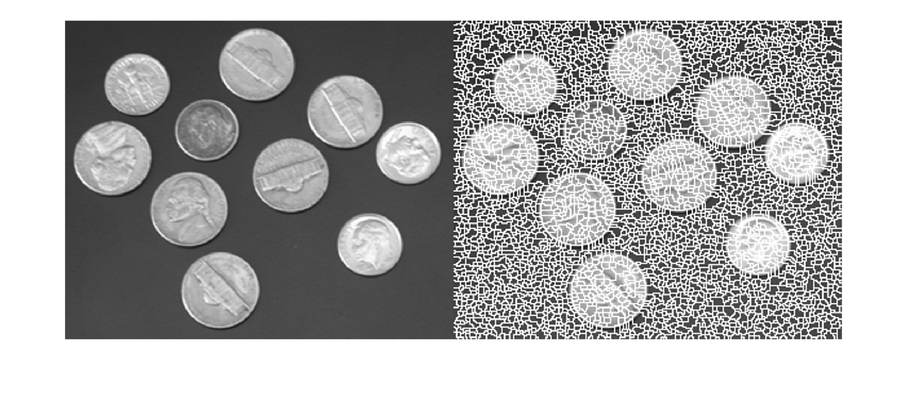

Claramente hay sobresegmentación, probamos formas diferentes de resolver dicha sobresegmentación.


1º forma \-\-> opción conectivitidad. El comando "watershed" acepta un segundo input, que es la conectividad de la imagen original. Esta conectividad puede mejorar el resultado, por medio de eliminar las los diques asociados a componentes conexas no afines con la connectividad impuesta.

```matlab
monedas_watershed_2 = watershed(monedas,8);

bordes_2 = monedas_watershed_2 == 0;

monedas_copia_2 = monedas;

monedas_copia_2(bordes_2) = 255;

montage({monedas_copia_2})
```

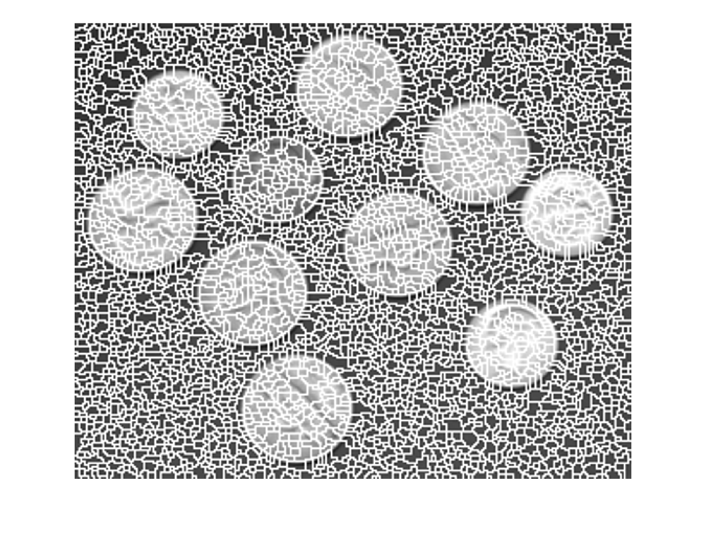

2º forma \-\-> uso de transformada de la distancia. La transformada de la distancia permite encontrar el centro geométrico de los objetos (no de las componentes conexas, sino de los objetos (dos objetos que se tocan pueden conformar una única componente conexa)). De hecho, esta es una de las grandes ventajas del watershed, que permite segmentar imagenes con objetos que se tocan o estan parcialmente solapados.


Para aplicar la transformada de la distancia, necesitamos una imagen binaria. Para ello, binarizamos usando el método de Otsu.

```matlab
T_otsu_monedas = graythresh(monedas);

monedas_bin = imbinarize(monedas,T_otsu_monedas);
```

Calculamos la transformada de la distancia.

```matlab
D = bwdist(monedas_bin);
```

Aplicamos al resultado el algoritmo watershed.

```matlab
D_watershed = watershed(D);

bordes_D = D_watershed == 0;

monedas_copia_3 = monedas;

monedas_copia_3(bordes_D) = 255;

montage(monedas_copia_3)
```

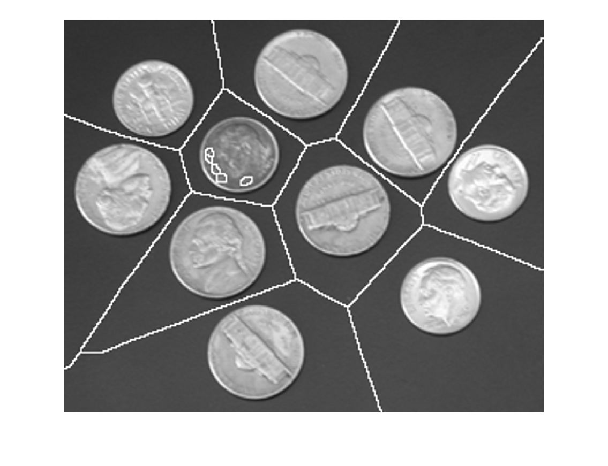

3º forma \-\-> uso del gradiente. La magnitud del gradiente de la imagen permite detectar TODOS los minimos de la imagen (los reales y los que producen la sobresegmentación).

```matlab
w_sobel = fspecial("sobel");

gradient_mag = abs(imfilter(double(monedas),w_sobel))+abs(imfilter(double(monedas),w_sobel'));
```

Filtramos los minimos de forma que solo los mas profundos sobreviven. El comando "imextendedmin" toma una imagen de mínimos regionales (como la que devuelve el gradiente) y elimina todos los pixeles con un valor de intensidad mayor que el segundo input. El output del comando es una imagen binaria con los mínimos más profundos.

```matlab
minimos = imextendedmin(gradient_mag, 200);
```

Forzamos que los mínimos del gradiente sean solo los que sobreviven al comando anterior. Para ello se usa el comando "imimposemin" que impone al primer input un conjunto de mínimos, que es el segundo input.

```matlab
minimos_forzados = imimposemin(gradient_mag, minimos);

monedas_watershed_3 = watershed(minimos_forzados);

bordes_3 = monedas_watershed_3 == 0;

monedas_copia_3 = monedas;

monedas_copia_3(bordes_3) = 255;

montage({bordes_3,monedas_copia_3})
```

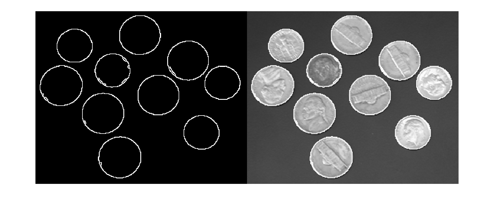

