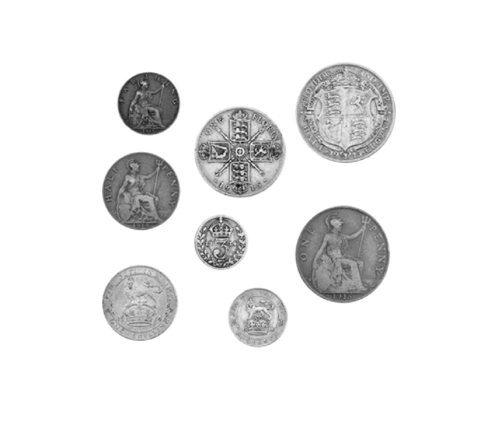
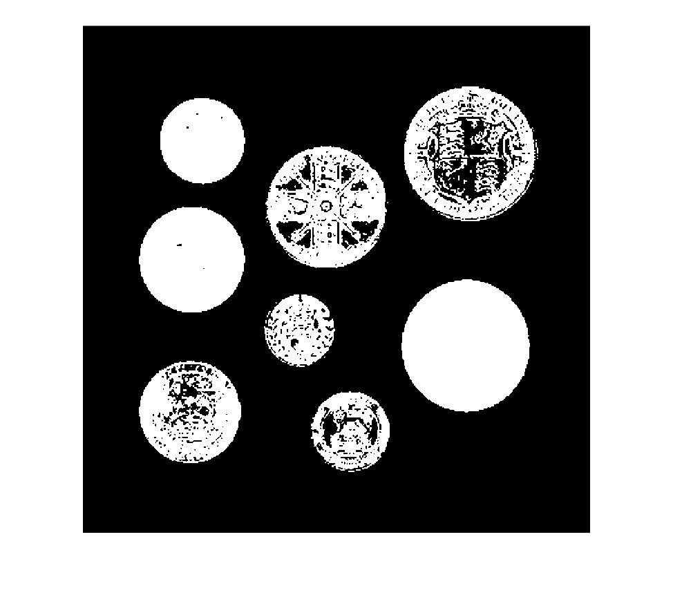
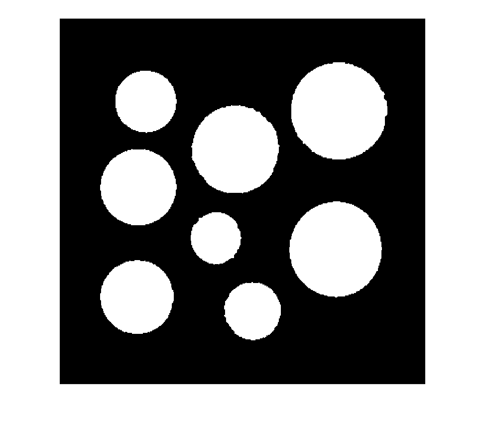
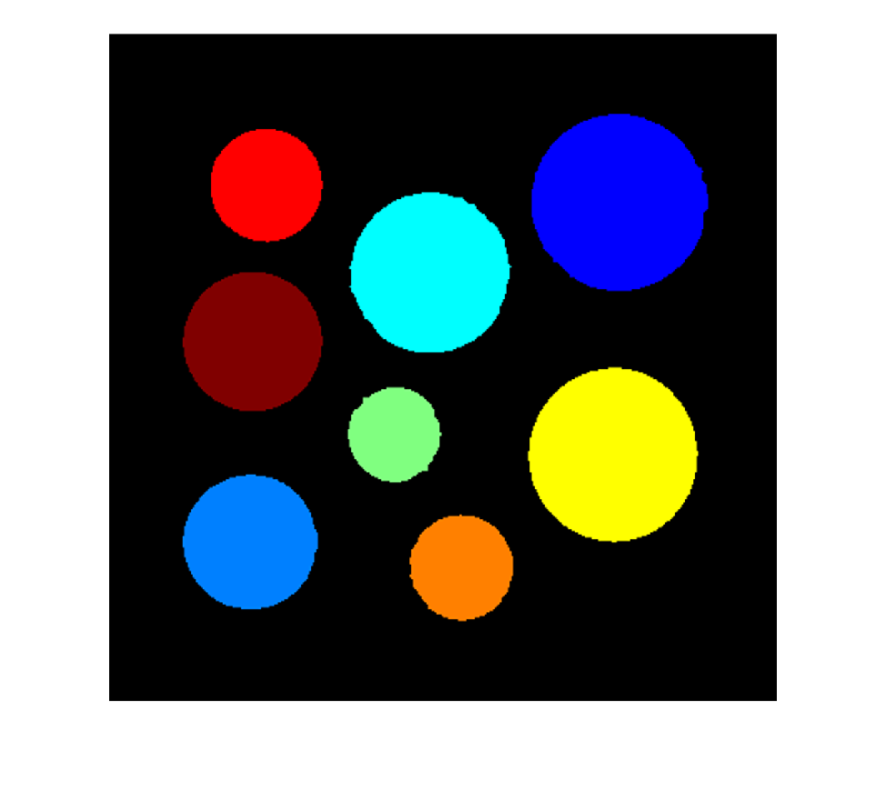
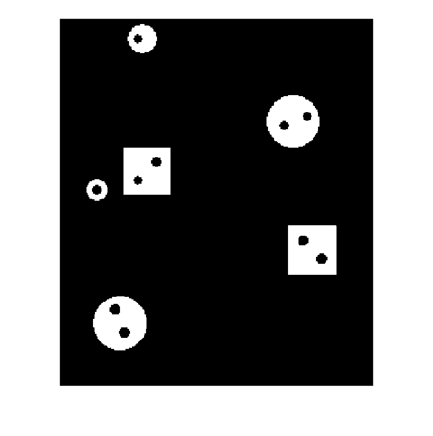
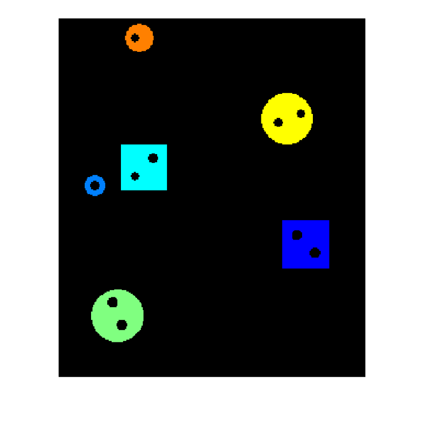
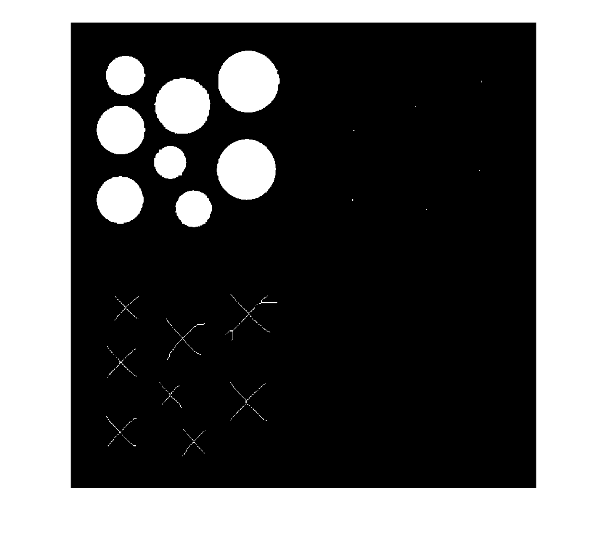
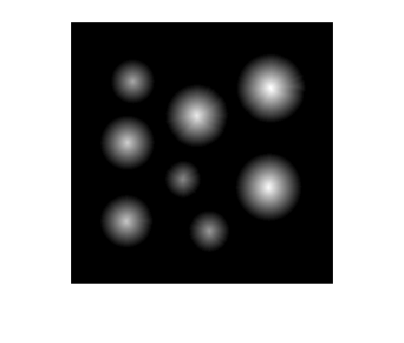
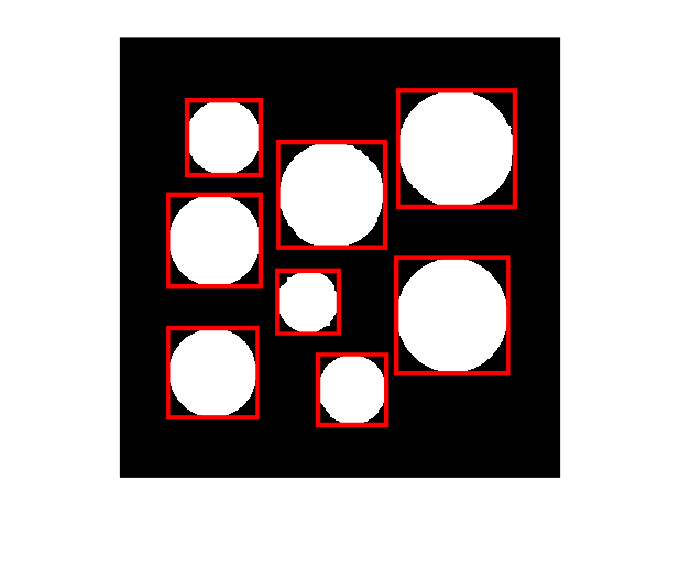

# PRÁCTICA 6: DESCRIPTORES

Cargamos las imágenes que utilizaremos en esta sesión práctica

```matlab
monedas = imread("Imagenes\monedas_color.jpg");

monedas = imresize(monedas,[400,400]);

monedas = rgb2gray(monedas);

montage(monedas)
```



Segmentamos la imagen. Queremos fondo negro, así que tomamos la imagen negativa.

```matlab
monedas = 255-monedas;
```

Y binarizamos usando el metodo de OTSU

```matlab
T_otsu = graythresh(monedas);

monedas_bin = imbinarize(monedas,T_otsu);

montage(monedas_bin)
```



Mejoramos la segmentación mediante métodos morfológicos para imágenes binarias

```matlab
monedas_bin = imfill(monedas_bin,"holes");

SE = strel("disk",5);

monedas_bin = imclose(monedas_bin,SE);

montage(monedas_bin)
```


# Descriptores topológicos

Número de componentes conexas.

```matlab
numero_componentes_conexas = bwconncomp(monedas_bin).NumObjects
```

```matlabTextOutput
numero_componentes_conexas = 8
```

```matlab
comp_conexas = bwlabel(monedas_bin);
```

Otra forma de contar componentes conexas

```matlab
numero_componentes_conexas_2 = max(comp_conexas(:))
```

```matlabTextOutput
numero_componentes_conexas_2 = 8
```

```matlab
montage({label2rgb(comp_conexas,"jet","k","shuffle")})
```



Número de agujeros. Matlab extrae los bordes de cada componente conexa, si hay dos bordes, es porque uno de los bordes es interior y envuelve a una agujero.


Definimos un vector vacio que llevará la cuenta de los agujeros de cada componente conexa.

```matlab
agujeros = [];
```

Iteramos a través de cada objeto etiquetado o componente conexa para ver si tiene agujeros

```matlab
for i = 1:numero_componentes_conexas

    comp_i = (comp_conexas == i);
   
    borde = bwboundaries(comp_i);

    if length(borde) > 1

        agujeros = [agujeros,length(borde)-1];

    end
end

agujeros
```

```matlabTextOutput
agujeros =

     []
```

Característica de Euler. Recordar que la característica de Euler es el número de componentes conexas que no son negras (fondo) menos el número de agujeros.


Definimos un vector vacio que llevará la cuenta de la característica de Euler cada componente conexa.

```matlab
caracteristica_euler = [];
```

Iteramos a través de cada objeto etiquetado o componente conexa para ver cuál es su característica de Euler

```matlab
for i = 1:numero_componentes_conexas

    comp_i = (comp_conexas == i);
   
    borde = bwboundaries(comp_i);

    caracteristica_euler = [caracteristica_euler,1-(length(borde)-1)];
    
end

caracteristica_euler
```

```matlabTextOutput
caracteristica_euler = 1x8
     1     1     1     1     1     1     1     1

```

Otro ejemplo

```matlab
figuras_agujeros = imread("Imagenes\figuras_agujeros.png");

figuras_agujeros = rgb2gray(figuras_agujeros);

T_otsu_figuras = graythresh(figuras_agujeros);

figuras_agujeros_bin = imbinarize(figuras_agujeros,T_otsu_figuras);

montage(figuras_agujeros_bin)
```



```matlab
numero_comps_conexas = bwconncomp(figuras_agujeros_bin).NumObjects
```

```matlabTextOutput
numero_comps_conexas = 6
```

```matlab
comp_conexas_figuras = bwlabel(figuras_agujeros_bin);

montage({label2rgb(comp_conexas_figuras,"jet","k","shuffle")})
```



```matlab
agujeros_2 = [];
caracteristica_euler_2 = [];

for i = 1:numero_comps_conexas

    comp_i = (comp_conexas_figuras == i);
   
    borde = bwboundaries(comp_i);

    if length(borde) > 1

        agujeros_2 = [agujeros_2,length(borde)-1];
        caracteristica_euler_2 = [caracteristica_euler_2,1-(length(borde)-1)];

    end
end

agujeros_2
```

```matlabTextOutput
agujeros_2 = 1x6
     1     2     2     1     2     2

```

```matlab
caracteristica_euler_2
```

```matlabTextOutput
caracteristica_euler_2 = 1x6
     0    -1    -1     0    -1    -1

```

Cálculo del esqueleto. Cálculo basado en la transformada de la distancia

```matlab
monedas_skel = bwskel(monedas_bin);
```

Cálculo basado en adelgazamiento con operadores morfologicos

```matlab
monedas_skel_2 = bwmorph(monedas_bin,"skeleton",Inf);

montage({monedas_bin,monedas_skel,monedas_skel_2})
```



Cálculo de la transformada de la distancia

```matlab
D = bwdist(~monedas_bin);

imshow(D,[])
```


# Descriptores geométricos
```matlab
montage(monedas_bin)
```


Cálculo del área.


Definimos un vector vacio que calculará el área de cada componente conexa.

```matlab
area = [];
```

Iteramos a través de cada objeto etiquetado o componente conexa para ver cuál es su área

```matlab
for i = 1:numero_componentes_conexas

    comp_i = (comp_conexas == i);
   
    area = [area,sum(comp_i(:))];
    
end

area
```

```matlabTextOutput
area = 1x8
        5453        5074        3563        2436        7174        3047        8253        8731

```

Cálculo del perímetro.

```matlab
perimetro = [];

for i = 1:numero_componentes_conexas

    comp_i = (comp_conexas == i);
   
    perimetro = [perimetro,regionprops(comp_i, 'Perimeter').Perimeter];

end

perimetro
```

```matlabTextOutput
perimetro = 1x8
  258.9320  250.6950  209.2860  175.7500  301.8050  196.0870  320.1980  332.9510

```

Al igual que el perímetro, el área también se puede calcular con el comando regionprops(comp\_i, 'Area').Area\]


Cálculo del centroide o centro de masas

```matlab
centroide = [];

for i = 1:numero_componentes_conexas

    comp_i = (comp_conexas == i);
   
    centroide = [centroide;regionprops(comp_i, 'Centroid').Centroid];

end

centroide
```

```matlabTextOutput
centroide = 8x2
   86.5034  185.0011
   85.0530  305.2221
   94.6444   91.2088
  171.4179  240.7373
  192.8400  143.6901
  211.6853  320.4207
  302.5620  252.9773
  305.9201  101.5368

```

Cálculo de la compacidad

```matlab
compacidad = perimetro.*perimetro./area
```

```matlabTextOutput
compacidad = 1x8
   12.2952   12.3863   12.2932   12.6798   12.6967   12.6190   12.4230   12.6969

```

Cálculo del diámetro

```matlab
diametro = [];

for i = 1:numero_componentes_conexas

    comp_i = (comp_conexas == i);
   
    diametro = [diametro,regionprops(comp_i, 'MajorAxisLength').MajorAxisLength];

end

diametro
```

```matlabTextOutput
diametro = 1x8
   83.5045   80.6870   67.6135   56.6321   96.2877   63.1585  104.0661  106.1058

```

Cálculo de la excentricidad (es decir, de la relación eje mayor\-eje menor)

```matlab
diametro_menor = [];

for i = 1:numero_componentes_conexas

    comp_i = (comp_conexas == i);
   
    diametro_menor = [diametro_menor,regionprops(comp_i, 'MinorAxisLength').MinorAxisLength];

end

excentricidad = diametro./diametro_menor
```

```matlabTextOutput
excentricidad = 1x8
1.0041    1.0074    1.0074    1.0328    1.0146    1.0274    1.0304    1.0124

```

Cálculo de la bounding box

```matlab
imshow(monedas_bin);
hold on;

for i = 1:numero_componentes_conexas

    comp_i = (comp_conexas == i);
   
    bounding_box = regionprops(comp_i, 'boundingbox').BoundingBox;

    rectangulo = rectangle('Position', bounding_box, 'EdgeColor', 'r', 'LineWidth', 2);

end

hold off
```




