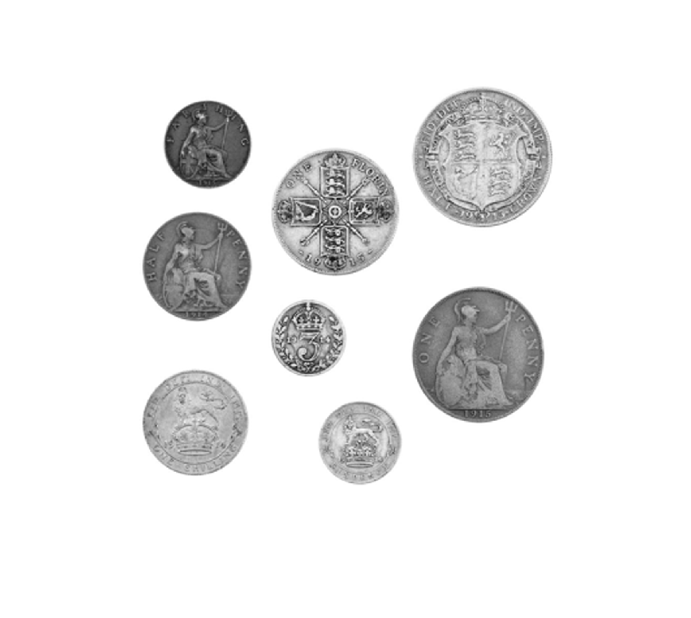
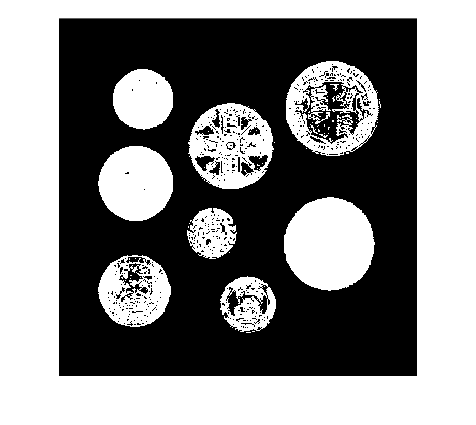
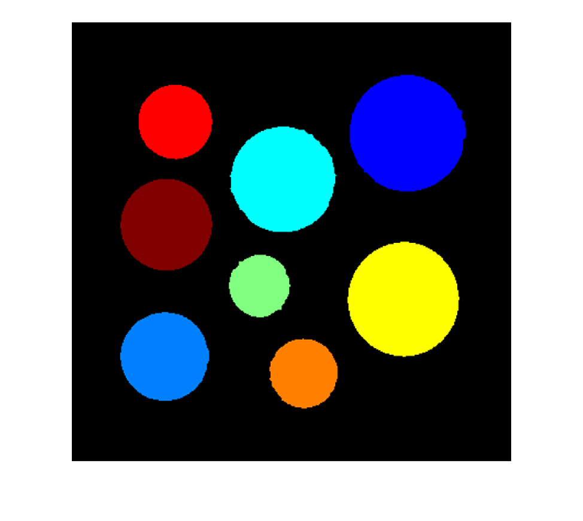
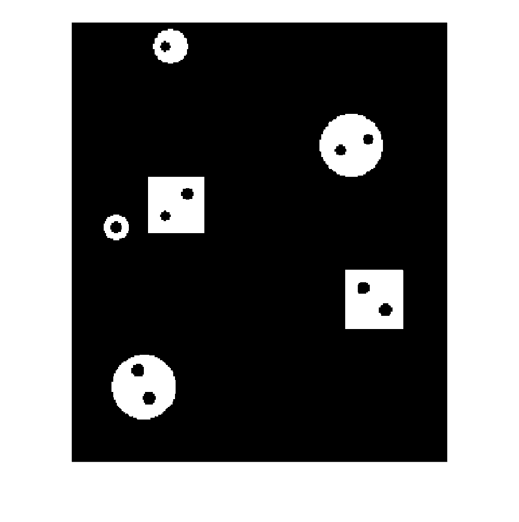
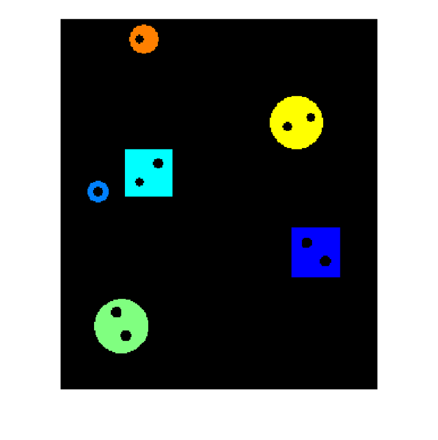
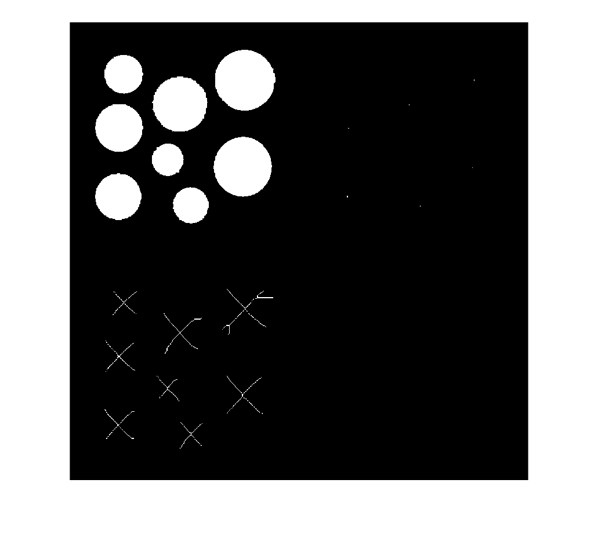
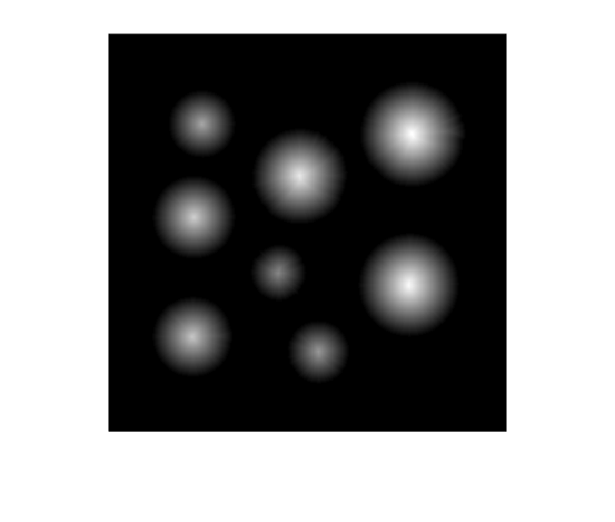
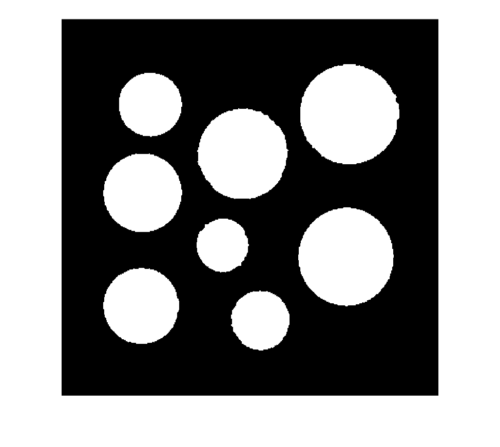
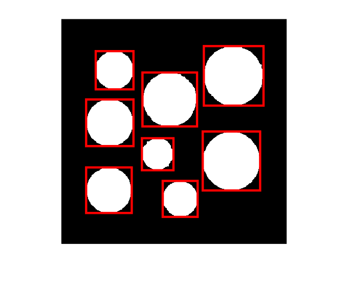

# PRÀCTICA 6: DESCRIPTORS

Carreguem les imatges que utilitzarem en aquesta sessió pràctica

```matlab
monedes = imread("Imagenes\monedas_color.jpg");

monedes = imresize(monedes,[400,400]);

monedes = rgb2gray(monedes);

montage(monedes)
```



Segmentem la imatge. Volem fons negre, així que prenem la imatge negativa.

```matlab
monedes = 255-monedes;
```

I binaritzem utilitzant el mètode d’OTSU

```matlab
T_otsu = graythresh(monedes);

monedes_bin = imbinarize(monedes,T_otsu);

montage(monedes_bin)
```



Millorem la segmentació mitjançant mètodes morfològics per a imatges binàries

```matlab
monedes_bin = imfill(monedes_bin,"holes");

SE = strel("disk",5);

monedes_bin = imclose(monedes_bin,SE);

montage(monedes_bin)
```


# Descriptors topològics

Nombre de components connexes.

```matlab
nombre_components_connexes = bwconncomp(monedes_bin).NumObjects
```

```matlabTextOutput
nombre_components_connexes = 8
```

```matlab
comp_connexes = bwlabel(monedes_bin);
```

Una altra manera de comptar components connexes

```matlab
nombre_components_connexes_2 = max(comp_connexes(:))
```

```matlabTextOutput
nombre_components_connexes_2 = 8
```

```matlab
montage({label2rgb(comp_connexes,"jet","k","shuffle")})
```



Nombre de forats. Matlab extreu les vores de cada component connexa; si hi ha dues vores, és perquè una de les vores és interior i envolta un forat.


Definim un vector buit que portarà el compte dels forats de cada component connexa.

```matlab
forats = [];
```

Iterem a través de cada objecte etiquetat o component connexa per veure si té forats

```matlab
for i = 1:nombre_components_connexes

    comp_i = (comp_connexes == i);
   
    vora = bwboundaries(comp_i);

    if length(vora) > 1

        forats = [forats,length(vora)-1];

    end
end

forats
```

```matlabTextOutput
forats =

     []
```

Característica d’Euler. Recordeu que la característica d’Euler és el nombre de components connexes que no són negres, és a dir, fons, menys el nombre de forats.


Definim un vector buit que portarà el compte de la característica d’Euler de cada component connexa.

```matlab
caracteristica_euler = [];
```

Iterem a través de cada objecte etiquetat o component connexa per veure quina és la seva característica d’Euler

```matlab
for i = 1:nombre_components_connexes

    comp_i = (comp_connexes == i);
   
    vora = bwboundaries(comp_i);

    caracteristica_euler = [caracteristica_euler,1-(length(vora)-1)];
    
end

caracteristica_euler
```

```matlabTextOutput
caracteristica_euler = 1x8
     1     1     1     1     1     1     1     1

```

Un altre exemple

```matlab
figures_forats = imread("Imagenes\figuras_agujeros.png");

figures_forats = rgb2gray(figures_forats);

T_otsu_figures = graythresh(figures_forats);

figures_forats_bin = imbinarize(figures_forats,T_otsu_figures);

montage(figures_forats_bin)
```



```matlab
nombre_comps_connexes = bwconncomp(figures_forats_bin).NumObjects
```

```matlabTextOutput
nombre_comps_connexes = 6
```

```matlab
comp_connexes_figures = bwlabel(figures_forats_bin);

montage({label2rgb(comp_connexes_figures,"jet","k","shuffle")})
```



```matlab
forats_2 = [];
caracteristica_euler_2 = [];

for i = 1:nombre_comps_connexes

    comp_i = (comp_connexes_figures == i);
   
    vora = bwboundaries(comp_i);

    if length(vora) > 1

        forats_2 = [forats_2,length(vora)-1];
        caracteristica_euler_2 = [caracteristica_euler_2,1-(length(vora)-1)];

    end
end

forats_2
```

```matlabTextOutput
forats_2 = 1x6
     1     2     2     1     2     2

```

```matlab
caracteristica_euler_2
```

```matlabTextOutput
caracteristica_euler_2 = 1x6
     0    -1    -1     0    -1    -1

```

Càlcul de l’esquelet. Càlcul basat en la transformada de la distància

```matlab
monedes_skel = bwskel(monedes_bin);
```

Càlcul basat en aprimament amb operadors morfològics

```matlab
monedes_skel_2 = bwmorph(monedes_bin,"skeleton",Inf);

montage({monedes_bin,monedes_skel,monedes_skel_2})
```



Càlcul de la transformada de la distància

```matlab
D = bwdist(~monedes_bin);

imshow(D,[])
```


# Descriptors geomètrics
```matlab
montage(monedes_bin)
```



Càlcul de l’àrea.


Definim un vector buit que calcularà l’àrea de cada component connexa.

```matlab
area = [];
```

Iterem a través de cada objecte etiquetat o component connexa per veure quina és la seva àrea

```matlab
for i = 1:nombre_components_connexes

    comp_i = (comp_connexes == i);
   
    area = [area,sum(comp_i(:))];
    
end

area
```

```matlabTextOutput
area = 1x8
        5453        5074        3563        2436        7174        3047        8253        8731

```

Càlcul del perímetre.

```matlab
perimetre = [];

for i = 1:nombre_components_connexes

    comp_i = (comp_connexes == i);
   
    perimetre = [perimetre,regionprops(comp_i, 'Perimeter').Perimeter];

end

perimetre
```

```matlabTextOutput
perimetre = 1x8
  258.9320  250.6950  209.2860  175.7500  301.8050  196.0870  320.1980  332.9510

```

Igual que el perímetre, l’àrea també es pot calcular amb la comanda regionprops(comp\_i, 'Area').Area\]


Càlcul del centroide o centre de masses

```matlab
centroide = [];

for i = 1:nombre_components_connexes

    comp_i = (comp_connexes == i);
   
    centroide = [centroide;regionprops(comp_i, 'Centroid').Centroid];

end

centroide
```

```matlabTextOutput
centroide = 8x2
   86.5034  185.0011
   85.0530  305.2221
   94.6444   91.2088
  171.4179  240.7373
  192.8400  143.6901
  211.6853  320.4207
  302.5620  252.9773
  305.9201  101.5368

```

Càlcul de la compacitat

```matlab
compacitat = perimetre.*perimetre./area
```

```matlabTextOutput
compacitat = 1x8
   12.2952   12.3863   12.2932   12.6798   12.6967   12.6190   12.4230   12.6969

```

Càlcul del diàmetre

```matlab
diametre = [];

for i = 1:nombre_components_connexes

    comp_i = (comp_connexes == i);
   
    diametre = [diametre,regionprops(comp_i, 'MajorAxisLength').MajorAxisLength];

end

diametre
```

```matlabTextOutput
diametre = 1x8
   83.5045   80.6870   67.6135   56.6321   96.2877   63.1585  104.0661  106.1058

```

Càlcul de l’excentricitat, és a dir, de la relació eix major\-eix menor

```matlab
diametre_menor = [];

for i = 1:nombre_components_connexes

    comp_i = (comp_connexes == i);
   
    diametre_menor = [diametre_menor,regionprops(comp_i, 'MinorAxisLength').MinorAxisLength];

end

excentricitat = diametre./diametre_menor
```

```matlabTextOutput
excentricitat = 1x8
1.0041    1.0074    1.0074    1.0328    1.0146    1.0274    1.0304    1.0124

```

Càlcul de la bounding box

```matlab
imshow(monedes_bin);
hold on;

for i = 1:nombre_components_connexes

    comp_i = (comp_connexes == i);
   
    bounding_box = regionprops(comp_i, 'boundingbox').BoundingBox;

    rectangle = rectangle('Position', bounding_box, 'EdgeColor', 'r', 'LineWidth', 2);

end

hold off
```

