# PRÁCTICA 7: CARACTERÍSTICAS LOCALES DE LA IMAGEN (1º PARTE)

Cargamos las imágenes que utilizaremos en la práctica.

```matlab
lena = imread("Imagenes\lena_color_512.tif");
mandril = imread("Imagenes\mandril_color.tif");
malla = imread("Imagenes\patron_malla.jpg");
textura = imread("Imagenes\astablet.tif");
chessboard = imread("Imagenes\chessboardpattern.jpg");
chessboard_inclinado = imread("Imagenes\esquinas_perspectiva.jpg");

malla = rgb2gray(malla);
chessboard_inclinado = rgb2gray(chessboard_inclinado);

montage({lena,mandril,malla,textura,chessboard,chessboard_inclinado})
```

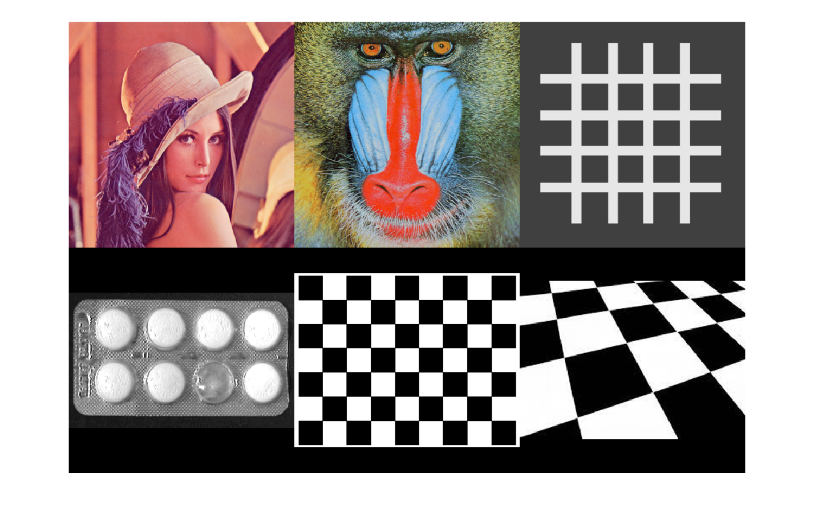
# Caracteristicas basadas en el histograma

Histograma del color


Primer ejemplo: Imagen Lena


Separamos la imagen en los tres canales de color

```matlab
rojo = lena(:,:,1);
verde = lena(:,:,2);
azul = lena(:,:,3);
```

Y obtenemos los histogramas de cada canal

```matlab
h_rojo = imhist(rojo);
h_verde = imhist(verde);
h_azul = imhist(azul);

bar(h_rojo)
```

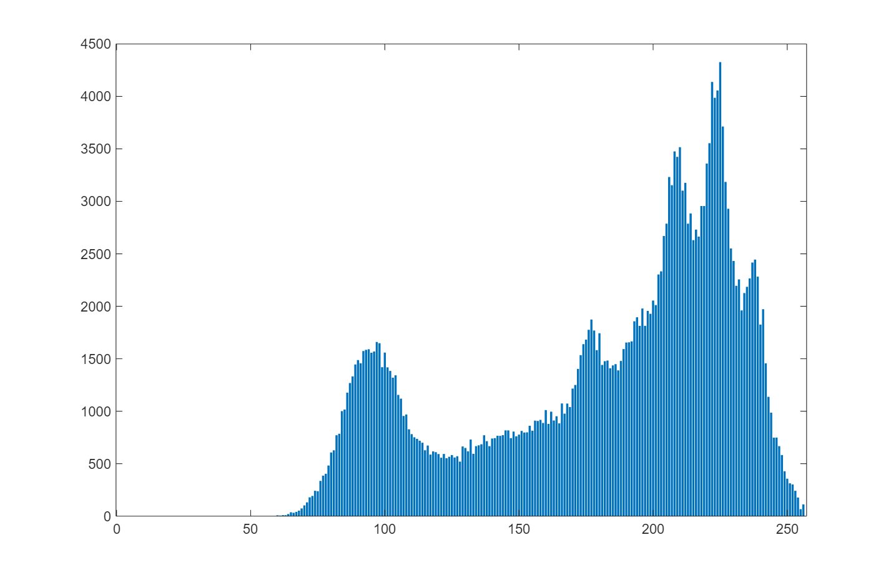

```matlab
bar(h_verde)
```

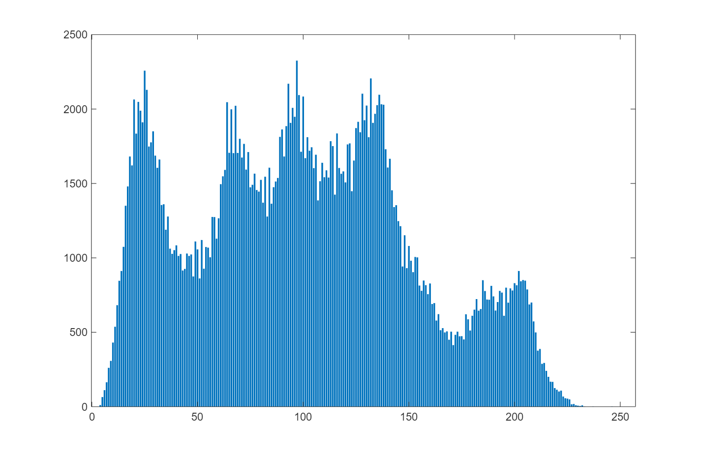

```matlab
bar(h_azul)
```

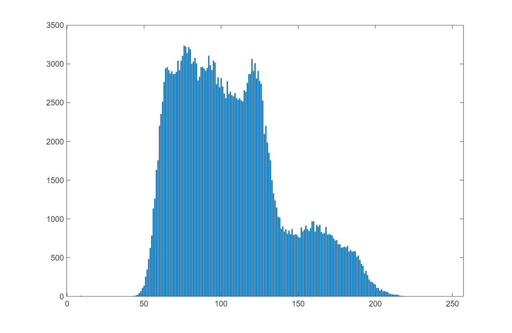

Otro ejemplo: Imagen mandril

```matlab
rojo = mandril(:,:,1);
verde = mandril(:,:,2);
azul = mandril(:,:,3);

h_rojo = imhist(rojo);
h_verde = imhist(verde);
h_azul = imhist(azul);

bar(h_rojo)
```

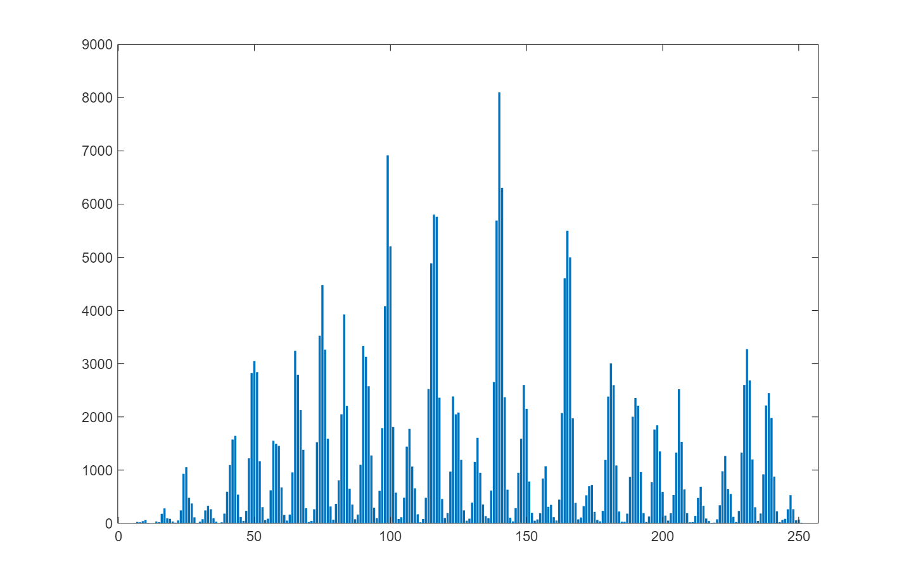

```matlab
bar(h_verde)
```

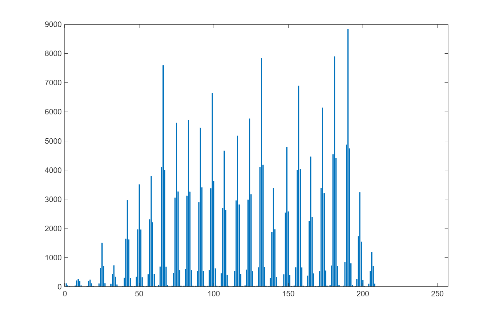

```matlab
bar(h_azul)
```

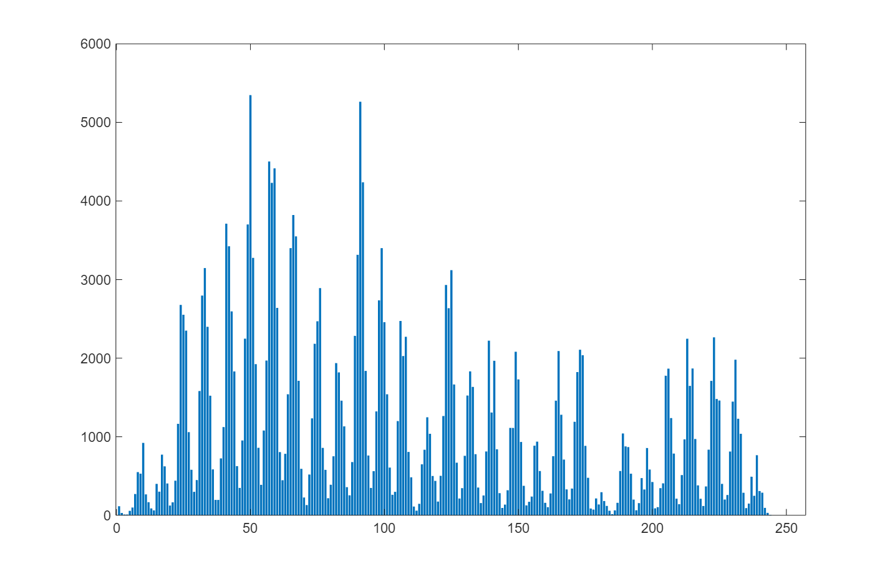

Calculamos las medidas de similitud para comparar histogramas. Para simplificar, vamos a comparar solo un histograma por imagen.

```matlab
lena_gris = rgb2gray(lena);
mandril_gris = rgb2gray(mandril);

h_lena = imhist(lena_gris);
h_mandril = imhist(mandril_gris);
```

Normalizamos el histograma

```matlab
h_lena_n = h_lena/numel(lena_gris);
h_mandril_n = h_mandril/numel(mandril_gris);
bar(h_lena_n)
```

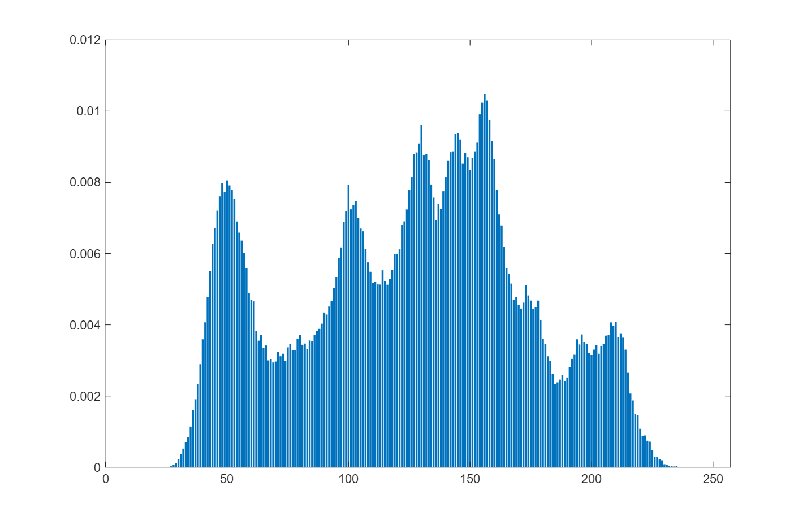

```matlab
bar(h_mandril_n)
```

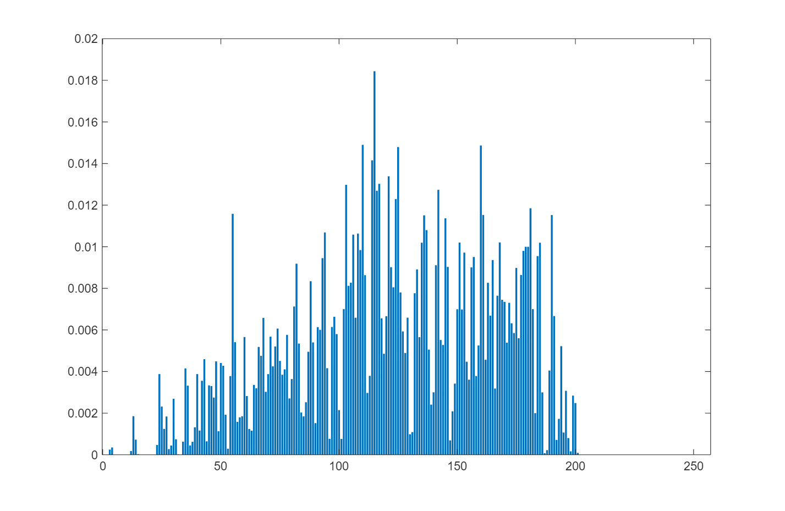

Distancia Euclidea

```matlab
dist_euclidea = sqrt(sum((h_lena_n - h_mandril_n).^2))
```

```matlabTextOutput
dist_euclidea = 0.0533
```

Distancia Xi\-cuadrado

```matlab
dist_xicuadrado = sum(((h_lena_n - h_mandril_n).^2) ./ (h_lena_n + h_mandril_n + eps))
```

```matlabTextOutput
dist_xicuadrado = 0.2997
```

Distancia de la divergencia de Jeffrey

```matlab
divergence_jeffrey = sum(h_lena_n.*log((h_lena_n./(h_mandril_n + eps))+eps))
```

```matlabTextOutput
divergence_jeffrey = 2.1436
```

Histograma de los gradientes orientados


Primer ejemplo: Imagen Lena


Comando: extractHOGFeatures

```matlab
[feature_vector,hog] = extractHOGFeatures(lena);

imshow(lena); 
hold on;
plot(hog);
hold off
```

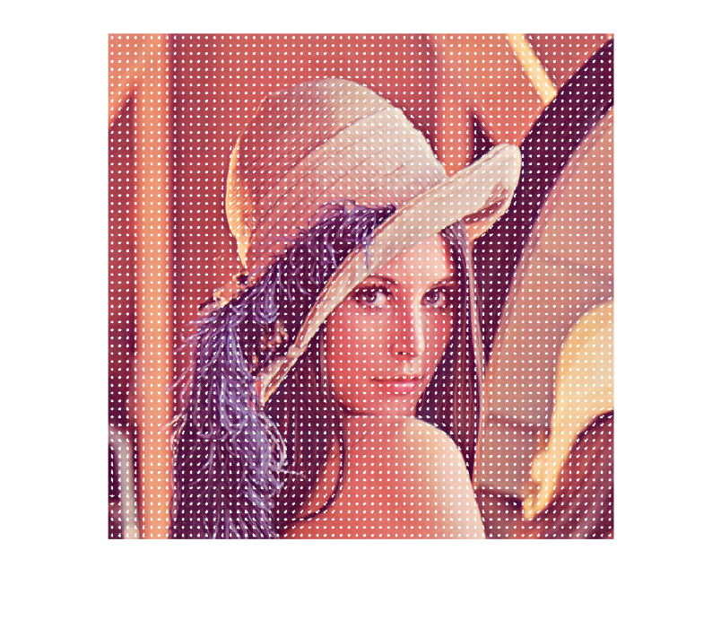

Otro ejemplo: Imagen mandril

```matlab
[feature_vector_mandril,hog_mandril] = extractHOGFeatures(mandril);
imshow(mandril);
hold on
plot(hog_mandril);
hold off
```

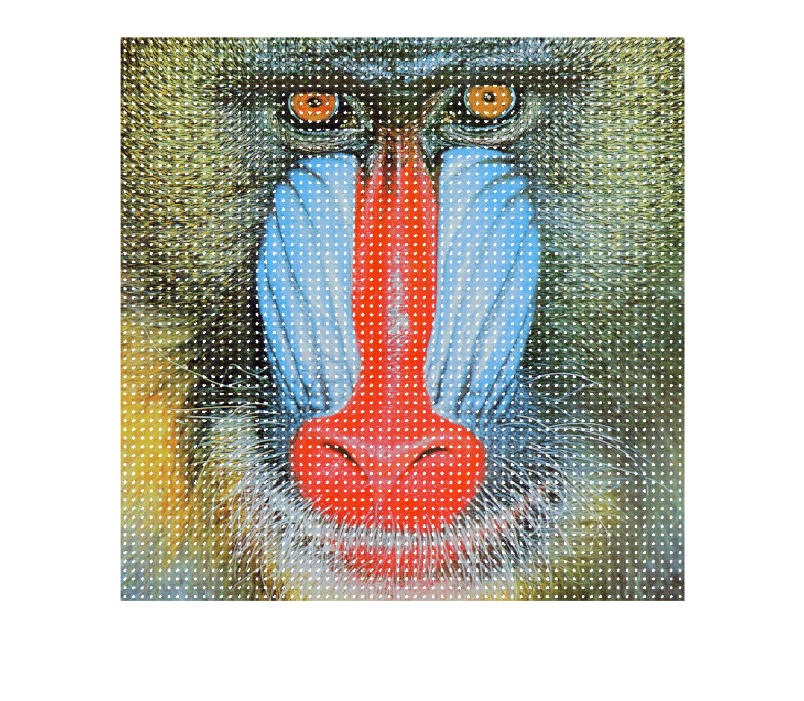
# Caracteristicas basadas en la transformada de Hough

Obtención de rectas vía la transformada de Hough


Primero obtenemos los bordes de la imagen

```matlab
malla_edge = edge(malla,"canny");
```

Comando: hough. Da como input la discretización del plano de Hough H, con los valores de theta T y rho R

```matlab
[H,T,R] = hough(malla_edge);
```

Calculamos los picos (puntos con más valor) en dicha discretización del plano de Hough. En particular, nos quedamos con los 16 picos de más valor que esten por encima del 35% del valor máximo.

```matlab
P = houghpeaks(H, 16,'threshold',ceil(0.35*max(H(:))));
```

Calculamos las rectas con dichos picos y sus valores theta y rho asociados (que definen las correspondientes rectas).

```matlab
lines = houghlines(malla_edge,T,R,P);

imshow(malla)
hold on

for k = 1:length(lines)
   
    xy = [lines(k).point1; lines(k).point2];
    plot(xy(:,1),xy(:,2),'LineWidth',2,'Color','red');

end
hold off
```

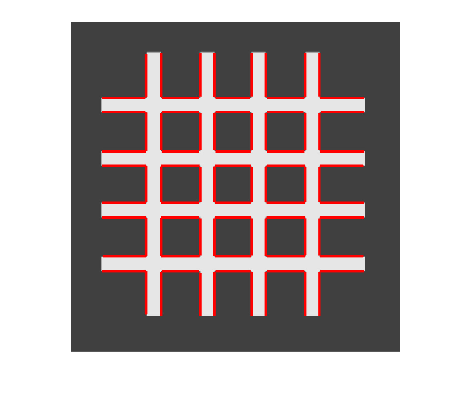

Obtenemos los círculos en la imagen vía la transformada de Hough. Para ello, usamos el comando imfindcircles que busca círculos con un radio de valor comprendido en el rango que se define como segundo input.

```matlab
[centers, radii] = imfindcircles(textura,[10 30]);
imshow(textura)
viscircles(centers, radii,'EdgeColor','b');
```

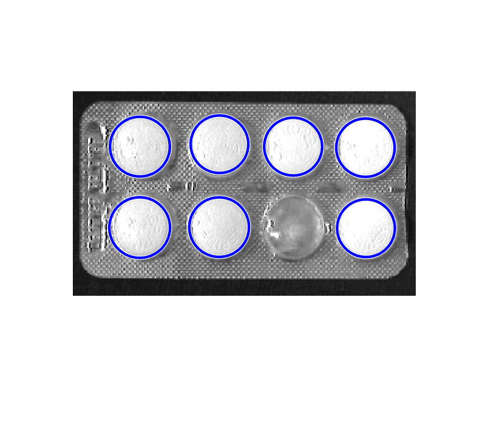
# Vértices

Se utiliza el detector de Harris para identificar esquinas y vértices en las imágenes.

```matlab
corners = detectHarrisFeatures(chessboard);

imshow(chessboard); 
hold on
plot(corners.Location(:,1),corners.Location(:,2),'o','Color','r','LineWidth',2);
hold off
```

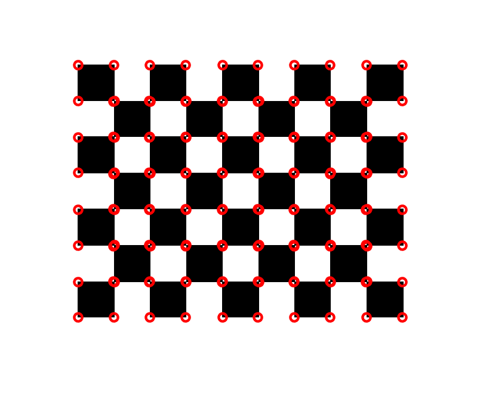

Otro ejemplo. Notad que en este caso se detectan varios falsos positivos. Un análisis más detallado muestra que la métrica de estos es muy baja, con lo que se pueden eliminar fácilmente mediante seleccionar los más fuertes, es decir, los que tienen una detección más robusta.

```matlab

corners_alt = detectHarrisFeatures(chessboard_inclinado);

imshow(chessboard_inclinado); 
hold on
plot(corners_alt.Location(:,1),corners_alt.Location(:,2),'o',"color",'r','LineWidth',2);
hold off
```

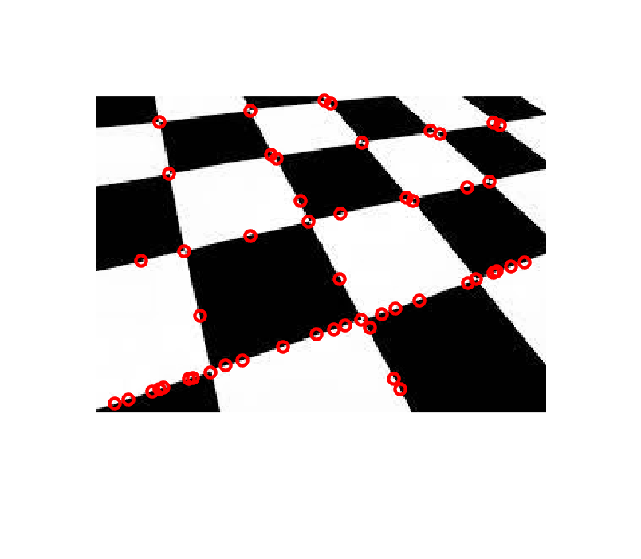

```matlab
imshow(chessboard_inclinado)

strongest = corners_alt.selectStrongest(20);

hold on
plot(strongest.Location(:,1),strongest.Location(:,2),'o','color','r','LineWidth',2)
hold off
```

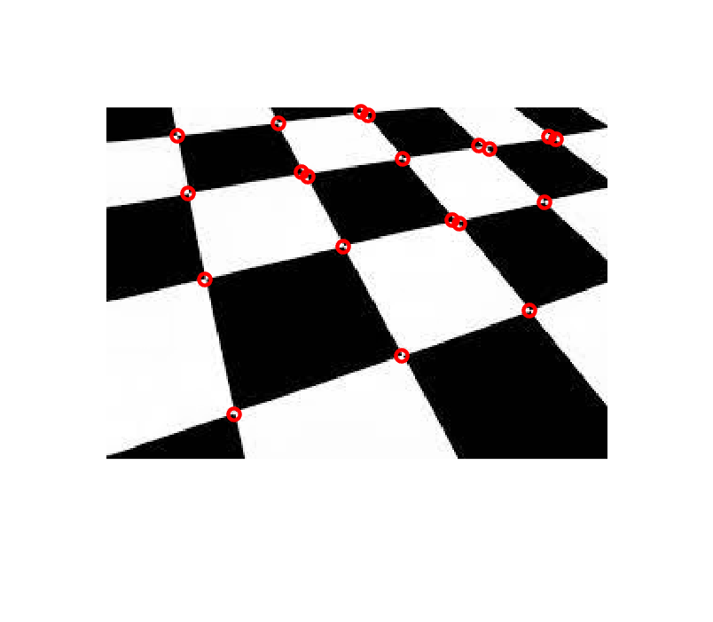


