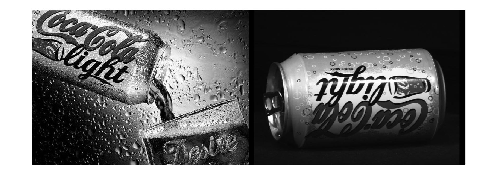
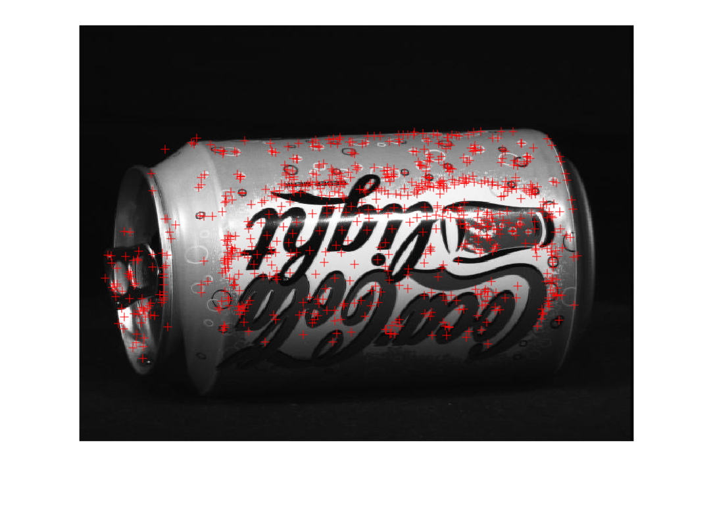
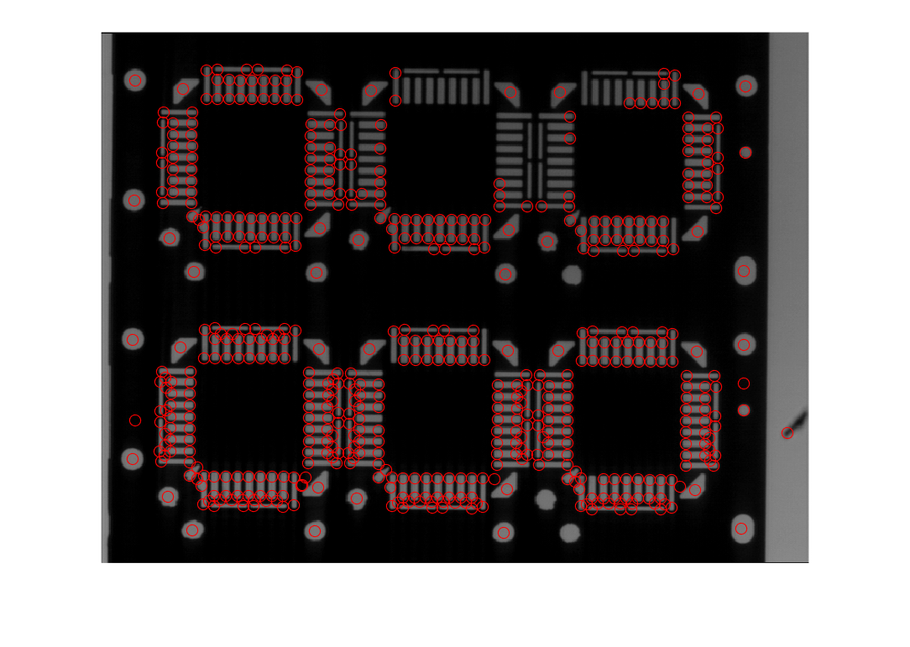
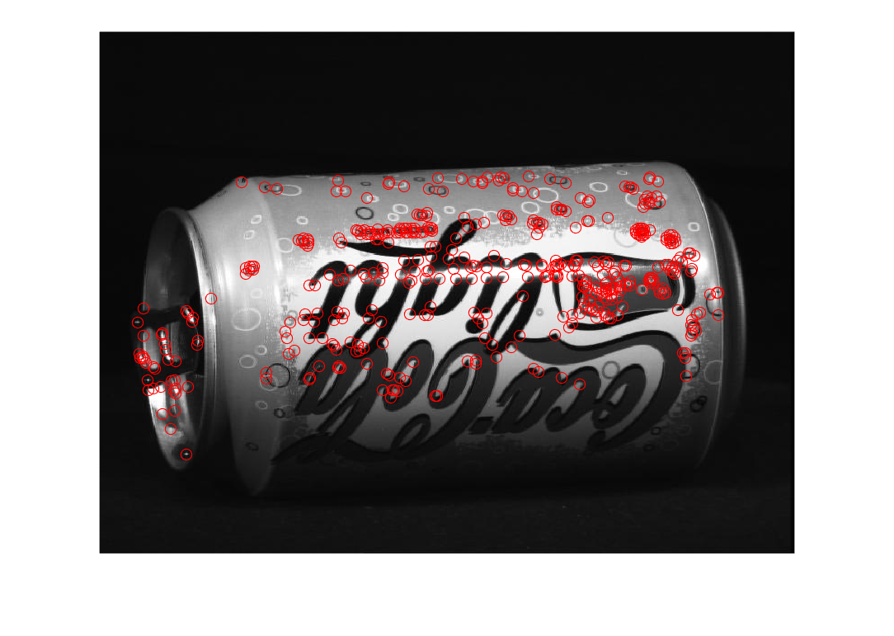
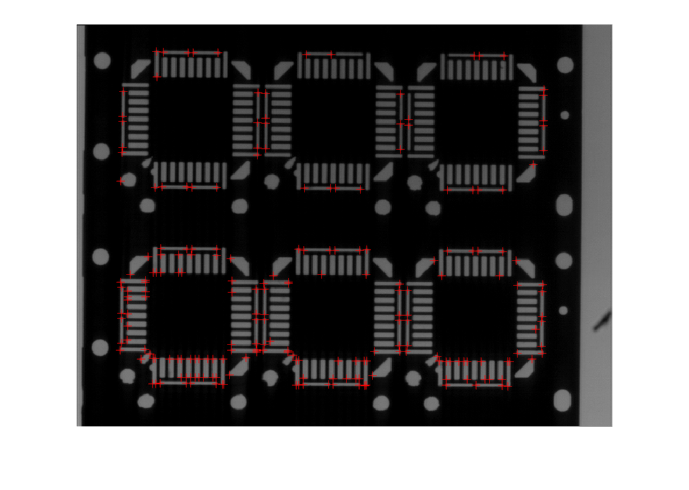
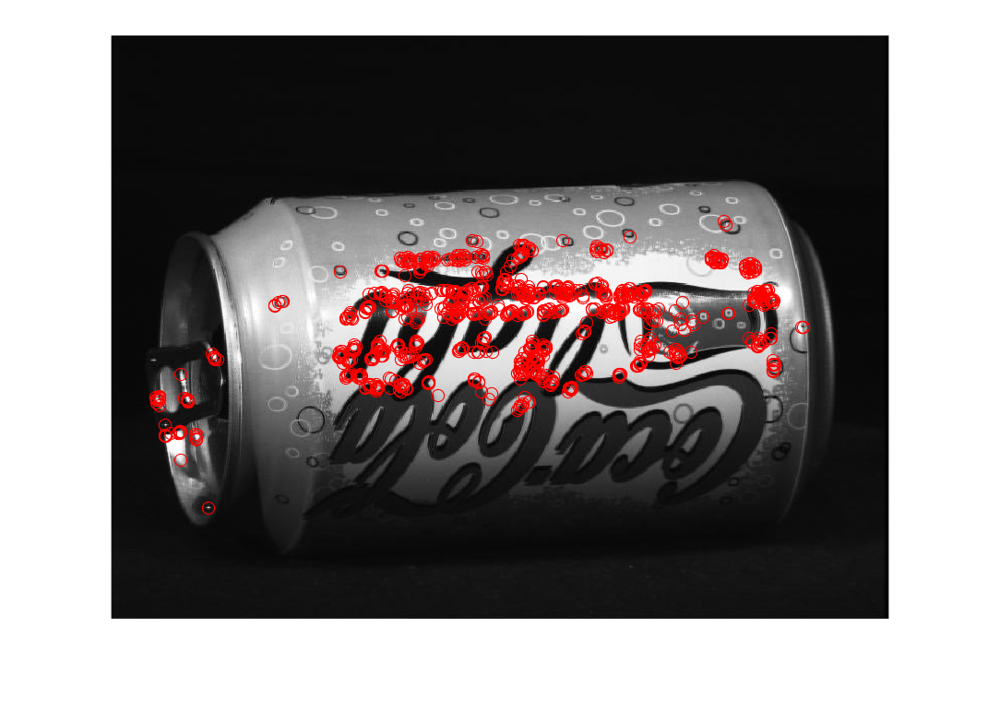
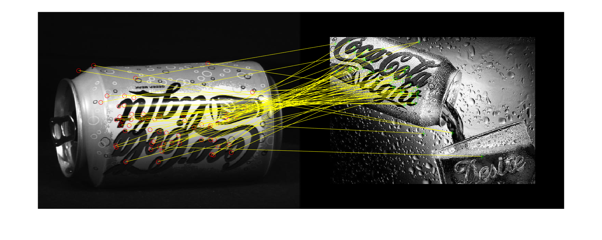

# PRÁCTICA 8: CARACTERÍSTICAS LOCALES DE LA IMAGEN (2º PARTE)

Cargamos las imágenes que utilizaremos en la sesión práctica

```matlab
cocacola_lata_1 = imread("Imagenes\coca_cola_1.jpg");
cocacola_lata_2 = imread("Imagenes\coca_cola_2.jpg");
frame1 = imread("Imagenes\Frame 1.tif");
```

Pasamos las imágenes a escala de grises (para una mejor detección de las características)

```matlab
cocacola_lata_1 = rgb2gray(cocacola_lata_1);
cocacola_lata_2 = rgb2gray(cocacola_lata_2);

montage({cocacola_lata_1,cocacola_lata_2})
```


# Características tipo SIFT

Usamos el comando detectSIFTFeatures para obtener todos los puntos de interés de tipo SIFT junto con sus descriptores. Luego los mostramos sobre la imagen original para ver qué tipo de características son las que detecta este algoritmo.

```matlab
SIFT_features_lata_2 = detectSIFTFeatures(cocacola_lata_2);
puntos_SIFT_lata_2 = SIFT_features_lata_2.Location;

imshow(cocacola_lata_2)
hold on
plot(puntos_SIFT_lata_2(:,1),puntos_SIFT_lata_2(:,2),'+',Color='r');
hold off
```



Analisis de los parámetros de entrada: Umbral para los maximos y los minimos, es decir, para la supresión de no\-máximos, umbral para eliminar los puntos de interés pertenecientes a rectas, definición del número de capas en las octavas y del valor inicial de la varianza).


Otro ejemplo

```matlab
SIFT_features_frame_1 = detectSIFTFeatures(frame1);

puntos_SIFT_frame_1 = SIFT_features_frame_1.selectStrongest(550);

puntos_SIFT_frame_1 = puntos_SIFT_frame_1.Location;

imshow(frame1);
hold on
plot(puntos_SIFT_frame_1(:,1),puntos_SIFT_frame_1(:,2),'o',Color='r')
hold off
```


# Características tipo FAST

Usamos el comando detectFASTFeatures para obtener todos los puntos de interés de tipo FAST. Luego los mostramos sobre la imagen original para ver qué tipo de características son las que detecta este algoritmo.

```matlab
FAST_features_lata_2 = detectFASTFeatures(cocacola_lata_2);

puntos_FAST_lata_2 = FAST_features_lata_2.Location;

imshow(cocacola_lata_2)
hold on
plot(puntos_FAST_lata_2(:,1),puntos_FAST_lata_2(:,2),'o',Color='r');
hold off
```



Otro ejemplo

```matlab
FAST_features_frame_1 = detectFASTFeatures(frame1);

puntos_FAST_frame_1 = FAST_features_frame_1.Location;

imshow(frame1)
hold on
plot(puntos_FAST_frame_1(:,1),puntos_FAST_frame_1(:,2),'+',Color='r')
hold off
```


# Características tipo ORB

Usamos el comando detectORBFeatures para obtener todos los puntos de interés de tipo ORB junto con sus descriptores. Luego los mostramos sobre la imagen original para ver qué tipo de características son las que detecta este algoritmo.

```matlab
ORB_features_lata_2 = detectORBFeatures(cocacola_lata_2);

puntos_ORB_lata_2 = ORB_features_lata_2.selectStrongest(1000);

puntos_coordenadas_ORB_lata_2 = puntos_ORB_lata_2.Location;

imshow(cocacola_lata_2)
hold on
plot(puntos_coordenadas_ORB_lata_2(:,1),puntos_coordenadas_ORB_lata_2(:,2),'o',Color='r');
hold off
```



Analisis de los parámetros de entrada: Factor de escala para la mejora de la parte FAST del algoritmo, número de octavas y una región de interes por si se quieren detectar las características en una subregión de la imagen original.


Otro ejemplo

```matlab
ORB_features_frame_1 = detectORBFeatures(frame1);

puntos_ORB_frame_1 = ORB_features_frame_1.selectStrongest(1000);

puntos_coordenadas_ORB_frame_1 = puntos_ORB_frame_1.Location;

imshow(frame1)
hold on
plot(puntos_coordenadas_ORB_frame_1(:,1),puntos_coordenadas_ORB_frame_1(:,2),'+',Color='r')
hold off
```


# Extraer las caracteristicas de un cierto tipo y compararlas

El comando extractFeatures permite extraer el vector descriptor de las características introducidas como argumento.

```matlab
[descriptor_lata_2, SIFT_features_lata_2] = extractFeatures(cocacola_lata_2,SIFT_features_lata_2);
```

Para comparar objetos entre si, repetimos el proceso con la otra imagen conteniendo una lata.

```matlab
SIFT_features_lata_1 = detectSIFTFeatures(cocacola_lata_1);

[descriptor_lata_1, SIFT_features_lata_1] = extractFeatures(cocacola_lata_1,SIFT_features_lata_1);
```

Comparamos los dos vectores descriptores con el comando matchFeatures. Si es binario se usa la distancia de Hamming y si no, se usa la distancia Euclidea normalizada. La función devuelve los indices de las caracterísiticas emparejadas para las dos imágenes y el comando length de dicho vector nos informa de cuantas características se han emparejado.

```matlab
[indices_pares_features,metrica] = matchFeatures(descriptor_lata_2,descriptor_lata_1,"MatchThreshold",10);

length(indices_pares_features)
```

```matlabTextOutput
ans = 71
```

Nos quedamos solo con las características emparejadas

```matlab
matched_SIFT_features_lata_2 = SIFT_features_lata_2(indices_pares_features(:,1),:);
matched_SIFT_features_lata_1 = SIFT_features_lata_1(indices_pares_features(:,2),:);
```

Mostramos el emparejamiento entre dichas características

```matlab
figure
showMatchedFeatures(cocacola_lata_2,cocacola_lata_1, matched_SIFT_features_lata_2,matched_SIFT_features_lata_1,"montage");
```



Calculamos la transformación geométrica (via RANSAC) que permite hacer el ajuste geométrico entre las dos imágenes en función de las características emparejadas. Usamos dicha transf. para transformar una de las imágenes y comparamos el resultado.

```matlab
T = estimateGeometricTransform(matched_SIFT_features_lata_2,matched_SIFT_features_lata_1,"affine");

T.T
```

```matlabTextOutput
ans = 3x3 single matrix
   -0.6308   -0.2532         0
    0.2542   -0.6325         0
  329.8466  431.7157    1.0000

```

```matlab

cocacola_lata_2_T = imwarp(cocacola_lata_2,T);

montage({cocacola_lata_2_T,cocacola_lata_1})
```


