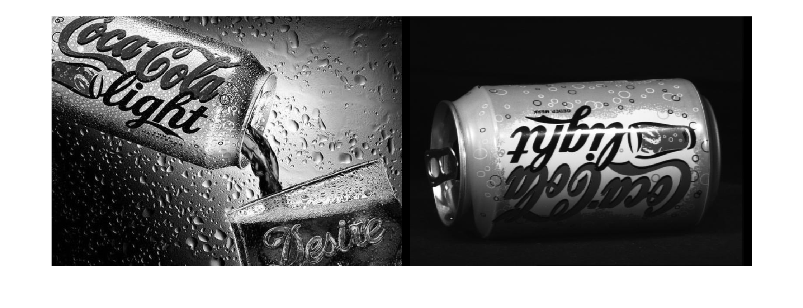
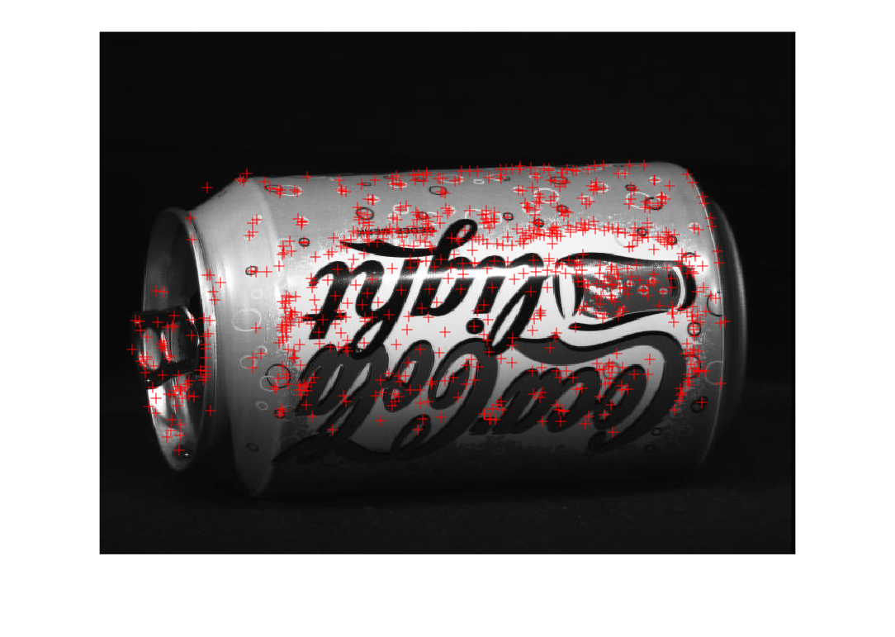
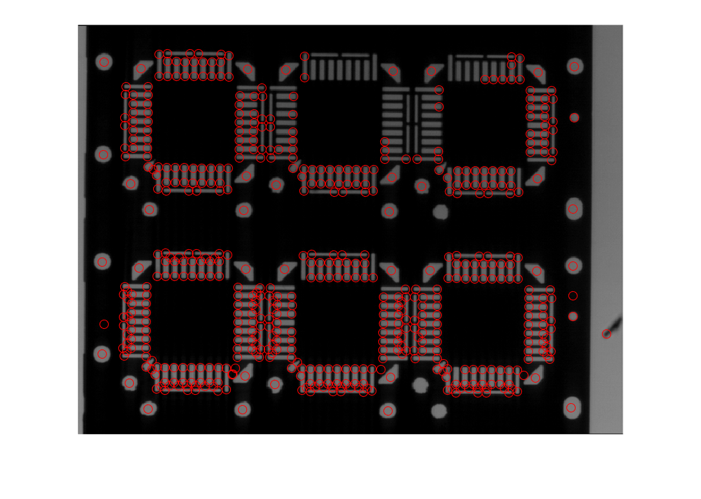
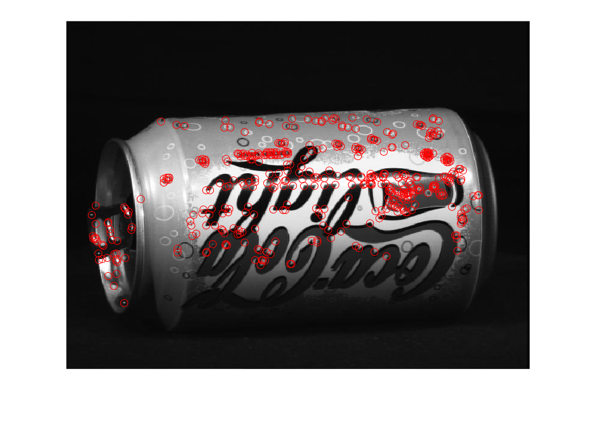
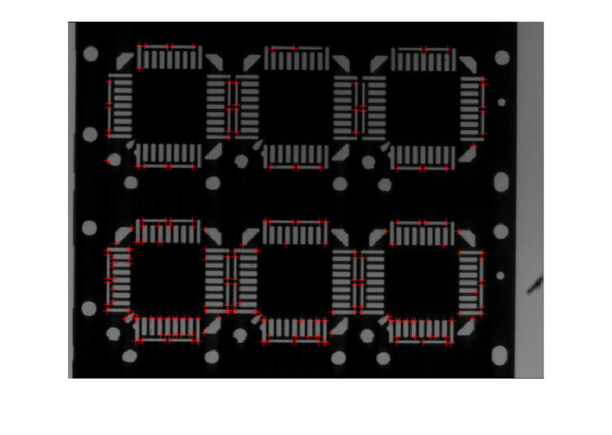
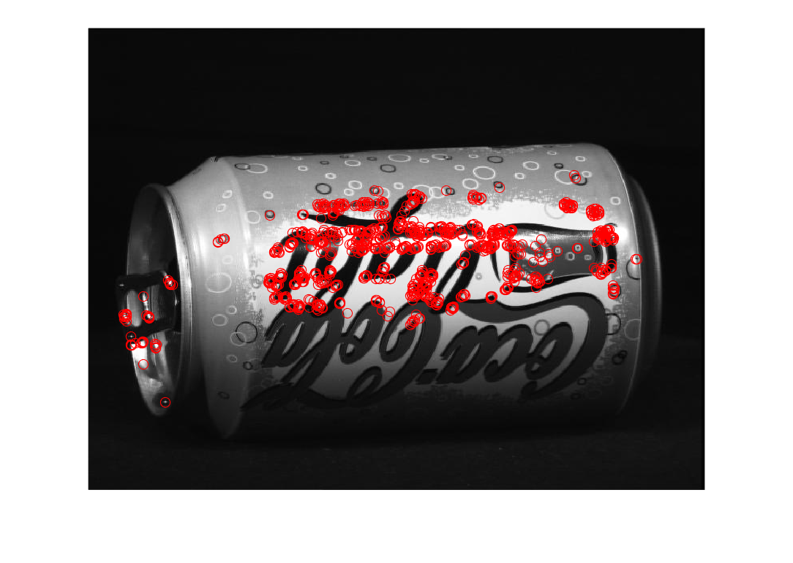
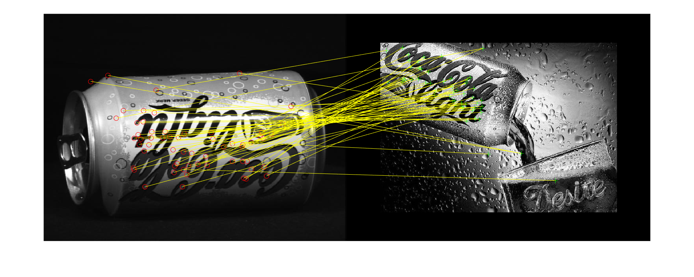

# PRÀCTICA 8: CARACTERÍSTIQUES LOCALS DE LA IMATGE (2a PART)

Carreguem les imatges que utilitzarem en la sessió pràctica

```matlab
cocacola_lata_1 = imread("Imagenes\coca_cola_1.jpg");
cocacola_lata_2 = imread("Imagenes\coca_cola_2.jpg");
frame1 = imread("Imagenes\Frame 1.tif");
```

Passem les imatges a escala de grisos, per a una millor detecció de les característiques

```matlab
cocacola_lata_1 = rgb2gray(cocacola_lata_1);
cocacola_lata_2 = rgb2gray(cocacola_lata_2);

montage({cocacola_lata_1,cocacola_lata_2})
```


# Característiques tipus SIFT

Utilitzem la comanda detectSIFTFeatures per obtenir tots els punts d’interès de tipus SIFT juntament amb els seus descriptors. Després els mostrem sobre la imatge original per veure quin tipus de característiques detecta aquest algorisme.

```matlab
SIFT_features_lata_2 = detectSIFTFeatures(cocacola_lata_2);
puntos_SIFT_lata_2 = SIFT_features_lata_2.Location;

imshow(cocacola_lata_2)
hold on
plot(puntos_SIFT_lata_2(:,1),puntos_SIFT_lata_2(:,2),'+',Color='r');
hold off
```



Anàlisi dels paràmetres d’entrada: llindar per als màxims i els mínims, és a dir, per a la supressió de no\-màxims; llindar per eliminar els punts d’interès pertanyents a rectes; definició del nombre de capes en les octaves i del valor inicial de la variància.


Un altre exemple

```matlab
SIFT_features_frame_1 = detectSIFTFeatures(frame1);

puntos_SIFT_frame_1 = SIFT_features_frame_1.selectStrongest(550);

puntos_SIFT_frame_1 = puntos_SIFT_frame_1.Location;

imshow(frame1);
hold on
plot(puntos_SIFT_frame_1(:,1),puntos_SIFT_frame_1(:,2),'o',Color='r')
hold off
```


# Característiques tipus FAST

Utilitzem la comanda detectFASTFeatures per obtenir tots els punts d’interès de tipus FAST. Després els mostrem sobre la imatge original per veure quin tipus de característiques detecta aquest algorisme.

```matlab
FAST_features_lata_2 = detectFASTFeatures(cocacola_lata_2);

puntos_FAST_lata_2 = FAST_features_lata_2.Location;

imshow(cocacola_lata_2)
hold on
plot(puntos_FAST_lata_2(:,1),puntos_FAST_lata_2(:,2),'o',Color='r');
hold off
```



Un altre exemple

```matlab
FAST_features_frame_1 = detectFASTFeatures(frame1);

puntos_FAST_frame_1 = FAST_features_frame_1.Location;

imshow(frame1)
hold on
plot(puntos_FAST_frame_1(:,1),puntos_FAST_frame_1(:,2),'+',Color='r')
hold off
```


# Característiques tipus ORB

Utilitzem la comanda detectORBFeatures per obtenir tots els punts d’interès de tipus ORB juntament amb els seus descriptors. Després els mostrem sobre la imatge original per veure quin tipus de característiques detecta aquest algorisme.

```matlab
ORB_features_lata_2 = detectORBFeatures(cocacola_lata_2);

puntos_ORB_lata_2 = ORB_features_lata_2.selectStrongest(1000);

puntos_coordenadas_ORB_lata_2 = puntos_ORB_lata_2.Location;

imshow(cocacola_lata_2)
hold on
plot(puntos_coordenadas_ORB_lata_2(:,1),puntos_coordenadas_ORB_lata_2(:,2),'o',Color='r');
hold off
```



Anàlisi dels paràmetres d’entrada: factor d’escala per a la millora de la part FAST de l’algorisme, nombre d’octaves i una regió d’interès per si es volen detectar les característiques en una subregió de la imatge original.


Un altre exemple

```matlab
ORB_features_frame_1 = detectORBFeatures(frame1);

puntos_ORB_frame_1 = ORB_features_frame_1.selectStrongest(1000);

puntos_coordenadas_ORB_frame_1 = puntos_ORB_frame_1.Location;

imshow(frame1)
hold on
plot(puntos_coordenadas_ORB_frame_1(:,1),puntos_coordenadas_ORB_frame_1(:,2),'+',Color='r')
hold off
```


# Extreure les característiques d’un cert tipus i comparar-les

La comanda extractFeatures permet extreure el vector descriptor de les característiques introduïdes com a argument.

```matlab
[descriptor_lata_2, SIFT_features_lata_2] = extractFeatures(cocacola_lata_2,SIFT_features_lata_2);
```

Per comparar objectes entre si, repetim el procés amb l’altra imatge que conté una llauna.

```matlab
SIFT_features_lata_1 = detectSIFTFeatures(cocacola_lata_1);

[descriptor_lata_1, SIFT_features_lata_1] = extractFeatures(cocacola_lata_1,SIFT_features_lata_1);
```

Comparem els dos vectors descriptors amb la comanda matchFeatures. Si és binari, s’utilitza la distància de Hamming i, si no, s’utilitza la distància euclidiana normalitzada. La funció retorna els índexs de les característiques emparellades per a les dues imatges, i la comanda length d’aquest vector ens informa de quantes característiques s’han emparellat.

```matlab
[indices_pares_features,metrica] = matchFeatures(descriptor_lata_2,descriptor_lata_1,"MatchThreshold",10);

length(indices_pares_features)
```

```matlabTextOutput
ans = 71
```

Ens quedem només amb les característiques emparellades

```matlab
matched_SIFT_features_lata_2 = SIFT_features_lata_2(indices_pares_features(:,1),:);
matched_SIFT_features_lata_1 = SIFT_features_lata_1(indices_pares_features(:,2),:);
```

Mostrem l’emparellament entre aquestes característiques

```matlab
figure
showMatchedFeatures(cocacola_lata_2,cocacola_lata_1, matched_SIFT_features_lata_2,matched_SIFT_features_lata_1,"montage");
```



Calculem la transformació geomètrica, via RANSAC, que permet fer l’ajust geomètric entre les dues imatges en funció de les característiques emparellades. Utilitzem aquesta transf. per transformar una de les imatges i comparem el resultat.

```matlab
T = estimateGeometricTransform(matched_SIFT_features_lata_2,matched_SIFT_features_lata_1,"affine");

T.T
```

```matlabTextOutput
ans = 3x3 single matrix
   -0.6308   -0.2532         0
    0.2542   -0.6325         0
  329.8466  431.7157    1.0000

```

```matlab

cocacola_lata_2_T = imwarp(cocacola_lata_2,T);

montage({cocacola_lata_2_T,cocacola_lata_1})
```

