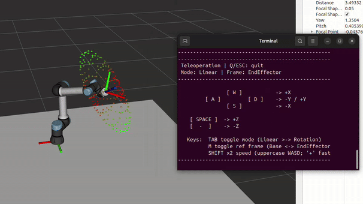

# From Code To Robot

<strong><em>Un currículum pràctic de robòtica, visió per computador i IA utilitzant MATLAB i robots UR</em></strong>

**Codi**: [https://github.com/iocroblab/from_code_to_robot.git](https://github.com/iocroblab/from_code_to_robot.git)

## Continguts

- [Visió general](#visió-general)
    - [Objectiu general](#objectiu-general)
    - [Objectius del projecte](#objectius-del-projecte)
    - [Públic objectiu](#públic-objectiu)
    - [Característiques principals](#característiques-principals)
    - [Flexibilitat educativa](#flexibilitat-educativa)
- [Principals resultats d’aprenentatge](#principals-resultats-daprenentatge)
- [Estructura del currículum](#estructura-del-currículum)
    - [Robòtica](#robòtica)
    - [Visió per computador](#visió-per-computador)
    - [Intel·ligència artificial](#intel·ligència-artificial)
- [Requisits de programari](#requisits-de-programari)
- [Crèdits](#crèdits)
- [Sobre el projecte](#sobre-el-projecte)

# Visió general

**From Code to Robot** és un currículum obert, modular i pràctic dissenyat per ensenyar els fonaments de:

- 🤖 Robòtica  
- 👁️ Visió per computador  
- 🧠 Intel·ligència artificial  

utilitzant **MATLAB** i manipuladors **Universal Robots (UR)**.

El projecte combina teoria amb experimentació pràctica mitjançant simulació, plataformes robòtiques reals i scripts executables de MATLAB. Està pensat per a cursos de grau i màster en:

- Enginyeria Industrial  
- Robòtica  
- Informàtica  
- Automatització i Control  
- Intel·ligència Artificial  

El currículum s’organitza com una col·lecció flexible de tutorials, demostracions, exercicis i projectes que els instructors poden adaptar fàcilment a diferents cursos i nivells acadèmics.

## Objectiu general

Proporcionar als estudiants un marc pràctic i interdisciplinari per dissenyar, simular, percebre, planificar i executar tasques robòtiques utilitzant eines modernes de robòtica, visió per computador i intel·ligència artificial.

El currículum connecta la teoria amb aplicacions robòtiques reals mitjançant exercicis pràctics reproduïbles utilitzant MATLAB i robots UR.

## Objectius del projecte

- Desenvolupar materials docents oberts per a l’educació en robòtica
- Promoure l’aprenentatge interdisciplinari entre robòtica, visió i IA
- Facilitar l’adopció de cursos pràctics de robòtica
- Donar suport a l’experimentació amb plataformes robòtiques industrials
- Publicar resultats d’innovació docent i recerca educativa
- Proporcionar tutorials, demostracions i documentació reutilitzables

## Públic objectiu

- Estudiants d’enginyeria
- Investigadors en robòtica
- Docents i instructors
- Professionals de la IA i la visió per computador
- Laboratoris que introdueixen l’educació pràctica en robòtica

## Característiques principals

✅ Aprenentatge pràctic basat en projectes  
✅ Currículum modular adaptable a molts cursos  
✅ Integració de Robòtica + Visió + IA  
✅ Flux de treball centrat en MATLAB  
✅ Simulació i execució en robots reals  
✅ Recursos educatius oberts  
✅ Materials disponibles en:

    - Anglès
    - Castellà
    - Català

## Flexibilitat educativa

El currículum és intencionadament modular.

Es pot utilitzar:

- Com un curs complet interdisciplinari de robòtica
- Com a mòduls independents en cursos de robòtica, visió o IA
- En programes de grau o de màster
- En sessions de laboratori, projectes o tutorials

Aquesta flexibilitat permet als instructors adaptar els materials als seus propis objectius docents i estructures de curs.

---

# Principals resultats d’aprenentatge

Després de completar el currículum, els estudiants seran capaços de:

- Modelar i controlar manipuladors robòtics
- Resoldre problemes de cinemàtica directa i inversa
- Planificar trajectòries i analitzar el moviment del robot
- Comprendre la dinàmica del robot i el control descentralitzat
- Entrenar i validar models de detecció d’objectes utilitzant YOLOv8
- Construir conjunts de dades i aplicar tècniques d’augment de dades
- Integrar la percepció amb la manipulació robòtica
- Implementar la planificació de tasques robòtiques utilitzant Reinforcement Learning
- Dissenyar comportaments robòtics intel·ligents utilitzant Q-learning i Deep Q-learning
- Connectar la presa de decisions basada en IA amb l’execució robòtica
- Desenvolupar pipelines robòtiques completes des de la percepció fins a l’acció

---

# Estructura del currículum

El currículum s’organitza en tres pilars interconnectats.

---

## Robòtica

Aquest mòdul introdueix els fonaments dels manipuladors robòtics mitjançant simulacions en MATLAB i experiments amb robots UR.

### Temes tractats

- Modelatge amb paràmetres DH
- Cinemàtica directa i inversa
- Cinemàtica diferencial i jacobians
- Singularitats i redundància
- Planificació de trajectòries
- Modelatge dinàmic
- Control de moviment
- Simulació amb Simulink

### Components pràctics

- MATLAB live scripts 
- Symbolic Math Toolbox
- Robotics System Toolbox
- Models de Simulink
- Simulacions amb UR3 utilitzant:
    - entorn ROS 2 Jazzy reproduïble basat en Docker.
- Experiments amb robot real utilitzant:
    - Universal Robots Support Package

### Resultats d’aprenentatge

Els estudiants aprenen a modelar matemàticament, simular i controlar manipuladors robòtics industrials en escenaris realistes.

---

## Visió per computador

Aquest mòdul se centra en la detecció d’objectes i la percepció robòtica utilitzant tècniques d’aprenentatge profund.

### Temes tractats

- Detecció d’objectes amb YOLOv8
- Generació i anotació de conjunts de dades
- Etiquetatge de bounding boxes
- Augment de dades
- Transfer learning
- Entrenament i validació de models
- Calibratge de càmera
- Transformació de coordenades de visió a robot

### Components pràctics

- MATLAB Deep Learning Toolbox
- Transfer learning amb models YOLOv8 preentrenats
- Integració amb tasques de manipulació robòtica
- Detecció d’objectes personalitzats per a la interacció amb el robot

### Resultats d’aprenentatge

Els estudiants aprenen a entrenar sistemes de visió capaços de detectar objectes i proporcionar informació espacial per a la manipulació robòtica.

---

## Intel·ligència artificial

Aquest mòdul introdueix la planificació de tasques robòtiques utilitzant tècniques de Reinforcement Learning.

### Temes tractats

- Representacions STRIPS
- Planificació de tasques
- Q-learning
- Deep Q-learning
- Presa de decisions seqüencial
- Poda d’accions
- Comportaments robòtics intel·ligents

### Components pràctics

- MATLAB Reinforcement Learning Toolbox
- Pipelines de planificació connectades amb l’execució del robot
- Seqüenciació de tasques guiada per IA
- Integració amb els mòduls de robòtica i visió per computador

### Resultats d’aprenentatge

Els estudiants aprenen com els robots poden prendre decisions de manera autònoma, optimitzar l’execució de tasques i planificar comportaments complexos.

---

# Requisits de programari 

El currículum es basa en MATLAB i diversos toolboxes de MathWorks per a robòtica, visió per computador i intel·ligència artificial.

## Programari recomanat

- MATLAB (versió recomanada: R2025a o R2025b)
- Simulink

## Toolboxes de MATLAB

- Robotics System Toolbox
- Symbolic Math Toolbox
- Deep Learning Toolbox
- Reinforcement Learning Toolbox
- Computer Vision Toolbox
- Image Processing Toolbox

## Maquinari suggerit

- Manipuladors Universal Robots UR3 / UR5
- Càmera RGB

---

# Crèdits

**From Code to Robot** és un projecte desenvolupat a la Universitat Politècnica de Catalunya i finançat per MathWorks i Universal Robots.

## Desenvolupadors

1. **Robòtica**

    - Constantin Sul (Universitat Politècnica de Catalunya)
    - Prof. Jan Rosell (Universitat Politècnica de Catalunya)

2. **Visió per computador i Intel·ligència artificial**

    - Noel Nathan Planell (Universitat Politècnica de Catalunya)
    - Prof. Isiah Zaplana (Universitat Politècnica de Catalunya)

## Assessors

- Jennifer Gago (MathWorks)
- Carlos Pérez (Universal Robots)

---

# Sobre el projecte

**Versió actual**: 0.0.1

# Exemples

El·lipsoide de manipulabilitat

<!--   -->

  

Control de parell

<!--  -->

  

