# Simulink 
# How to add Blocks 

In Simulink double click on an empty field and search for the block you want to insert in your plant.  

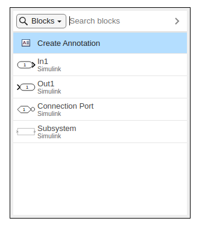

Alternatively you can brows the block library. Navigate to the Simulation tab and click Library Browser. 

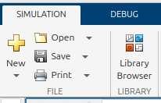

The browser will open from where you can drag the desired blocks into your plant. 

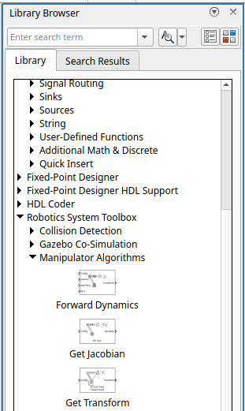
# Connect Blocks

To connect Blocks simply select the signal wire or block output and the desired block input. 

# Format Blocks

You can change the appearance of blocks by formatting them. 

-  Right click on a block and expand the Format tab. From here you are able to rotate or flip the block.  
-  You can change the size of a block by dragging one of its corners.  

# Format Plant

You can select a section of your model and drag it to create more space, the signal lines will stay intact and extend/retract. 

You can drag the signal lines to make the plant easier to read. 

# Tools and Blocks to use

In Simulink you can use a variety of differnt blocks to achieve your desired behaviour. Below we will introduce a few blocks that you can use to solve the exercises of this Curriculum. (Alternative solutions are not wrong!)

### Constant

Constant lets you insert a numeric scalar or array, which you can also load from your workspace. 

### Sum

The Sum block lets you add or subtract signals from one another. By changing the settings inside the block you can increase the amount of signals to be processed. By adding a | you can change the positions of inputs. 

### Scope

The scope block lets you visualize your signal trajectories. Click above or below an input to create an additional signal input. You can delete it by selecting the input and pressing "del"

### Matrix Multiply

To multiply matrices (matrix as an input). Can also be used to multiply a matrix with a vector. 

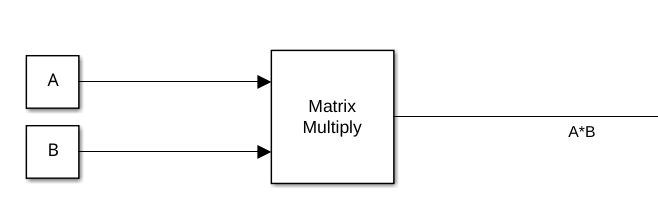

### Gain

Has a static gain. Can be loaded from the workspace via a variable name. 

Allows scalar valus and matrices as gain. 

Select a desired Multiplication option for your application. 

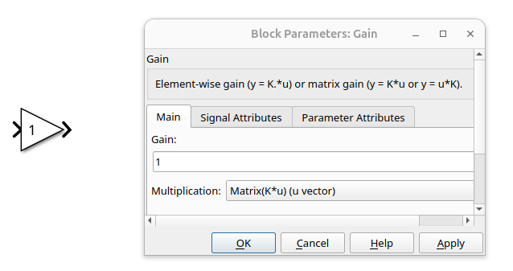

### MatlabFunction

Allows to use code inside of simulink. Define inputs and outputs in the function declaration. 

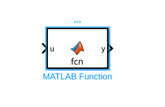

### Saturation

This block is used to limit a signal. Define the upper and lower allowed limit. 

Can take a vector as the limits (corresponding to the input vector size) 

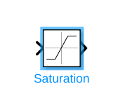

### Mux/Demux

Mux and Demux blocks can be used to seperate or combine signals into a vector. 

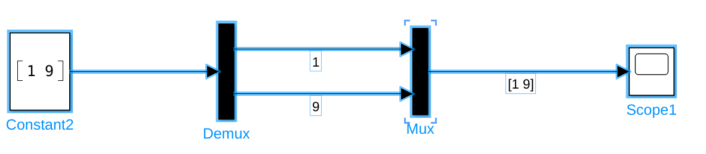

# Run a Simulation 

Navigate to the Simulation section. You will see under the tab SIMULATE. 

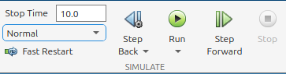

To run a simulation you must first set the desired simulation length. 

Set a positive number or inf for a continious execution. 

To start the Simulation press Run 

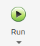

You can also simulate step by step by pressing the Step Forward button. However this is more useful in offline applications. 

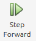

Once running you can pause or stop the simulation by pressing: 

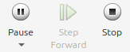

