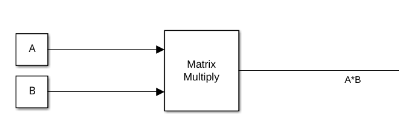
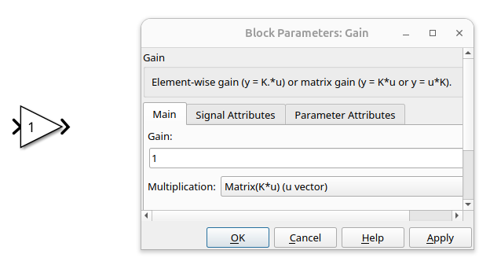
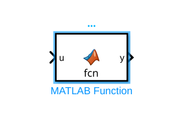

# Simulink 
# Com afegir blocs 

A Simulink, fes doble clic en un camp buit i busca el bloc que vols inserir a la teva planta.  

Alternativament, pots navegar per la biblioteca de blocs. Ves a la pestanya Simulation i fes clic a Library Browser. 

S’obrirà el navegador, des d’on pots arrossegar els blocs desitjats cap a la teva planta. 

# Connectar blocs

Per connectar blocs, simplement selecciona el cable de senyal o la sortida del bloc i l’entrada del bloc desitjat. 

# Donar format als blocs

Pots canviar l’aparença dels blocs donant-los format. 

-  Fes clic dret sobre un bloc i desplega la pestanya Format. Des d’aquí pots rotar o invertir el bloc.  
-  Pots canviar la mida d’un bloc arrossegant una de les seves cantonades.  

# Donar format a la planta

Pots seleccionar una secció del teu model i arrossegar-la per crear més espai; les línies de senyal es mantindran intactes i s’estendran o es retrauran. 

Pots arrossegar les línies de senyal per fer que la planta sigui més fàcil de llegir. 

# Eines i blocs a utilitzar

A Simulink pots utilitzar una varietat de blocs diferents per aconseguir el comportament desitjat. A continuació introduirem alguns blocs que pots utilitzar per resoldre els exercicis d’aquest currículum. (Les solucions alternatives no són incorrectes!)

### Constant

Constant et permet inserir un escalar numèric o un array, que també pots carregar des del workspace. 

### Sum

El bloc Sum et permet sumar o restar senyals entre si. Canviant la configuració dins del bloc pots augmentar la quantitat de senyals que s’han de processar. Afegint un | pots canviar les posicions de les entrades. 

### Scope

El bloc Scope et permet visualitzar les trajectòries dels senyals. Fes clic a sobre o a sota d’una entrada per crear una entrada de senyal addicional. La pots eliminar seleccionant l’entrada i prement "del"

### Matrix Multiply

Per multiplicar matrius (matriu com a entrada). També es pot utilitzar per multiplicar una matriu per un vector. 

### Gain

Té un guany estàtic. Es pot carregar des del workspace mitjançant el nom d’una variable. 

Permet valors escalars i matrius com a guany. 

Selecciona una opció de multiplicació adequada per a la teva aplicació. 

### MatlabFunction

Permet utilitzar codi dins de Simulink. Defineix entrades i sortides a la declaració de la funció. 

### Saturation

Aquest bloc s’utilitza per limitar un senyal. Defineix el límit superior i inferior permès. 

Pot acceptar un vector com a límits (corresponent a la mida del vector d’entrada). 

### Mux/Demux

Els blocs Mux i Demux es poden utilitzar per separar o combinar senyals en un vector. 

# Executar una simulació 

Ves a la secció Simulation. Ho veuràs sota la pestanya SIMULATE. 

Per executar una simulació, primer has d’establir la durada de simulació desitjada. 

Estableix un nombre positiu o inf per a una execució contínua. 

Per iniciar la simulació, prem Run 

També pots simular pas a pas prement el botó Step Forward. Tanmateix, això és més útil en aplicacions offline. 

Un cop en execució, pots pausar o aturar la simulació prement: 

