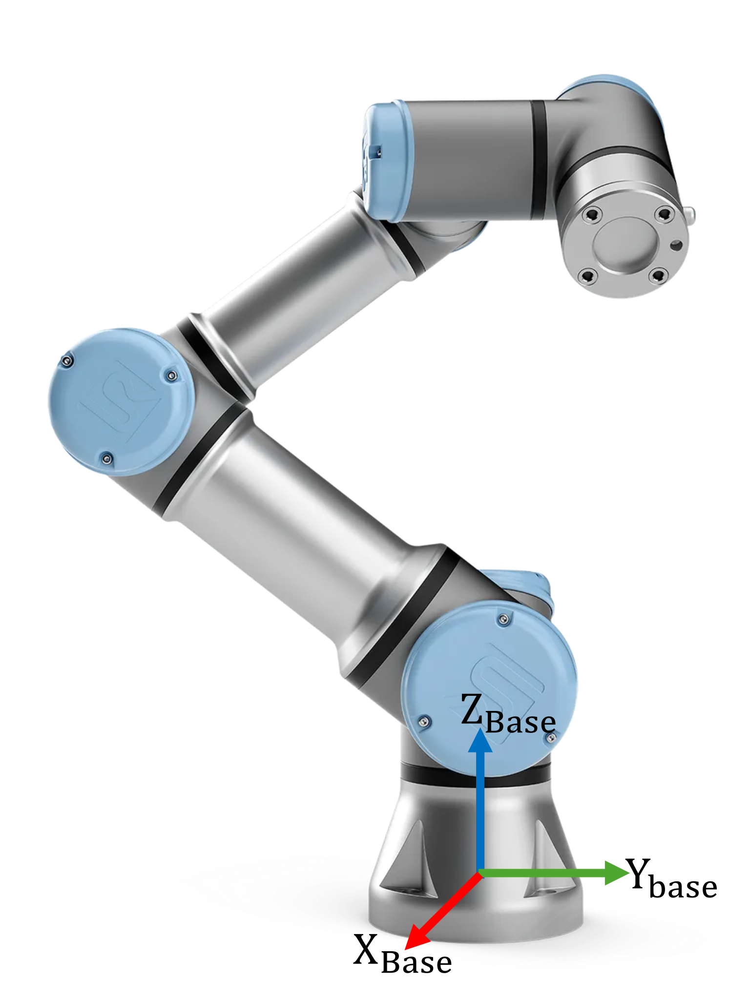

```matlab
clear all; 
```
# Exercici 1.2 \- Modelatge d’un robot

En aquest exercici modelaràs un robot Universal UR3e a partir dels paràmetres DH donats.


 


Guarda les teves solucions a les variables predefinides!

# Descripció de la tasca:

Donats els paràmetres DH d’un robot UR3e: 

||||||
| :-: | :-- | :-: | :-: | :-: |
| Eslabó  | a $begin:math:display$m$end:math:display$  | alpha  | d $begin:math:display$m$end:math:display$  | theta   |
| 1  | 0  | pi/2  | 0.15185  | 0   |
| 2  | \-0.24355  | 0  | 0  | 0   |
| 3  | \-0.2132  | 0  | 0  | 0   |
| 4  | 0  | pi/2  | 0.13105  | 0   |
| 5  | 0  | \-pi/2  | 0.08535  | 0   |
| 6  | 0  | 0  | 0.0921  | 0   |


La base i el sistema de coordenades de la primera articulació són idèntics!


Respon totes les preguntes i guarda la teva solució a la variable correcta.

# Tasca 1

1.  Configura l’estructura del robot i utilitza el format de dades "column"
2. Defineix els cossos, anomena’ls body\_1, ..., body\_n
3. Defineix les articulacions, anomena-les joint\_1, ..., joint\_n

Utilitza les variables següents per guardar la teva solució:

-  robot (nom del teu robot) 
-  bodies (nom de la variable que conté els cossos) 
-  joints (nom de la variable que conté les articulacions) 
```matlab
robot = [];
bodies = []; 
joints = []; 
```

Pots comprovar la feina fent clic a Run: 

```matlab
 
check_exercise('1-2-1')
```

```matlabTextOutput
Checking exercise 1-2-1: Variable Structure

Checking variables:
 
Checking Variable robot
[OK] robot is of type rigidBodyTree

Checking robot data format
[OK] Correct data format

Checking Variable bodies
[OK] bodies is of type cell

Checking Variable joints
[OK] joints is of type cell

checking body elements
checking joint elements
```

# Tasca 2

1.  Enllaça els paràmetres DH amb les articulacions corresponents.
2. Enllaça les articulacions amb els seus cossos.
3. Afegeix els cossos al robot
```matlab
DH=[
   %a       alpha       d       theta
   0        pi/2        0.15185  0;
   -0.24355 0           0       0;
   -0.2132  0           0       0;
   0        pi/2        0.13105 0;
   0        -pi/2       0.08535 0;
   0        0           0.0921  0;
    ]
```

Afegeix el teu codi aquí: 


Pots comprovar la feina fent clic a Run: 

```matlab
 
check_exercise('1-2-2')

```
# Tasca 3
1.  Defineix la gravetat en la direcció Z negativa amb una magnitud de $9\ldotp 81\;\frac{m}{s^2 }$ (vegeu la figura anterior)
2. Estableix la posició inicial de les articulacions 1, 3 i 5 a $\frac{\pi }{2}$

Afegeix el teu codi aquí:


Pots comprovar la feina fent clic a Run: 

```matlab
 
check_exercise('1-2-3')
```