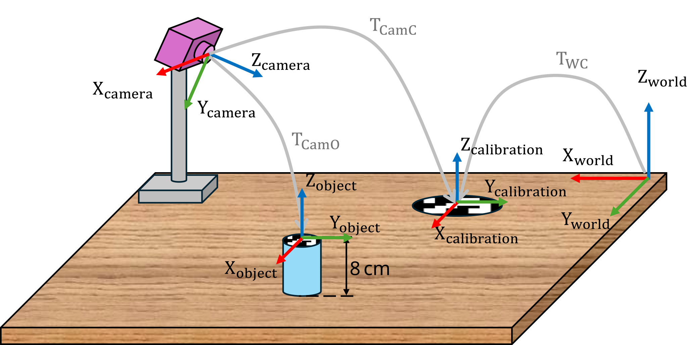

```matlab
clear all; 
```
# Exercici 1.1 \- Trobar les transformacions

En aquest exercici hauràs de trobar transformacions entre sistemes de coordenades. 


Guarda les teves solucions a les variables predefinides!

# Descripció de la tasca:

Donat aquest conjunt de sistemes de coordenades:


Respon totes les preguntes i guarda la teva solució a la variable correcta.

# Tasca 1
1.  Troba les transformacions homogènies entre els sistemes 1 i 2
2. Troba les transformacions homogènies entre els sistemes 2 i 3
3. Troba les transformacions homogènies entre els sistemes 3 i 4

Utilitza les variables següents per guardar la teva solució:

-  T12 (transformació homogènia del sistema 1 al sistema 2) 
-  T23 (transformació homogènia del sistema 2 al sistema 3) 
-  T34 (transformació homogènia del sistema 3 al sistema 4) 

Posa les distàncies en metres.

```matlab
T12 = [];  
T23 = []; 
T34 = [];  
```

Pots comprovar la feina fent clic a Run: 

```matlab
 
check_exercise('1-1-1')
```

```matlabTextOutput
Checking exercise 1-1-1: Check a homogeneous transformation matrix

Checking variables:
 
Checking Variable T12
[OK] T12 is of type double
[OK] T12 correct

Checking Variable T23
[OK] T23 is of type double
[OK] T23 correct

Checking Variable T34
[OK] T34 correct
```

# Tasca 2
1.  Troba la transformació homogènia entre el sistema 1 i el sistema 4.
2. Troba l’origen del sistema 4 respecte del sistema 1.

Utilitza les variables següents per guardar la teva solució: 

-  T14 (transformació homogènia del sistema 1 al sistema 4) 
-  origin14 (vector que conté les coordenades xyz) 
```matlab
T14 = []; 
origin14 = []; 
```

Pots comprovar la feina fent clic a Run: 

```matlab
 
check_exercise('1-1-2')
```

```matlabTextOutput
Checking exercise 1-1-2: Check transform and position of origin

Checking variables:
 
Checking Variable T14
[OK] T14 is of type double
[OK] T14 correct

Checking Variable origin14
[OK] origin14 is of type double
[OK] origin14 correct
```

# Tasca 3
1.  Troba la transformació homogènia del sistema 4 al sistema 1.
2. Dona l’origen del sistema 1 respecte del sistema 4.

Utilitza les variables següents per guardar la teva solució: 

-  T41 (transformació homogènia del sistema 4 al sistema 1) 
-  origin41 (vector que conté les coordenades xyz) 
```matlab
T41 = []; 
origin41 = []; 
```

Pots comprovar la feina fent clic a Run: 

```matlab
 
check_exercise('1-1-3')
```

```matlabTextOutput
Checking exercise 1-2: Check a homogeneous transformation matrix

Checking variable structure:
[FAIL] TB0 not found in workspace
[FAIL] TB1 not found in workspace

 Running 1 functional test(s):

Test 1: Checking Transform TB0
```

# Tasca 4

Calibra la càmera i troba la ubicació de l’objecte respecte del sistema món. 


Observa la configuració següent: 





Per calibrar la càmera, volem localitzar-la respecte del sistema món.


Saps que la posició i orientació relatives del sistema món al marcador de calibratge són:

 $$ T_{\textrm{WC}} =\left\lbrack \begin{array}{cccc} 0 & -1 & 0 & 0\ldotp 14\newline 1 & 0 & 0 & 0\ldotp 25\newline 0 & 0 & 1 & 0\newline 0 & 0 & 0 & 1 \end{array}\right\rbrack $$ 

A partir de la imatge de la càmera, pots obtenir la posició relativa entre la càmera i el marcador de calibratge: 

 $$ T_{\textrm{CamC}} =\left\lbrack \begin{array}{cccc} 0\ldotp 9397 & -0\ldotp 2620 & 0\ldotp 2198 & -0\ldotp 3237\newline 1 & -0\ldotp 6428 & -0\ldotp 766 & 0\ldotp 4655\newline 0\ldotp 342 & 0\ldotp 7198 & -0\ldotp 604 & 0\ldotp 4507\newline 0 & 0 & 0 & 1 \end{array}\right\rbrack $$ 

A partir de la imatge de la càmera, també pots obtenir la posició relativa entre la càmera i l’objecte desitjat: 

 $$ T_{\textrm{CamO}} =\left\lbrack \begin{array}{cccc} 0\ldotp 9397 & -0\ldotp 2620 & 0\ldotp 2198 & -0\ldotp 0893\newline 1 & -0\ldotp 6428 & -0\ldotp 766 & 0\ldotp 4749\newline 0\ldotp 342 & 0\ldotp 7198 & -0\ldotp 604 & 0\ldotp 3916\newline 0 & 0 & 0 & 1 \end{array}\right\rbrack $$ 

1.  Troba la transformació entre el món i la càmera
2. Troba la transformació entre el món i l’objecte

Utilitza les variables següents per guardar la teva solució: 

-  TWCam (transformació homogènia del sistema món al sistema càmera) 
-  TWO (transformació homogènia del món a l’objecte) 
```matlab
TWC = [
    0  -1   0   0.14;
    1   0   0   0.25;
    0   0   1   0 ;
    0   0   0   1];

TCamC = [
    0.9397    -0.2620     0.2198     -0.3237;
    0        -0.6428     -0.766    0.4655 ;
    0.342    0.7198         -0.604    0.4507 ;
    0        0             0        1];

TCamO = [
    0.9397    -0.2620     0.2198     -0.0893 ;
    0        -0.6428     -0.766    0.4749 ;
    0.342    0.7198         -0.604    0.3916;
    0        0             0        1];

TWCam = [];

TWO = [];
```

Pots comprovar la feina fent clic a Run: 

```matlab
 
check_exercise('1-1-4')
```