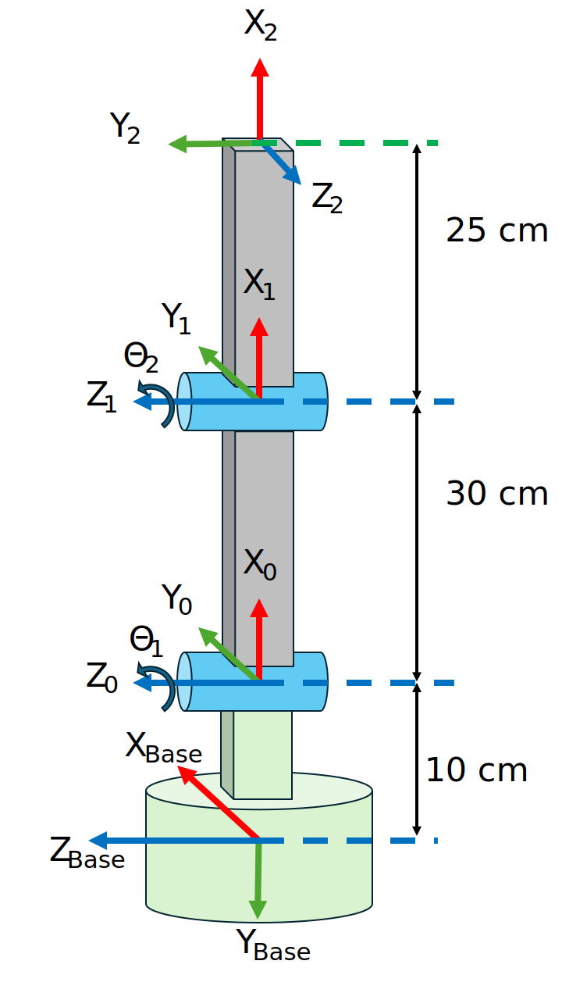
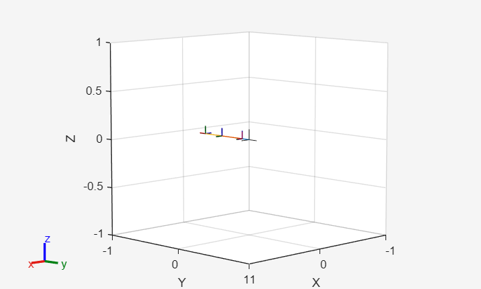

```matlab
clear all 
```
# Modelling with Robotic System Toolbox

This tutorial explains how to set up a robot in the Robotic System Toolbox. 

# General 

The Robotic System Toolbox uses Structures to define the Robot manipulators. 


You can create a rigidBodyTree to fill it with your robot values. Define the DataFormat as column or row for dynamic calculations. 

```matlab
robot = rigidBodyTree("DataFormat","column")
```

```matlabTextOutput
robot = 
  rigidBodyTree with properties:

     NumBodies: 0
        Bodies: {1x0 cell}
          Base: [1x1 rigidBody]
     BodyNames: {1x0 cell}
      BaseName: 'base'
       Gravity: [0 0 0]
    DataFormat: 'column'
    FrameNames: {'base'}

```


We now need to fill this objects fields with the values corresponding to the robot.

# Create a Robot

Let's consider a simple planar robot: 





and its DH parameters:

||||||
| :-: | :-: | :-: | :-: | :-: |
| Link  | a \[m\]  | alpha  | d \[m\]  | theta   |
| 1  | 0.30  | 0  | 0  | 0   |
| 2  | 0.25  | pi/2  | 0  | 0   |


```matlab
        %a      alpha   d       theta
DH_1 = [0.3     0       0       0];
DH_2 = [0.25    pi/2    0       0];
```

additionally we have an translation and rotation from the base to the first joint. This can be represented by the following homogeneous transform matrix: 

 $$ T_{\textrm{B0}} =\left\lbrack \begin{array}{cccc} 0 & 1 & 0 & 0\newline -1 & 0 & 0 & -0\ldotp 1\newline 0 & 0 & 1 & 0\newline 0 & 0 & 0 & 1 \end{array}\right\rbrack $$ 

```matlab

TB0= [  0,  1,  0,  0;
        -1, 0,  0,  -0.1;
        0,  0,  1,  0;
        0,  0,  0,  1 ];
```

first create empty body and joint cell arrays

```matlab
bodies = cell(3,1);
joints = cell(3,1);
```

define the bodies as a rigidBody and assign a name to each body

```matlab
bodies{1} = rigidBody('body_base');
bodies{2} = rigidBody('body_1');
bodies{3} = rigidBody('body_2');
```

define the joints as a rigidBodyJoint, set their name and define if it is a revolute, prismatic or fixed joint.

```matlab
joints{1} = rigidBodyJoint('base_link', 'fixed');
joints{2} = rigidBodyJoint('joint_1', 'revolute');
joints{3} = rigidBodyJoint('joint_2', 'revolute');
```

If one a joint has a limit in terms of viable positions we can set the position limits. Lets consider the first revolute joint to be restricted by $\theta {\;}_{\textrm{Joint}\;1} \in \left\lbrack 0\;,\pi \right\rbrack$ 

```matlab
joints{2}.PositionLimits = [0 , pi];
```

define the transforms for the joints. Add the parameter 'dh' to let the toolbox know you are feeding it data in DH format. You may also pass a homogeneous transform matrix. 


For a revolute joint the system will automatically disregard the "theta" parameter, as theta is the joint action. For prismatic joints the "d" parameter will be disregarded as it is the joint action.

```matlab
setFixedTransform(joints{1}, TB0);
setFixedTransform(joints{2}, DH_1, 'dh');
setFixedTransform(joints{3}, DH_2, 'dh');
```

add the joints to the bodies: 

```matlab
bodies{1}.Joint = joints{1};
bodies{2}.Joint = joints{2};
bodies{3}.Joint = joints{3};
```

finally, add the bodies to the robot structure. 


The first body is connected to the base. 

```matlab
addBody(robot, bodies{1}, "base");
```

The following bodies are connected to their predecessor.


You can manually input their names:

```matlab
addBody(robot, bodies{2}, 'body_base')
```

 or access the previously defined names 

```matlab
addBody(robot, bodies{3}, bodies{2}.Name);
```

To access and change values from the robot joints after adding the bodies to the robot, we can use structure and cell notation. To change the joint limits we can:

```matlab
robot.Bodies{2}.Joint.PositionLimits = [-pi,pi/2];
```

To add offsets for a joint state ("theta" for revolute or "d" for prismatic joints) you can define their home position. These values will be the default for showing the robot.


For this sample robot we will use the "theta" parameter stored at the 4th position of our DH parameters

```matlab
robot.Bodies{2}.Joint.HomePosition = DH_1(4);
robot.Bodies{3}.Joint.HomePosition = DH_2(4);
```

additionally we need to set the direction and magnitude of gravity w.r.t. the base frame:

```matlab
robot.Gravity = [0, 9.81, 0];  
showdetails(robot)
```

```matlabTextOutput
--------------------
Robot: (3 bodies)

 Idx        Body Name       Joint Name       Joint Type        Parent Name(Idx)   Children Name(s)
 ---        ---------       ----------       ----------        ----------------   ----------------
   1        body_base        base_link            fixed                 base(0)   body_1(2)  
   2           body_1          joint_1         revolute            body_base(1)   body_2(3)  
   3           body_2          joint_2         revolute               body_1(2)   
--------------------
```

# Visualize the Robot Structure

To view the robot in MATLAB you can use the show() function, it will show the robot in its home configuration: 

```matlab
show(robot)
```



```matlabTextOutput
ans = 
  Axes (Primary) with properties:

             XLim: [-1 1]
             YLim: [-1 1]
           XScale: 'linear'
           YScale: 'linear'
    GridLineStyle: '-'
         Position: [0.1300 0.1100 0.7750 0.8150]
            Units: 'normalized'

  Show all properties

```


To view the robot in another configuration: 

```matlab
myconfig_2 = [0;-pi/2];  %column vector because we defined the robot as: robot = rigidBodyTree("DataFormat","column")
show(robot, myconfig_2) %we only have two joints

%This configuration is the one needed for the JointStatesToRviz
myconfig = [0,-pi/2,0,-pi/2,0,0]; 

```
# Visualize in Rviz

In this tutorial can use the ROS2 visualization tool Rviz. Once  **Rviz is running** you can send it a desired configuration like: 


you can specify the robot with the extension 'ur5e' ( default is ur3e). 

```matlab
JointStatesToRviz(myconfig, 'ur5e'); 
```

