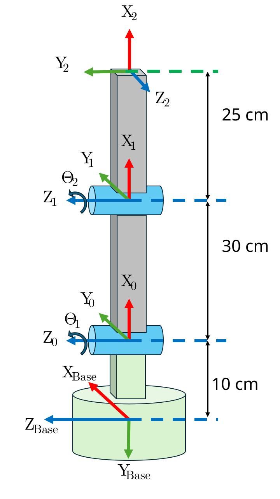
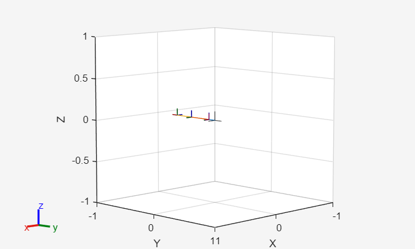

```matlab
clear all 
```
# Modelatge amb la Robotic System Toolbox

Aquest tutorial explica com configurar un robot a la Robotic System Toolbox. 

# General 

La Robotic System Toolbox utilitza estructures per definir els manipuladors robòtics. 


Pots crear un rigidBodyTree per omplir-lo amb els valors del teu robot. Defineix el DataFormat com a column o row per als càlculs dinàmics. 

```matlab
robot = rigidBodyTree("DataFormat","column")
```

```matlabTextOutput
robot = 
  rigidBodyTree with properties:

     NumBodies: 0
        Bodies: {1x0 cell}
          Base: [1x1 rigidBody]
     BodyNames: {1x0 cell}
      BaseName: 'base'
       Gravity: [0 0 0]
    DataFormat: 'column'
    FrameNames: {'base'}

```


Ara hem d’omplir els camps d’aquest objecte amb els valors corresponents al robot.

# Crear un robot

Considerem un robot planar simple: 





i els seus paràmetres DH:

||||||
| :-: | :-: | :-: | :-: | :-: |
| Eslabó  | a $begin:math:display$m$end:math:display$  | alpha  | d $begin:math:display$m$end:math:display$  | theta   |
| 1  | 0.30  | 0  | 0  | 0   |
| 2  | 0.25  | pi/2  | 0  | 0   |


```matlab
        %a      alpha   d       theta
DH_1 = [0.3     0       0       0];
DH_2 = [0.25    pi/2    0       0];
```

addicionalment, tenim una translació i una rotació de la base a la primera articulació. Això es pot representar amb la matriu de transformació homogènia següent: 

 $$ T_{\textrm{B0}} =\left\lbrack \begin{array}{cccc} 0 & 1 & 0 & 0\newline -1 & 0 & 0 & -0\ldotp 1\newline 0 & 0 & 1 & 0\newline 0 & 0 & 0 & 1 \end{array}\right\rbrack $$ 

```matlab

TB0= [  0,  1,  0,  0;
        -1, 0,  0,  -0.1;
        0,  0,  1,  0;
        0,  0,  0,  1 ];
```

primer crea cell arrays buits de cossos i articulacions

```matlab
bodies = cell(3,1);
joints = cell(3,1);
```

defineix els cossos com a rigidBody i assigna un nom a cada cos

```matlab
bodies{1} = rigidBody('body_base');
bodies{2} = rigidBody('body_1');
bodies{3} = rigidBody('body_2');
```

defineix les articulacions com a rigidBodyJoint, estableix-ne el nom i defineix si són una articulació revolute, prismatic o fixed.

```matlab
joints{1} = rigidBodyJoint('base_link', 'fixed');
joints{2} = rigidBodyJoint('joint_1', 'revolute');
joints{3} = rigidBodyJoint('joint_2', 'revolute');
```

Si una articulació té un límit en termes de posicions viables, podem establir els límits de posició. Considerem que la primera articulació rotacional està restringida per $\theta {\;}_{\textrm{Joint}\;1} \in \left\lbrack 0\;,\pi \right\rbrack$ 

```matlab
joints{2}.PositionLimits = [0 , pi];
```

defineix les transformacions per a les articulacions. Afegeix el paràmetre 'dh' perquè la toolbox sàpiga que li estàs introduint dades en format DH. També pots passar-hi una matriu de transformació homogènia. 


Per a una articulació rotacional, el sistema ignorarà automàticament el paràmetre "theta", ja que theta és l’acció de l’articulació. Per a les articulacions prismàtiques, s’ignorarà el paràmetre "d", ja que és l’acció de l’articulació.

```matlab
setFixedTransform(joints{1}, TB0);
setFixedTransform(joints{2}, DH_1, 'dh');
setFixedTransform(joints{3}, DH_2, 'dh');
```

afegeix les articulacions als cossos: 

```matlab
bodies{1}.Joint = joints{1};
bodies{2}.Joint = joints{2};
bodies{3}.Joint = joints{3};
```

finalment, afegeix els cossos a l’estructura del robot. 


El primer cos està connectat a la base. 

```matlab
addBody(robot, bodies{1}, "base");
```

Els cossos següents estan connectats al seu predecessor.


Pots introduir manualment els seus noms:

```matlab
addBody(robot, bodies{2}, 'body_base')
```

 o accedir als noms definits prèviament 

```matlab
addBody(robot, bodies{3}, bodies{2}.Name);
```

Per accedir i canviar valors de les articulacions del robot després d’afegir els cossos al robot, podem utilitzar notació d’estructura i de cell. Per canviar els límits de l’articulació podem fer:

```matlab
robot.Bodies{2}.Joint.PositionLimits = [-pi,pi/2];
```

Per afegir desplaçaments per a un estat d’articulació ("theta" per a articulacions rotacionals o "d" per a prismàtiques), pots definir-ne la posició inicial. Aquests valors seran els valors per defecte per mostrar el robot.


Per a aquest robot d’exemple utilitzarem el paràmetre "theta" guardat a la 4a posició dels nostres paràmetres DH.

```matlab
robot.Bodies{2}.Joint.HomePosition = DH_1(4);
robot.Bodies{3}.Joint.HomePosition = DH_2(4);
```

addicionalment, hem d’establir la direcció i la magnitud de la gravetat respecte del sistema de la base:

```matlab
robot.Gravity = [0, 9.81, 0];  
showdetails(robot)
```

```matlabTextOutput
--------------------
Robot: (3 bodies)

 Idx        Body Name       Joint Name       Joint Type        Parent Name(Idx)   Children Name(s)
 ---        ---------       ----------       ----------        ----------------   ----------------
   1        body_base        base_link            fixed                 base(0)   body_1(2)  
   2           body_1          joint_1         revolute            body_base(1)   body_2(3)  
   3           body_2          joint_2         revolute               body_1(2)   
--------------------
```

# Visualitzar l’estructura del robot

Per veure el robot a MATLAB pots utilitzar la funció show(); mostrarà el robot en la seva configuració inicial: 

```matlab
show(robot)
```



```matlabTextOutput
ans = 
  Axes (Primary) with properties:

             XLim: [-1 1]
             YLim: [-1 1]
           XScale: 'linear'
           YScale: 'linear'
    GridLineStyle: '-'
         Position: [0.1300 0.1100 0.7750 0.8150]
            Units: 'normalized'

  Show all properties

```


Per veure el robot en una altra configuració: 

```matlab
myconfig_2 = [0;-pi/2];  %column vector because we defined the robot as: robot = rigidBodyTree("DataFormat","column")
show(robot, myconfig_2) %we only have two joints

%This configuration is the one needed for the JointStatesToRviz
myconfig = [0,-pi/2,0,-pi/2,0,0]; 

```
# Visualitzar a Rviz

En aquest tutorial pots utilitzar l'eina de visualització de ROS2 Rviz. 

Per arrancar Rviz:

```matlab
StartTutorialApplication('Rviz','model','ur3e'); 
%StartTutorialApplication('Rviz','model','ur3e', 'docker',false); %use this
%when using a native ROS workspace
```

Pots especificar qualsevol model UR, per exemple 'UR5e' (el model per defecte és UR3e).

Un cop **Rviz està en execució**, pots enviar-li una configuració desitjada com: 


pots especificar el robot amb l’extensió 'ur5e' (per defecte és ur3e). 

```matlab
myconfig = [0,-pi/2,0,-pi/2,0,0]; 
JointStatesToRviz(myconfig, 'ur5e'); 
```