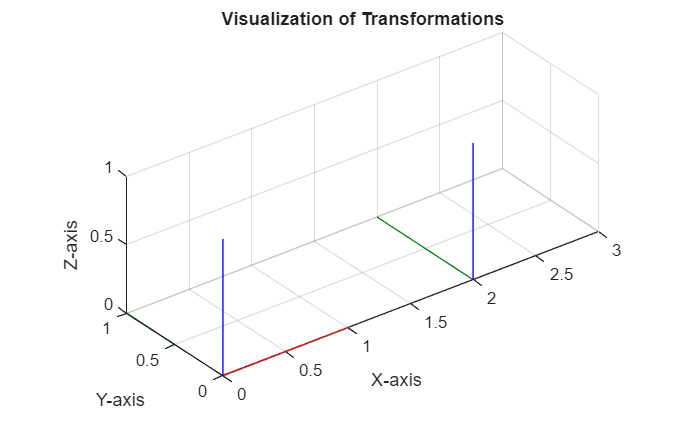
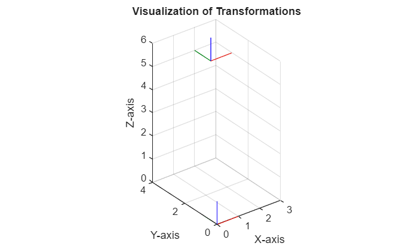
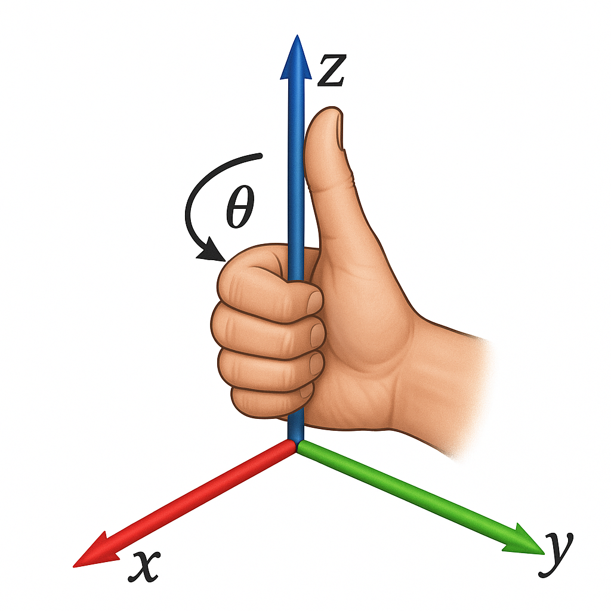
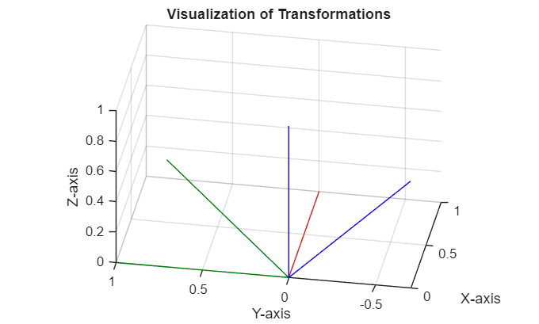
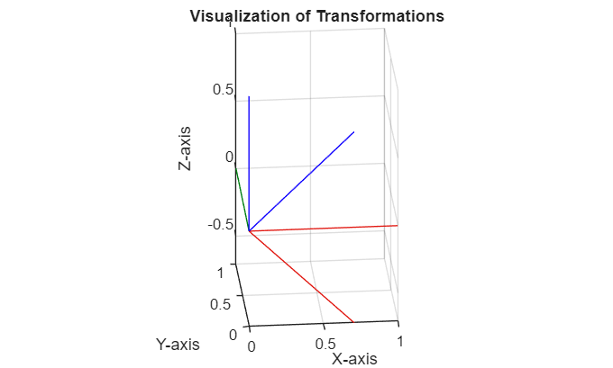
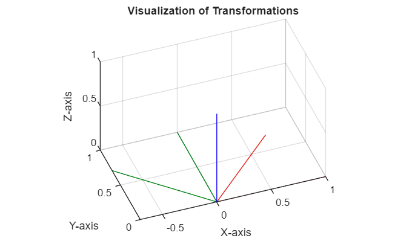
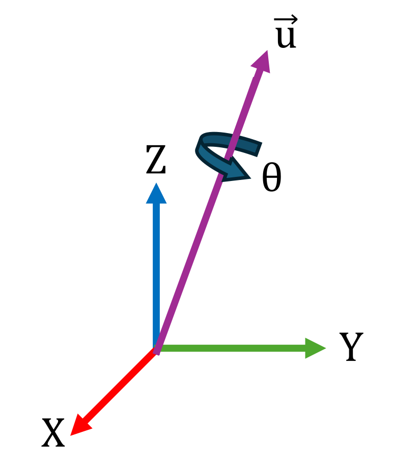

# Basics of Translation and Rotation
# Introduction

In this section you will learn how to represent translations and rotations in a 3D space. 


After understanding the basic ideas of translation and rotations, we will combine them into homogeneous transform matrices, which will be the basis for the next tutorial. 

# Translation

Translations are represented by a vector of the same dimensions as the task space ${\mathbb{R}}^n \to {\mathbb{R}}^n$ 


A translation along x\-axis can be represented by $\left\lbrack \begin{array}{c} \Delta \;x\newline 0\newline 0 \end{array}\right\rbrack$. Note that the values are w.r.t. (with respect to) the source frame. 

```matlab
visualizeTranslation([2,0,0]);
```



For a translation along all axis the vector will be $\left\lbrack \begin{array}{c} \Delta \;x\newline \Delta \;y\newline \Delta \;z \end{array}\right\rbrack$. Note that the values are w.r.t. (with respect to) the source frame. 

```matlab
visualizeTranslation([2,3,5]);
```




With the following code, you can create a new frame and make its location known. The function `transl()` defines a new coordinate frame  whose origin is offset (translated) from its parent frame (starting point) the provided distances. The `TargetFrameBroadcaster` then publishes this new frame.

```matlab
x_trans=0.34
```

```matlabTextOutput
x_trans = 0.3400
```

```matlab
y_trans=0.02
```

```matlabTextOutput
y_trans = 0.0200
```

```matlab
z_trans=0.62
```

```matlabTextOutput
z_trans = 0.6200
```

```matlab

TargetFrameBroadcaster(transl([x_trans,y_trans,z_trans]),'my_frame')
```

```matlabTextOutput
Published static transform: world → my_frame
```

## Obtaining the translation vector

We can compute the translation vector by subtracting the coordinate frame origins as: 

 $$ \textrm{translation}\;\textrm{vector}=\textrm{target}\;\textrm{frame}-\textrm{source}\;\textrm{frame}\; $$ 

for the example above: 

 $$ \left\lbrack \begin{array}{c} t_x \newline t_y \newline t_z  \end{array}\right\rbrack =\left\lbrack \begin{array}{c} 2\newline 3\newline 5 \end{array}\right\rbrack -\left\lbrack \begin{array}{c} 0\newline 0\newline 0 \end{array}\right\rbrack =\left\lbrack \begin{array}{c} 2\newline 3\newline 5 \end{array}\right\rbrack $$ 
# Rotations

Rotations can be represented in a few different ways. We are going to work with a matrix representation. Where $R\in {\mathbb{R}}^{3x3}$ 


The angle of rotation for a counter clockwise movement is positive (use right hand rule) 




## How to define a simple rotation

We can use prebuild functions to get these matrices for a given rotation. 

```matlab
syms alpha beta gamma 
Rx=rotx(alpha)
```
Rx = 

  $$ \displaystyle \left(\begin{array}{ccc} 1 & 0 & 0\newline 0 & \cos \left(\alpha \right) & -\sin \left(\alpha \right)\newline 0 & \sin \left(\alpha \right) & \cos \left(\alpha \right) \end{array}\right) $$ 
 

```matlab
visualizeRotation(double(subs(Rx, alpha, pi/4)),'x') %alpha = 45° = pi/4
```



```matlab
Ry=roty(beta)
```
Ry = 

  $$ \displaystyle \left(\begin{array}{ccc} \cos \left(\beta \right) & 0 & \sin \left(\beta \right)\newline 0 & 1 & 0\newline -\sin \left(\beta \right) & 0 & \cos \left(\beta \right) \end{array}\right) $$ 
 

```matlab
visualizeRotation(double(subs(Ry, beta, pi/4)),'y') %beta = 45° = pi/4
```



```matlab
Rz=rotz(gamma)
```
Rz = 

  $$ \displaystyle \left(\begin{array}{ccc} \cos \left(\gamma \right) & -\sin \left(\gamma \right) & 0\newline \sin \left(\gamma \right) & \cos \left(\gamma \right) & 0\newline 0 & 0 & 1 \end{array}\right) $$ 
 

```matlab
visualizeRotation(double(subs(Rz, gamma, pi/4)), 'z') %gamma = 45° = pi/4
```



Multiplying these rotations with one another, gives us complex rotations in 3D space. 


The order of individual rotations is important for the final matrix, as each consecutive rotation relates to the new coordinate frame. 

```matlab
clear all; 
```
## Rotation Notation

In robotics we often need to switch between different ways of describing a 3\-D rotation. Instead of giving a full matrix, we can represent any rotation by a set of angles and a specific order. 


The main representations are:

## **Euler Angles (ZYZ)**

Also called **moving\-axis** Euler angles (ϕ,  θ,  ψ), as the rotations revolve around the new updated axis:

1.  Rotate by ϕ about the original z.
2. Rotate by θ about the new y.
3. Rotate by ψ about the newest z.
```matlab
syms phi theta psi
R = rotz(phi) * roty(theta) * rotz(psi)
```
R = 

  $$ \displaystyle \left(\begin{array}{ccc} \cos \left(\phi \right)\,\cos \left(\psi \right)\,\cos \left(\theta \right)-\sin \left(\phi \right)\,\sin \left(\psi \right) & -\cos \left(\psi \right)\,\sin \left(\phi \right)-\cos \left(\phi \right)\,\cos \left(\theta \right)\,\sin \left(\psi \right) & \cos \left(\phi \right)\,\sin \left(\theta \right)\newline \cos \left(\phi \right)\,\sin \left(\psi \right)+\cos \left(\psi \right)\,\cos \left(\theta \right)\,\sin \left(\phi \right) & \cos \left(\phi \right)\,\cos \left(\psi \right)-\cos \left(\theta \right)\,\sin \left(\phi \right)\,\sin \left(\psi \right) & \sin \left(\phi \right)\,\sin \left(\theta \right)\newline -\cos \left(\psi \right)\,\sin \left(\theta \right) & \sin \left(\psi \right)\,\sin \left(\theta \right) & \cos \left(\theta \right) \end{array}\right) $$ 
 

We can also use the build\-in functions for numerical values:

```matlab
Angles = [phi, theta, psi]; 
Angles_num = double(subs(Angles, [phi, theta, psi], [pi/2, pi/3, pi/4]));
R_func = eul2rotm(Angles_num, "ZYZ")
```

```matlabTextOutput
R_func = 3x3
   -0.7071   -0.7071    0.0000
    0.3536   -0.3536    0.8660
   -0.6124    0.6124    0.5000

```

### Compute Euler Angles from Rotation Matrix

For the inverse of this problem (computing the angles from a rotation matrix), we can solve it analytically: 

 $$ R=\left\lbrack \begin{array}{ccc} r_{11}  & r_{12}  & r_{13} \newline r_{21}  & r_{22}  & r_{23} \newline r_{31}  & r_{32}  & r_{33}  \end{array}\right\rbrack $$ 

 $$ \phi =\textrm{atan2}\left(r_{23} ,\;r_{13} \right)=\textrm{atan2}\left(-r_{23} ,\;-r_{13} \right) $$ 

 $$ \theta =\textrm{atan2}\left(\sqrt{\;r_{13}^2 +r_{23}^2 },r_{33} \right) $$ 

 $$ \psi =\textrm{atan2}\left(r_{32} ,\;{-r}_{31} \right)=\textrm{atan2}\left(-r_{32} ,\;r_{31} \right) $$ 


We can also use the build\-in function rotm2eul(R, sequence) or tform2eul(T, sequence) for homogeneous transforms. 


For the example values: 

 $$ \begin{array}{l} \phi =~0\newline \theta =\frac{\pi }{2}\newline \psi =\frac{\pi }{3} \end{array} $$ 

substituting $\phi ,~\theta ~and~\psi$: 

```matlab
R_subs = double(subs(R, [phi, theta, psi], [0, pi/2, pi/3]));  
ZYZ_angles = rotm2eul(R_subs, "ZYZ")
```

```matlabTextOutput
ZYZ_angles = 1x3
   -3.1416   -1.5708   -2.0944

```


 *Note that a same rotation matrix can be obtained with different combination of euler angles. This is why, the obtained angles are not equal to the ones computed.* 

```matlab
clear all; 
```
## Euler Angles (RPY/ZYX)

Also called **roll\-pitch\-yaw** (fixed axes) or ZYX Euler angles (roll,  pitch,  yaw). Here the angles correspond to a fixed reference frame where: 


 $\theta_r ~=~Roll~~\Rightarrow$ Rotation around X\-axis


 $\theta_p ~=~Pitch~\Rightarrow$ Rotation around Y\-axis


 $\theta_y ~=~Yaw~~\Rightarrow$ Rotation around Z\-axis


This is achieved by applying the angles in the following order:

1.  Rotate by $\theta_y$ about the original Z.
2. Rotate by $\theta_p$ about the original Y.
3. Rotate by $\theta_r$ about the original X.
```matlab
syms roll pitch yaw 
R = rotz(yaw) * roty(pitch) * rotx(roll)
```
R = 

  $$ \displaystyle \left(\begin{array}{ccc} \cos \left(\textrm{pitch}\right)\,\cos \left(\textrm{yaw}\right) & \cos \left(\textrm{yaw}\right)\,\sin \left(\textrm{pitch}\right)\,\sin \left(\textrm{roll}\right)-\cos \left(\textrm{roll}\right)\,\sin \left(\textrm{yaw}\right) & \sin \left(\textrm{roll}\right)\,\sin \left(\textrm{yaw}\right)+\cos \left(\textrm{roll}\right)\,\cos \left(\textrm{yaw}\right)\,\sin \left(\textrm{pitch}\right)\newline \cos \left(\textrm{pitch}\right)\,\sin \left(\textrm{yaw}\right) & \cos \left(\textrm{roll}\right)\,\cos \left(\textrm{yaw}\right)+\sin \left(\textrm{pitch}\right)\,\sin \left(\textrm{roll}\right)\,\sin \left(\textrm{yaw}\right) & \cos \left(\textrm{roll}\right)\,\sin \left(\textrm{pitch}\right)\,\sin \left(\textrm{yaw}\right)-\cos \left(\textrm{yaw}\right)\,\sin \left(\textrm{roll}\right)\newline -\sin \left(\textrm{pitch}\right) & \cos \left(\textrm{pitch}\right)\,\sin \left(\textrm{roll}\right) & \cos \left(\textrm{pitch}\right)\,\cos \left(\textrm{roll}\right) \end{array}\right) $$ 
 

We can also use the build\-in functions for numerical values:

```matlab
RPY = [roll, pitch, yaw];
RPY_num = double(subs(RPY, [roll, pitch, yaw], [pi/2, pi/3, pi]));
R_num = eul2rotm(RPY_num, "ZYX")
```

```matlabTextOutput
R_num = 3x3
    0.0000    1.0000    0.0000
    0.5000    0.0000   -0.8660
   -0.8660    0.0000   -0.5000

```

### Compute RPY Angles from Rotation Matrix

For the inverse of this problem (computing the angles from a rotation matrix), we can solve it analytically: 

 $$ R=\left\lbrack \begin{array}{ccc} r_{11}  & r_{12}  & r_{13} \newline r_{21}  & r_{22}  & r_{23} \newline r_{31}  & r_{32}  & r_{33}  \end{array}\right\rbrack $$ 

 $$ \theta_r =\textrm{atan2}\left(r_{21} ,\;r_{11} \right)=\textrm{atan2}\left(-r_{21} ,\;-r_{11} \right) $$ 

 $$ \theta_p =\textrm{atan2}\left(-r_{31} ,\;\sqrt{\;r_{32}^2 +r_{33}^2 }\right)=\textrm{atan2}\left(-r_{31} ,\;-\sqrt{\;r_{32}^2 +r_{33}^2 }\right) $$ 

 $$ \theta_y =\textrm{atan2}\left(r_{32} ,\;r_{33} \right)=\textrm{atan2}\left(-r_{32} ,-r_{33} \right) $$ 


We can also use the build\-in function rotm2eul(R, sequence) or tform2eul(T,sequence) for homogeneous transforms.  


For the example values: 

 $$ \begin{array}{l} \theta_r =~0\newline \theta_p =\frac{\pi }{2}\newline \theta_y =\frac{\pi }{3} \end{array} $$ 

substituting $\phi ,~\theta ~and~\psi$: 

```matlab
R_subs = double(subs(R, [roll, pitch, yaw], [0, pi/2, pi/3])); 
RPY_angles = rotm2eul(R_subs, "ZYX")
```

```matlabTextOutput
RPY_angles = 1x3
         0    1.5708   -1.0472

```


 *Note that a same rotation matrix can be obtained with different combination of euler angles. This is why, the obtained angles are not equal to the ones computed.* 

```matlab
clear all; 
```
## Quaternions

Quaternions provide a four\-parameter, singularity\-free way to encode any 3D rotation.





A unit quaternion is represented by $q=\left\lbrack w\;,x,y,z\right\rbrack$ 


with 

 $$ \begin{array}{l} w=\cos \left(\frac{\theta }{2}\right)\newline x=\sin \left(\frac{\theta }{2}\right)\cdot u_x \newline y=\sin \left(\frac{\theta }{2}\right)\cdot u_y \newline z=\sin \left(\frac{\theta }{2}\right)\cdot u_z  \end{array} $$ 

The Rotation matrix can be constructed as: 

 $$ R=\left\lbrack \begin{array}{ccc} 2\cdot \;\left(w^2 +x^2 \right)-1 & \;\;\;\;\;2\cdot \;\left(x\cdot \;y-w\cdot z\right) & \;\;\;\;\;2\cdot \;\left(x\cdot z-w\cdot y\right)\newline 2\cdot \;\left(x\cdot \;y-w\cdot z\right) & \;\;\;\;\;2\cdot \;\left(w^2 +y^2 \right)-1 & \;\;\;\;\;2\cdot \;\left(y\cdot z-w\cdot x\right)\newline 2\cdot \;\left(x\cdot z-w\cdot y\right) & \;\;\;\;\;2\cdot \;\left(y\cdot z-w\cdot x\right) & \;\;\;\;\;2\cdot \;\left(w^2 +z^2 \right)-1 \end{array}\right\rbrack $$ 

We can use build\-in functions to compute the Rotation Matrix from Quaternions. For example a quaternion describing a rotation around x with 90° would be: 

 $$ \theta =\frac{\pi }{2}=90° $$ 

 $$ \vec{\;u} =\vec{\;x} =\left\lbrack \begin{array}{c} 1\newline 0\newline 0 \end{array}\right\rbrack $$ 
```matlab
q = [cos(pi/4)    1*sin(pi/4)    0    0];
RotxMat=rotx(pi/2)
```

```matlabTextOutput
RotxMat = 3x3
1.0000         0         0
         0    0.0000   -1.0000
         0    1.0000    0.0000

```

```matlab
R = quat2rotm(q)
```

```matlabTextOutput
R = 3x3
1.0000         0         0
         0    0.0000   -1.0000
         0    1.0000    0.0000

```

### Compute Quaternions from Rotation Matrix

For the inverse of this problem (computing the angles from a rotation matrix), we can solve it analytically: 

 $$ R=\left\lbrack \begin{array}{ccc} r_{11}  & r_{12}  & r_{13} \newline r_{21}  & r_{22}  & r_{23} \newline r_{31}  & r_{32}  & r_{33}  \end{array}\right\rbrack $$ 

 $$ w=\frac{1}{2}\cdot \sqrt{\;r_{11} +r_{22} +r_{33} +1} $$ 

 $$ x=\frac{r_{32} -r_{23} }{4\cdot \;w} $$ 

 $$ y=\frac{r_{13} -r_{31} }{4\cdot \;w} $$ 

 $$ z=\frac{r_{21} -r_{12} }{4\cdot \;w} $$ 
### **Special Cases**

The primary issue is encountered when the Trace of the matrix (sum of diagonal elements) is less or equal than 0. If so, the computations need to be adjusted, otherwise you might end up with imaginary numbers for w or with a division by 0 while calculating  x/y/z. 


To avoid this, you must first identify the greatest diagonal element and then calculate a scaling factor (S)

 $$ {\mathit{\mathbf{r}}}_{11} >{\mathit{\mathbf{r}}}_{22} \;\;\textrm{and}\;{\mathit{\mathbf{r}}}_{11} >{\mathit{\mathbf{r}}}_{33} $$ 

 $$ S=2\cdot \sqrt{1+\;r_{11} -r_{22} -r_{33} }=4\cdot x $$ 

 $$ w=\frac{r_{32} -r_{23} }{S} $$ 

 $$ x=\frac{1}{2}\cdot \sqrt{1+\;r_{11} -r_{22} -r_{33} }=0\ldotp 25\cdot S $$ 

 $$ y=\frac{r_{12} +r_{21} }{S}\;\; $$ 

 $$ z=\frac{r_{13} +r_{31} }{S}\;\; $$ 

 $$ {\mathit{\mathbf{r}}}_{22} >{\mathit{\mathbf{r}}}_{11} \;\;\textrm{and}\;{\mathit{\mathbf{r}}}_{22} >{\mathit{\mathbf{r}}}_{33} $$ 

 $$ S=2\cdot \sqrt{1+\;r_{22} -r_{11} -r_{33} }=4\cdot y $$ 

 $$ w=\frac{r_{13} -r_{31} }{S} $$ 

 $$ x=\frac{r_{12} +r_{21} }{S} $$ 

 $$ y=0\ldotp 25\cdot S $$ 

 $$ z=\frac{r_{23} +r_{32} }{S}\;\; $$ 

 $$ {\mathit{\mathbf{r}}}_{33} >{\mathit{\mathbf{r}}}_{11} \;\;\textrm{and}\;{\mathit{\mathbf{r}}}_{33} >{\mathit{\mathbf{r}}}_{22} $$ 

 $$ S=2\cdot \sqrt{1+\;r_{33} -r_{11} -r_{22} }=4\cdot z $$ 

 $$ w=\frac{r_{21} -r_{12} }{S} $$ 

 $$ x=\frac{r_{13} +r_{31} }{S} $$ 

 $$ y=\frac{r_{23} +r_{32} }{S} $$ 

 $$ z=0\ldotp 25\cdot S\;\; $$ 
### Toolbox implementation

We can also use the build\-in function rotm2quat(R) to compute the Quaternions from a rotation matrix

```matlab
q=rotm2quat(R)
```

```matlabTextOutput
q = 1x4
    0.7071    0.7071         0         0

```

```matlab
clear all; 
```
# Homogeneous Transformations

Homogeneous Transformations allow us to encode a translation and rotation in a single matrix of the form: 

 $$ T=\left\lbrack \begin{array}{ccccc}  &  &  & | & \newline  & R\in {\mathbb{R}}^{3\textrm{x3}}  &  & | & t\in {\mathbb{R}}^{3\textrm{x1}} \newline  &  &  & | & \newline -- & -- & -- & + & --\newline 0 & 0 & 0 & | & 1 \end{array}\right\rbrack =\left\lbrack \begin{array}{cccc} r_{11}  & r_{12}  & r_{13}  & \Delta \;x\newline r_{21}  & r_{22}  & r_{23}  & \Delta \;y\newline r_{13}  & r_{32}  & r_{33}  & \Delta \;z\newline 0 & 0 & 0 & 1 \end{array}\right\rbrack $$ 
### Matlab implementation

Here are some ways to create them:

```matlab
syms theta dx dy dz real
T = eye(4); %create a 4x4 identity matrix
T=sym(T) %Convert matrix to symbolic 
```
T = 

  $$ \displaystyle \left(\begin{array}{cccc} 1 & 0 & 0 & 0\newline 0 & 1 & 0 & 0\newline 0 & 0 & 1 & 0\newline 0 & 0 & 0 & 1 \end{array}\right) $$ 
 

```matlab
T(1:3,1:3) = rotx(theta) %fill rotation part 
```
T = 

  $$ \displaystyle \left(\begin{array}{cccc} 1 & 0 & 0 & 0\newline 0 & \cos \left(\theta \right) & -\sin \left(\theta \right) & 0\newline 0 & \sin \left(\theta \right) & \cos \left(\theta \right) & 0\newline 0 & 0 & 0 & 1 \end{array}\right) $$ 
 

```matlab
translation_vector = [dx, dy, dz]' 
```
translation_vector = 

  $$ \displaystyle \left(\begin{array}{c} \textrm{dx}\newline \textrm{dy}\newline \textrm{dz} \end{array}\right) $$ 
 

```matlab
T(1:3,4) = translation_vector %fill translation part
```
T = 

  $$ \displaystyle \left(\begin{array}{cccc} 1 & 0 & 0 & \textrm{dx}\newline 0 & \cos \left(\theta \right) & -\sin \left(\theta \right) & \textrm{dy}\newline 0 & \sin \left(\theta \right) & \cos \left(\theta \right) & \textrm{dz}\newline 0 & 0 & 0 & 1 \end{array}\right) $$ 
 


We can also use functions to create homogeneous transform matrices:

```matlab
T_Rotx = trotx(theta)
```
T_Rotx = 

  $$ \displaystyle \left(\begin{array}{cccc} 1 & 0 & 0 & 0\newline 0 & \cos \left(\theta \right) & -\sin \left(\theta \right) & 0\newline 0 & \sin \left(\theta \right) & \cos \left(\theta \right) & 0\newline 0 & 0 & 0 & 1 \end{array}\right) $$ 
 

```matlab
T_Roty = troty(theta)
```
T_Roty = 

  $$ \displaystyle \left(\begin{array}{cccc} \cos \left(\theta \right) & 0 & \sin \left(\theta \right) & 0\newline 0 & 1 & 0 & 0\newline -\sin \left(\theta \right) & 0 & \cos \left(\theta \right) & 0\newline 0 & 0 & 0 & 1 \end{array}\right) $$ 
 

```matlab
T_Rotz = trotz(theta)
```
T_Rotz = 

  $$ \displaystyle \left(\begin{array}{cccc} \cos \left(\theta \right) & -\sin \left(\theta \right) & 0 & 0\newline \sin \left(\theta \right) & \cos \left(\theta \right) & 0 & 0\newline 0 & 0 & 1 & 0\newline 0 & 0 & 0 & 1 \end{array}\right) $$ 
 

```matlab
T_trans = transl([dx,dy,dz])
```
T_trans = 

  $$ \displaystyle \left(\begin{array}{cccc} 1 & 0 & 0 & \textrm{dx}\newline 0 & 1 & 0 & \textrm{dy}\newline 0 & 0 & 1 & \textrm{dz}\newline 0 & 0 & 0 & 1 \end{array}\right) $$ 
 

```matlab
T_combined = T_trans * T_Rotx %note the order of multiplicands 
```
T_combined = 

  $$ \displaystyle \left(\begin{array}{cccc} 1 & 0 & 0 & \textrm{dx}\newline 0 & \cos \left(\theta \right) & -\sin \left(\theta \right) & \textrm{dy}\newline 0 & \sin \left(\theta \right) & \cos \left(\theta \right) & \textrm{dz}\newline 0 & 0 & 0 & 1 \end{array}\right) $$ 
 

