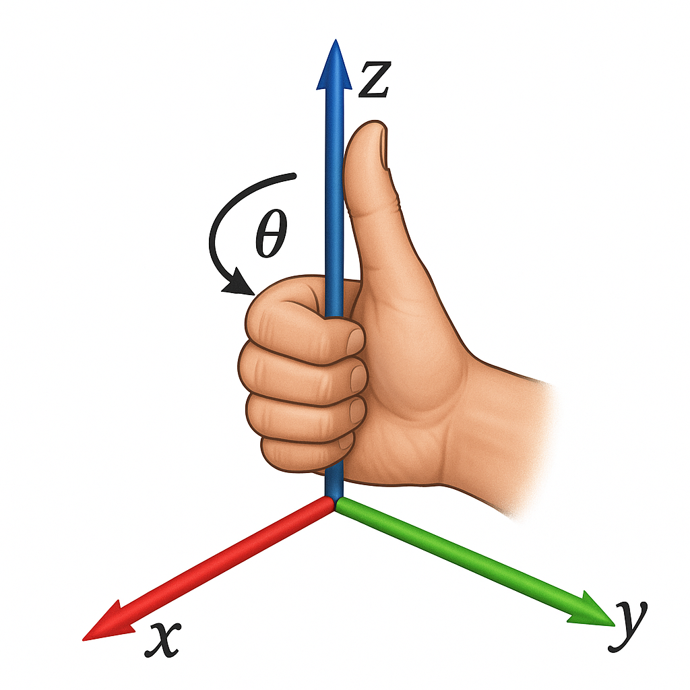

# Conceptes bàsics de translació i rotació
# Introducció

En aquesta secció aprendràs com representar translacions i rotacions en un espai 3D. 


Després d’entendre les idees bàsiques de translació i rotació, les combinarem en matrius de transformació homogènia, que seran la base del tutorial següent. 

# Translació

Les translacions es representen mitjançant un vector de les mateixes dimensions que l’espai de treball ${\mathbb{R}}^n \to {\mathbb{R}}^n$ 


Una translació al llarg de l’eix x es pot representar amb $\left\lbrack \begin{array}{c} \Delta \;x\newline 0\newline 0 \end{array}\right\rbrack$. Tingues en compte que els valors són respecte de (with respect to) el sistema d’origen. 

```matlab
visualizeTranslation([2,0,0]);
```


Per a una translació al llarg de tots els eixos, el vector serà $\left\lbrack \begin{array}{c} \Delta \;x\newline \Delta \;y\newline \Delta \;z \end{array}\right\rbrack$. Tingues en compte que els valors són respecte de (with respect to) el sistema d’origen. 

```matlab
visualizeTranslation([2,3,5]);
```


Amb el codi següent, pots crear un nou sistema de coordenades i fer-ne coneguda la ubicació. La funció `transl()` defineix un nou sistema de coordenades l’origen del qual està desplaçat (traduït) respecte del seu sistema pare (punt inicial) les distàncies proporcionades. Després, `TargetFrameBroadcaster` publica aquest nou sistema. Fixa valors entre \-1 i 1.

```matlab
x_trans=0.34
```

```matlabTextOutput
x_trans = 0.4400
```

```matlab
y_trans=0.02
```

```matlabTextOutput
y_trans = 0.0200
```

```matlab
z_trans=0.62
```

```matlabTextOutput
z_trans = 0.6200
```

```matlab

TargetFrameBroadcaster(transl([x_trans,y_trans,z_trans]),'my_frame')
```

```matlabTextOutput
TargetFrameBroadcaster is not found in the current folder or on the MATLAB path, but exists in:
    /home/janrosell/git-projects/from-code-to-robot/from-code-to-robot/robotics/Ros/Functions

Change the MATLAB current folder or add its folder to the MATLAB path.
```

## Obtenció del vector de translació

Podem calcular el vector de translació restant els orígens dels sistemes de coordenades com: 

 $$ \textrm{vector}\;\textrm{de}\;\textrm{translació}=\textrm{sistema}\;\textrm{objectiu}-\textrm{sistema}\;\textrm{origen}\; $$ 

per a l’exemple anterior: 

 $$ \left\lbrack \begin{array}{c} t_x \newline t_y \newline t_z  \end{array}\right\rbrack =\left\lbrack \begin{array}{c} 2\newline 3\newline 5 \end{array}\right\rbrack -\left\lbrack \begin{array}{c} 0\newline 0\newline 0 \end{array}\right\rbrack =\left\lbrack \begin{array}{c} 2\newline 3\newline 5 \end{array}\right\rbrack $$ 
# Rotacions

Les rotacions es poden representar de diverses maneres. Treballarem amb una representació matricial, on $R\in {\mathbb{R}}^{3x3}$ 


L’angle de rotació per a un moviment antihorari és positiu (utilitza la regla de la mà dreta). 




## Com definir una rotació simple

Podem utilitzar funcions predefinides per obtenir aquestes matrius per a una rotació donada. 

```matlab
syms alpha beta gamma 
Rx=rotx(alpha)
```
Rx = 

  $$ \displaystyle \left(\begin{array}{ccc} 1 & 0 & 0\newline 0 & \cos \left(\alpha \right) & -\sin \left(\alpha \right)\newline 0 & \sin \left(\alpha \right) & \cos \left(\alpha \right) \end{array}\right) $$ 
 

```matlab
visualizeRotation(double(subs(Rx, alpha, pi/4)),'x') %alpha = 45° = pi/4
```


```matlab
Ry=roty(beta)
```
Ry = 

  $$ \displaystyle \left(\begin{array}{ccc} \cos \left(\beta \right) & 0 & \sin \left(\beta \right)\newline 0 & 1 & 0\newline -\sin \left(\beta \right) & 0 & \cos \left(\beta \right) \end{array}\right) $$ 
 

```matlab
visualizeRotation(double(subs(Ry, beta, pi/4)),'y') %beta = 45° = pi/4
```


```matlab
Rz=rotz(gamma)
```
Rz = 

  $$ \displaystyle \left(\begin{array}{ccc} \cos \left(\gamma \right) & -\sin \left(\gamma \right) & 0\newline \sin \left(\gamma \right) & \cos \left(\gamma \right) & 0\newline 0 & 0 & 1 \end{array}\right) $$ 
 

```matlab
visualizeRotation(double(subs(Rz, gamma, pi/4)), 'z') %gamma = 45° = pi/4
```


Multiplicar aquestes rotacions entre si ens dona rotacions complexes en l’espai 3D. 


L’ordre de les rotacions individuals és important per a la matriu final, ja que cada rotació consecutiva fa referència al nou sistema de coordenades. 

```matlab
clear all; 
```
## Notació de rotacions

En robòtica sovint hem de canviar entre diferents maneres de descriure una rotació 3D. En lloc de donar una matriu completa, podem representar qualsevol rotació mitjançant un conjunt d’angles i un ordre específic. 


Les representacions principals són:

## **Angles d’Euler (ZYZ)**

També anomenats angles d’Euler d’**eixos mòbils** (ϕ,  θ,  ψ), ja que les rotacions giren al voltant del nou eix actualitzat:

1.  Rotar ϕ al voltant del z original.
2. Rotar θ al voltant del nou y.
3. Rotar ψ al voltant del z més nou.
```matlab
syms phi theta psi
R = rotz(phi) * roty(theta) * rotz(psi)
```
R = 

  $$ \displaystyle \left(\begin{array}{ccc} \cos \left(\phi \right)\,\cos \left(\psi \right)\,\cos \left(\theta \right)-\sin \left(\phi \right)\,\sin \left(\psi \right) & -\cos \left(\psi \right)\,\sin \left(\phi \right)-\cos \left(\phi \right)\,\cos \left(\theta \right)\,\sin \left(\psi \right) & \cos \left(\phi \right)\,\sin \left(\theta \right)\newline \cos \left(\phi \right)\,\sin \left(\psi \right)+\cos \left(\psi \right)\,\cos \left(\theta \right)\,\sin \left(\phi \right) & \cos \left(\phi \right)\,\cos \left(\psi \right)-\cos \left(\theta \right)\,\sin \left(\phi \right)\,\sin \left(\psi \right) & \sin \left(\phi \right)\,\sin \left(\theta \right)\newline -\cos \left(\psi \right)\,\sin \left(\theta \right) & \sin \left(\psi \right)\,\sin \left(\theta \right) & \cos \left(\theta \right) \end{array}\right) $$ 
 

També podem utilitzar les funcions predefinides per a valors numèrics:

```matlab
Angles = [phi, theta, psi]; 
Angles_num = double(subs(Angles, [phi, theta, psi], [pi/2, pi/3, pi/4]));
R_func = eul2rotm(Angles_num, "ZYZ")
```

```matlabTextOutput
R_func = 3x3
   -0.7071   -0.7071    0.0000
    0.3536   -0.3536    0.8660
   -0.6124    0.6124    0.5000

```

### Calcular angles d’Euler a partir d’una matriu de rotació

Per al problema invers (calcular els angles a partir d’una matriu de rotació), podem resoldre’l analíticament: 

 $$ R=\left\lbrack \begin{array}{ccc} r_{11}  & r_{12}  & r_{13} \newline r_{21}  & r_{22}  & r_{23} \newline r_{31}  & r_{32}  & r_{33}  \end{array}\right\rbrack $$ 

 $$ \phi =\textrm{atan2}\left(r_{23} ,\;r_{13} \right)=\textrm{atan2}\left(-r_{23} ,\;-r_{13} \right) $$ 

 $$ \theta =\textrm{atan2}\left(\sqrt{\;r_{13}^2 +r_{23}^2 },r_{33} \right) $$ 

 $$ \psi =\textrm{atan2}\left(r_{32} ,\;{-r}_{31} \right)=\textrm{atan2}\left(-r_{32} ,\;r_{31} \right) $$ 


També podem utilitzar la funció predefinida rotm2eul(R, sequence) o tform2eul(T, sequence) per a transformacions homogènies. 


Per als valors d’exemple: 

 $$ \begin{array}{l} \phi =~0\newline \theta =\frac{\pi }{2}\newline \psi =\frac{\pi }{3} \end{array} $$ 

substituint $\phi ,~\theta ~and~\psi$: 

```matlab
R_subs = double(subs(R, [phi, theta, psi], [0, pi/2, pi/3]));  
ZYZ_angles = rotm2eul(R_subs, "ZYZ")
```

```matlabTextOutput
ZYZ_angles = 1x3
   -3.1416   -1.5708   -2.0944

```


 *Tingues en compte que una mateixa matriu de rotació es pot obtenir amb diferents combinacions d’angles d’Euler. Per això, els angles obtinguts no són iguals als calculats.* 

```matlab
clear all; 
```
## Angles d’Euler (RPY/ZYX)

També anomenats **roll\-pitch\-yaw** (eixos fixos) o angles d’Euler ZYX (roll,  pitch,  yaw). Aquí els angles corresponen a un sistema de referència fix on: 


 $\theta_r ~=~Roll~~\Rightarrow$ Rotació al voltant de l’eix X


 $\theta_p ~=~Pitch~\Rightarrow$ Rotació al voltant de l’eix Y


 $\theta_y ~=~Yaw~~\Rightarrow$ Rotació al voltant de l’eix Z


Això s’aconsegueix aplicant els angles en l’ordre següent:

1.  Rotar $\theta_y$ al voltant del Z original.
2. Rotar $\theta_p$ al voltant del Y original.
3. Rotar $\theta_r$ al voltant del X original.
```matlab
syms roll pitch yaw 
R = rotz(yaw) * roty(pitch) * rotx(roll)
```
R = 

  $$ \displaystyle \left(\begin{array}{ccc} \cos \left(\textrm{pitch}\right)\,\cos \left(\textrm{yaw}\right) & \cos \left(\textrm{yaw}\right)\,\sin \left(\textrm{pitch}\right)\,\sin \left(\textrm{roll}\right)-\cos \left(\textrm{roll}\right)\,\sin \left(\textrm{yaw}\right) & \sin \left(\textrm{roll}\right)\,\sin \left(\textrm{yaw}\right)+\cos \left(\textrm{roll}\right)\,\cos \left(\textrm{yaw}\right)\,\sin \left(\textrm{pitch}\right)\newline \cos \left(\textrm{pitch}\right)\,\sin \left(\textrm{yaw}\right) & \cos \left(\textrm{roll}\right)\,\cos \left(\textrm{yaw}\right)+\sin \left(\textrm{pitch}\right)\,\sin \left(\textrm{roll}\right)\,\sin \left(\textrm{yaw}\right) & \cos \left(\textrm{roll}\right)\,\sin \left(\textrm{pitch}\right)\,\sin \left(\textrm{yaw}\right)-\cos \left(\textrm{yaw}\right)\,\sin \left(\textrm{roll}\right)\newline -\sin \left(\textrm{pitch}\right) & \cos \left(\textrm{pitch}\right)\,\sin \left(\textrm{roll}\right) & \cos \left(\textrm{pitch}\right)\,\cos \left(\textrm{roll}\right) \end{array}\right) $$ 
 

També podem utilitzar les funcions predefinides per a valors numèrics:

```matlab
RPY = [roll, pitch, yaw];
RPY_num = double(subs(RPY, [roll, pitch, yaw], [pi/2, pi/3, pi]));
R_num = eul2rotm(RPY_num, "ZYX")
```

```matlabTextOutput
R_num = 3x3
    0.0000    1.0000    0.0000
    0.5000    0.0000   -0.8660
   -0.8660    0.0000   -0.5000

```

### Calcular angles RPY a partir d’una matriu de rotació

Per al problema invers (calcular els angles a partir d’una matriu de rotació), podem resoldre’l analíticament: 

 $$ R=\left\lbrack \begin{array}{ccc} r_{11}  & r_{12}  & r_{13} \newline r_{21}  & r_{22}  & r_{23} \newline r_{31}  & r_{32}  & r_{33}  \end{array}\right\rbrack $$ 

 $$ \theta_r =\textrm{atan2}\left(r_{21} ,\;r_{11} \right)=\textrm{atan2}\left(-r_{21} ,\;-r_{11} \right) $$ 

 $$ \theta_p =\textrm{atan2}\left(-r_{31} ,\;\sqrt{\;r_{32}^2 +r_{33}^2 }\right)=\textrm{atan2}\left(-r_{31} ,\;-\sqrt{\;r_{32}^2 +r_{33}^2 }\right) $$ 

 $$ \theta_y =\textrm{atan2}\left(r_{32} ,\;r_{33} \right)=\textrm{atan2}\left(-r_{32} ,-r_{33} \right) $$ 


També podem utilitzar la funció predefinida rotm2eul(R, sequence) o tform2eul(T,sequence) per a transformacions homogènies.  


Per als valors d’exemple: 

 $$ \begin{array}{l} \theta_r =~0\newline \theta_p =\frac{\pi }{2}\newline \theta_y =\frac{\pi }{3} \end{array} $$ 

substituint $\phi ,~\theta ~and~\psi$: 

```matlab
R_subs = double(subs(R, [roll, pitch, yaw], [0, pi/2, pi/3])); 
RPY_angles = rotm2eul(R_subs, "ZYX")
```

```matlabTextOutput
RPY_angles = 1x3
         0    1.5708   -1.0472

```


 *Tingues en compte que una mateixa matriu de rotació es pot obtenir amb diferents combinacions d’angles d’Euler. Per això, els angles obtinguts no són iguals als calculats.* 

```matlab
clear all; 
```
## Quaternions

Els quaternions proporcionen una manera de codificar qualsevol rotació 3D amb quatre paràmetres i sense singularitats.


Un quaternió unitari es representa amb $q=\left\lbrack w\;,x,y,z\right\rbrack$ 


amb 

 $$ \begin{array}{l} w=\cos \left(\frac{\theta }{2}\right)\newline x=\sin \left(\frac{\theta }{2}\right)\cdot u_x \newline y=\sin \left(\frac{\theta }{2}\right)\cdot u_y \newline z=\sin \left(\frac{\theta }{2}\right)\cdot u_z  \end{array} $$ 

La matriu de rotació es pot construir com: 

 $$ R=\left\lbrack \begin{array}{ccc} 2\cdot \;\left(w^2 +x^2 \right)-1 & \;\;\;\;\;2\cdot \;\left(x\cdot \;y-w\cdot z\right) & \;\;\;\;\;2\cdot \;\left(x\cdot z-w\cdot y\right)\newline 2\cdot \;\left(x\cdot \;y-w\cdot z\right) & \;\;\;\;\;2\cdot \;\left(w^2 +y^2 \right)-1 & \;\;\;\;\;2\cdot \;\left(y\cdot z-w\cdot x\right)\newline 2\cdot \;\left(x\cdot z-w\cdot y\right) & \;\;\;\;\;2\cdot \;\left(y\cdot z-w\cdot x\right) & \;\;\;\;\;2\cdot \;\left(w^2 +z^2 \right)-1 \end{array}\right\rbrack $$ 

Podem utilitzar funcions predefinides per calcular la matriu de rotació a partir de quaternions. Per exemple, un quaternió que descriu una rotació al voltant de x de 90° seria: 

 $$ \theta =\frac{\pi }{2}=90° $$ 

 $$ \vec{\;u} =\vec{\;x} =\left\lbrack \begin{array}{c} 1\newline 0\newline 0 \end{array}\right\rbrack $$ 
```matlab
q = [cos(pi/4)    1*sin(pi/4)    0    0];
RotxMat=rotx(pi/2)
```

```matlabTextOutput
RotxMat = 3x3
1.0000         0         0
         0    0.0000   -1.0000
         0    1.0000    0.0000

```

```matlab
R = quat2rotm(q)
```

```matlabTextOutput
R = 3x3
1.0000         0         0
         0    0.0000   -1.0000
         0    1.0000    0.0000

```

### Calcular quaternions a partir d’una matriu de rotació

Per al problema invers (calcular els angles a partir d’una matriu de rotació), podem resoldre’l analíticament: 

 $$ R=\left\lbrack \begin{array}{ccc} r_{11}  & r_{12}  & r_{13} \newline r_{21}  & r_{22}  & r_{23} \newline r_{31}  & r_{32}  & r_{33}  \end{array}\right\rbrack $$ 

 $$ w=\frac{1}{2}\cdot \sqrt{\;r_{11} +r_{22} +r_{33} +1} $$ 

 $$ x=\frac{r_{32} -r_{23} }{4\cdot \;w} $$ 

 $$ y=\frac{r_{13} -r_{31} }{4\cdot \;w} $$ 

 $$ z=\frac{r_{21} -r_{12} }{4\cdot \;w} $$ 
### **Casos especials**

El problema principal apareix quan la traça de la matriu (suma dels elements diagonals) és menor o igual que 0. Si és així, els càlculs s’han d’ajustar; en cas contrari, podries acabar amb nombres imaginaris per a w o amb una divisió per 0 en calcular x/y/z. 


Per evitar-ho, primer has d’identificar l’element diagonal més gran i després calcular un factor d’escala (S)

 $$ {\mathit{\mathbf{r}}}_{11} >{\mathit{\mathbf{r}}}_{22} \;\;\textrm{and}\;{\mathit{\mathbf{r}}}_{11} >{\mathit{\mathbf{r}}}_{33} $$ 

 $$ S=2\cdot \sqrt{1+\;r_{11} -r_{22} -r_{33} }=4\cdot x $$ 

 $$ w=\frac{r_{32} -r_{23} }{S} $$ 

 $$ x=\frac{1}{2}\cdot \sqrt{1+\;r_{11} -r_{22} -r_{33} }=0\ldotp 25\cdot S $$ 

 $$ y=\frac{r_{12} +r_{21} }{S}\;\; $$ 

 $$ z=\frac{r_{13} +r_{31} }{S}\;\; $$ 

 $$ {\mathit{\mathbf{r}}}_{22} >{\mathit{\mathbf{r}}}_{11} \;\;\textrm{and}\;{\mathit{\mathbf{r}}}_{22} >{\mathit{\mathbf{r}}}_{33} $$ 

 $$ S=2\cdot \sqrt{1+\;r_{22} -r_{11} -r_{33} }=4\cdot y $$ 

 $$ w=\frac{r_{13} -r_{31} }{S} $$ 

 $$ x=\frac{r_{12} +r_{21} }{S} $$ 

 $$ y=0\ldotp 25\cdot S $$ 

 $$ z=\frac{r_{23} +r_{32} }{S}\;\; $$ 

 $$ {\mathit{\mathbf{r}}}_{33} >{\mathit{\mathbf{r}}}_{11} \;\;\textrm{and}\;{\mathit{\mathbf{r}}}_{33} >{\mathit{\mathbf{r}}}_{22} $$ 

 $$ S=2\cdot \sqrt{1+\;r_{33} -r_{11} -r_{22} }=4\cdot z $$ 

 $$ w=\frac{r_{21} -r_{12} }{S} $$ 

 $$ x=\frac{r_{13} +r_{31} }{S} $$ 

 $$ y=\frac{r_{23} +r_{32} }{S} $$ 

 $$ z=0\ldotp 25\cdot S\;\; $$ 
### Implementació amb la toolbox

També podem utilitzar la funció predefinida rotm2quat(R) per calcular els quaternions a partir d’una matriu de rotació.

```matlab
q=rotm2quat(R)
```

```matlabTextOutput
q = 1x4
    0.7071    0.7071         0         0

```

```matlab
clear all; 
```
# Transformacions homogènies

Les transformacions homogènies ens permeten codificar una translació i una rotació en una única matriu de la forma: 

 $$ T=\left\lbrack \begin{array}{ccccc}  &  &  & | & \newline  & R\in {\mathbb{R}}^{3\textrm{x3}}  &  & | & t\in {\mathbb{R}}^{3\textrm{x1}} \newline  &  &  & | & \newline -- & -- & -- & + & --\newline 0 & 0 & 0 & | & 1 \end{array}\right\rbrack =\left\lbrack \begin{array}{cccc} r_{11}  & r_{12}  & r_{13}  & \Delta \;x\newline r_{21}  & r_{22}  & r_{23}  & \Delta \;y\newline r_{13}  & r_{32}  & r_{33}  & \Delta \;z\newline 0 & 0 & 0 & 1 \end{array}\right\rbrack $$ 
### Implementació a Matlab

Aquí tens algunes maneres de crear-les:

```matlab
syms theta dx dy dz real
T = eye(4); %create a 4x4 identity matrix
T=sym(T) %Convert matrix to symbolic 
```
T = 

  $$ \displaystyle \left(\begin{array}{cccc} 1 & 0 & 0 & 0\newline 0 & 1 & 0 & 0\newline 0 & 0 & 1 & 0\newline 0 & 0 & 0 & 1 \end{array}\right) $$ 
 

```matlab
T(1:3,1:3) = rotx(theta) %fill rotation part 
```
T = 

  $$ \displaystyle \left(\begin{array}{cccc} 1 & 0 & 0 & 0\newline 0 & \cos \left(\theta \right) & -\sin \left(\theta \right) & 0\newline 0 & \sin \left(\theta \right) & \cos \left(\theta \right) & 0\newline 0 & 0 & 0 & 1 \end{array}\right) $$ 
 

```matlab
translation_vector = [dx, dy, dz]' 
```
translation_vector = 

  $$ \displaystyle \left(\begin{array}{c} \textrm{dx}\newline \textrm{dy}\newline \textrm{dz} \end{array}\right) $$ 
 

```matlab
T(1:3,4) = translation_vector %fill translation part
```
T = 

  $$ \displaystyle \left(\begin{array}{cccc} 1 & 0 & 0 & \textrm{dx}\newline 0 & \cos \left(\theta \right) & -\sin \left(\theta \right) & \textrm{dy}\newline 0 & \sin \left(\theta \right) & \cos \left(\theta \right) & \textrm{dz}\newline 0 & 0 & 0 & 1 \end{array}\right) $$ 
 


També podem utilitzar funcions per crear matrius de transformació homogènia:

```matlab
T_Rotx = trotx(theta)
```
T_Rotx = 

  $$ \displaystyle \left(\begin{array}{cccc} 1 & 0 & 0 & 0\newline 0 & \cos \left(\theta \right) & -\sin \left(\theta \right) & 0\newline 0 & \sin \left(\theta \right) & \cos \left(\theta \right) & 0\newline 0 & 0 & 0 & 1 \end{array}\right) $$ 
 

```matlab
T_Roty = troty(theta)
```
T_Roty = 

  $$ \displaystyle \left(\begin{array}{cccc} \cos \left(\theta \right) & 0 & \sin \left(\theta \right) & 0\newline 0 & 1 & 0 & 0\newline -\sin \left(\theta \right) & 0 & \cos \left(\theta \right) & 0\newline 0 & 0 & 0 & 1 \end{array}\right) $$ 
 

```matlab
T_Rotz = trotz(theta)
```
T_Rotz = 

  $$ \displaystyle \left(\begin{array}{cccc} \cos \left(\theta \right) & -\sin \left(\theta \right) & 0 & 0\newline \sin \left(\theta \right) & \cos \left(\theta \right) & 0 & 0\newline 0 & 0 & 1 & 0\newline 0 & 0 & 0 & 1 \end{array}\right) $$ 
 

```matlab
T_trans = transl([dx,dy,dz])
```
T_trans = 

  $$ \displaystyle \left(\begin{array}{cccc} 1 & 0 & 0 & \textrm{dx}\newline 0 & 1 & 0 & \textrm{dy}\newline 0 & 0 & 1 & \textrm{dz}\newline 0 & 0 & 0 & 1 \end{array}\right) $$ 
 

```matlab
T_combined = T_trans * T_Rotx %note the order of multiplicands 
```
T_combined = 

  $$ \displaystyle \left(\begin{array}{cccc} 1 & 0 & 0 & \textrm{dx}\newline 0 & \cos \left(\theta \right) & -\sin \left(\theta \right) & \textrm{dy}\newline 0 & \sin \left(\theta \right) & \cos \left(\theta \right) & \textrm{dz}\newline 0 & 0 & 0 & 1 \end{array}\right) $$ 