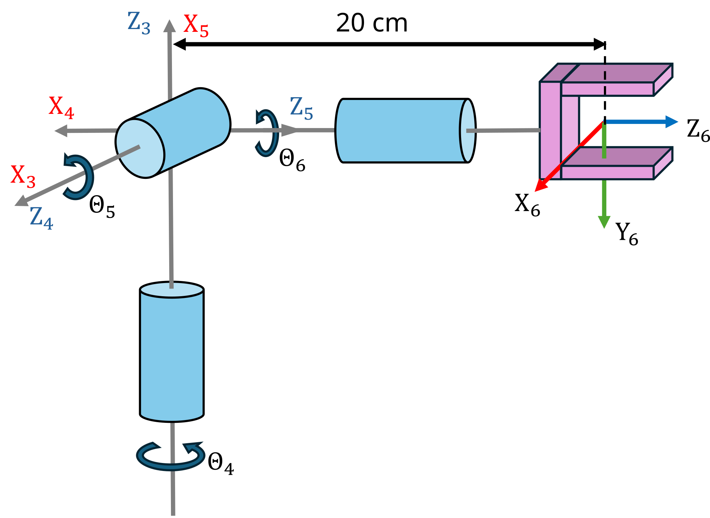

```matlab
clear all; 
```
# Exercici 2.1 \- Cinemàtica directa

En aquest exercici configuraràs les equacions de cinemàtica directa per a diferents manipuladors robòtics. 


Si us plau, desa les teves solucions a les variables predefinides!

# Descripció de la tasca:

Troba els paràmetres DH i configura la cinemàtica directa per a l’estructura mostrada.


Respon totes les preguntes i desa la teva solució a la variable correcta

# Tasca 1

Donada aquesta configuració de canell esfèric. 

1.  Troba els paràmetres DH i configura la matriu de cinemàtica directa.


Fes servir les variables següents per desar la teva solució:

-  q4 ... q6 (variable simbòlica real per a l’angle articular Theta 4\-6) 
-  q (vector que conté els angles articulars simbòlics) 
-  A36 (equació de cinemàtica directa) 
```matlab
q = []; 
A36= []; 
```

Pots comprovar la teva feina fent clic a Run: 

```matlab
 
check_exercise('2-1-1')
```

```matlabTextOutput
Comprovant l’exercici 2-1-1: Comprovant la cinemàtica directa

Comprovant variables:
 
Comprovant la variable A36
[OK] A36 és de tipus sym

Comprovant la variable q4
[OK] q4 és de tipus sym

Comprovant la variable q5
[OK] q5 és de tipus sym

Comprovant la variable q6
[OK] q6 és de tipus sym

Comprovant si les variables són reals
[OK] les variables estan configurades correctament

Comprovant la variable q
[OK] q és de tipus sym

Comprovant la dimensió de q
[OK] dimensions correctes de q

Comprovant la matriu A36
[OK] La cinemàtica directa coincideix amb la solució
```

# Tasca 2
1.  Troba la cinemàtica directa per a la configuració articular $begin:math:display$0\, 0\, 0$end:math:display$
2. Troba la cinemàtica directa per a la configuració articular $begin:math:display$pi\/2\, 0 \, pi\/7$end:math:display$

Fes servir les variables següents per desar la teva solució:

-  T\_1 (transformació homogènia per a la configuració articular $begin:math:display$0\, 0\, 0$end:math:display$)  
-  T\_2 (transformació homogènia per a la configuració articular $begin:math:display$pi\/2\, 0 \, pi\/7$end:math:display$)  
```matlab
T_1 = []; 
T_2 = []; 
```

Pots comprovar la teva feina fent clic a Run: 

```matlab
 
check_exercise('2-1-2')
```

```matlabTextOutput
Comprovant l’exercici 2-1-2: Matrius de transformació

Comprovant variables:
 
Comprovant la variable T_1
[OK] T_1 és de tipus double
[OK] T_1 correcta

Comprovant la variable T_2
[OK] T_2 és de tipus double
[OK] T_2 correcta
```


# Tasca 3
1.  Configura el canell fent servir el Robotic System Toolbox amb el Dataformat "column"
2. Defineix el format de dades com a column

fes servir els noms següents:

-  spherical\_wrist (nom del robot) 
-  world (nom de la base del robot) 
-  wrist\_1\_link ... wrist\_3\_link (nom del cos dels enllaços del canell) 
-  wrist\_1\_joint ... wrist\_3\_joint (noms de les articulacions del canell) 
```matlab
spherical_wrist =[]; 
```

Pots comprovar la teva feina fent clic a Run: 

```matlab
 
check_exercise('2-1-3')
```

```matlabTextOutput
Comprovant l’exercici 2-1-3: Estructura spherical_wrist

Comprovant variables:
 
Comprovant la variable spherical_wrist
[OK] spherical_wrist és de tipus rigidBodyTree

Comprovant el format de dades de spherical_wrist
[OK] Format de dades correcte

Comprovant la variable bodies
[OK] bodies és de tipus cell

Nombre de cossos
[OK] nombre correcte de cossos

Comprovant la variable joints
[OK] joints és de tipus cell

Nombre d’articulacions
[OK] nombre correcte d’articulacions

Comprovant el tipus d’articulació
[OK] spherical_wrist.Bodies{1}.Joint.Type coincideix amb el valor esperat

Comprovant el tipus d’articulació
[OK] spherical_wrist.Bodies{2}.Joint.Type coincideix amb el valor esperat

Comprovant el tipus d’articulació
[OK] spherical_wrist.Bodies{3}.Joint.Type coincideix amb el valor esperat

Comprovant el nom de la base
[OK] spherical_wrist.BaseName coincideix amb el valor esperat

Comprovant si els paràmetres DH són correctes
[OK] paràmetres DH enllaçats correctament amb les articulacions

Comprovant els noms dels cossos i de les articulacions
[OK] Cossos anomenats correctament
[OK] Articulacions anomenades correctament
```


# Tasca 4
1.  Obtén la transformació per a la configuració articular $begin:math:display$0\,\\\-pi\/2\,\\\-pi\/2$end:math:display$ des del marc de la base fins a l’últim marc del canell.

Fes servir les variables següents per desar la teva solució:

-  T\_config (transformació per a la configuració articular $begin:math:display$0\,\\\-pi\/2\,\\\-pi\/2$end:math:display$) 
```matlab
T_config =[]; 
```

Pots comprovar la teva feina fent clic a Run: 

```matlab
 
check_exercise('2-1-4')
```

```matlabTextOutput
Comprovant l’exercici 2-1-4: Comprovant matrius de transformació

Comprovant variables:
 
Comprovant la variable T_config
[OK] T_config és de tipus double
[ERROR] La comparació ha fallat per a T_config: Els arrays tenen mides incompatibles per a aquesta operació.
```

# Tasca 5
1.  Fent servir el Robotic System Toolbox, carrega un model UR10e
2. Obtén la transformació des del marc de la base fins al primer enllaç del canell per a la configuració $begin:math:display$0\,0\,0\,0\,0\,0$end:math:display$
3. Obtén la transformació des del marc de la base fins al marc tool0 per a la configuració $begin:math:display$0\, \\\-pi\/2\, 0\, \\\-pi\/2\, 0\, 0$end:math:display$

Fes servir les variables següents per desar la teva solució:

-  ur10e (nom del robot) 
-  TBW1 (transformació homogènia de la base al primer canell) 
-  TBT (transformació homogènia de la base a tool0) 
```matlab
TBW1 = [];
TBT = []; 
```

Pots comprovar la teva feina fent clic a Run: 

```matlab
 
check_exercise('2-1-5')

```