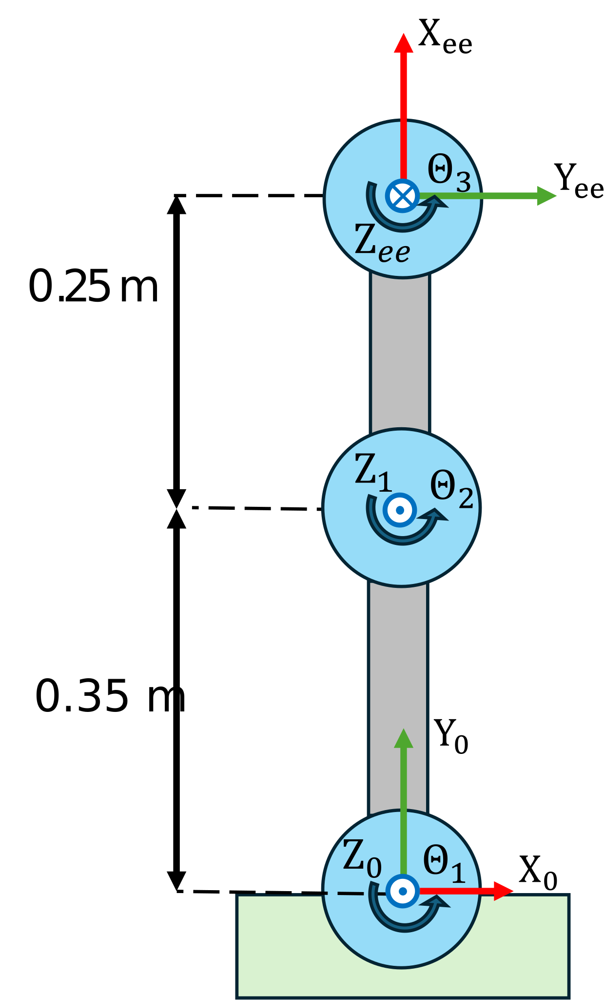

```matlab
clear all; 
```
# Exercise 2.2 \- Inverse Kinematic Planar Arms

In this Exercise you will compute the inverse kinematic solutions of different planar manipulators.


Please store your solutions in the predefined variables!

# Task description:

Compute the solutions to the inverse kinematics in order to reach a desired position or pose.


Answer all the questions and store your solution in the correct variable

# Task 1


Reach the Position 

 $$ t_{\textrm{desired}} =\left\lbrack \begin{array}{c} 0\ldotp 3333\newline 0\ldotp 4989\newline 0 \end{array}\right\rbrack $$ 

w.r.t. frame 0

1.  compute the solution to reach this position

Use the following variables  to store your solution:

-  sol\_1 (row vector as: \[q1,q2\]) 
```matlab
sol_1 = []; 
```

```matlabTextOutput
Error using atan2
Argument must be real.
```


You can check your work by clicking the Run: 

```matlab
 
check_exercise('2-2-1')
```
# Task 2


Reach the Position 

 $$ t_{\textrm{desired}} =\left\lbrack \begin{array}{c} 0\ldotp 2582\newline 0\ldotp 6944\newline 0 \end{array}\right\rbrack $$ 

w.r.t. frame 0

1.  find all solutions to this problem

Use the following variables to store your solution:

-  sol\_2 (Matrix where each row represents a solution as: \[q1,q2\]) 
```matlab
sol_2 = [];
```

You can check your work by clicking the Run: 

```matlab
 
check_exercise('2-2-2')

```
# Task 3




Reach the pose: 

 $$ T_{\textrm{desired}} =\left\lbrack \begin{array}{cccc} 0\ldotp 3303 & 0\ldotp 9439 & 0 & 0\ldotp 2828\newline 0\ldotp 9439 & -0\ldotp 3303 & 0 & 0\ldotp 6328\newline 0 & 0 & -1 & 0\newline 0 & 0 & 0 & 1 \end{array}\right\rbrack $$ 

w.r.t. frame 0

1.  Find all inverse kinematics solutions

Use the following variables  to store your solution:

-  sol\_3 (Matrix where each row represents a solution as: \[q1,q2,q3\]) 
```matlab
sol_3 = []; 
```

You can check your work by clicking the Run: 

```matlab
 
check_exercise('2-2-3')

```

