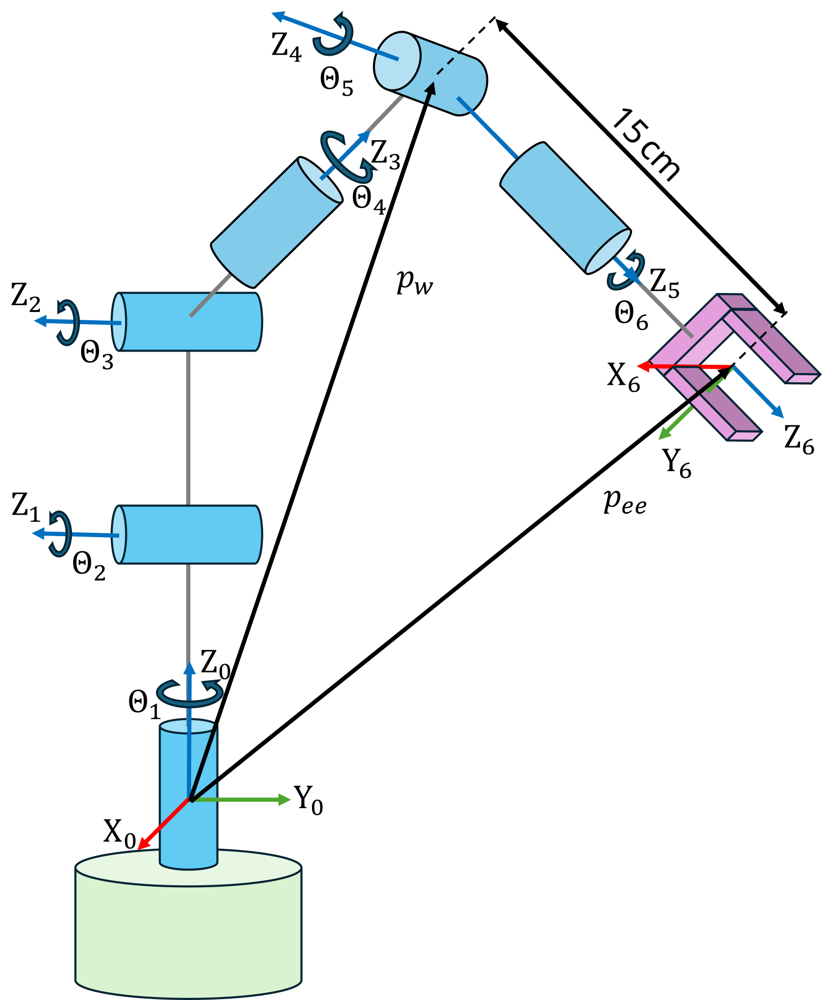

```matlab
clear all; 
```
# Exercici 2.3 \- Cinemàtica inversa d’un braç antropomòrfic amb canell esfèric

En aquest exercici calcularàs la cinemàtica inversa d’un braç antropomòrfic amb un canell esfèric


Si us plau, desa les teves solucions a les variables predefinides!

# Descripció de la tasca:

a continuació veuràs un model d’un braç antropomòrfic amb un canell esfèric. 


Considera el conjunt següent de paràmetres DH: 

||||||
| :-: | :-- | :-: | :-: | :-- |
| Enllaç  | a $begin:math:display$m$end:math:display$  | alpha  | d $begin:math:display$m$end:math:display$  | theta   |
| 1  | 0  | pi/2  | 0  | $\displaystyle \theta_1$   |
| 2  | 0.3  | 0  | 0  | $\displaystyle \theta_2$   |
| 3  |   0.2  | pi/2  | 0  | $\displaystyle \theta_3$   |
| 4  | 0  | \-pi/2  | 0.2  | $\displaystyle \theta_4$   |
| 5  | 0  | pi/2  | 0  | $\displaystyle \theta_5$   |
| 6  | 0  | 0  | 0.15  | $\displaystyle \theta_6$   |





En el cas d’aquest manipulador amb un canell esfèric, la solució es desacobla entre posició i orientació, és a dir, les tres articulacions del braç s’utilitzen per posicionar l’efector final, i les tres articulacions s’utilitzen per fixar-ne l’orientació.


Donades la posició de l’efector final $p_{\textrm{ee}}$ i l’orientació $R_{\textrm{ee}}$, s’han de seguir els passos següents:

1.  Calcula la posició del canell $p_w =p_{\textrm{ee}} -d_6 \cdot z_6$
2. Resol la cinemàtica inversa per al braç antropomòrfic: $\theta_3 ,\theta_2 ,\theta_1$
3. Calcula $R_3^0 \left(\theta_1 ,\theta_2 ,\theta_3 \right)$
4. Calcula $R_6^3 \left(\theta_4 ,\theta_5 ,\theta_6 \right)={R_3^0 }^T \cdot R_{\textrm{ee}}$
5. Resol la cinemàtica inversa per al canell esfèric: $\theta_4 ,\theta_5 ,\theta_6$

Les quatre solucions de la IK del braç combinades amb les dues solucions del canell donen com a resultat un total de vuit solucions.


Arriba a la postura següent: 

 $$ T_{\textrm{desired}} =\left\lbrack \begin{array}{cccc} 0\ldotp 5 & 0 & 0\ldotp 866 & 0\ldotp 25\newline 0\ldotp 866 & 0 & -0\ldotp 5 & 0\ldotp 1\newline 0 & 1 & 0 & 0\ldotp 35\newline 0 & 0 & 0 & 1 \end{array}\right\rbrack $$ 

Respon totes les preguntes i desa la teva solució a la variable correcta

```matlab
syms q1 q2 q3 q4 q5 q6 real 
% Taula de paràmetres DH
        % a      alpha      d       theta
DH = [    0,     pi/2,     0,       q1;    % Enllaç 1
          0.3,   0,        0,       q2;    % Enllaç 2
          0.2,   pi/2,     0,       q3;    % Enllaç 3
          0,     -pi/2,    0.2,     q4;    % Enllaç 4
          0,     pi/2,     0,       q5;    % Enllaç 5
          0,     0,        0.15,    q6];   % Enllaç 6

Tdesired = [0.5,      0,     0.866, 0.25;
            0.866,    0,    -0.5,  0.1;
            0,        1,     0,    0.35;
            0,        0,     0,    1];
```
# Tasca 1
1.  Calcula la posició del canell $p_w =p_{\textrm{ee}} -d_6 \cdot z_6$
2. Resol la cinemàtica inversa per al braç antropomòrfic: $\theta_3 ,\theta_2 ,\theta_1$

Fes servir les variables següents per desar la teva solució:

-  pee (posició de l’efector final) 
-  pw (la posició del canell) 
-  anthro\_solutions (solució de cinemàtica inversa on cada fila és una solució) 
```matlab
pee = [];
pw = [];
anthro_solutions = []; 
```

Pots comprovar la teva feina fent clic a Run: 

```matlab
 
check_exercise('2-3-1')
```
# Tasca 2
1.  Calcula $R_3^0 \left(\theta_1 ,\theta_2 ,\theta_3 \right)$
2. Calcula $R_6^3 \left(\theta_4 ,\theta_5 ,\theta_6 \right)={R_3^0 }^T \cdot R_{\textrm{ee}}$

Fes servir les variables següents per desar la teva solució:

-  Ree (rotació de l’efector final) 
-  R03 (rotació del marc 0 al marc 3) 
-  R36 (rotació del marc 3 al marc 6) 
```matlab
Ree = []; 
R03 = []; 
R36 = [];
```

Pots comprovar la teva feina fent clic a Run: 

```matlab
 
check_exercise('2-3-2')

```
# Tasca 3
1.  Resol la cinemàtica inversa per al canell esfèric: $\theta_4 ,\theta_5 ,\theta_6$

Fes servir les variables següents per desar la teva solució:

-  spherical\_solutions (solució de cinemàtica inversa on cada fila és una solució)  
-  solutions (solució completa de cinemàtica inversa per al braç antropomòrfic amb canell esfèric, on cada fila representa una solució única) 
```matlab
spherical_solutions = [];
solutions = [];
```

Pots comprovar la teva feina fent clic a Run: 

```matlab
 
check_exercise('2-3-3')

```