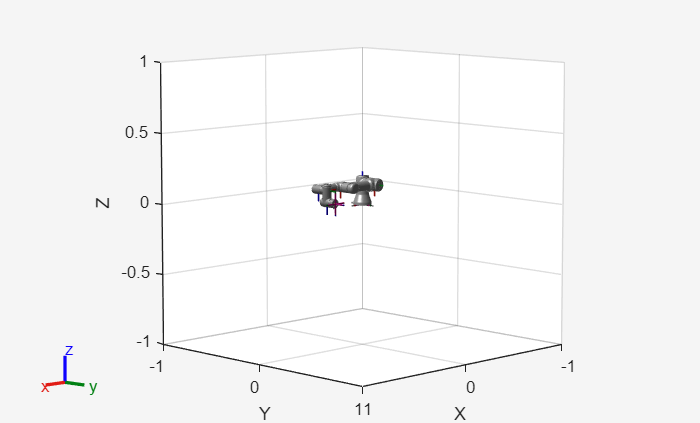

# Cinemàtica directa

Una capacitat fonamental que permet als robots interactuar de manera fiable amb el seu entorn és la capacitat de calcular on serà cada part del mecanisme, donat un conjunt d’entrades articulars. Aquest procés, conegut com a **cinemàtica directa**, sustenta tot, des de la visualització bàsica del moviment fins a la planificació avançada de trajectòries. En aquest tutorial, explorarem el marc matemàtic i les estratègies pràctiques d’implementació que et permeten determinar la postura d’un efector final (posició i orientació) en l’espai, donada la configuració de les seves articulacions.

# Problema

En essència, la cinemàtica directa és el problema de mapar **l’espai articular**, el vector de variables dels actuadors o de les articulacions, a **l’espai cartesià**, la postura espacial de l’enllaç o de l’efector final d’un robot.


Això s’aconsegueix fent servir els paràmetres DH per calcular una matriu de transformació homogènia que depèn d’un estat articular. Recorda que una transformació homogènia es defineix com: 

 $$ T=\left\lbrack \begin{array}{ccccc}  &  &  & | & \newline  & R\in {\mathbb{R}}^{3\textrm{x3}}  &  & | & t\in {\mathbb{R}}^{3\textrm{x1}} \newline  &  &  & | & \newline -- & -- & -- & + & --\newline 0 & 0 & 0 & | & 1 \end{array}\right\rbrack =\left\lbrack \begin{array}{cccc} r_{11}  & r_{12}  & r_{13}  & \Delta \;x\newline r_{21}  & r_{22}  & r_{23}  & \Delta \;y\newline r_{13}  & r_{32}  & r_{33}  & \Delta \;z\newline 0 & 0 & 0 & 1 \end{array}\right\rbrack $$ 

L’objectiu és calcular una matriu de transformació que només depengui de la variable de l’actuador q: 

 $$ T\left(q\right)=\left\lbrack \begin{array}{ccccc}  &  &  & | & \newline  & R\left(q\right) &  & | & t\left(q\right)\newline  &  &  & | & \newline -- & -- & -- & + & --\newline 0 & 0 & 0 & | & 1 \end{array}\right\rbrack $$ 

Aquestes matrius de transformació defineixen la translació i la rotació entre dues articulacions consecutives. Concatenar-les ens permet calcular la postura d’una sèrie d’enllaços fins a l’efector final. 


Considera l’Universal Robots UR3. Com que totes les articulacions són rotatives, les variables articulars q\_i s’assignen al paràmetre theta de la taula DH següent:

```matlab
syms q1 q2 q3 q4 q5 q6 real
DH=[ %per Universal Robots (lloc web)
   %a       alpha       d       theta
   0        pi/2        0.1519  q1;
   -0.24365 0           0       q2;
   -0.21325 0           0       q3;
   0        pi/2        0.11235 q4;
   0        -pi/2       0.08535 q5;
   0        0           0.0819  q6;
    ];
```

Fent servir el Symbolic Math Toolbox podem transformar aquests paràmetres DH en una matriu de transformació homogènia que depèn de l’estat articular q. 

# Symbolic Math Toolbox

Per modelar el robot fent servir el Symbolic Math Toolbox, hem de definir matrius de transformació amb variables simbòliques. Més endavant podem substituir-les per valors reals per calcular la postura cartesiana d’una sèrie d’enllaços. 

## De DH a transformació homogènia

Entenguem com construir una matriu de transformació homogènia a partir dels paràmetres DH. 


Recorda que els paràmetres DH descriuen la cinemàtica del manipulador d’un robot definint la posició i l’orientació relatives de cada enllaç adjacent. Es resumeixen en quatre paràmetres:

-           **θ** (theta) → angle articular (rotació al voltant de z\_i\-1 per passar de x\_i\-1 a x\_i) → s’utilitza per a **articulacions rotatives**. 
-          **d** → distància al llarg de z\_i\-1 entre x\_i\-1 i x\_i → s’utilitza per a **articulacions prismàtiques**. 
-          **a** → distància al llarg de x\_i entre z\_i\-1 i z\_i 
-           **α** (alpha) → angle entre z\_i\-1 i z\_i des de x\_i 

Bàsicament, la transformació de modelatge DH implica dues translacions i dues rotacions, realitzades en l’ordre següent: 

1.  **Rotació al voltant de Z**, alineant les normals comunes (eix X) fent servir theta (fent servir el paràmetre DH $\theta \;$, per a articulacions rotatives aquesta és l’entrada q).
2. **Translació al llarg de l’eix Z**, col·locant els orígens en el mateix punt. (fent servir el paràmetre DH d; per a articulacions prismàtiques aquesta serà l’entrada q)
3. **Translació al llarg de l’eix X**, col·locant els orígens en el mateix pla Y\-Z (fent servir el paràmetre DH a).
4. **Rotació al voltant de l’eix X**, alineant tots dos eixos Z. (fent servir el paràmetre DH $\alpha$ )
```matlab
syms alpha theta a d real %configura variables simbòliques i defineix-les com a reals 

FirstRotation=trotz(theta) %crea una matriu de transformació homogènia -->Gira al voltant de l’eix z
```
FirstRotation = 

  $$ \displaystyle \left(\begin{array}{cccc} \cos \left(\theta \right) & -\sin \left(\theta \right) & 0 & 0\newline \sin \left(\theta \right) & \cos \left(\theta \right) & 0 & 0\newline 0 & 0 & 1 & 0\newline 0 & 0 & 0 & 1 \end{array}\right) $$ 
 

```matlab
FirstTranslation=transl([a 0 0]) %crea una matriu de transformació homogènia --> Mou al llarg de l’eix x
```
FirstTranslation = 

  $$ \displaystyle \left(\begin{array}{cccc} 1 & 0 & 0 & a\newline 0 & 1 & 0 & 0\newline 0 & 0 & 1 & 0\newline 0 & 0 & 0 & 1 \end{array}\right) $$ 
 

```matlab
SecondTranslation=transl([0 0 d]) %crea una matriu de transformació homogènia --> mou al llarg de l’eix z 
```
SecondTranslation = 

  $$ \displaystyle \left(\begin{array}{cccc} 1 & 0 & 0 & 0\newline 0 & 1 & 0 & 0\newline 0 & 0 & 1 & d\newline 0 & 0 & 0 & 1 \end{array}\right) $$ 
 

```matlab
SecondRotation=trotx(alpha) %crea una matriu de transformació homogènia -->gira al voltant de l’eix x
```
SecondRotation = 

  $$ \displaystyle \left(\begin{array}{cccc} 1 & 0 & 0 & 0\newline 0 & \cos \left(\alpha \right) & -\sin \left(\alpha \right) & 0\newline 0 & \sin \left(\alpha \right) & \cos \left(\alpha \right) & 0\newline 0 & 0 & 0 & 1 \end{array}\right) $$ 
 

Visualitzem què passa amb cadascuna d’aquestes transformacions.


Considera aquest conjunt arbitrari de paràmetres DH: 

```matlab
          % a      alpha     d          theta
DHexample=[0.6,    -pi/2,    0.24,      pi/2]
```

```matlabTextOutput
DHexample = 1x4
    0.6000   -1.5708    0.2400    1.5708

```


Observa com cada pas es multiplica per la transformació anterior: 

```matlab
                                % Matriu d’entrada      variable    valor 
exampleFirstRotation =      subs(FirstRotation,     theta,      DHexample(4));
exampleFirstTranslation =   subs(FirstTranslation,  a,          DHexample(1));
exampleSecondTranslation =  subs(SecondTranslation, d,          DHexample(3));
exampleSecondRotation =     subs(SecondRotation,    alpha,      DHexample(2));

M=zeros(4,4,5);
M(:,:,1)=eye(4); 
M(:,:,2)=M(:,:,1)*double(exampleFirstRotation); 
M(:,:,3)=M(:,:,2)*double(exampleFirstTranslation); 
M(:,:,4)=M(:,:,3)*double(exampleSecondTranslation);
M(:,:,5)=M(:,:,4)*double(exampleSecondRotation); 

figure; 
axis(2*[-1,1,-1,1,-1,1])
for i=1:5
subplot(1,5,i)
plotTransforms(M(1:3,4,i)',tform2quat(M(:,:,i)))
end
```


Seguir aquests passos donarà com a resultat una matriu de transformació homogènia que concatena tots els paràmetres DH. Anomenarem aquestes matrius de transformació $A_{\textrm{enllaç}\;\textrm{origen}\to \textrm{enllaç}\;\textrm{destí}}$. Fent servir el Symbolic Toolbox podem configurar una plantilla com:

```matlab
Ai=FirstRotation*FirstTranslation*SecondTranslation*SecondRotation
```
Ai = 

  $$ \displaystyle \left(\begin{array}{cccc} \cos \left(\theta \right) & -\cos \left(\alpha \right)\,\sin \left(\theta \right) & \sin \left(\alpha \right)\,\sin \left(\theta \right) & a\,\cos \left(\theta \right)\newline \sin \left(\theta \right) & \cos \left(\alpha \right)\,\cos \left(\theta \right) & -\sin \left(\alpha \right)\,\cos \left(\theta \right) & a\,\sin \left(\theta \right)\newline 0 & \sin \left(\alpha \right) & \cos \left(\alpha \right) & d\newline 0 & 0 & 0 & 1 \end{array}\right) $$ 
 

o configurar-la manualment com:

```matlab
Ai_symbolic = [
                  cos(theta)     -sin(theta)*cos(alpha)    sin(theta)*sin(alpha)     a*cos(theta);
                  sin(theta)     cos(theta)*cos(alpha)     -cos(theta)*sin(alpha)    a*sin(theta);
                  0              sin(alpha)                cos(alpha)                d;
                  0              0                         0                         1
              ]
```
Ai_symbolic = 

  $$ \displaystyle \left(\begin{array}{cccc} \cos \left(\theta \right) & -\cos \left(\alpha \right)\,\sin \left(\theta \right) & \sin \left(\alpha \right)\,\sin \left(\theta \right) & a\,\cos \left(\theta \right)\newline \sin \left(\theta \right) & \cos \left(\alpha \right)\,\cos \left(\theta \right) & -\sin \left(\alpha \right)\,\cos \left(\theta \right) & a\,\sin \left(\theta \right)\newline 0 & \sin \left(\alpha \right) & \cos \left(\alpha \right) & d\newline 0 & 0 & 0 & 1 \end{array}\right) $$ 
 

Fer servir aquesta matriu simbòlica ens permet substituir fàcilment diferents paràmetres DH per calcular les transformacions entre dos marcs consecutius. 


Per a l’UR3, les matrius resultants són: 

```matlab
A01 = subs(Ai_symbolic, [a alpha d theta], DH(1,:))
```
A01 = 

  $$ \displaystyle \left(\begin{array}{cccc} \cos \left(q_1 \right) & 0 & \sin \left(q_1 \right) & 0\newline \sin \left(q_1 \right) & 0 & -\cos \left(q_1 \right) & 0\newline 0 & 1 & 0 & \frac{1519}{10000}\newline 0 & 0 & 0 & 1 \end{array}\right) $$ 
 

```matlab
A12 = subs(Ai_symbolic, [a alpha d theta], DH(2,:))
```
A12 = 

  $$ \displaystyle \left(\begin{array}{cccc} \cos \left(q_2 \right) & -\sin \left(q_2 \right) & 0 & -\frac{4873\,\cos \left(q_2 \right)}{20000}\newline \sin \left(q_2 \right) & \cos \left(q_2 \right) & 0 & -\frac{4873\,\sin \left(q_2 \right)}{20000}\newline 0 & 0 & 1 & 0\newline 0 & 0 & 0 & 1 \end{array}\right) $$ 
 

```matlab
A23 = subs(Ai_symbolic, [a alpha d theta], DH(3,:))
```
A23 = 

  $$ \displaystyle \left(\begin{array}{cccc} \cos \left(q_3 \right) & -\sin \left(q_3 \right) & 0 & -\frac{853\,\cos \left(q_3 \right)}{4000}\newline \sin \left(q_3 \right) & \cos \left(q_3 \right) & 0 & -\frac{853\,\sin \left(q_3 \right)}{4000}\newline 0 & 0 & 1 & 0\newline 0 & 0 & 0 & 1 \end{array}\right) $$ 
 

```matlab
A34 = subs(Ai_symbolic, [a alpha d theta], DH(4,:))
```
A34 = 

  $$ \displaystyle \left(\begin{array}{cccc} \cos \left(q_4 \right) & 0 & \sin \left(q_4 \right) & 0\newline \sin \left(q_4 \right) & 0 & -\cos \left(q_4 \right) & 0\newline 0 & 1 & 0 & \frac{2247}{20000}\newline 0 & 0 & 0 & 1 \end{array}\right) $$ 
 

```matlab
A45 = subs(Ai_symbolic, [a alpha d theta], DH(5,:))
```
A45 = 

  $$ \displaystyle \left(\begin{array}{cccc} \cos \left(q_5 \right) & 0 & -\sin \left(q_5 \right) & 0\newline \sin \left(q_5 \right) & 0 & \cos \left(q_5 \right) & 0\newline 0 & -1 & 0 & \frac{1707}{20000}\newline 0 & 0 & 0 & 1 \end{array}\right) $$ 
 

```matlab
A56 = subs(Ai_symbolic, [a alpha d theta], DH(6,:))
```
A56 = 

  $$ \displaystyle \left(\begin{array}{cccc} \cos \left(q_6 \right) & -\sin \left(q_6 \right) & 0 & 0\newline \sin \left(q_6 \right) & \cos \left(q_6 \right) & 0 & 0\newline 0 & 0 & 1 & \frac{819}{10000}\newline 0 & 0 & 0 & 1 \end{array}\right) $$ 
 

Compondre aquestes transformacions ens permet trobar transformacions més complexes entre una sèrie de marcs. Per obtenir la transformació entre el marc 0 i el marc 2, simplement podem multiplicar A01 i A12: 

```matlab
A02=A01*A12
```
A02 = 

  $$ \displaystyle \left(\begin{array}{cccc} \cos \left(q_1 \right)\,\cos \left(q_2 \right) & -\cos \left(q_1 \right)\,\sin \left(q_2 \right) & \sin \left(q_1 \right) & -\frac{4873\,\cos \left(q_1 \right)\,\cos \left(q_2 \right)}{20000}\newline \cos \left(q_2 \right)\,\sin \left(q_1 \right) & -\sin \left(q_1 \right)\,\sin \left(q_2 \right) & -\cos \left(q_1 \right) & -\frac{4873\,\cos \left(q_2 \right)\,\sin \left(q_1 \right)}{20000}\newline \sin \left(q_2 \right) & \cos \left(q_2 \right) & 0 & \frac{1519}{10000}-\frac{4873\,\sin \left(q_2 \right)}{20000}\newline 0 & 0 & 0 & 1 \end{array}\right) $$ 
 

Per trobar la posició del marc 2 a la configuració $begin:math:display$0\, 0$end:math:display$, podem substituir: 

```matlab
A02_configuration = subs(A02, [q1,q2], [0,0])
```
A02_configuration = 

  $$ \displaystyle \left(\begin{array}{cccc} 1 & 0 & 0 & -\frac{4873}{20000}\newline 0 & 0 & -1 & 0\newline 0 & 1 & 0 & \frac{1519}{10000}\newline 0 & 0 & 0 & 1 \end{array}\right) $$ 
 

Pots veure-ho com un decimal amb n decimals així: 

```matlab
n=4; 
A02_config_decimal = vpa(A02_configuration, n)
```
A02_config_decimal = 

  $$ \displaystyle \left(\begin{array}{cccc} 1.0 & 0 & 0 & -0.2436\newline 0 & 0 & -1.0 & 0\newline 0 & 1.0 & 0 & 0.1519\newline 0 & 0 & 0 & 1.0 \end{array}\right) $$ 
 

Fent servir aquesta composició podem calcular la posició de l’efector final concatenant: 

```matlab
A06 = A01 * A12 * A23 * A34 * A45 * A56; 
A06_config=vpa(subs(A06,[q1,q2,q3,q4,q5,q6],[0,0,0,0,0,0]),4)
```
A06_config = 

  $$ \displaystyle \left(\begin{array}{cccc} 1.0 & 0 & 0 & -0.4569\newline 0 & 0 & -1.0 & -0.1943\newline 0 & 1.0 & 0 & 0.06655\newline 0 & 0 & 0 & 1.0 \end{array}\right) $$ 
 
# Robotic System Toolbox

Carrega un robot predefinit o configura’l tu mateix.

```matlab
ur3=loadrobot("universalUR3", "DataFormat", "column");
```

Pots obtenir la matriu de transformació fent servir la funció getTransform(). 


Fes-la servir donant les entrades següents: 

1.  estructura RigidBodyTree (robot)
2. configuració articular (segons el teu format de dades, és un vector fila/columna o una estructura)
3. nom de l’enllaç destí
4. nom de l’enllaç origen
```matlab

A06_RS_toolbox = getTransform(ur3, [0;0;0;0;0;0], "wrist_3_link", "base")
```

```matlabTextOutput
A06_RS_toolbox = 4x4
1.0000    0.0000   -0.0000   -0.4569
    0.0000   -1.0000   -0.0000   -0.1124
   -0.0000         0   -1.0000    0.0666
         0         0         0    1.0000

```


Podem visualitzar una configuració a MATLAB com

```matlab
figure; 
show(ur3,[0;0;0;0;0;0]);
```



O mostrar-la a ROS fent servir la funció preconstruïda (assegura’t d’haver-la inicialitzat): 

```matlab
JointStatesToRviz([0;0;0;0;0;0],'ur3');
```

Recorda que primer has d’inicialitzar el robot fent servir StartTutorialApplication().