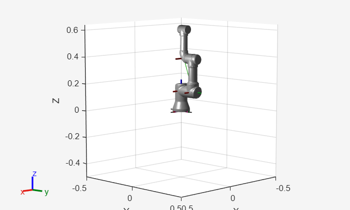
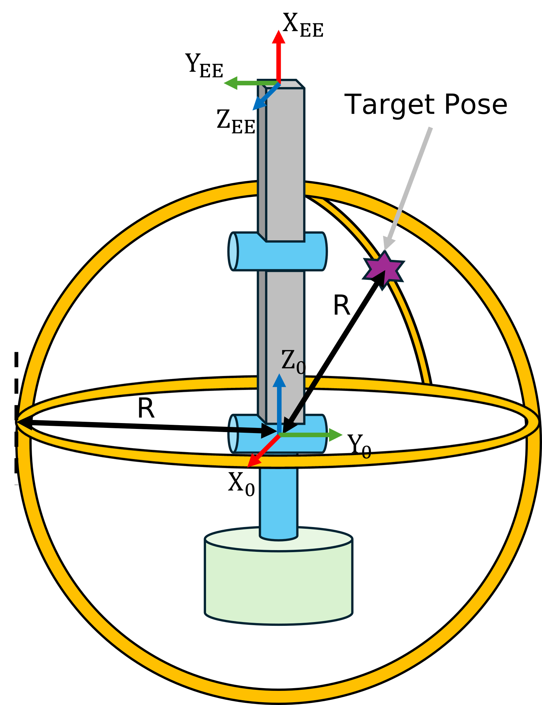
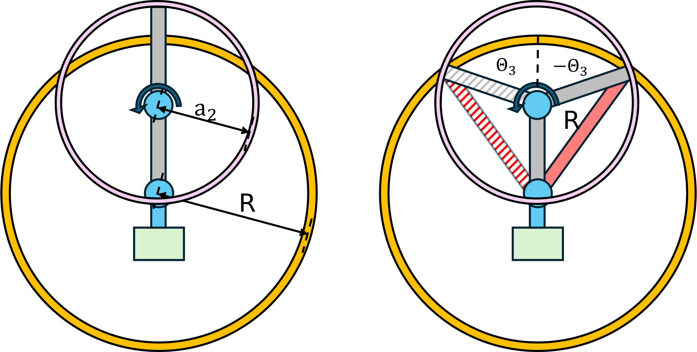
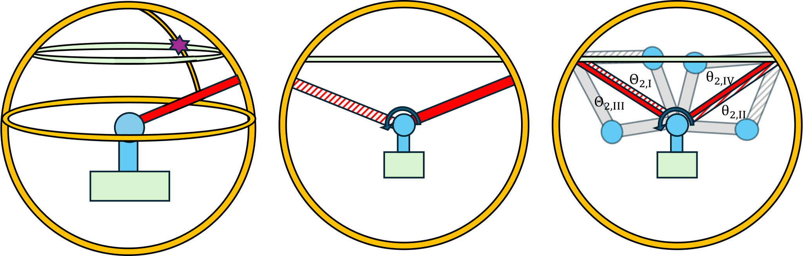
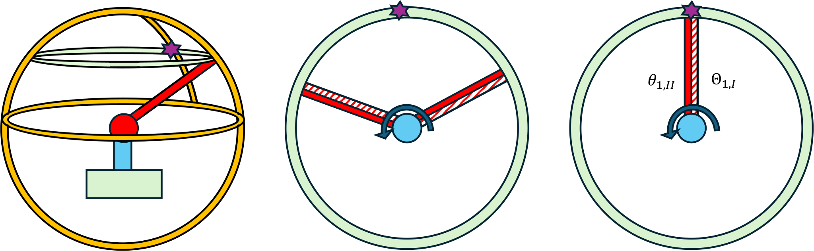
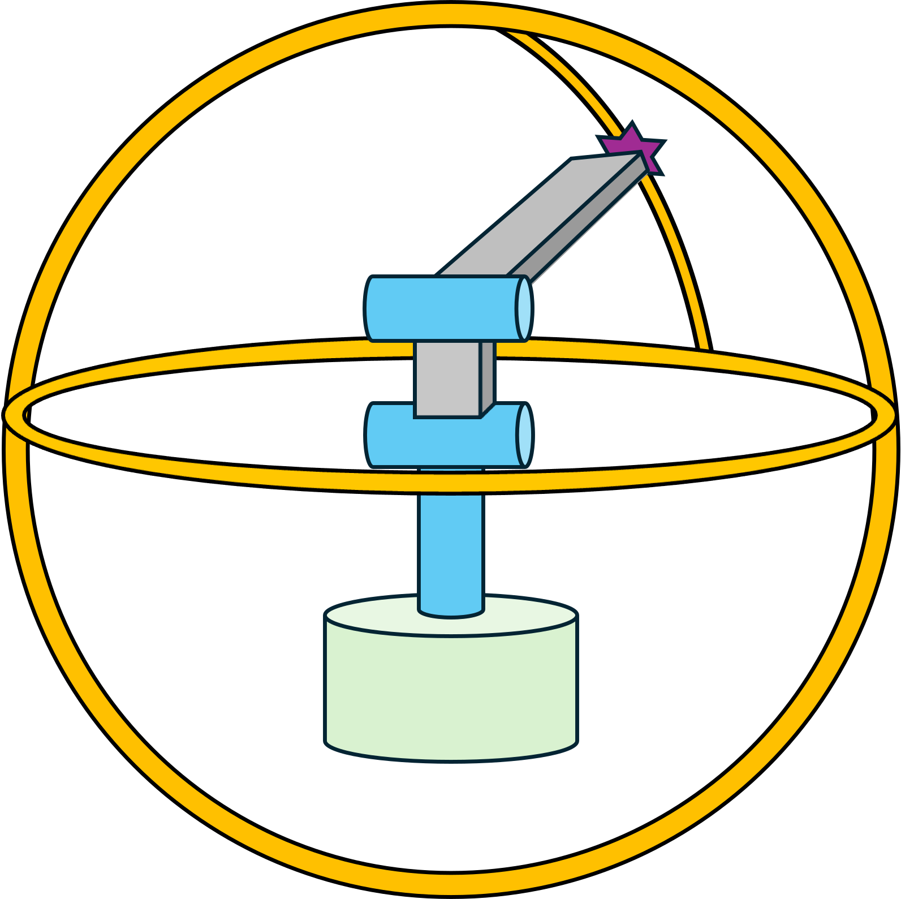
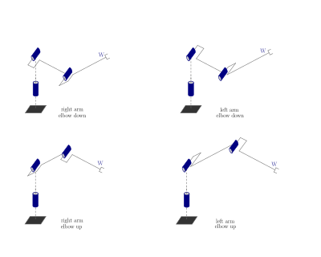
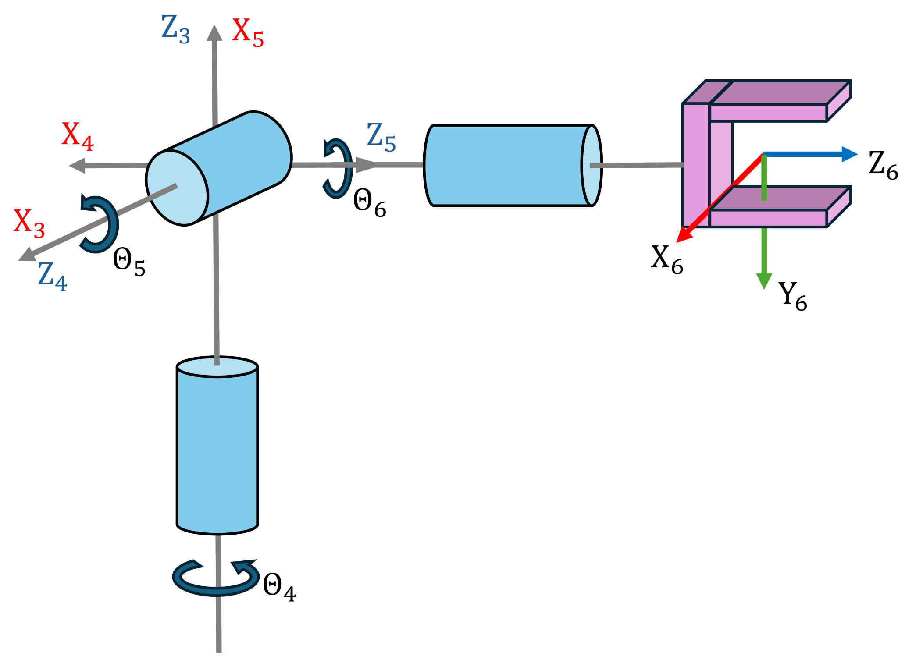
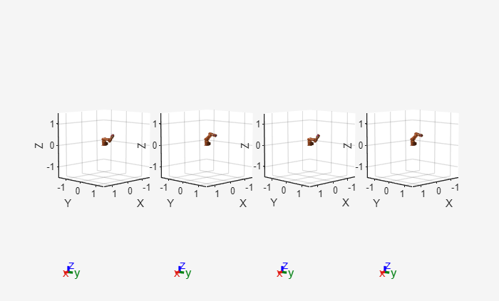

# Inverse Kinematics

Where forward kinematics asks "Given joint angles, where is the end\-effector?", inverse kinematics (IK) poses the reverse question: "Given a desired end\-effector pose, what joint angles achieve it?" IK is the cornerstone of robotic motion planning and control. Whether programming a manipulator to grasp an object, guiding a humanoid's hand to a switch, or coordinating a mobile manipulator's arm and base, computing valid joint configurations from spatial goals is essential.


If a manipulator's forward\-kinematics function 

 $$ T\left(q\right)=\left\lbrack \begin{array}{ccccc}  &  &  & | & \newline  & R\left(q\right) &  & | & t\left(q\right)\newline  &  &  & | & \newline -- & -- & -- & + & --\newline 0 & 0 & 0 & | & 1 \end{array}\right\rbrack $$ 

maps joint variables $q\in {\mathbb{R}}^n \;$ to an end\-effector pose T, then inverse kinematics seeks one or more solutions q such that

 $$ T\left(q\right)=T_{\textrm{desired}} =\left\lbrack \begin{array}{ccccc}  &  &  & | & \newline  & R_{\textrm{desired}}  &  & | & t_{\textrm{desired}} \newline  &  &  & | & \newline -- & -- & -- & + & --\newline 0 & 0 & 0 & | & 1 \end{array}\right\rbrack $$ 

Unlike forward kinematics, the IK problem may have zero, one, or infinite solutions, depending on the manipulator geometry, reachability, and redundancy.


Some manipulator structures have closed\-form solutions, allowing us to analytically compute all solutions to the desired transformation. Universal Robot models all posses the closed form solutions property, making them efficient to work with. 

# Anthropomorphic arm

The Anthropomorphic arm is an example of a structure with a closed form solution. This configuration is often used as it is possible to algebraically compute the different solutions and control the position (translation) of the end\-effector without considering a specific orientation. The first three Joints of a universal robot form this configuration. 

```matlab
anthropomorphic_arm=loadrobot("universalUR3", DataFormat="column");
%removing all additional links
removeBody(anthropomorphic_arm, "tool0");
removeBody(anthropomorphic_arm, "ee_link");
removeBody(anthropomorphic_arm, "wrist_3_link");
removeBody(anthropomorphic_arm, "wrist_2_link");
removeBody(anthropomorphic_arm, "wrist_1_link");
show(anthropomorphic_arm, [0,-pi/2,0]')
```



```matlabTextOutput
ans = 
  Axes (Primary) with properties:

             XLim: [-0.5000 0.5000]
             YLim: [-0.5000 0.5000]
           XScale: 'linear'
           YScale: 'linear'
    GridLineStyle: '-'
         Position: [0.1300 0.1100 0.7750 0.8150]
            Units: 'normalized'

  Show all properties

```


For a set of DH parameters a, alpha, d (theta is joint state) we find the homogeneous transformation matrix A03

||||||
| :-: | :-: | :-: | :-: | :-: |
| Link  | a \[m\]  | alpha  | d \[m\]  | theta   |
| 1  | 0  | pi/2  | 0  | q1   |
| 2  | a2  | 0  | 0  | q2   |
| 3  | a3  | 0  | 0  | q3   |

```matlab
syms a2 a3 q1 q2 q3 real
DH = [
        0 pi/2  0 q1; 
        a2 0    0 q2; 
        a3 0    0 q3
]; 
A01 = dh2tf(DH(1,:));
A12 = dh2tf(DH(2,:));
A23 = dh2tf(DH(3,:));
A03 = A01 * A12 * A23; 
A03 = simplify(A03)
```
A03 = 

  $$ \displaystyle \begin{array}{l} \left(\begin{array}{cccc} \cos \left(q_2 +q_3 \right)\,\cos \left(q_1 \right) & -\sin \left(q_2 +q_3 \right)\,\cos \left(q_1 \right) & \sin \left(q_1 \right) & \cos \left(q_1 \right)\,\sigma_1 \newline \cos \left(q_2 +q_3 \right)\,\sin \left(q_1 \right) & -\sin \left(q_2 +q_3 \right)\,\sin \left(q_1 \right) & -\cos \left(q_1 \right) & \sin \left(q_1 \right)\,\sigma_1 \newline \sin \left(q_2 +q_3 \right) & \cos \left(q_2 +q_3 \right) & 0 & a_3 \,\sin \left(q_2 +q_3 \right)+a_2 \,\sin \left(q_2 \right)\newline 0 & 0 & 0 & 1 \end{array}\right)\\\mathrm{}\\\textrm{where}\\\mathrm{}\\\;\;\sigma_1 =a_3 \,\cos \left(q_2 +q_3 \right)+a_2 \,\cos \left(q_2 \right)\end{array} $$ 
 

For a desired location of the end\-effector in the reachable workspace we can solve it using a set of equations. 

 $$ t_{\textrm{desired}} =\left\lbrack \begin{array}{c} x_{\textrm{desired}} \newline y_{\textrm{desired}} \newline z_{\textrm{desired}}  \end{array}\right\rbrack =\left\lbrack \begin{array}{c} \cos \left(q_1 \right)\cdot \left(a_3 \cdot \cos \left(\textrm{q2}+\textrm{q3}\right)+a_2 \cdot \cos \left(\textrm{q2}\right)\right)\newline \sin \left(q_1 \right)\cdot \left(a_3 \cdot \cos \left(\textrm{q2}+\textrm{q3}\right)+a_2 \cdot \cos \left(\textrm{q2}\right)\right)\newline a_3 \cdot \sin \left(q_2 +q_3 \right)+a_2 \cdot \sin \left(q_2 \right) \end{array}\right\rbrack $$ 


Consider this sketch of an anthropomorphic arm, its frames and a desired target pose. Notice that the origin of Frame 0 and Frame 1 coincide, therefore the distance from Z0 and Z1 to the target are identical. In the figure below the distance from frame 1 to the target is marked as R. Consider a sphere (yellow) around Joint 1 with a radius R. 




## $$ {\textrm{Computing}\;\theta }_3 $$

Look at the 2\-D projection below. The yellow circle is the sphere with the radius R, the pink sphere is the rotation of Joint 3 with $\theta_3$ with a radius of $a_2$, corresponding to the length of Joint 3. We want to find the solutions to $\theta_3$ so that the end\-effector frame lies on the yellow sphere. Notice how there are two solutions that fulfill this task:


 


Squaring and summing the cartesian coordinates from Frame 1 (or Frame 0 if they coincide) to the target pose, gives us an expression for the required arm reach:

 $$ \;x_{\textrm{desired}}^2 +y_{\textrm{desired}}^2 +z_{\textrm{desired}}^2 =a_2^2 +a_3^2 +2\cdot \cos \left(q_3 \right)\cdot a_2 \cdot a_3 $$ 

This equation represents the cosine law ( $c^2 =a^{2\;} +b^2 -2\textrm{ab}\cdot \cos \left(\gamma \right)$ ), however in robotics a fully extended arm is represented with joint angle of 0. Contrarily, in the cosine law for standard geometry, this extended arm would be computed with an angle of 180° (or $\pi$ ) . 


This change in angle reference results in the following cosine law expression:

 $$ \vec{{||P}_{\textrm{desired}} ||} =a_2^2 +a_3^2 -2\cdot \cos \left(\theta \;+\pi \right)\cdot a_2 \cdot a_3 $$ 

where we have substituted $\cos \left(\theta +\pi \;\right)$ for $-\cos \left(\theta \right)$.


Solving for $\cos \left(q_3 \right)$ yields the expression: 

 $$ \cos \left(q_3 \right)=\frac{x_{\textrm{desired}}^2 +y_{\textrm{desired}}^2 +z_{\textrm{desired}}^2 -a_2^2 -a_3^2 }{\;2\cdot a_2 \cdot a_3 }\; $$ 

The solution is admissible if $-1\le \cos \left(q_3 \right)\le 1$, which is equivalent to the desired point lying in the reachable workspace. 

 $$ |a_2 -a_3 |\le \sqrt{x_{\textrm{desired}}^2 +y_{\textrm{desired}}^2 +z_{\textrm{desired}}^2 \;}\le |a_2 +a_3 | $$ 

where $|a_2 -a_3 |\;$ represents the arm being folded onto itself $q_3 =\pi \;$ 


and $|a_2 +a_3 |$ the arm fully extended $q_3 =0$.


Using the property: 


 ${\sin \left(q_3 \;\right)}^2 +{\cos \left(q_3 \right)}^{2\;} =1$ lets us get two solutions for $\sin \left(\beta \;\right)$ as: 

 $$ \sin \left(q_3 \right)=\pm \sqrt{\;1-\cos \left(q_3 \;\right)}\;\left\lbrace \begin{array}{ll} \sin^+ \left(q_3 \right)=+\sqrt{\;1-\cos \left(q_3 \right)} & \newline \sin^- \left(q_3 \right)=-\sqrt{\;1-\cos \left(q_3 \right)} &  \end{array}\right. $$ 

with this you can compute $q_3$ as

 $$ q_3 =\theta_3 =\textrm{atan2}\left(\sin \left(q_3 \right),\cos \left(q_3 \right)\right)\left\lbrace \begin{array}{ll} \theta_{3,I} =\textrm{atan2}\left(\sin^+ \left(q_3 \right),\cos \left(q_3 \right)\right)\in \left\lbrack -\pi ,\pi \;\right\rbrack  & \newline \theta_{3,\textrm{II}} =\textrm{atan2}\left(\sin^- \left(q_3 \right),\cos \left(q_3 \right)\right)=-\theta {\;}_{3,1}  &  \end{array}\right. $$ 
## $$ \textrm{Computing}\;\theta_2 $$

In the figure below (left) you see a green torus, that is on the sphere surface at the Z\-height of the target pose. To compute $\theta_2$, you align the link (red) that results from the chosen $\theta_3$ with the green circle. Notice how for each angle of $\theta_3$ there are two solutions, resulting in a total of four solutions that fulfill this task:





From the expressions for $x_{\textrm{desired}}$ and $y_{\textrm{desired}}$ we can obtain the equation: 

 $$ x_{\textrm{desired}}^2 +y_{\textrm{desired}}^2 ={\left(a_2 \cdot \cos \left(q_2 \right)+a_3 \cdot \cos \left(q_2 +q_3 \right)\right)}^2 $$ 

Including the equation for $z_{\textrm{desired}}$ yields a system of equations that lets us solve for $q_2$:

 $$ \textrm{System}\;\textrm{of}\;\textrm{equation}\left\lbrace \begin{array}{ll} a_2 \cdot \cos \left(q_2 \right)+a_3 \cdot \cos \left(q_2 +q_3 \right)=\pm \sqrt{\;x_{\textrm{desired}}^2 +y_{\textrm{desired}}^2 } & \newline z_{\textrm{desired}} =a_2 \cdot \sin \left(q_2 \right)+a_3 \cdot \sin \left(q_2 +q_3 \right) &  \end{array}\right. $$ 

this lets us express sinus and cosinus of $q_2 \;$ as:

 $$ \cos \left(q_2 \right)=\frac{\pm \sqrt{\;x_{\textrm{desired}}^2 +y_{\textrm{desired}}^2 }\cdot \left(a_2 +a_3 \cdot \cos \left(q_3 \right)\right)+z_{\textrm{desired}} \cdot a_3 \cdot \sin \left(q_3 \right)}{\;a_2^2 +a_3^2 +2\cdot a_2 \cdot a_3 \cdot \cos \left(q_3 \right)} $$ 

 $$ \sin \left(q_2 \right)=\frac{z_{\textrm{desired}} \cdot \left(a_2 +a_3 \cdot \cos \left(q_3 \right)\right)\mp \sqrt{\;x_{\textrm{desired}}^2 +y_{\textrm{desired}}^2 }\cdot a_3 \cdot \sin \left(q_3 \right)}{\;a_2^2 +a_3^2 +2\cdot a_2 \cdot a_3 \cdot \cos \left(q_3 \right)} $$ 


using these expressions we can derive the solutions for $\theta_2$ 

 $ \theta_2 =\textrm{atan2}\left(\sin \left(q_2 \right),\;\cos \left(q_2 \right)\right)= $ $ \left\lbrace \begin{array}{ll} \theta_{2,I}  & when~using~sin(q_3 )^+ ~(\theta_{3,I} )~and~+\sqrt{~~~}~\newline \theta_{2,II}  & when~using~sin(q_3 )^+ ~(\theta_{3,I} )~and~-\sqrt{~~~}\newline \theta_{2,III}  & when~using~sin(q_3 )^- ~(\theta_{3,II} )~and~+\sqrt{~~~}\newline \theta_{2,IV}  & when~using~sin(q_3 )^- ~(\theta_{3,II} )~and~-\sqrt{~~~} \end{array}\right. $ 

## $$ \textrm{Computing}\;\theta_1 $$

The figure below is a 2\-D projection from above. To align the end\-effector with the target pose rotate the $Z_0$ Axis with $\theta_1$. Notice how there are two solutions depending on the $\theta_3$ and $\theta_2$ configuration: 





We can rewrite expressions for $x_{\textrm{desired}}$ and $y_{\textrm{desired}}$ as:

 $$ x_{\textrm{desired}} =\pm \cos \left(q_1 \right)\cdot \sqrt{x_{\textrm{desired}}^2 +y_{\textrm{desired}}^2 } $$ 

 $$ y_{\textrm{desired}} =\pm \sin \left(q_1 \right)\cdot \sqrt{x_{\textrm{desired}}^2 +y_{\textrm{desired}}^2 } $$ 

using this we can compute the solutions for $\theta_1$. Notice how the expressions simplify as $\sqrt{x_{\textrm{desired}}^2 +y_{\textrm{desired}}^2 }$ is a constant factor:

 $$ \theta_1 =\textrm{atan2}\left(\sin \left(q_1 \right),\cos \left(q_1 \right)\right)=\left\lbrace \begin{array}{ll} \;\theta_{1,I} =\textrm{atan2}\left(y_{\textrm{desired}} ,\;\;\;\;\;\;\;\;x_{\textrm{desired}} \right) & \textrm{when}\;\textrm{using}+\sqrt{\;\;\;\;\;\;}\newline \theta_{1,\textrm{II}} =\textrm{atan2}\left({-y}_{\textrm{desired}} ,{\;-x}_{\textrm{desired}} \right) & \textrm{when}\;\textrm{using}-\sqrt{\;\;\;\;\;\;} \end{array}\right. $$ 

## Inverse Kinematics Solutions of the Anthropomorphic Arm

The IK of the anthropomorphic arm has four solutions: 

||||
| :-- | :-- | :-- |
|  | $\displaystyle {\sin \left(q_3 \right)}^+$  | $\displaystyle \sin \left(q_3 {\left.\right)}^- \right.$   |
| $\displaystyle +\sqrt{\;\;\;\;\;\;\;}$  | $\displaystyle \theta_{1,\mathrm{I}} \;;\;\theta_{2,\mathrm{I}} \;;\theta_{3,\mathrm{I}}$  | $\displaystyle \theta_{1,\mathrm{I}} \;;\;\theta_{2,\textrm{III}} \;;\theta_{3,\textrm{II}}$   |
| $\displaystyle -\sqrt{\;\;\;\;\;\;\;}$  | $\displaystyle \theta_{1,\textrm{II}} \;;\;\theta_{2,\textrm{II}} \;;\theta_{3,\mathrm{I}}$  | $\displaystyle \theta_{1,\textrm{II}} \;;\;\theta_{2,\textrm{IV}} \;;\theta_{3,\textrm{II}}$   |


Applying a solution configuration results in the anthropomorphic arm reaching the target pose. 





See below the different solutions illustrated 




# Spherical wrist

The Spherical wrist is another example of a unique configuration for closed form solutions. Notice how all the origins of the joint frames intersect in a single point. The spherical wrist configuration is used to control the orientation of the end\-effector. 





For a set of DH parameters a, alpha, d (theta is joint state) we find the homogeneous transformation matrix A36

||||||
| :-: | :-: | :-: | :-: | :-: |
| Link  | a \[m\]  | alpha  | d \[m\]  | theta   |
| 4  | 0  | \-pi/2  | 0  | q4   |
| 5  | 0  | pi/2  | 0  | q5   |
| 6  | 0  | 0  | d6  | q6   |

```matlab
syms d6 q4 q5 q6 real
DH = [
        0  -pi/2    0   q4; 
        0  pi/2     0   q5; 
        0  0        d6  q6
]; 

A34 = dh2tf(DH(1,:));
A45 = dh2tf(DH(2,:));
A56 = dh2tf(DH(3,:));

A36 = A34 * A45 * A56;
simplify(A36)
```
ans = 

  $$ \displaystyle \left(\begin{array}{cccc} \cos \left(q_4 \right)\,\cos \left(q_5 \right)\,\cos \left(q_6 \right)-\sin \left(q_4 \right)\,\sin \left(q_6 \right) & -\cos \left(q_6 \right)\,\sin \left(q_4 \right)-\cos \left(q_4 \right)\,\cos \left(q_5 \right)\,\sin \left(q_6 \right) & \cos \left(q_4 \right)\,\sin \left(q_5 \right) & d_6 \,\cos \left(q_4 \right)\,\sin \left(q_5 \right)\newline \cos \left(q_4 \right)\,\sin \left(q_6 \right)+\cos \left(q_5 \right)\,\cos \left(q_6 \right)\,\sin \left(q_4 \right) & \cos \left(q_4 \right)\,\cos \left(q_6 \right)-\cos \left(q_5 \right)\,\sin \left(q_4 \right)\,\sin \left(q_6 \right) & \sin \left(q_4 \right)\,\sin \left(q_5 \right) & d_6 \,\sin \left(q_4 \right)\,\sin \left(q_5 \right)\newline -\cos \left(q_6 \right)\,\sin \left(q_5 \right) & \sin \left(q_5 \right)\,\sin \left(q_6 \right) & \cos \left(q_5 \right) & d_6 \,\cos \left(q_5 \right)\newline 0 & 0 & 0 & 1 \end{array}\right) $$ 
 

To compute the joint angles $\theta_4 ,\theta_5$ and $\theta_6$ so that: 

 $$ R_6^3 \left(\theta_4 ,\theta_5 ,\theta_6 \right)=R_{\textrm{desired}} =\left\lbrack \begin{array}{ccc} n_x  & s_x  & a_x \newline n_y  & s_y  & a_y \newline n_z  & s_z  & a_z  \end{array}\right\rbrack $$ 
## Computing $\theta_4 ,\theta_5$ and $\theta_6$ 
 $$ \theta_5 =\textrm{atan2}\left(\pm \sqrt{{\left(a_x \right)}^2 +{\left(a_y \right)}^2 },a_z \right) $$ 

 $$ \theta_5 =\left\lbrace \begin{array}{ll} \;\theta_5 \in \left(0,\pi \;\right) & \textrm{if}+\sqrt{\;\;\;\;\;\;\;}\textrm{is}\;\textrm{chosen}\to \sin \left(\theta_5 \right)>0\newline \theta_5 \in \left(-\pi \;,0\right) & \textrm{if}-\sqrt{\;\;\;\;\;\;\;}\textrm{is}\;\textrm{chosen}\to \sin \left(\theta_5 \right)<0 \end{array}\right. $$ 
### Case $\sin \left(\theta_5 \right)>0$:
 $$ \theta_4 =\textrm{atan2}\left(a_y ,a_x \right) $$ 

 $$ \theta_6 =\textrm{atan2}\left(s_z ,-n_z \right) $$ 
### Case $\sin \left(\theta_5 \right)<0$:
 $$ \theta_4 =\textrm{atan2}\left({-a}_y ,-a_x \right) $$ 

 $$ \theta_6 =\textrm{atan2}\left(-s_z ,n_z \right) $$ 

## Euler Angle ZYZ

Notice how the joint angles of a spherical wrist when configured above, are identical to an Euler ZYZ notation. 

```matlab
syms roll pitch yaw real 
Eul_ZYZ = rotz(roll)*roty(pitch)*rotz(yaw)
```
Eul_ZYZ = 

  $$ \displaystyle \left(\begin{array}{ccc} \cos \left(\textrm{pitch}\right)\,\cos \left(\textrm{roll}\right)\,\cos \left(\textrm{yaw}\right)-\sin \left(\textrm{roll}\right)\,\sin \left(\textrm{yaw}\right) & -\cos \left(\textrm{yaw}\right)\,\sin \left(\textrm{roll}\right)-\cos \left(\textrm{pitch}\right)\,\cos \left(\textrm{roll}\right)\,\sin \left(\textrm{yaw}\right) & \cos \left(\textrm{roll}\right)\,\sin \left(\textrm{pitch}\right)\newline \cos \left(\textrm{roll}\right)\,\sin \left(\textrm{yaw}\right)+\cos \left(\textrm{pitch}\right)\,\cos \left(\textrm{yaw}\right)\,\sin \left(\textrm{roll}\right) & \cos \left(\textrm{roll}\right)\,\cos \left(\textrm{yaw}\right)-\cos \left(\textrm{pitch}\right)\,\sin \left(\textrm{roll}\right)\,\sin \left(\textrm{yaw}\right) & \sin \left(\textrm{pitch}\right)\,\sin \left(\textrm{roll}\right)\newline -\cos \left(\textrm{yaw}\right)\,\sin \left(\textrm{pitch}\right) & \sin \left(\textrm{pitch}\right)\,\sin \left(\textrm{yaw}\right) & \cos \left(\textrm{pitch}\right) \end{array}\right) $$ 
 

```matlab
Spherical_rot = subs(A36(1:3,1:3), [q4, q5, q6], [roll, pitch, yaw])
```
Spherical_rot = 

  $$ \displaystyle \left(\begin{array}{ccc} \cos \left(\textrm{pitch}\right)\,\cos \left(\textrm{roll}\right)\,\cos \left(\textrm{yaw}\right)-\sin \left(\textrm{roll}\right)\,\sin \left(\textrm{yaw}\right) & -\cos \left(\textrm{yaw}\right)\,\sin \left(\textrm{roll}\right)-\cos \left(\textrm{pitch}\right)\,\cos \left(\textrm{roll}\right)\,\sin \left(\textrm{yaw}\right) & \cos \left(\textrm{roll}\right)\,\sin \left(\textrm{pitch}\right)\newline \cos \left(\textrm{roll}\right)\,\sin \left(\textrm{yaw}\right)+\cos \left(\textrm{pitch}\right)\,\cos \left(\textrm{yaw}\right)\,\sin \left(\textrm{roll}\right) & \cos \left(\textrm{roll}\right)\,\cos \left(\textrm{yaw}\right)-\cos \left(\textrm{pitch}\right)\,\sin \left(\textrm{roll}\right)\,\sin \left(\textrm{yaw}\right) & \sin \left(\textrm{pitch}\right)\,\sin \left(\textrm{roll}\right)\newline -\cos \left(\textrm{yaw}\right)\,\sin \left(\textrm{pitch}\right) & \sin \left(\textrm{pitch}\right)\,\sin \left(\textrm{yaw}\right) & \cos \left(\textrm{pitch}\right) \end{array}\right) $$ 
 

```matlab
isequal(Eul_ZYZ, Spherical_rot)
```

```matlabTextOutput
ans = logical
   1

```

## Closed Form Solution Conditions

A six\-DOF manipulator has a closed\-form solution if either condition is true:

-  Three consecutive joints intersect at a common point (like in the case of the spherical wrist), 
-  Three consecutive revolute joint axes are parallel (as in UR robots) 
# Robotic System Toolbox

The robotic System Toolbox features different solvers to acquire solutions to the inverse kinematics.

```matlab
ur3e=loadrobot("universalUR3e", DataFormat="column");
% Define the target pose for the end-effector
TargetPose=getTransform(ur3e, [0;0;0;0;0;0], "tool0", "base_link")
```

```matlabTextOutput
TargetPose = 4x4
   -1.0000    0.0000    0.0000    0.4567
    0.0000    0.0000    1.0000    0.2231
    0.0000    1.0000   -0.0000    0.0665
         0         0         0    1.0000

```

## Generic Solver

Start by creating an inverse kinematics object as: 

```matlab
ik = inverseKinematics('RigidBodyTree', ur3e);
```

Define weights to determine the tolerance w.r.t. the orientation and position.


The first three positions define the tolerance for the orientation, the last three define the tolerance for the position. Set them equal to each other if no additional information is given. 

```matlab
weights = [1, 1, 1, 1, 1, 1];
```

Define the initial condition of the joint configuration. This will help find solutions that are close to the current joint state, optimizing the effort to reach a specific target pose. 

```matlab
initialConfig = [-pi; pi; pi/2; 0; 0; 0];
```

This solver will find a solution from the base frame to the specified target frame. If you are unsure which one is the base frame you can obtain the name as: 

```matlab
base_name = ur3e.BaseName
```

```matlabTextOutput
base_name = 'base_link'
```


To obtain a solution, call the inverse kinematics object, specify the end\-effector frame, the target pose weights and initial joint states. 

```matlab
[configSol, solInfo] = ik('tool0', TargetPose, weights, initialConfig);
```

you will find the solution in configSol and additional information in solInfo. The acquired solution will have the same data format as previously defined in the robot, making it easy to work with. 

```matlab
getTransform(ur3e, configSol,"tool0", base_name)
```

```matlabTextOutput
ans = 4x4
   -1.0000   -0.0000    0.0000    0.4568
    0.0000   -0.0000    1.0000    0.2231
   -0.0000    1.0000    0.0000    0.0665
         0         0         0    1.0000

```

## Analytical Inverse Kinematic

The Robotic system toolbox also features an analytical inverse kinematic solver. This can be used to obtain all solutions if the robot features three consecutive joints intersecting at a common point (e.g. spherical wrist). 


Analyzing the UR models, you will notice that while they have three consecutive parallel joints, the UR models do not feature a spherical wrist. Due to this, they cannot be solved by the analytical inverse kinematic solver. See below an example of a robot featuring this specific configuration: 

```matlab
robot = loadrobot('abbIrb120','DataFormat','column');
%show(robot, robot.homeConfiguration)
```

Define the target pose as a homogeneous transform matrix:

```matlab
TargetPose = transl([0 0.5 0.5])
```

```matlabTextOutput
TargetPose = 4x4
1.0000         0         0         0
         0    1.0000         0    0.5000
         0         0    1.0000    0.5000
         0         0         0    1.0000

```


Setup the analytical solver:

```matlab
AnalyticalSolver = analyticalInverseKinematics(robot)
```

```matlabTextOutput
AnalyticalSolver = 
  analyticalInverseKinematics with properties:

             KinematicGroup: [1x1 struct]
              RigidBodyTree: [1x1 rigidBodyTree]
         KinematicGroupType: 'RRRSSS'
    KinematicGroupConfigIdx: [1 2 3 4 5 6]
          IsValidGroupForIK: 1

```


Your robot may have multiple joints that qualify for analytical solving. View and choose the desired group using:

```matlab
AnalyticalSolver.showdetails()
```

```matlabTextOutput
--------------------
Robot: (8 bodies)

Index      Base Name   EE Body Name     Type                    Actions
-----      ---------   ------------     ----                    -------
    1      base_link         link_6   RRRSSS   Use this kinematic group
    2      base_link          tool0   RRRSSS   Use this kinematic group
```


To view the chosen kinematics group: 

```matlab
AnalyticalSolver.KinematicGroup
```

```matlabTextOutput
ans = struct with fields:
               BaseName: 'base_link'
    EndEffectorBodyName: 'tool0'

```


Generate a function object for the selected kinematics group: 

```matlab
generateIKFunction(AnalyticalSolver,'IKSolver')
```

```matlabTextOutput
ans = function_handle with value:
    @IKSolver

```


Obtain the analytical solutions to the robot by: 

```matlab
ikConfig = IKSolver(TargetPose)
```

```matlabTextOutput
ikConfig = 4x6
   -1.4278   -1.5406   -0.6641    1.4553    1.6553    0.6290
1.7138    0.8130   -0.6641   -1.5494    1.7122    1.7212
   -1.4278   -1.5406   -0.6641   -1.6863   -1.6553    3.7706
1.7138    0.8130   -0.6641    1.5922   -1.7122   -1.4204

```


This function will always return a row data format. Keep this in mind when using the solutions. 


Take a look at the solutions: 

```matlab
numSolutions = size(ikConfig, 1); 
figure; 
for i = 1:size(ikConfig,1)
    subplot(1,numSolutions,i)
    show(robot,ikConfig(i,:)');
end
```



