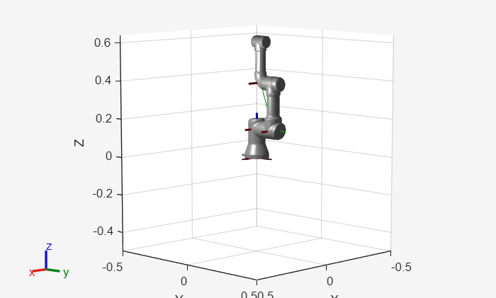
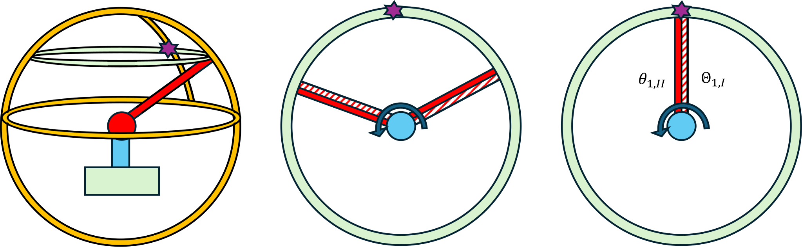
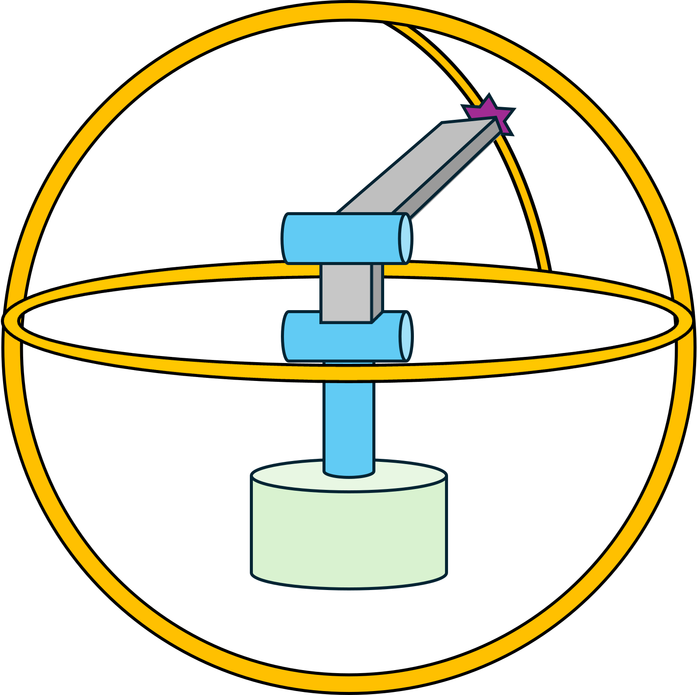
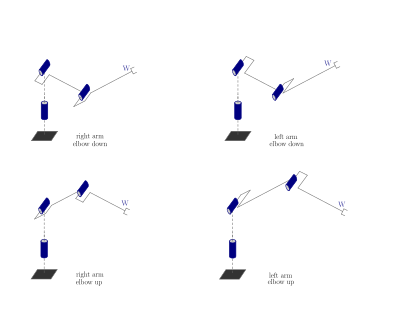
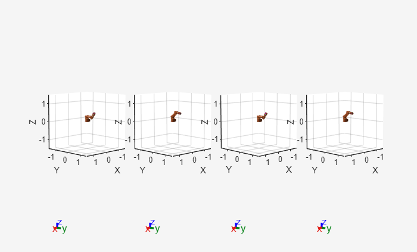

# Cinemàtica inversa

Quan la cinemàtica directa pregunta "Donats uns angles articulars, on és l’efector final?", la cinemàtica inversa (IK) planteja la pregunta inversa: "Donada una postura desitjada de l’efector final, quins angles articulars l’assoleixen?" La IK és la pedra angular de la planificació i el control del moviment robòtic. Tant si es programa un manipulador per agafar un objecte, com si es guia la mà d’un humanoide cap a un interruptor, o es coordina el braç i la base d’un manipulador mòbil, calcular configuracions articulars vàlides a partir d’objectius espacials és essencial.


Si la funció de cinemàtica directa d’un manipulador 

 $$ T\left(q\right)=\left\lbrack \begin{array}{ccccc}  &  &  & | & \newline  & R\left(q\right) &  & | & t\left(q\right)\newline  &  &  & | & \newline -- & -- & -- & + & --\newline 0 & 0 & 0 & | & 1 \end{array}\right\rbrack $$ 

mapeja les variables articulars $q\in {\mathbb{R}}^n \;$ a una postura de l’efector final T, aleshores la cinemàtica inversa busca una o més solucions q tals que

 $$ T\left(q\right)=T_{\textrm{desired}} =\left\lbrack \begin{array}{ccccc}  &  &  & | & \newline  & R_{\textrm{desired}}  &  & | & t_{\textrm{desired}} \newline  &  &  & | & \newline -- & -- & -- & + & --\newline 0 & 0 & 0 & | & 1 \end{array}\right\rbrack $$ 

A diferència de la cinemàtica directa, el problema de la IK pot tenir zero, una o infinites solucions, depenent de la geometria del manipulador, l’assolibilitat i la redundància.


Algunes estructures de manipuladors tenen solucions en forma tancada, cosa que ens permet calcular analíticament totes les solucions per a la transformació desitjada. Tots els models d’Universal Robots posseeixen la propietat de solucions en forma tancada, fet que els fa eficients per treballar-hi. 

# Braç antropomòrfic

El braç antropomòrfic és un exemple d’una estructura amb solució en forma tancada. Aquesta configuració s’utilitza sovint, ja que és possible calcular algebraicament les diferents solucions i controlar la posició (translació) de l’efector final sense considerar una orientació específica. Les tres primeres articulacions d’un robot universal formen aquesta configuració. 

```matlab
anthropomorphic_arm=loadrobot("universalUR3", DataFormat="column");
%eliminació de tots els enllaços addicionals
removeBody(anthropomorphic_arm, "tool0");
removeBody(anthropomorphic_arm, "ee_link");
removeBody(anthropomorphic_arm, "wrist_3_link");
removeBody(anthropomorphic_arm, "wrist_2_link");
removeBody(anthropomorphic_arm, "wrist_1_link");
show(anthropomorphic_arm, [0,-pi/2,0]')
```



```matlabTextOutput
ans = 
  Eixos (principal) amb propietats:

             XLim: [-0.5000 0.5000]
             YLim: [-0.5000 0.5000]
           XScale: 'linear'
           YScale: 'linear'
    GridLineStyle: '-'
         Position: [0.1300 0.1100 0.7750 0.8150]
            Units: 'normalized'

  Mostra totes les propietats

```


Per a un conjunt de paràmetres DH a, alpha, d (theta és l’estat articular), trobem la matriu de transformació homogènia A03

||||||
| :-: | :-: | :-: | :-: | :-: |
| Enllaç  | a $begin:math:display$m$end:math:display$  | alpha  | d $begin:math:display$m$end:math:display$  | theta   |
| 1  | 0  | pi/2  | 0  | q1   |
| 2  | a2  | 0  | 0  | q2   |
| 3  | a3  | 0  | 0  | q3   |

```matlab
syms a2 a3 q1 q2 q3 real
DH = [
        0 pi/2  0 q1; 
        a2 0    0 q2; 
        a3 0    0 q3
]; 
A01 = dh2tf(DH(1,:));
A12 = dh2tf(DH(2,:));
A23 = dh2tf(DH(3,:));
A03 = A01 * A12 * A23; 
A03 = simplify(A03)
```
A03 = 

  $$ \displaystyle \begin{array}{l} \left(\begin{array}{cccc} \cos \left(q_2 +q_3 \right)\,\cos \left(q_1 \right) & -\sin \left(q_2 +q_3 \right)\,\cos \left(q_1 \right) & \sin \left(q_1 \right) & \cos \left(q_1 \right)\,\sigma_1 \newline \cos \left(q_2 +q_3 \right)\,\sin \left(q_1 \right) & -\sin \left(q_2 +q_3 \right)\,\sin \left(q_1 \right) & -\cos \left(q_1 \right) & \sin \left(q_1 \right)\,\sigma_1 \newline \sin \left(q_2 +q_3 \right) & \cos \left(q_2 +q_3 \right) & 0 & a_3 \,\sin \left(q_2 +q_3 \right)+a_2 \,\sin \left(q_2 \right)\newline 0 & 0 & 0 & 1 \end{array}\right)\\\mathrm{}\\\textrm{where}\\\mathrm{}\\\;\;\sigma_1 =a_3 \,\cos \left(q_2 +q_3 \right)+a_2 \,\cos \left(q_2 \right)\end{array} $$ 
 

Per a una ubicació desitjada de l’efector final dins l’espai de treball assolible, ho podem resoldre fent servir un conjunt d’equacions. 

 $$ t_{\textrm{desired}} =\left\lbrack \begin{array}{c} x_{\textrm{desired}} \newline y_{\textrm{desired}} \newline z_{\textrm{desired}}  \end{array}\right\rbrack =\left\lbrack \begin{array}{c} \cos \left(q_1 \right)\cdot \left(a_3 \cdot \cos \left(\textrm{q2}+\textrm{q3}\right)+a_2 \cdot \cos \left(\textrm{q2}\right)\right)\newline \sin \left(q_1 \right)\cdot \left(a_3 \cdot \cos \left(\textrm{q2}+\textrm{q3}\right)+a_2 \cdot \cos \left(\textrm{q2}\right)\right)\newline a_3 \cdot \sin \left(q_2 +q_3 \right)+a_2 \cdot \sin \left(q_2 \right) \end{array}\right\rbrack $$ 


Considera aquest esquema d’un braç antropomòrfic, els seus marcs i una postura objectiu desitjada. Observa que l’origen del marc 0 i del marc 1 coincideixen; per tant, la distància des de Z0 i Z1 fins a l’objectiu és idèntica. A la figura següent, la distància des del marc 1 fins a l’objectiu està marcada com a R. Considera una esfera (groga) al voltant de l’articulació 1 amb un radi R. 


## $$ {\textrm{Càlcul}\;\theta }_3 $$

Observa la projecció 2D següent. El cercle groc és l’esfera amb radi R; l’esfera rosa és la rotació de l’articulació 3 amb $\theta_3$ amb un radi de $a_2$, corresponent a la longitud de l’articulació 3. Volem trobar les solucions per a $\theta_3$ perquè el marc de l’efector final es trobi sobre l’esfera groga. Observa com hi ha dues solucions que compleixen aquesta tasca:


 


Elevat al quadrat i sumant les coordenades cartesianes des del marc 1 (o des del marc 0 si coincideixen) fins a la postura objectiu, obtenim una expressió per a l’abast requerit del braç:

 $$ \;x_{\textrm{desired}}^2 +y_{\textrm{desired}}^2 +z_{\textrm{desired}}^2 =a_2^2 +a_3^2 +2\cdot \cos \left(q_3 \right)\cdot a_2 \cdot a_3 $$ 

Aquesta equació representa la llei del cosinus ( $c^2 =a^{2\;} +b^2 -2\textrm{ab}\cdot \cos \left(\gamma \right)$ ); tanmateix, en robòtica, un braç completament estès es representa amb un angle articular de 0. Per contra, en la llei del cosinus de la geometria estàndard, aquest braç estès es calcularia amb un angle de 180° (o $\pi$ ) . 


Aquest canvi en la referència angular dona lloc a l’expressió següent de la llei del cosinus:

 $$ \vec{{||P}_{\textrm{desired}} ||} =a_2^2 +a_3^2 -2\cdot \cos \left(\theta \;+\pi \right)\cdot a_2 \cdot a_3 $$ 

on hem substituït $\cos \left(\theta +\pi \;\right)$ per $-\cos \left(\theta \right)$.


Resolent per a $\cos \left(q_3 \right)$ s’obté l’expressió: 

 $$ \cos \left(q_3 \right)=\frac{x_{\textrm{desired}}^2 +y_{\textrm{desired}}^2 +z_{\textrm{desired}}^2 -a_2^2 -a_3^2 }{\;2\cdot a_2 \cdot a_3 }\; $$ 

La solució és admissible si $-1\le \cos \left(q_3 \right)\le 1$, cosa que és equivalent al fet que el punt desitjat es trobi dins l’espai de treball assolible. 

 $$ |a_2 -a_3 |\le \sqrt{x_{\textrm{desired}}^2 +y_{\textrm{desired}}^2 +z_{\textrm{desired}}^2 \;}\le |a_2 +a_3 | $$ 

on $|a_2 -a_3 |\;$ representa el braç plegat sobre si mateix $q_3 =\pi \;$ 


i $|a_2 +a_3 |$ el braç completament estès $q_3 =0$.


Fer servir la propietat: 


 ${\sin \left(q_3 \;\right)}^2 +{\cos \left(q_3 \right)}^{2\;} =1$ ens permet obtenir dues solucions per a $\sin \left(\beta \;\right)$ com: 

 $$ \sin \left(q_3 \right)=\pm \sqrt{\;1-\cos \left(q_3 \;\right)}\;\left\lbrace \begin{array}{ll} \sin^+ \left(q_3 \right)=+\sqrt{\;1-\cos \left(q_3 \right)} & \newline \sin^- \left(q_3 \right)=-\sqrt{\;1-\cos \left(q_3 \right)} &  \end{array}\right. $$ 

amb això pots calcular $q_3$ com

 $$ q_3 =\theta_3 =\textrm{atan2}\left(\sin \left(q_3 \right),\cos \left(q_3 \right)\right)\left\lbrace \begin{array}{ll} \theta_{3,I} =\textrm{atan2}\left(\sin^+ \left(q_3 \right),\cos \left(q_3 \right)\right)\in \left\lbrack -\pi ,\pi \;\right\rbrack  & \newline \theta_{3,\textrm{II}} =\textrm{atan2}\left(\sin^- \left(q_3 \right),\cos \left(q_3 \right)\right)=-\theta {\;}_{3,1}  &  \end{array}\right. $$ 
## $$ \textrm{Càlcul}\;\theta_2 $$

A la figura següent (esquerra) veus un tor verd, que es troba a la superfície de l’esfera a l’altura Z de la postura objectiu. Per calcular $\theta_2$, alinees l’enllaç (vermell) que resulta de la $\theta_3$ escollida amb el cercle verd. Observa com per a cada angle de $\theta_3$ hi ha dues solucions, cosa que dona un total de quatre solucions que compleixen aquesta tasca:


A partir de les expressions per a $x_{\textrm{desired}}$ i $y_{\textrm{desired}}$ podem obtenir l’equació: 

 $$ x_{\textrm{desired}}^2 +y_{\textrm{desired}}^2 ={\left(a_2 \cdot \cos \left(q_2 \right)+a_3 \cdot \cos \left(q_2 +q_3 \right)\right)}^2 $$ 

Incloure l’equació per a $z_{\textrm{desired}}$ dona lloc a un sistema d’equacions que ens permet resoldre $q_2$:

 $$ \textrm{Sistema}\;\textrm{d’}\;\textrm{equacions}\left\lbrace \begin{array}{ll} a_2 \cdot \cos \left(q_2 \right)+a_3 \cdot \cos \left(q_2 +q_3 \right)=\pm \sqrt{\;x_{\textrm{desired}}^2 +y_{\textrm{desired}}^2 } & \newline z_{\textrm{desired}} =a_2 \cdot \sin \left(q_2 \right)+a_3 \cdot \sin \left(q_2 +q_3 \right) &  \end{array}\right. $$ 

això ens permet expressar el sinus i el cosinus de $q_2 \;$ com:

 $$ \cos \left(q_2 \right)=\frac{\pm \sqrt{\;x_{\textrm{desired}}^2 +y_{\textrm{desired}}^2 }\cdot \left(a_2 +a_3 \cdot \cos \left(q_3 \right)\right)+z_{\textrm{desired}} \cdot a_3 \cdot \sin \left(q_3 \right)}{\;a_2^2 +a_3^2 +2\cdot a_2 \cdot a_3 \cdot \cos \left(q_3 \right)} $$ 

 $$ \sin \left(q_2 \right)=\frac{z_{\textrm{desired}} \cdot \left(a_2 +a_3 \cdot \cos \left(q_3 \right)\right)\mp \sqrt{\;x_{\textrm{desired}}^2 +y_{\textrm{desired}}^2 }\cdot a_3 \cdot \sin \left(q_3 \right)}{\;a_2^2 +a_3^2 +2\cdot a_2 \cdot a_3 \cdot \cos \left(q_3 \right)} $$ 


fent servir aquestes expressions podem derivar les solucions per a $\theta_2$ 

 $ \theta_2 =\textrm{atan2}\left(\sin \left(q_2 \right),\;\cos \left(q_2 \right)\right)= $ $ \left\lbrace \begin{array}{ll} \theta_{2,I}  & quan~es~fa~servir~sin(q_3 )^+ ~(\theta_{3,I} )~i~+\sqrt{~~~}~\newline \theta_{2,II}  & quan~es~fa~servir~sin(q_3 )^+ ~(\theta_{3,I} )~i~-\sqrt{~~~}\newline \theta_{2,III}  & quan~es~fa~servir~sin(q_3 )^- ~(\theta_{3,II} )~i~+\sqrt{~~~}\newline \theta_{2,IV}  & quan~es~fa~servir~sin(q_3 )^- ~(\theta_{3,II} )~i~-\sqrt{~~~} \end{array}\right. $ 

## $$ \textrm{Càlcul}\;\theta_1 $$

La figura següent és una projecció 2D des de dalt. Per alinear l’efector final amb la postura objectiu, gira l’eix $Z_0$ amb $\theta_1$. Observa com hi ha dues solucions depenent de la configuració de $\theta_3$ i $\theta_2$: 





Podem reescriure les expressions per a $x_{\textrm{desired}}$ i $y_{\textrm{desired}}$ com:

 $$ x_{\textrm{desired}} =\pm \cos \left(q_1 \right)\cdot \sqrt{x_{\textrm{desired}}^2 +y_{\textrm{desired}}^2 } $$ 

 $$ y_{\textrm{desired}} =\pm \sin \left(q_1 \right)\cdot \sqrt{x_{\textrm{desired}}^2 +y_{\textrm{desired}}^2 } $$ 

fent servir això podem calcular les solucions per a $\theta_1$. Observa com les expressions se simplifiquen, ja que $\sqrt{x_{\textrm{desired}}^2 +y_{\textrm{desired}}^2 }$ és un factor constant:

 $$ \theta_1 =\textrm{atan2}\left(\sin \left(q_1 \right),\cos \left(q_1 \right)\right)=\left\lbrace \begin{array}{ll} \;\theta_{1,I} =\textrm{atan2}\left(y_{\textrm{desired}} ,\;\;\;\;\;\;\;\;x_{\textrm{desired}} \right) & \textrm{quan}\;\textrm{s’utilitza}+\sqrt{\;\;\;\;\;\;}\newline \theta_{1,\textrm{II}} =\textrm{atan2}\left({-y}_{\textrm{desired}} ,{\;-x}_{\textrm{desired}} \right) & \textrm{quan}\;\textrm{s’utilitza}-\sqrt{\;\;\;\;\;\;} \end{array}\right. $$ 

## Solucions de cinemàtica inversa del braç antropomòrfic

La IK del braç antropomòrfic té quatre solucions: 

||||
| :-- | :-- | :-- |
|  | $\displaystyle {\sin \left(q_3 \right)}^+$  | $\displaystyle \sin \left(q_3 {\left.\right)}^- \right.$   |
| $\displaystyle +\sqrt{\;\;\;\;\;\;\;}$  | $\displaystyle \theta_{1,\mathrm{I}} \;;\;\theta_{2,\mathrm{I}} \;;\theta_{3,\mathrm{I}}$  | $\displaystyle \theta_{1,\mathrm{I}} \;;\;\theta_{2,\textrm{III}} \;;\theta_{3,\textrm{II}}$   |
| $\displaystyle -\sqrt{\;\;\;\;\;\;\;}$  | $\displaystyle \theta_{1,\textrm{II}} \;;\;\theta_{2,\textrm{II}} \;;\theta_{3,\mathrm{I}}$  | $\displaystyle \theta_{1,\textrm{II}} \;;\;\theta_{2,\textrm{IV}} \;;\theta_{3,\textrm{II}}$   |


Aplicar una configuració solució fa que el braç antropomòrfic arribi a la postura objectiu. 





Mira a continuació les diferents solucions il·lustrades 




# Canell esfèric

El canell esfèric és un altre exemple d’una configuració única per a solucions en forma tancada. Observa com tots els orígens dels marcs articulars s’intersequen en un únic punt. La configuració de canell esfèric s’utilitza per controlar l’orientació de l’efector final. 


Per a un conjunt de paràmetres DH a, alpha, d (theta és l’estat articular), trobem la matriu de transformació homogènia A36

||||||
| :-: | :-: | :-: | :-: | :-: |
| Enllaç  | a $begin:math:display$m$end:math:display$  | alpha  | d $begin:math:display$m$end:math:display$  | theta   |
| 4  | 0  | \-pi/2  | 0  | q4   |
| 5  | 0  | pi/2  | 0  | q5   |
| 6  | 0  | 0  | d6  | q6   |

```matlab
syms d6 q4 q5 q6 real
DH = [
        0  -pi/2    0   q4; 
        0  pi/2     0   q5; 
        0  0        d6  q6
]; 

A34 = dh2tf(DH(1,:));
A45 = dh2tf(DH(2,:));
A56 = dh2tf(DH(3,:));

A36 = A34 * A45 * A56;
simplify(A36)
```
ans = 

  $$ \displaystyle \left(\begin{array}{cccc} \cos \left(q_4 \right)\,\cos \left(q_5 \right)\,\cos \left(q_6 \right)-\sin \left(q_4 \right)\,\sin \left(q_6 \right) & -\cos \left(q_6 \right)\,\sin \left(q_4 \right)-\cos \left(q_4 \right)\,\cos \left(q_5 \right)\,\sin \left(q_6 \right) & \cos \left(q_4 \right)\,\sin \left(q_5 \right) & d_6 \,\cos \left(q_4 \right)\,\sin \left(q_5 \right)\newline \cos \left(q_4 \right)\,\sin \left(q_6 \right)+\cos \left(q_5 \right)\,\cos \left(q_6 \right)\,\sin \left(q_4 \right) & \cos \left(q_4 \right)\,\cos \left(q_6 \right)-\cos \left(q_5 \right)\,\sin \left(q_4 \right)\,\sin \left(q_6 \right) & \sin \left(q_4 \right)\,\sin \left(q_5 \right) & d_6 \,\sin \left(q_4 \right)\,\sin \left(q_5 \right)\newline -\cos \left(q_6 \right)\,\sin \left(q_5 \right) & \sin \left(q_5 \right)\,\sin \left(q_6 \right) & \cos \left(q_5 \right) & d_6 \,\cos \left(q_5 \right)\newline 0 & 0 & 0 & 1 \end{array}\right) $$ 
 

Per calcular els angles articulars $\theta_4 ,\theta_5$ i $\theta_6$ de manera que: 

 $$ R_6^3 \left(\theta_4 ,\theta_5 ,\theta_6 \right)=R_{\textrm{desired}} =\left\lbrack \begin{array}{ccc} n_x  & s_x  & a_x \newline n_y  & s_y  & a_y \newline n_z  & s_z  & a_z  \end{array}\right\rbrack $$ 
## Càlcul de $\theta_4 ,\theta_5$ i $\theta_6$ 
 $$ \theta_5 =\textrm{atan2}\left(\pm \sqrt{{\left(a_x \right)}^2 +{\left(a_y \right)}^2 },a_z \right) $$ 

 $$ \theta_5 =\left\lbrace \begin{array}{ll} \;\theta_5 \in \left(0,\pi \;\right) & \textrm{si}+\sqrt{\;\;\;\;\;\;\;}\textrm{és}\;\textrm{escollit}\to \sin \left(\theta_5 \right)>0\newline \theta_5 \in \left(-\pi \;,0\right) & \textrm{si}-\sqrt{\;\;\;\;\;\;\;}\textrm{és}\;\textrm{escollit}\to \sin \left(\theta_5 \right)<0 \end{array}\right. $$ 
### Cas $\sin \left(\theta_5 \right)>0$:
 $$ \theta_4 =\textrm{atan2}\left(a_y ,a_x \right) $$ 

 $$ \theta_6 =\textrm{atan2}\left(s_z ,-n_z \right) $$ 
### Cas $\sin \left(\theta_5 \right)<0$:
 $$ \theta_4 =\textrm{atan2}\left({-a}_y ,-a_x \right) $$ 

 $$ \theta_6 =\textrm{atan2}\left(-s_z ,n_z \right) $$ 

## Angle d’Euler ZYZ

Observa com els angles articulars d’un canell esfèric, quan està configurat com s’ha indicat anteriorment, són idèntics a una notació d’Euler ZYZ. 

```matlab
syms roll pitch yaw real 
Eul_ZYZ = rotz(roll)*roty(pitch)*rotz(yaw)
```
Eul_ZYZ = 

  $$ \displaystyle \left(\begin{array}{ccc} \cos \left(\textrm{pitch}\right)\,\cos \left(\textrm{roll}\right)\,\cos \left(\textrm{yaw}\right)-\sin \left(\textrm{roll}\right)\,\sin \left(\textrm{yaw}\right) & -\cos \left(\textrm{yaw}\right)\,\sin \left(\textrm{roll}\right)-\cos \left(\textrm{pitch}\right)\,\cos \left(\textrm{roll}\right)\,\sin \left(\textrm{yaw}\right) & \cos \left(\textrm{roll}\right)\,\sin \left(\textrm{pitch}\right)\newline \cos \left(\textrm{roll}\right)\,\sin \left(\textrm{yaw}\right)+\cos \left(\textrm{pitch}\right)\,\cos \left(\textrm{yaw}\right)\,\sin \left(\textrm{roll}\right) & \cos \left(\textrm{roll}\right)\,\cos \left(\textrm{yaw}\right)-\cos \left(\textrm{pitch}\right)\,\sin \left(\textrm{roll}\right)\,\sin \left(\textrm{yaw}\right) & \sin \left(\textrm{pitch}\right)\,\sin \left(\textrm{roll}\right)\newline -\cos \left(\textrm{yaw}\right)\,\sin \left(\textrm{pitch}\right) & \sin \left(\textrm{pitch}\right)\,\sin \left(\textrm{yaw}\right) & \cos \left(\textrm{pitch}\right) \end{array}\right) $$ 
 

```matlab
Spherical_rot = subs(A36(1:3,1:3), [q4, q5, q6], [roll, pitch, yaw])
```
Spherical_rot = 

  $$ \displaystyle \left(\begin{array}{ccc} \cos \left(\textrm{pitch}\right)\,\cos \left(\textrm{roll}\right)\,\cos \left(\textrm{yaw}\right)-\sin \left(\textrm{roll}\right)\,\sin \left(\textrm{yaw}\right) & -\cos \left(\textrm{yaw}\right)\,\sin \left(\textrm{roll}\right)-\cos \left(\textrm{pitch}\right)\,\cos \left(\textrm{roll}\right)\,\sin \left(\textrm{yaw}\right) & \cos \left(\textrm{roll}\right)\,\sin \left(\textrm{pitch}\right)\newline \cos \left(\textrm{roll}\right)\,\sin \left(\textrm{yaw}\right)+\cos \left(\textrm{pitch}\right)\,\cos \left(\textrm{yaw}\right)\,\sin \left(\textrm{roll}\right) & \cos \left(\textrm{roll}\right)\,\cos \left(\textrm{yaw}\right)-\cos \left(\textrm{pitch}\right)\,\sin \left(\textrm{roll}\right)\,\sin \left(\textrm{yaw}\right) & \sin \left(\textrm{pitch}\right)\,\sin \left(\textrm{roll}\right)\newline -\cos \left(\textrm{yaw}\right)\,\sin \left(\textrm{pitch}\right) & \sin \left(\textrm{pitch}\right)\,\sin \left(\textrm{yaw}\right) & \cos \left(\textrm{pitch}\right) \end{array}\right) $$ 
 

```matlab
isequal(Eul_ZYZ, Spherical_rot)
```

```matlabTextOutput
ans = logical
   1

```

## Condicions de solució en forma tancada

Un manipulador de sis GDL té una solució en forma tancada si es compleix alguna d’aquestes condicions:

-  Tres articulacions consecutives s’intersequen en un punt comú (com en el cas del canell esfèric), 
-  Tres eixos articulars rotatius consecutius són paral·lels (com en els robots UR) 
# Robotic System Toolbox

El Robotic System Toolbox inclou diferents solucionadors per obtenir solucions de cinemàtica inversa.

```matlab
ur3e=loadrobot("universalUR3e", DataFormat="column");
% Defineix la postura objectiu per a l’efector final
TargetPose=getTransform(ur3e, [0;0;0;0;0;0], "tool0", "base_link")
```

```matlabTextOutput
TargetPose = 4x4
   -1.0000    0.0000    0.0000    0.4567
    0.0000    0.0000    1.0000    0.2231
    0.0000    1.0000   -0.0000    0.0665
         0         0         0    1.0000

```

## Solucionador genèric

Comença creant un objecte de cinemàtica inversa com: 

```matlab
ik = inverseKinematics('RigidBodyTree', ur3e);
```

Defineix pesos per determinar la tolerància respecte de l’orientació i la posició.


Les tres primeres posicions defineixen la tolerància per a l’orientació; les tres últimes defineixen la tolerància per a la posició. Fes-les iguals si no es dona informació addicional. 

```matlab
weights = [1, 1, 1, 1, 1, 1];
```

Defineix la condició inicial de la configuració articular. Això ajudarà a trobar solucions properes a l’estat articular actual, optimitzant l’esforç per arribar a una postura objectiu específica. 

```matlab
initialConfig = [-pi; pi; pi/2; 0; 0; 0];
```

Aquest solucionador trobarà una solució des del marc base fins al marc objectiu especificat. Si no tens clar quin és el marc base, en pots obtenir el nom així: 

```matlab
base_name = ur3e.BaseName
```

```matlabTextOutput
base_name = 'base_link'
```


Per obtenir una solució, crida l’objecte de cinemàtica inversa i especifica el marc de l’efector final, els pesos de la postura objectiu i els estats articulars inicials. 

```matlab
[configSol, solInfo] = ik('tool0', TargetPose, weights, initialConfig);
```

trobaràs la solució a configSol i informació addicional a solInfo. La solució obtinguda tindrà el mateix format de dades que s’ha definit prèviament al robot, cosa que facilita treballar-hi. 

```matlab
getTransform(ur3e, configSol,"tool0", base_name)
```

```matlabTextOutput
ans = 4x4
   -1.0000   -0.0000    0.0000    0.4568
    0.0000   -0.0000    1.0000    0.2231
   -0.0000    1.0000    0.0000    0.0665
         0         0         0    1.0000

```

## Cinemàtica inversa analítica

El Robotic System Toolbox també inclou un solucionador analític de cinemàtica inversa. Es pot fer servir per obtenir totes les solucions si el robot presenta tres articulacions consecutives que s’intersequen en un punt comú (p. ex., un canell esfèric). 


Analitzant els models UR, observaràs que, tot i que tenen tres articulacions paral·leles consecutives, els models UR no presenten un canell esfèric. Per això, no es poden resoldre amb el solucionador analític de cinemàtica inversa. A continuació es mostra un exemple d’un robot que presenta aquesta configuració específica: 

```matlab
robot = loadrobot('abbIrb120','DataFormat','column');
%show(robot, robot.homeConfiguration)
```

Defineix la postura objectiu com una matriu de transformació homogènia:

```matlab
TargetPose = transl([0 0.5 0.5])
```

```matlabTextOutput
TargetPose = 4x4
1.0000         0         0         0
         0    1.0000         0    0.5000
         0         0    1.0000    0.5000
         0         0         0    1.0000

```


Configura el solucionador analític:

```matlab
AnalyticalSolver = analyticalInverseKinematics(robot)
```

```matlabTextOutput
AnalyticalSolver = 
  analyticalInverseKinematics amb propietats:

             KinematicGroup: [1x1 struct]
              RigidBodyTree: [1x1 rigidBodyTree]
         KinematicGroupType: 'RRRSSS'
    KinematicGroupConfigIdx: [1 2 3 4 5 6]
          IsValidGroupForIK: 1

```


El teu robot pot tenir múltiples articulacions que compleixin els requisits per a la resolució analítica. Visualitza i escull el grup desitjat fent servir:

```matlab
AnalyticalSolver.showdetails()
```

```matlabTextOutput
--------------------
Robot: (8 cossos)

Índex     Nom base    Nom cos EE       Tipus                   Accions
-----     ---------   ------------     ----                    -------
    1     base_link        link_6   RRRSSS   Fes servir aquest grup cinemàtic
    2     base_link         tool0   RRRSSS   Fes servir aquest grup cinemàtic
```


Per visualitzar el grup cinemàtic escollit: 

```matlab
AnalyticalSolver.KinematicGroup
```

```matlabTextOutput
ans = struct amb camps:
               BaseName: 'base_link'
    EndEffectorBodyName: 'tool0'

```


Genera un objecte de funció per al grup cinemàtic seleccionat: 

```matlab
generateIKFunction(AnalyticalSolver,'IKSolver')
```

```matlabTextOutput
ans = function_handle amb valor:
    @IKSolver

```


Obtén les solucions analítiques del robot amb: 

```matlab
ikConfig = IKSolver(TargetPose)
```

```matlabTextOutput
ikConfig = 4x6
   -1.4278   -1.5406   -0.6641    1.4553    1.6553    0.6290
1.7138    0.8130   -0.6641   -1.5494    1.7122    1.7212
   -1.4278   -1.5406   -0.6641   -1.6863   -1.6553    3.7706
1.7138    0.8130   -0.6641    1.5922   -1.7122   -1.4204

```


Aquesta funció sempre retornarà un format de dades en fila. Tingues-ho en compte quan facis servir les solucions. 


Dona un cop d’ull a les solucions: 

```matlab
numSolutions = size(ikConfig, 1); 
figure; 
for i = 1:size(ikConfig,1)
    subplot(1,numSolutions,i)
    show(robot,ikConfig(i,:)');
end
```




