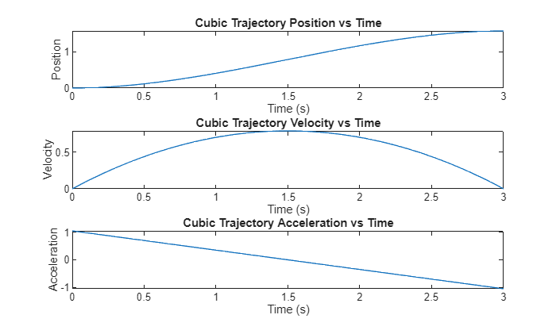
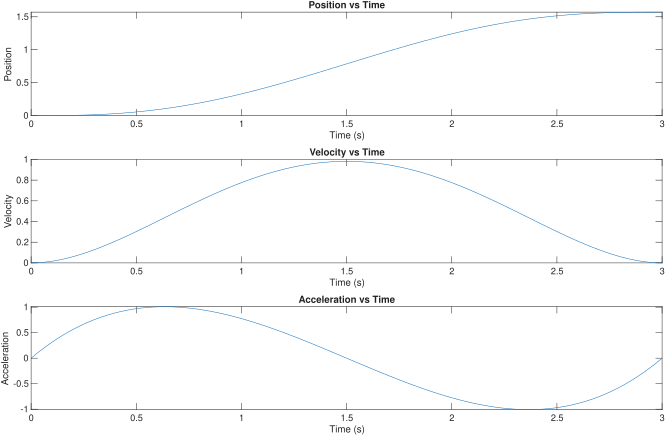
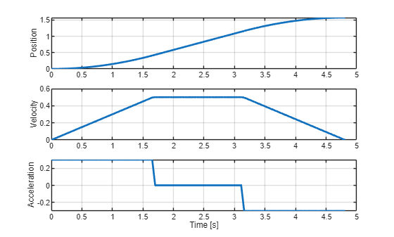

# Planificació de trajectòries en l’espai articular 

La planificació de trajectòries és una pedra angular del control del moviment robòtic: defineix **com** es mou un robot entre dues configuracions o postures de l’efector final al llarg del temps, subjecte a requisits de suavitat, temporització i límits físics (velocitats, acceleracions) de les seves articulacions o enllaços. Generant perfils continus de posició, velocitat i acceleració, els planificadors de trajectòries permeten als robots dur a terme tasques de manera segura, precisa i eficient, tant si segueixen una trajectòria de pick-and-place, com si solden una junta o cooperen amb humans.

# Espai cartesià i espai articular

La solució de cinemàtica inversa mapeja les coordenades cartesianes a l’espai articular. Si volem moure el robot d’una postura cartesiana a una altra, obtenim les posicions articulars inicials i la solució a la postura desitjada. Donades aquestes configuracions, hem de calcular com es mourà cada articulació per tenir una trajectòria suau.

# Interpolació polinòmica

La interpolació polinòmica ens permet calcular els estats articulars, les velocitats i les acceleracions per seguir un perfil específic. Normalment faràs servir una equació cúbica o quíntica.

## Perfil cúbic

Per aconseguir un perfil cúbic com el que es veu a continuació, has de resoldre les equacions paramètriques següents:


 $S\left(t\right)=A\cdot t^3 +B\cdot t^2 +C\cdot t+D$ = posició articular


 $\dot{\;S} \left(t\right)=3\cdot A\cdot t^2 +2\cdot B\cdot t+C$ = velocitat articular


Aquest sistema d’equacions té quatre incògnites (A,B,C,D); per tant, has de plantejar 4 equacions per resoldre aquest sistema. 


Per a un conjunt de paràmetres desitjats com: 

-          Estat articular inicial = 0 
-          Estat articular desitjat = $\frac{\pi }{2}$ 
-          Velocitat inicial = 0 
-          Velocitat desitjada a l’estat articular desitjat = 0 
-          Temps per al moviment = 5 s 

dona lloc al sistema lineal següent: 

 $$ \left\lbrace \begin{array}{ll} ~I & S(0)=0=D\newline ~II & \dot{S} (0)=0=C\newline ~III & S(5)=\pi /2=A\cdot 5^3 +B\cdot 5^2 +C\cdot 5+D\newline ~IV & \dot{S} (5)=0=3\cdot A\cdot 5^2 +2\cdot B\cdot 5+C \end{array}\right. $$ 

Podem simplificar les equacions III i IV substituint els resultats de I&II com: 

 $$ \left\lbrace \begin{array}{ll} ~I & S(0)=0=D\newline ~II & \dot{S} (0)=0=C\newline ~III & S(5)=\pi /2=A\cdot 5^3 +B\cdot 5^2 \newline ~IV & \dot{S} (5)=0=3\cdot A\cdot 5^2 +2\cdot B\cdot 5 \end{array}\right. $$ 

on podem trobar una equació paramètrica per a B reescrivint IV com:

 $$ B=-7\ldotp 5\cdot A $$ 

Substituint això a l’equació III podem derivar: 

 $$ A=-\frac{\pi }{125} $$ 

i finalment 

 $$ B=\frac{3}{50}\cdot \pi \; $$ 

Fer servir aquests valors dona lloc a les trajectòries: 


*El gràfic de posició segueix la funció cúbica amb els paràmetres A,B,C,D.*


Pots programar això fent servir el toolbox simbòlic. Per fer-ho, crea variables simbòliques per als paràmetres i el temps

```matlab
clear all 
syms A B C D t real
```

Defineix la funció paramètrica i la seva derivada: 

```matlab
S = A * t^3 + B*t^2 + C*t + D;
S_d = diff(S, t);
```

Crea expressions per a t=0 

```matlab
S_0 = subs(S, t, 0) == 0;
S_d0 = subs(S_d, t, 0) == 0;
```

i per a T = temps desitjat

```matlab
T = 5; 
S_T = subs(S, t, T) == pi/2;
S_dT = subs(S_d, t, T) == 0;
```

Ara pots trobar les solucions algebraicament o fer servir la funció solve del toolbox simbòlic: 

```matlab
eqns = [S_0, S_d0,  S_T, S_dT];
vars = [A, B, C, D];
% Fes servir vpasolve per a solucions numèriques
sol = solve(eqns, vars);
```

Converteix la solució a una matriu: 

```matlab
% Converteix la solució a una matriu
solution = struct2cell(sol);
solution = cell2mat(solution);
```

Substitueix els valors dels paràmetres A,B,C,D a les equacions de posició, velocitat i acceleració:

```matlab
posfunc = subs(S, vars, solution')
```
posfunc = 
 $\displaystyle \frac{3\,\pi \,t^2 }{50}-\frac{\pi \,t^3 }{125}$
 

```matlab
velfunc = subs(S_d, vars, solution')
```
velfunc = 
 $\displaystyle \frac{3\,\pi \,t}{25}-\frac{3\,\pi \,t^2 }{125}$
 

```matlab
S_dd = diff(S_d, t);
accfunc = subs(S_dd, vars, solution')
```
accfunc = 
 $\displaystyle \frac{3\,\pi }{25}-\frac{6\,\pi \,t}{125}$
 

Per obtenir un vector que contingui els estats articulars en temps discret, pots substituir un vector de temps a les equacions i obtenir les posicions, velocitats i acceleracions articulars:

```matlab
time = linspace(0, T, 100);
position = double(subs(posfunc, t, time));
velocity = double(subs(velfunc, t, time));
acceleration = double(subs(accfunc, t, time));
```
### Robotic System Toolbox

Per generar aquesta trajectòria fent servir el Robotic System Toolbox, pots fer servir la funció cubicpolytraj(): 


Comença creant un vector de temps que defineixi la resolució:

```matlab
clear all
T = 3; 
```

Crea un vector de temps igualment espaiat com: 

```matlab
timevec = linspace(0, T, 100);
```

Defineix el waypoint desitjat

```matlab
waypoints = [0, pi/2]; 
```

Defineix en quins temps s’han d’assolir aquests waypoints

```matlab
timepoints = [0,T];
```

Finalment, crida la funció de planificació de trajectòries

```matlab
[position,velocity,acceleration,pp] = cubicpolytraj(waypoints,timepoints,timevec); 
% Representa gràficament la trajectòria cúbica
figure;
subplot(3,1,1);
plot(timevec,position);
title('Posició de la trajectòria cúbica vs temps');
xlabel('Temps (s)');
ylabel('Posició');

subplot(3,1,2);
plot(timevec,velocity);
title('Velocitat de la trajectòria cúbica vs temps');
xlabel('Temps (s)');
ylabel('Velocitat');

subplot(3,1,3);
plot(timevec,acceleration);
title('Acceleració de la trajectòria cúbica vs temps');
xlabel('Temps (s)');
ylabel('Acceleració');
```


### Múltiples waypoints

També pots donar múltiples waypoints alhora. Pots definir-los seguint aquest codi: 

```matlab
timevec = linspace(0, 2*T, 100);
waypoints = [0, pi/3,pi]; 
timepoints = [0,T, 2*T];
velocities = [0,0.8,0];
[position,velocity,acceleration,pp] = cubicpolytraj(waypoints,timepoints,timevec, "VelocityBoundaryCondition",velocities); 

% Representa gràficament la trajectòria quíntica
figure;
subplot(3,1,1);
plot(timevec,position);
title('Posició de la trajectòria cúbica vs temps');
xlabel('Temps (s)');
ylabel('Posició');

subplot(3,1,2);
plot(timevec,velocity);
title('Velocitat de la trajectòria cúbica vs temps');
xlabel('Temps (s)');
ylabel('Velocitat');

subplot(3,1,3);
plot(timevec,acceleration);
title('Acceleració de la trajectòria cúbica vs temps');
xlabel('Temps (s)');
ylabel('Acceleració');
```


per accedir als coeficients polinòmics fes servir:  

```matlab
pp.coefs(2,:) %coeficients per a la trajectòria de 0 -> pi/2 (igual que s’ha calculat anteriorment)
```

```matlabTextOutput
ans = 1x4
    0.0113    0.0824         0         0

```


on cada fila correspon a un waypoint

```matlab
pp.coefs(3,:) %coeficients per a la trajectòria de pi/2 -> pi 
```

```matlabTextOutput
ans = 1x4
   -0.0663    0.1648    0.8000    1.0472

```

### Configuracions articulars

També pots calcular les trajectòries de configuracions articulars completes: 

```matlab
initialConfig = [0, 0, 0]; 
desiredConfig = [pi, -pi/2, pi/3]; 
timepoints = [0,timevec(end)]
```

```matlabTextOutput
timepoints = 1x2
     0     6

```

```matlab
waypoints = [initialConfig; desiredConfig]'
```

```matlabTextOutput
waypoints = 3x2
         0    3.1416
         0   -1.5708
         0    1.0472

```

```matlab
[position,velocity,acceleration,pp] = cubicpolytraj(waypoints,timepoints,timevec); 

figure;

% Defineix colors per a cada articulació
colors = lines(size(position, 1));

% Posició
subplot(3,1,1);
hold on;
for i = 1:size(position, 1)
    plot(timevec, position(i,:), 'Color', colors(i,:), 'DisplayName', sprintf('Joint %d', i));
end
title('Posició de la trajectòria cúbica vs temps');
xlabel('Temps (s)');
ylabel('Posició');
legend show;
hold off;

% Velocitat
subplot(3,1,2);
hold on;
for i = 1:size(velocity, 1)
    plot(timevec, velocity(i,:), 'Color', colors(i,:), 'DisplayName', sprintf('Joint %d', i));
end
title('Velocitat de la trajectòria cúbica vs temps');
xlabel('Temps (s)');
ylabel('Velocitat');
legend show;
hold off;

% Acceleració
subplot(3,1,3);
hold on;
for i = 1:size(acceleration, 1)
    plot(timevec, acceleration(i,:), 'Color', colors(i,:), 'DisplayName', sprintf('Joint %d', i));
end
title('Acceleració de la trajectòria cúbica vs temps');
xlabel('Temps (s)');
ylabel('Acceleració');
legend show;
hold off;
```


## Perfil **quíntic**

Mentre que el perfil cúbic només té en compte la posició i la velocitat desitjades en el temps objectiu, el perfil quíntic també permet definir una acceleració desitjada a l’inici i al final d’un moviment. Això pot fer que l’acceleració sigui 0 a l’inici i al final, fent així que el moviment del robot sigui molt més suau que en un perfil cúbic (vegeu els perfils de la figura següent). 


Per aconseguir un perfil quíntic com el que es veu a continuació, has de resoldre les equacions paramètriques següents:


 $S\left(t\right)=A\cdot t^5 +B\cdot t^4 +C\cdot t^3 +D\cdot t^2 +E\cdot t+F$ = posició articular


 $\dot{\;S} \left(t\right)=5\cdot A\cdot t^4 +4\cdot B\cdot t^3 +3\cdot C\cdot t^2 +2\cdot D\cdot t+E$ = velocitat articular


 $\ddot{\;S} \left(t\right)=20\cdot A\cdot t^3 +12\cdot B\cdot t^2 +6\cdot C\cdot t+2\cdot D$ = acceleració articular


resoldre aquestes equacions donarà lloc a la trajectòria següent:  




### Robotic System Toolbox

Per generar aquesta trajectòria fent servir el Robotic System Toolbox, pots fer servir la funció quinticpolytraj(). 


Per definir la resolució, primer hem de crear un vector de temps:

```matlab
clear all
T = 3; 
```

i després, crear un vector de temps igualment espaiat com: 

```matlab
timevec = linspace(0, T, 100);
```

Defineix el waypoint desitjat

```matlab
waypoints = [0, pi/2]; 
```

Defineix en quins temps s’han d’assolir aquests waypoints

```matlab
timepoints = [0,T];
```

crida la funció de planificació de trajectòries

```matlab
[position,velocity,acceleration,pp] = quinticpolytraj(waypoints,timepoints,timevec); 
% Representa gràficament la trajectòria quíntica
figure;
subplot(3,1,1);
plot(timevec,position);
title('Posició de la trajectòria quíntica vs temps');
xlabel('Temps (s)');
ylabel('Posició');

subplot(3,1,2);
plot(timevec,velocity);
title('Velocitat de la trajectòria quíntica vs temps');
xlabel('Temps (s)');
ylabel('Velocitat');

subplot(3,1,3);
plot(timevec,acceleration);
title('Acceleració de la trajectòria quíntica vs temps');
xlabel('Temps (s)');
ylabel('Acceleració');
```


# Perfil trapezoidal

Un perfil trapezoidal es defineix per tres fases:

-  Fase d’acceleració, amb una acceleració constant $a_{\max }$ 
-  Fase de velocitat constant, amb la velocitat de creuer constant $v_c$ 
-  Fase de desacceleració, amb una acceleració constant $-a_{\max }$ 

Observa el perfil de velocitat articular següent. 


Aquesta trajectòria es defineix per la velocitat de creuer $v_c$ i l’acceleració màxima $a_{\max }$.


Els estats articulars es poden descriure amb el conjunt d’equacions següent:  

 $$ q(t)=\left\lbrace \begin{array}{ll} q_0 +\frac{1}{2}\cdot sign(\Delta q)\cdot a_{\max } \cdot t^2 , & 0\le t<t_a \newline q_a +sign(\Delta q)\cdot v_{\textrm{c}} \cdot (t-t_a ), & t_a \le t<t_a +t_c \newline q_f -\frac{1}{2}\cdot sign(\Delta q)\cdot a_{\max } \cdot (t_f -t)^2 , & t_a +t_c \le t\le t_f  \end{array}\right. $$ 

amb l’estat articular inicial $q_0$ i l’estat articular objectiu $q_f$ en el temps $t_f$ i la direcció del desplaçament $\textrm{sign}\left(\Delta q\right)$. 


El temps per arribar a $t_a$ es pot calcular com: 

 $$ t_a =\frac{v_c }{a_{\max } } $$ 

donant lloc a l’estat articular 

 $$ q\left(t_a \right)=q_a =q_0 +\frac{1}{2}\cdot a_{\max } \cdot t_a^2 $$ 

amb un desplaçament de

 $$ \Delta q_a =\frac{1}{2}\cdot a_{\max } \cdot t_a^2 $$ 

Ara sigui

 $$ \Delta q=q_f -q_0 $$ 

Com que el desplaçament entre $t_0$ i $t_a$ és igual al desplaçament entre $t_c$ i $t_f$, podem fer servir la formulació següent per determinar el valor de $t_c$, que representa el temps passat a velocitat constant 

 $$ {\Delta q}_c =\Delta q-2\cdot \left(\frac{1}{2}\cdot a_{\max } \cdot t_a^2 \right) $$ 

on $\Delta q_c$ representa el desplaçament durant la fase de velocitat constant. La posició articular resultant al final d’aquesta fase es defineix com:

 $$ q_c =q_a +\Delta q_c \; $$ 

Finalment, obtenim la durada de la fase de velocitat constant: 

 $$ t_c =\frac{{\Delta \;q}_c }{v_c } $$ 

donant lloc a un temps total de

 $$ t_f =2\cdot t_a +t_c $$ 
## Cas especial

En cas que el desplaçament articular $\Delta q\;$ sigui petit respecte de la velocitat de creuer i l’acceleració desitjades, és possible que no s’arribi a la velocitat de creuer abans de la fase de desacceleració. 


La velocitat màxima assolible es pot calcular com:

 $$ v_{\max } =\sqrt{\;a_{\max } \cdot |\Delta q|\;} $$ 

si $v_{\max } <v_c$ aquest perfil tindrà una forma triangular sense arribar a $v_c$.


on: 

 $$ t_a =\sqrt{\;\frac{|\Delta q|\;}{a_{\max } }} $$ 

i

 $$ t_f =2\cdot t_a $$ 
```matlab
q0 = 0; 
qf = pi/2; 
v_c = 0.5; 
a_max=0.3; 

direction = sign(qf - q0);
delta_q = abs(qf - q0);

v_max = sqrt(a_max*delta_q);

if v_max <= v_c
    t_a = sqrt(delta_q/a_max)
else
    t_a = v_c / a_max;
end

q_a = 0.5 * a_max * t_a^2;

delta_qc = delta_q - 2 * q_a;
t_c = delta_qc / v_c;

t_f = 2 * t_a + t_c;

syms t real
delta_q_2a = 0.5 * a_max * t^2;
delta_q_2c = q_a + v_c * (t - t_a);
delta_q_2f = delta_q - 0.5 * a_max * (t_f - t)^2;

time = linspace(0, t_f, 100); 
q = zeros(100,1); 
v = zeros(100,1); 
a = zeros(100,1);

for i = 1:length(time)
    ti = time(i);
    if ti <= t_a
        q(i) = subs(delta_q_2a, t, ti);
        v(i) = subs(diff(delta_q_2a, t), t, ti);
        a(i) = a_max;
    elseif ti <= (t_a + t_c)
        q(i) = subs(delta_q_2c, t, ti);
        v(i) = subs(diff(delta_q_2c, t), t, ti);
        a(i) = 0;
    else
        q(i) = subs(delta_q_2f, t, ti);
        v(i) = subs(diff(delta_q_2f, t), t, ti);
        a(i) = -a_max;
    end
end

% Aplica la direcció i el desplaçament inicial
q = q0 + direction * double(q);
v = direction * double(v);
a = direction * a;

subplot(3,1,1); 
plot(time, q, 'LineWidth', 2);
ylabel('Position'); grid on;

subplot(3,1,2); 
plot(time, v, 'LineWidth', 2);
ylabel('Velocity'); grid on;

subplot(3,1,3); 
plot(time, a, 'LineWidth', 2);
ylabel('Acceleration'); xlabel('Time [s]'); grid on;
```



```matlab
clear all
```
## Robotic System Toolbox

Per generar aquesta trajectòria fent servir el Robotic System Toolbox, pots fer servir la funció trapveltraj(): 


Defineix els waypoints 

```matlab
q0 = 0; 
qf = pi/2; 
v_c = 0.5; 
a_max=0.3; 
waypoints = [q0 , qf];
```

Defineix la quantitat de passos per arribar als waypoints

```matlab
N = 100; 
```

Crida la funció amb les opcions per a restriccions de velocitat i acceleració:

```matlab
[q, v, a, time, pp]=trapveltraj(waypoints, N, "PeakVelocity", v_c, "Acceleration", a_max);
```

Altres restriccions opcionals són EndTime per definir la durada de la trajectòria i AccelTime, que defineix la durada de les fases d’acceleració. 

```matlab
desiredTime = 10; 
desiredAccelerationTime = 3.5;
[q2, v2, a2, time2, pp2]=trapveltraj(waypoints, N, "EndTime",desiredTime, "AccelTime",desiredAccelerationTime);
```

Pots combinar qualsevol combinació de dues restriccions per generar una trajectòria.

```matlab
figure;
subplot(3,2,1); 
plot(time, q, 'LineWidth', 2);
title('Posició (q) vs temps');
ylabel('Posició'); 
grid on;

subplot(3,2,3); 
plot(time, v, 'LineWidth', 2);
title('Velocitat (v) vs temps');
ylabel('Velocitat'); 
grid on;

subplot(3,2,5); 
plot(time, a, 'LineWidth', 2);
title('Acceleració (a) vs temps');
ylabel('Acceleració'); 
grid on;

subplot(3,2,2); 
plot(time2, q2, 'LineWidth', 2);
title('Posició (q2) vs temps2');
ylabel('Posició'); 
grid on;

subplot(3,2,4); 
plot(time2, v2, 'LineWidth', 2);
title('Velocitat (v2) vs temps2');
ylabel('Velocitat'); 
grid on;

subplot(3,2,6); 
plot(time2, a2, 'LineWidth', 2);
title('Acceleració (a2) vs temps2');
ylabel('Acceleració'); 
xlabel('Temps [s]'); 
grid on;
```


# Exemples de trajectòries a Rviz

Executa els botons següents per veure una trajectòria a Rviz. 

```matlab
initialConfig = zeros(1,6); 
desiredConfig = [0, -pi/2, pi/3, 0, -pi/2, pi]; 
wayPoints = [initialConfig;desiredConfig]';
timePoints = [0,5]; 
N=200; 
tSamples = linspace(0, 5, N);

[qc, qdc, qddc, ppc] = cubicpolytraj(wayPoints, timePoints, tSamples);
[qq, qdq, qddq, ppq] = quinticpolytraj(wayPoints, timePoints, tSamples);
[qt, qdt, qddt, ppt] = trapveltraj(wayPoints, N, "EndTime",5);

JointStatesToRviz(initialConfig)
```

```matlabTextOutput
ans = logical
   1

```

```matlab
  
JointStatesToRviz(qc', [], 5)
```

```matlabTextOutput
ans = logical
   1

```

```matlab
 
JointStatesToRviz(qq', [], 5)
```

```matlabTextOutput
ans = logical
   1

```

```matlab
 
JointStatesToRviz(qt', [], 5)
```

```matlabTextOutput
ans = logical
   1

```


Per veure la teva pròpia trajectòria, pots fer servir la funció preconstruïda JointStatesToRviz amb les entrades: 

1.  Estat articular o trajectòria
2. Model UR (deixa’l buit com "$begin:math:display$ $end:math:display$" per tenir ur3e per defecte)
3. Temps per completar la trajectòria articular
4. (opcional) entrada 'trajectory' i un valor booleà per mostrar la trajectòria com una línia groga a Rviz; això és true per defecte per a trajectòries. (per aturar la visualització d’una trajectòria antiga, prem el botó de reinici a la cantonada inferior esquerra)
```matlab
 
yourTrajectory = zeros(1,6); 
TimeToComplete = 1; 
URModel = 'ur5e';
JointStatesToRviz(yourTrajectory, URModel, TimeToComplete)
```

```matlabTextOutput
ans = logical
   1

```


*Recorda que aquest codi enviarà el teu braç robot a la postura $begin:math:display$0 0 0 0 0 0$end:math:display$*