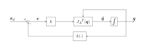

# Algorisme de cinemàtica inversa

Fer servir el jacobià ens permet configurar un algorisme per trobar una solució numèrica de cinemàtica inversa. Aquest enfocament es pot utilitzar per a manipuladors redundants o manipuladors on no existeix cap solució en forma tancada (solució analítica). 

La idea general és calcular la direcció des de l’efector final actual fins a la postura desitjada. Fent servir aquest vector de velocitat, t’aproximes iterativament a la postura desitjada mitjançant una discretització d’Euler. A cada pas discret, consideres la nova postura de l’efector final i el nou vector de velocitat fins a la convergència. 

Aquests algorismes fan servir el jacobià analític, ja que codifica l’orientació desitjada en termes de, per exemple, angles d’Euler.

# (Pseudo-)inversa del jacobià 

### Objectiu: 

Selecciona $\dot{q}$ de manera que $\dot{e} =\dot{x_d } -\dot{x_{\textrm{ee}} } =\dot{x_d } -J_A \left(q\right)\cdot \dot{q} <0$ 

### Teoria: 

Si triem $\dot{q} =J_A^{-1} \left(q\right)\cdot \left(\dot{x_d } +K\cdot e\right)$, aleshores la dinàmica de l’error és lineal: 

 $$ \dot{e} +K\cdot e=0 $$ 

La convergència a zero depèn dels valors propis de K. Com més grans siguin els valors propis, més ràpida serà la convergència. Tanmateix, guanys molt grans poden trencar implementacions en temps discret (sobreeiximent) o violar els límits articulars.

### Algorisme: 

Per a cada pas de temps discret k amb $\Delta t$:

 $$ q\left(t_{k+1} \right)=q\left(t_k \right)+\dot{q} \left(t_k \right)\cdot \Delta t $$ 

fins a la convergència. 

El jacobià utilitzat per als càlculs només és vàlid per a la configuració articular amb què s’ha calculat. Triar un pas temporal $\Delta t$ massa gran pot fer que no hi hagi convergència. 

### Esquema de control: 

on $k\left(\cdot \right)$ és la cinemàtica directa de q. 

### Notes: 
-  Normalment $\dot{x_d } =0$ i l’error en règim estacionari és 0, ja que hi ha un integrador al bucle 
-  Per a manipuladors redundants, s’ha de fer servir la pseudoinversa, ja que J és una matriu no quadrada. 
# Transposada del jacobià 

### Objectiu: 

Selecciona $\dot{q}$ de manera que $\dot{e} =\dot{x_d } -\dot{x_{\textrm{ee}} } =\dot{x_d } -J_A \left(q\right)\cdot \dot{q} <0$ 

### Teoria: 

Fes servir el mètode directe de Lyapunov per garantir l’estabilitat asimptòtica:

 $$ V\left(e\right)=\frac{1}{2}\cdot e^T \cdot K\cdot e $$ 

 $$ \dot{V} \left(e\right)=e^T \cdot K\cdot \dot{x_d } -e^T \cdot K\cdot J_A \left(q\right)\cdot \dot{q} $$ 
### Passos: 

Triant $\dot{q} =J_A^T \left(q\right)\cdot K\cdot e$, aleshores: 

 $$ \dot{V} \left(e\right)=e^T \cdot K\cdot \dot{x_d } -e^T \cdot K\cdot J_A^T \left(q\right)\cdot \dot{q} $$ 

si $\dot{x_d } =0$, aleshores $\dot{V} <0$ quan $J_A$ és de rang complet, assegurant l’estabilitat asimptòtica. 

### Esquema: 

on $k\left(\cdot \right)$ és la cinemàtica directa del manipulador. 

### Notes: 
-  Només cal calcular $J_A^T \left(q\right)$ i $k\left(\cdot \right)$.  
-  L’error d’orientació s’ha de tractar amb cura (l’ús d’angles d’Euler no és la millor opció).  