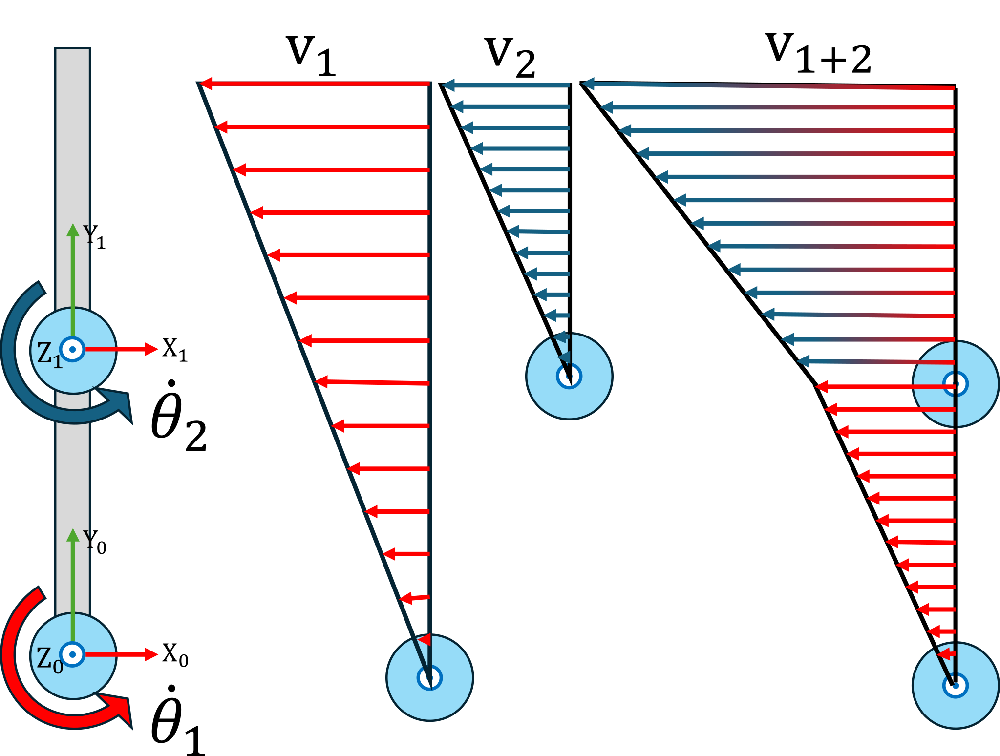
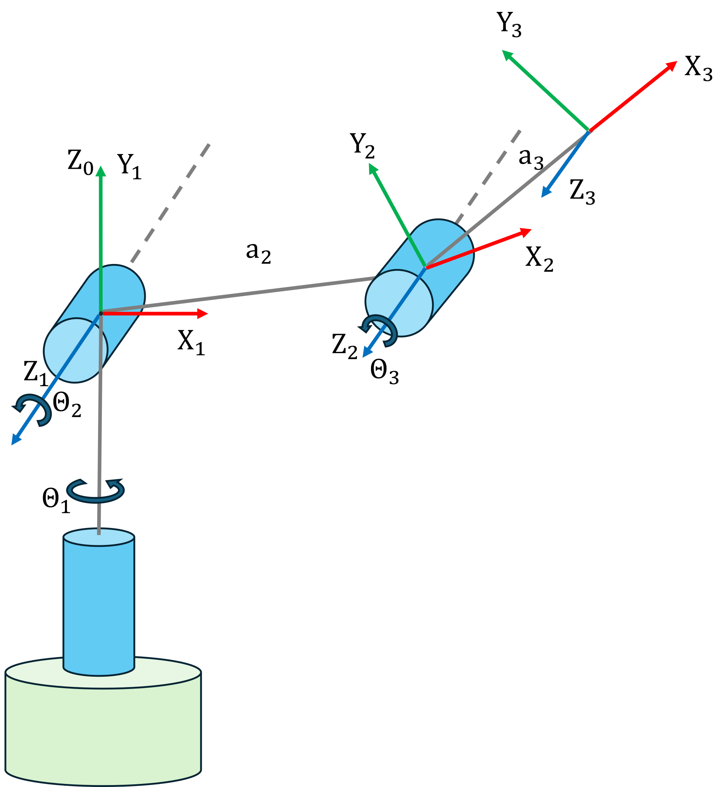

# Cinemàtica diferencial \- Jacobians

La cinemàtica diferencial és l’estudi de com els canvis infinitesimals en les coordenades articulars d’un robot es tradueixen en velocitats lineals i angulars instantànies del seu efector final. Centrant-se en les relacions de velocitat més que no pas en desplaçaments finits, proporciona la base per al control de velocitat, el seguiment de trajectòries i la planificació de moviment en temps real en manipuladors robòtics.


Al centre de la cinemàtica diferencial hi ha el **jacobià geomètric**, J(q), que mapeja el vector de velocitats articulars $\dot{\;q}$ a la velocitat espacial de l’efector final, $v=\left\lbrack \begin{array}{c} \dot{\;p} \newline \omega  \end{array}\right\rbrack =\left\lbrack \begin{array}{c} \dot{\;x} \newline \dot{\;y} \newline \dot{\;z} \newline \omega_x \newline \omega_y \newline \omega_z  \end{array}\right\rbrack$, mitjançant $v=J\left(q\right)\cdot \dot{\;q}$. 


Aquí, el bloc superior de J(q) captura com els moviments articulars indueixen velocitat translacional, mentre que el bloc inferior captura la velocitat angular induïda.


A més de la forma geomètrica, sovint es treballa amb el **jacobià analític**, que relaciona les velocitats articulars amb la derivada temporal d’una parametrització d’orientació escollida (p. ex., angles d’Euler ZYZ). Això requereix una transformació addicional que tingui en compte la cinemàtica de la representació de l’orientació, garantint la compatibilitat amb les coordenades angulars que es facin servir per al control o l’especificació de trajectòries.

# Jacobià geomètric

El jacobià geomètric es pot dividir en dues parts. 

 $$ J\left(q\right)=\left\lbrack \begin{array}{c} J_p \left(q\right)\newline J_{\Theta } \left(q\right) \end{array}\right\rbrack $$ 

la part translacional $J_p \left(q\right)\in {\mathbb{R}}^{3\;x\;n}$ 


i la part rotacional $J_{\Theta } \left(q\right)\in \mathbb{R}{\;}^{3\;x\;n\;}$ 


per a n articulacions. 


Imagina una única articulació que gira a una velocitat angular constant $\dot{\;\theta \;}$. Com que tota l’articulació girarà a aquesta velocitat angular, podem visualitzar les velocitats lineals en un moment donat. La velocitat respecte de l’eix articular es pot calcular com $||\vec{\;v} ||=\dot{\theta} \cdot \textrm{distància}\;\textrm{al}\;\textrm{centre}\;\textrm{de}\;\textrm{rotació}$, donant lloc a un augment lineal de la velocitat amb la distància a l’eix. Observa la imatge següent: pots veure que, en aquesta configuració, una rotació de $\dot{\theta_1 }$ donarà lloc a una velocitat en la direcció x, i a cap velocitat en les direccions y o z. 


A la configuració següent, la situació ha canviat. Tot i que encara no hi ha velocitat en la direcció z, el vector de velocitat ara té una component no nul·la en les posicions x i y. Observa que un jacobià només és vàlid per a la configuració articular per a la qual s’ha calculat; per tant, s’ha de recalcular per a cada instant de temps. 


## Part translacional $J_p \left(q\right)$ \- Articulacions rotatives

Per trobar la direcció de la velocitat, fas servir el producte vectorial. Recorda que el producte vectorial de dos vectors dona un vector perpendicular als vectors de càlcul. Per a aquesta aplicació, volem trobar el vector que és perpendicular tant a l’eix articular (z) com a la direcció cap a l’efector final o marc objectiu. La mida (magnitud) d’aquest vector vindrà definida per la distància (longitud) fins a l’efector final, ja que la longitud de l’eix z és $\vec{\;z_i } =A_{i-1}^0 \cdot \;\;\left\lbrack \begin{array}{c} 0\newline 0\newline 1 \end{array}\right\rbrack$ amb $||\vec{\;z_i } ||=1$ 


La fórmula és

 $$ J_{p,i} \;\left(q\right)=\vec{\;z_{i-1} } \times \left(p_{\textrm{ee}} -p_{i-1} \right) $$ 

on has de considerar totes les articulacions i enllaços que venen després de l’articulació donada, ja que una rotació de la base influirà en totes les articulacions consecutives en direcció cap a l’efector final. 


A continuació pots veure una imatge que il·lustra com es pot comportar la velocitat de l’efector final si s’actuen múltiples articulacions. Observa com l’articulació 1 afecta tant el marc Z1 com el marc EE, mentre que la segona articulació només influeix en el marc objectiu. 




## Part translacional $J_p \left(q\right)$ \- Articulacions prismàtiques

La part translacional per a articulacions prismàtiques es calcula més fàcilment, ja que la velocitat de l’actuador $\dot{\;q}$ és directament la velocitat de l’articulació. Per tant, la magnitud del vector de velocitat és

 $$ ||\vec{\;v} ||=\dot{\;q} =\dot{\;d} =||\;\vec{\;z} \cdot \dot{\;q} \;|| $$ 


La fórmula és 

 $$ J_{p,i} \;\left(q\right)=\vec{\;z_{i-1} } =A_{i-1}^0 \cdot \;\;\left\lbrack \begin{array}{c} 0\newline 0\newline 1 \end{array}\right\rbrack $$ 
### Vector de velocitat a partir de la part translacional $J_{p\;} \left(q\right)$ 

Per calcular el vector de velocitat, multiplica el vector de velocitats articulars com: 

 $$ \left\lbrack \begin{array}{c} \dot{x\;} \newline \dot{y\;} \newline \dot{z\;}  \end{array}\right\rbrack =J_p \left(q\right)\cdot \dot{\;q} $$ 
## Part rotacional $J_{\Theta } \left(q\right)$ \- Articulacions rotatives

De manera similar a la translació d’una articulació prismàtica, la part rotacional de $J_{\Theta } \left(q\right)$ és la velocitat articular. 

 $$ ||\omega_i ||=\dot{\;q} =\dot{\;\theta \;} $$ 

ara 

 $$ J_{\theta ,i} \;\left(q\right)=\vec{\;z_{i-1} } $$ 
## Part rotacional $J_{\Theta } \left(q\right)$ \- Articulacions prismàtiques

Les articulacions prismàtiques només actuen linealment; per tant, la part rotacional esdevé 0. 

 $$ J_{\Theta ,i} \;\left(q\right)=0 $$ 
### Vector de velocitat a partir de la part rotacional $J_{\Theta } \left(q\right)$ 

Per fer servir la part rotacional del jacobià, multiplica el vector de velocitats articulars com: 

 $$ \left\lbrack \begin{array}{c} \omega_x \;\newline \omega_y \newline \omega_z  \end{array}\right\rbrack =J_{\Theta \;} \left(q\right)\cdot \dot{\;q} $$ 
## Implementació en Matlab




considera els paràmetres DH d’un braç antropomòrfic:

||||||
| :-: | :-- | :-: | :-: | :-- |
| Enllaç  | a $begin:math:display$m$end:math:display$  | alpha  | d $begin:math:display$m$end:math:display$  | theta   |
| 1  | 0  | pi/2  | 0  | $\displaystyle \theta_1$   |
| 2  | 0.3  | 0  | 0  | $\displaystyle \theta_2$   |
| 3  |   0.4  | pi/2  | 0  | $\displaystyle \theta_3$   |

```matlab
syms q1 q2 q3 q4 q5 q6 real 
% Taula de paràmetres DH
        % a      alpha      d       theta
DH = [    0,     pi/2,     0,       q1;    % Enllaç 1
          0.3,   0,        0,       q2;    % Enllaç 2
          0.4,   0,        0,       q3;    % Enllaç 3
          ]; 

A01 = dh2tf(DH(1,:)); 
A12 = dh2tf(DH(2,:));
A23 = dh2tf(DH(3,:));

A02 = A01 * A12; 
A03 = A02 * A23; 

R01 = A01(1:3,1:3); 
R02 = A02(1:3,1:3);
R03 = A03(1:3,1:3); 

z0 = [0;0;1]; 
z1 = R01 * z0; 
z2 = R02 * z0; 

p0 = [0;0;0]; 
p1 = A01(1:3,4); 
p2 = A02(1:3,4); 

pee=A03(1:3,4); 

Jp1 = cross(z0,(pee-p0));
Jp2 = cross(z1, (pee - p1));
Jp3 = cross(z2, (pee - p2));

J(1:3,:) = [Jp1,Jp2,Jp3]; 
J(4:6,:) = [z0, z1, z2];

simplify(J)

Config = [0,-pi/2,0]; 

% Substitueix les variables articulars pels valors de configuració
J_substituted = subs(J, [q1, q2, q3], Config(1:3))

```
### Implementació amb Robotic System Toolbox

Podem fer servir el Robotic System Toolbox per obtenir el jacobià geomètric. Tanmateix, la funció geometricJacobian retorna el jacobià en el format: 

 $$ J=\left\lbrack \begin{array}{c} J_{\Theta \;} \newline J_p  \end{array}\right\rbrack $$ 

Observa com la part translacional i la part rotacional estan intercanviades. 

```matlab
ur3e = loadrobot("universalUR3e", "DataFormat", "column"); 
Config2 = [0,-pi/3,pi/7,pi/2,pi/2,0]';
J_toolbox = geometricJacobian(ur3e, Config2, 'tool0')
J_p_toolbox = J_toolbox(4:6,:); 
J_theta_toolbox = J_toolbox(1:3,:); 
```
# Jacobià analític

El jacobià analític relaciona les velocitats articulars d’un manipulador directament amb les derivades temporals d’una parametrització posició-orientació escollida de l’efector final, com ara angles d’Euler o angles roll-pitch-yaw.


A diferència del jacobià geomètric, que fa servir vectors de velocitat angular per a la part rotacional, el jacobià analític expressa tant el moviment lineal com l’angular en termes que coincideixen amb la representació de coordenades escollida. La part de velocitat lineal s’obté derivant el vector de posició de l’efector final respecte de les variables articulars, mentre que la part angular s’obté transformant la velocitat angular en taxes dels paràmetres d’orientació mitjançant una matriu de mapatge dependent de la configuració.


Aquesta forma és especialment útil quan les lleis de control, la planificació de trajectòries o les restriccions s’especifiquen directament en coordenades posició-orientació en lloc de fer-ho en forma de velocitat espacial.


El jacobià analític consta de dues parts: 

 $$ J_A \left(q\right)=\left\lbrack \begin{array}{c} J_p \left(q\right)\newline J_{\Phi } \left(q\right) \end{array}\right\rbrack =\left\lbrack \begin{array}{c} \frac{\partial p_{\textrm{ee}} }{\partial q}\newline \frac{\partial \;\Phi_{\textrm{ee}} \;}{\partial q} \end{array}\right\rbrack $$ 

En contrast amb el jacobià geomètric, fent servir l’enfocament de càlcul analític del jacobià, només hi ha una fórmula per a articulacions prismàtiques i rotatives.

## Part translacional $J_p \left(q\right)$ 

Com que el jacobià analític es basa en la derivació, mapeja directament els canvis en els estats articulars a velocitats (i, per tant, a posició), sense fer servir relacions geomètriques. Les parts translacionals del jacobià geomètric i analític són idèntiques. 


Donat un vector de translació de l’efector final $p_{\textrm{ee}}$ (aquí, el braç antropomòrfic), la part translacional $J_p \left(q\right)$ es calcula de la manera següent: 

 $$ p_{\textrm{ee}} =\left\lbrack \begin{array}{c} \cos \left(q_1 \right)\cdot \left(a_2 \cdot \cos \left(q_2 \right)+a_3 \cdot \cos \left(q_2 +q_3 \right)\right)\newline \sin \left(q_1 \right)\cdot \left(a_2 \cdot \cos \left(q_2 \right)+a_3 \cdot \cos \left(q_2 +q_3 \right)\right)\newline a_2 \cdot \sin \left(q_2 \right)+a_3 \cdot \sin \left(q_2 +q_3 \right) \end{array}\right\rbrack =\left\lbrack \begin{array}{c} x\newline y\newline z \end{array}\right\rbrack $$ 

 $$ J_p (\mathbf{q})=\left\lbrack \begin{array}{ccc} \frac{\partial x}{\partial q_1 } & \frac{\partial x}{\partial q_2 } & \frac{\partial x}{\partial q_3 }\newline \frac{\partial y}{\partial q_1 } & \frac{\partial y}{\partial q_2 } & \frac{\partial y}{\partial q_3 }\newline \frac{\partial z}{\partial q_1 } & \frac{\partial z}{\partial q_2 } & \frac{\partial z}{\partial q_3 } \end{array}\right\rbrack =\left\lbrack \begin{array}{ccc} -\sin (q_1 )\cdot \big(a_2 \cdot \cos (q_2 )+a_3 \cdot \cos (q_2 +q_3 )\big) & -\cos (q_1 )\cdot \big(a_2 \cdot \sin (q_2 )+a_3 \cdot \sin (q_2 +q_3 )\big) & -\cos (q_1 )\cdot a_3 \cdot \sin (q_2 +q_3 )\newline \cos (q_1 )\cdot \big(a_2 \cdot \cos (q_2 )+a_3 \cdot \cos (q_2 +q_3 )\big) & -\sin (q_1 )\cdot \big(a_2 \cdot \sin (q_2 )+a_3 \cdot \sin (q_2 +q_3 )\big) & -\sin (q_1 )\cdot a_3 \cdot \sin (q_2 +q_3 )\newline 0 & a_2 \cdot \cos (q_2 )+a_3 \cdot \cos (q_2 +q_3 ) & a_3 \cdot \cos (q_2 +q_3 ) \end{array}\right\rbrack . $$ 

## Part rotacional $J_{\Phi \;} \left(q\right)$ \- ZYZ 

Per calcular la part rotacional del jacobià analític, primer s’ha de decidir quina representació angular es farà servir. 


Exemple: 


Per als angles d’Euler ZYZ $\phi ,\theta \;$ i $\psi \;$ has de trobar una expressió que representi els angles en termes de la matriu de rotació de l’efector final. Consulta el tutorial "Transforms" a la secció Modelling per a altres representacions. 


Donada la matriu de rotació de l’efector final $R_{\textrm{ee}}$:

 $$ R_{ee} =\Phi_{ee} =\left\lbrack \begin{array}{ccc} \cos (q_1 )\cdot \cos (q_2 +q_3 ) & -\cos (q_1 )\cdot \sin (q_2 +q_3 ) & \sin (q_1 )\newline \sin (q_1 )\cdot \cos (q_2 +q_3 ) & -\sin (q_1 )\cdot \sin (q_2 +q_3 ) & -\cos (q_1 )\newline \sin (q_2 +q_3 ) & \cos (q_2 +q_3 ) & 0 \end{array}\right\rbrack =\left\lbrack \begin{array}{ccc} r_{11}  & r_{12}  & r_{13} \newline r_{21}  & r_{22}  & r_{23} \newline r_{31}  & r_{32}  & r_{33}  \end{array}\right\rbrack =R_z (\phi )\cdot R_{y^{\prime } } (\theta )\cdot R_{z^{\prime \prime } } (\psi ) $$ 

 $$ \begin{array}{l} \phi =atan2(r_{23} ,\,r_{13} )=atan2\big(-\cos (q_1 ),\,\sin (q_1 )\big)=q_1 -\frac{\pi }{2}\newline \theta =atan2\big(\sqrt{r_{13}^2 +r_{23}^2 },\,r_{33} \big)=atan2(1,\,0)=\frac{\pi }{2}\newline \psi =atan2(r_{32} ,\,-r_{31} )=atan2\big(\cos (q_2 +q_3 ),\,-\sin (q_2 +q_3 )\big)=q_2 +q_3 +\frac{\pi }{2} \end{array} $$ 

ara, derivant aquests angles respecte de les articulacions, s’obté la part rotacional del jacobià $J_{\Phi \;} \left(q\right)$ 

 $$ J_{\phi } (\mathbf{q})=\left\lbrack \begin{array}{ccc} \frac{\partial \phi }{\partial q_1 } & \frac{\partial \phi }{\partial q_2 } & \frac{\partial \phi }{\partial q_3 }\newline \frac{\partial \theta }{\partial q_1 } & \frac{\partial \theta }{\partial q_2 } & \frac{\partial \theta }{\partial q_3 }\newline \frac{\partial \psi }{\partial q_1 } & \frac{\partial \psi }{\partial q_2 } & \frac{\partial \psi }{\partial q_3 } \end{array}\right\rbrack =\left\lbrack \begin{array}{ccc} 1 & 0 & 0\newline 0 & 0 & 0\newline 0 & 1 & 1 \end{array}\right\rbrack $$ 
### Conversió entre $J_{\Theta } \left(q\right)$ i $J_{\Phi } \left(q\right)$ 

Les parts rotacionals dels jacobians geomètric i analític estan relacionades per la matriu $T_A \left(\Phi \right)$ i es poden convertir l’una en l’altra. 

 $$ J_{\Theta \;} \left(q\right)=T_A \left(\Phi \right)\cdot J_{\Phi } \left(q\right) $$ 

amb 

 $$ T_A \left(\Phi \right)=\left\lbrack \begin{array}{ccc} 0 & -\sin \left(\phi \right) & \cos \left(\phi \right)\cdot \sin \left(\theta \right)\newline 0 & -\sin \left(\phi \right)\cdot \sin \left(\theta \right) & -\sin \left(\phi \right)\cdot \sin \left(\theta \right)\newline 1 & \cos \left(\theta \right) & \cos \left(\theta \right) \end{array}\right\rbrack $$ 

 $$ J_{\Theta } (\mathbf{q})=T_A (\Phi )\cdot J_{\Phi } (q)=\left\lbrack \begin{array}{ccc} 0 & -\sin (\phi ) & \cos (\phi )\cdot \sin (\theta )\newline 0 & \cos (\phi ) & \sin (\phi )\cdot \sin (\theta )\newline 1 & 0 & \cos (\theta ) \end{array}\right\rbrack \cdot \left\lbrack \begin{array}{ccc} 1 & 0 & 0\newline 0 & 0 & 0\newline 0 & 1 & 1 \end{array}\right\rbrack =\left\lbrack \begin{array}{ccc} 0 & \cos (\phi )\cdot \sin (\theta ) & \cos (\phi )\cdot \sin (\theta )\newline 0 & \sin (\phi )\cdot \sin (\theta ) & \sin (\phi )\cdot \sin (\theta )\newline 1 & \cos (\theta ) & \cos (\theta ) \end{array}\right\rbrack $$ 

com que $\phi =q_1 -\frac{\pi }{2}$ i $\theta =\frac{\pi }{2}$, aleshores $\cos \left(\phi \right)=\sin \left(q_1 \right),\;\;\;\sin \left(\phi \right)=-\cos \left(q_1 \right),\;\;\cos \left(\theta \right)=0$ i $\sin \left(\theta \right)=1$. Per tant: 

 $$ J_{\Theta } \left(q\right)=\left\lbrack \begin{array}{ccc} 0 & \sin \left(q_1 \right) & \sin \left(q_1 \right)\newline 0 & -\cos \left(q_1 \right) & -\cos \left(q_1 \right)\newline 1 & 0 & 0 \end{array}\right\rbrack $$ 
### Vector de velocitat a partir de la part rotacional $J_{\Phi \;} \left(q\right)$ 

Per fer servir la part rotacional del jacobià, multiplica el vector de velocitats articulars com: 

 $$ \left\lbrack \begin{array}{c} \dot{\;\phi \;} \newline \dot{\;\theta \;} \newline \dot{\;\psi \;}  \end{array}\right\rbrack =J_{\Phi } \left(q\right)\cdot \dot{\;q} $$ 
## Implementació en Matlab
```matlab
 Jpa_1 = diff(pee, q1);
 Jpa_2 = diff(pee, q2);
 Jpa_3 = diff(pee, q3);
 
 Ree = simplify(R03); 
 
 phi = atan2(Ree(2,3), Ree(1,3)); 
 theta = atan2(sqrt(Ree(1,3)^2+Ree(2,3)^2),Ree(3,3));
 psi = atan2(Ree(3,2), -Ree(3,1)); 

 Jphi = [phi; theta; psi]; 

 Jphi_1 = diff(Jphi, q1); 
 Jphi_2 = diff(Jphi, q2); 
 Jphi_3 = diff(Jphi, q3);

 J_A = simplify([Jpa_1,Jpa_2,Jpa_3; ...
     Jphi_1, Jphi_2, Jphi_3]) 
```
J_A = 

  $$ \displaystyle \begin{array}{l} \left(\begin{array}{ccc} -\frac{\sin \left(q_1 \right)\,\sigma_2 }{10} & -\frac{\cos \left(q_1 \right)\,\sigma_1 }{10} & -\frac{2\,\sin \left(q_2 +q_3 \right)\,\cos \left(q_1 \right)}{5}\newline \frac{\cos \left(q_1 \right)\,\sigma_2 }{10} & -\frac{\sin \left(q_1 \right)\,\sigma_1 }{10} & -\frac{2\,\sin \left(q_2 +q_3 \right)\,\sin \left(q_1 \right)}{5}\newline 0 & \sigma_3 +\frac{3\,\cos \left(q_2 \right)}{10} & \sigma_3 \newline 1 & 0 & 0\newline 0 & 0 & 0\newline 0 & 1 & 1 \end{array}\right)\\\mathrm{}\\\textrm{where}\\\mathrm{}\\\;\;\sigma_1 =4\,\sin \left(q_2 +q_3 \right)+3\,\sin \left(q_2 \right)\\\mathrm{}\\\;\;\sigma_2 =4\,\cos \left(q_2 +q_3 \right)+3\,\cos \left(q_2 \right)\\\mathrm{}\\\;\;\sigma_3 =\frac{2\,\cos \left(q_2 +q_3 \right)}{5}\end{array} $$ 
 

```matlab

 J_A_subs = subs(J_A, [q1,q2,q3], Config)
```
J_A_subs = 

  $$ \displaystyle \left(\begin{array}{ccc} 0 & \frac{7}{10} & \frac{2}{5}\newline 0 & 0 & 0\newline 0 & 0 & 0\newline 1 & 0 & 0\newline 0 & 0 & 0\newline 0 & 1 & 1 \end{array}\right) $$ 