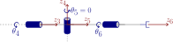
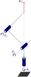

# Manipulabilitat

La manipulabilitat és un concepte clau en robòtica que quantifica amb quina facilitat un manipulador pot produir moviment o exercir forces en diferents direccions des d’una configuració donada. Està estretament vinculada a les propietats de la matriu jacobiana del robot, que mapeja les velocitats articulars a velocitats de l’efector final. Estudiant el *rang* del jacobià, podem determinar si el robot pot assolir velocitats arbitràries en l’espai de tasca o si està operant sota restriccions. Les situacions en què el jacobià perd rang es coneixen com a *singularitats*. En aquestes configuracions de *singularitat*, certes direccions de moviment esdevenen inassolibles o requereixen velocitats articulars desproporcionadament grans. Per contra, els robots amb més articulacions que el mínim requerit per realitzar una tasca presenten *redundància*, que es pot explotar per millorar la manipulabilitat, evitar obstacles o optimitzar criteris secundaris. Entendre aquests conceptes interrelacionats és essencial per a una planificació del moviment, un control i una operació segura eficaços dels manipuladors robòtics.


**1. El·lipsoides de manipulabilitat**


Podem visualitzar la manipulabilitat com un el·lipsoide. 


Projectant el jacobià a l’espai de tasca, podem visualitzar el conjunt de velocitats assolibles de l’efector final per a una norma unitària de velocitats articulars. Els valors propis i vectors propis de $J_p$ o $J_{\Theta \;}$ defineixen la forma de l’el·lipsoide, on els vectors propis corresponen a la direcció i el valor propi a la longitud d’aquest eix. Aquest conjunt forma un **el·lipsoide**:

-  **Eixos grans** → el moviment és fàcil en aquella direcció. 
-  **Eixos petits** → el moviment és limitat. 
-  **Eixos col·lapsats** → el moviment és impossible en aquella direcció (singularitat). 

Considera el robot UR3e en una configuració aleatòria

```matlab
ur3e = loadrobot("universalUR3e", "DataFormat","column");

%config = [0,-pi/2,0,-pi/2,0,0]'; 
config = randomConfiguration(ur3e); 
config = [0,-pi/1.5, pi/2.5, -pi/2,-pi/2,0]'; 
% config = [0,-pi/2,0,-pi/2,0,0]'; 
```

per a cada part del jacobià (translació i rotació), podem calcular els eixos fent servir la descomposició en valors singulars (SVD). Amb 

 $$ J_t \;=U*\Sigma *V\prime $$ 

on $U$ és una matriu dels vectors dels semieixos de l’el·lipsoide, $\Sigma$ conté els valors singulars, $\sigma_i$, que són iguals a la longitud dels eixos. Finalment, $V$ conté la configuració relativa per assolir velocitats en els eixos de $U$. 


L’índex de manipulabilitat és el volum de l’el·lipsoide. 


Per calcular l’índex de manipulabilitat per a una configuració específica:

 $$ m_{\textrm{trans}} =\sqrt{\det \left(J_p \cdot J_p^T \right)}=\sqrt{\lambda_1 \cdot \lambda_2 \cdot \lambda_3 }=\sigma_1 \cdot \sigma_2 \cdot \sigma_3 $$ 

i


 $m_{\textrm{rot}} =\sqrt{\det \left(J_{\Theta } \cdot J_{\Theta \;\;} \right)}$ o $\sqrt{\det \left(J_{\Phi \;} \cdot J_{\Phi \;} \right)}=\sqrt{\lambda_1 \cdot \lambda_2 \cdot \lambda_3 }=\sigma_1 \cdot \sigma_2 \cdot \sigma_3$ 

```matlab
J  = geometricJacobian(ur3e, config, "tool0");   % 6×6, base frame
J_r = J(1:3,:); 
J_t = J(4:6,:);   
T = getTransform(ur3e, config, 'tool0'); 
p_ee = T(1:3,4); 

% SVD: J_t = U*S*V'

[U_t,S_t,~] = svd(J_t,'econ');                        % U: eixos (marc base), S: diag(σ)
trans_axes_lengths = diag(S_t)';                          % [σ1 σ2 σ3]
m_t = prod(trans_axes_lengths)                           % índex de manipulabilitat
```

```matlabTextOutput
m_t = 0.0163
```

```matlab

[U_r,S_r,~] = svd(J_r,'econ');                        % U: eixos (marc base), S: diag(σ)
rot_axes_lengths = diag(S_r)';                          % [σ1 σ2 σ3]
m_r = prod(rot_axes_lengths)   
```

```matlabTextOutput
m_r = 2.4495
```

```matlab

% % Esfera unitària -> el·lipsoide: E = U*S*[punts de l’esfera]
[xu,yu,zu] = sphere(50);
P_t = [xu(:)'; yu(:)'; zu(:)'];                           % 3×N
E_t = U_t*S_t*P_t;                                        % 3×N, marc base
x_t = reshape(E_t(1,:), size(xu))+p_ee(1);
y_t = reshape(E_t(2,:), size(yu))+p_ee(2);
z_t = reshape(E_t(3,:), size(zu))+p_ee(3);

figure; surf(x_t,y_t,z_t,'FaceAlpha',0.4'); hold on;

plot3(p_ee(1),p_ee(2),p_ee(3),'.','MarkerSize',20,'Color','r');
axis equal; grid on; xlabel x; ylabel y; zlabel z;
title(sprintf('Manipulabilitat translacional m = %.4g', m_t)); hold off; 
```


vegeu-ho a Rviz

```matlab
JointStatesToRviz(config, 'ur3e', [],  'Ellipsoid', true);
```
## Robotic System Toolbox

Fent servir el Robotic System Toolbox, pots calcular fàcilment l’índex de manipulabilitat d’una configuració:

```matlab
m_rs = manipulabilityIndex(ur3e, config');
```

on això retornarà la manipulabilitat combinada de translació i rotació. 


Per a un conjunt de dimensions de l’espai de tasca, pots comprovar l’índex com: 

```matlab
m_rs_rot = manipulabilityIndex(ur3e, config',MotionComponent="angular");
```

o per a moviments específics pots fer servir un vector per especificar l’espai de tasca requerit. 

```matlab
m_rs_custom = manipulabilityIndex(ur3e, config',MotionComponent=[1,0,1,1,0,0]);
```

La funció generateRobotWorkspace et permet visualitzar l’espai de treball del teu robot i analitzar l’índex de manipulabilitat en cada punt. 

```matlab
figure; 
show(ur3e, [0,-pi/2,0,-pi/2,0,0]');
ee = "tool0";

rng default
[workspace,configs] = generateRobotWorkspace(ur3e,{},ee,IgnoreSelfCollision="on");

mIdx = manipulabilityIndex(ur3e,configs,ee);

hold on
showWorkspaceAnalysis(workspace,mIdx,Voxelize=true)
axis auto
title("Voxelized Manipulability-Encoded Workspace")
hold off
```


# Rang del jacobià 

El rang del jacobià proporciona informació crucial sobre la manipulabilitat del robot. Per a una dimensió N donada de l’espai de tasca, el rang de la part corresponent del jacobià hauria de ser N per assolir una manipulabilitat completa. Si el rang del jacobià és inferior a N, existeix almenys un moviment que no es pot realitzar o controlar de manera independent.


En termes d’àlgebra lineal, el rang correspon al nombre d’elements pivots en la forma esglaonada per files del jacobià. Cada pivot representa una direcció independent de moviment en l’espai de tasca. Tingues en compte que els pivots absents indiquen moviments dependents i una reducció de la manipulabilitat.


De manera similar, en termes de valors singulars, cada valor singular no nul correspon a una direcció controlable. Un valor singular zero indica una direcció al llarg de la qual l’efector final no es pot moure, reflectint directament la pèrdua de manipulabilitat en aquella direcció.

```matlab
N = rank(J)
```

```matlabTextOutput
N = 6
```

```matlab
N_t = rank(J_t)
```

```matlabTextOutput
N_t = 3
```

```matlab
N_r = rank(J_r)
```

```matlabTextOutput
N_r = 3
```

# Singularitats

Els punts on el jacobià perd rang es coneixen com a singularitats o configuracions singulars. En aquestes configuracions, l’el·lipsoide es converteix en una el·lipse o una línia. 


Hi ha dos tipus de singularitats:

### Singularitats de frontera
-  Es produeixen quan el robot està retret/estirat (per a UR, per exemple, configuració $begin:math:display$0\,\\\-pi\/2\,0\,\\\-pi\/2\,0\,0$end:math:display$) 
-  Generalment es poden evitar si la postura objectiu és dins l’espai de treball assolible 

La figura següent mostra un braç completament estirat on, per a la configuració mostrada, no és possible cap velocitat en x o y. En altres termes, si $\theta_2 =0$ pots considerar que el braç robot és una única articulació controlada per $\theta_1$ amb longitud $a_1 +a_2$. Com que cal almenys una articulació per GDL, aquest manipulador només té 1 GDL restant. 

 $$ J\left(q\right)=\left\lbrack \begin{array}{cc} -a_1 \cdot \sin \left(q_1 \right)-a_2 \cdot \sin \left(q_1 +q_2 \right) & -a_2 \cdot \sin \left(q_1 +q_2 \right)\newline a_1 \cdot \cos \left(q_1 \right)+a_2 \cdot \cos \left(q_1 +q_2 \right) & a_2 \cdot \cos \left(q_1 +q_2 \right) \end{array}\right\rbrack $$ 


### Singularitats internes 
-  Es produeixen dins l’espai de treball assolible 
-  Generalment són causades per l’alineació de dos o més eixos de moviment 

La figura següent mostra un canell esfèric en una configuració singular. Com que $\theta_4$ i $\theta_6$ es troben en el mateix eix, controlen el mateix moviment. Considera la part rotacional del jacobià per a aquest canell esfèric: 

 $$ J_{\Theta } =\left\lbrack \begin{array}{ccc} \vec{\;z_3 }  & \vec{\;z_4 }  & \vec{\;z_5 }  \end{array}\right\rbrack =\left\lbrack \begin{array}{ccc} \vec{\;z_3 }  & \vec{\;z_4 }  & \vec{\;z_3 }  \end{array}\right\rbrack =\left\lbrack \begin{array}{ccc} 1 & 0 & 1\newline 0 & 1 & 0\newline 0 & 0 & 0 \end{array}\right\rbrack $$ 



## Desacoblament de singularitats 

Per a un manipulador amb canell esfèric, les singularitats es poden desacoblar. Això et permet analitzar les singularitats del braç i les singularitats del canell per separat. 


Sigui $p_e$ el lloc on s’intersequen els eixos de les tres articulacions del canell: 

 $$ J=\left\lbrack \begin{array}{cc} J_{11}  & J_{12} \newline J_{21}  & J_{22}  \end{array}\right\rbrack $$ 

 $$ \left\lbrack \begin{array}{c} J_{12} \newline J_{22}  \end{array}\right\rbrack =\left\lbrack \begin{array}{ccc} z_3 \cdot \;\left(p_e -p_3 \right) & z_4 \cdot \;\left(p_e -p_4 \right) & z_5 \cdot \;\left(p_e -p_5 \right)\newline z_3  & z_4  & z_5  \end{array}\right\rbrack =\left\lbrack \begin{array}{ccc} 0 & 0 & 0\newline z_3  & z_4  & z_5  \end{array}\right\rbrack $$ 

Aleshores $\det \left(J\right)=\det \left(J_{11} \right)\cdot \det \left(J_{22} \right)$, és a dir, les singularitats del manipulador són les del braç ( $\det \left(J_{11} \right)=0$ ) més les del canell ( $\det \left(J_{22} \right)=0$ ).

### Singularitats del braç
-  Depenen de l’estructura cinemàtica  
-  Per al braç antropomòrfic:  

 


donat el jacobià del braç antropomòrfic: 

 $$ J_p (q)=\left\lbrack \begin{array}{ccc} -\sin (q_1 )\cdot \left(a_2 \cdot \cos (q_2 )+a_3 \cdot \cos (q_2 +q_3 )\right) & -\cos (q_1 )\cdot \left(a_2 \cdot \sin (q_2 )+a_3 \cdot \sin (q_2 +q_3 )\right) & -a_3 \cdot \cos (q_1 )\cdot \sin (q_2 +q_3 )\newline +\cos (q_1 )\cdot \left(a_2 \cdot \cos (q_2 )+a_3 \cdot \cos (q_2 +q_3 )\right) & -\sin (q_1 )\cdot \left(a_2 \cdot \sin (q_2 )+a_3 \cdot \sin (q_2 +q_3 )\right) & -a_3 \cdot \sin (q_1 )\cdot \sin (q_2 +q_3 )\newline 0 & a_2 \cdot \cos (q_2 )+a_3 \cdot \cos (q_2 +q_3 ) & a_3 \cdot \cos (q_2 +q_3 ) \end{array}\right\rbrack $$ 

el determinant és:  

 $$ \det \left(J_p \right)=-a_2 \cdot a_3 \cdot \sin \left(q_3 \right)\cdot \left(a_2 \cdot \cos \left(q_2 \right)+a_3 \cdot \cos \left(q_2 +q_3 \right)\right) $$ 

aleshores $\det \left(J_p \right)=0$ si:

-  $\displaystyle \sin \left(q_3 \right)=0$ 
-  $\displaystyle a_2 \cdot \cos \left(q_2 \right)+a_3 \cdot \cos \left(q_2 +q_3 \right)=0$ 
### Singularitats del canell
-  Causades per l’alineació de $z_3$ i $z_5$ 
-  Es produeixen quan $q_5 =0$, o $q_5 =\pi \;$ 


amb $J_{22} =\left\lbrack \begin{array}{ccc} \vec{\;z_3 }  & \vec{\;z_4 }  & \vec{\;z_5 }  \end{array}\right\rbrack$ 


Visualitza l’el·lipsoide a Rviz mentre travesses una singularitat

```matlab
trajectory1 = quinticpolytraj([0,0,0,0,0,0; 0,-pi/2,0,-pi/2,0,0; -pi/2,-pi/3,pi/5,pi/7,-pi/10,pi;0,0,0,0,0,0]',[0,10, 20,30],linspace(0,30,300));
JointStatesToRviz(trajectory1, 'ur3e', 30, 'Ellipsoid', true, 'EllipsoidKind', 'trans', 'trajectory', false)
```

```matlabTextOutput
ans = logical
   1

```

# Redundància

Es diu que un manipulador és cinemàticament redundant quan té més graus de llibertat (GDL) que la dimensionalitat del seu espai de tasca. L’espai de tasca normalment correspon al nombre de variables independents requerides per especificar completament la posició i l’orientació de l’efector final (p. ex., 6 GDL per a una postura 3D completa). Per exemple, un braç robòtic de 7 articulacions que opera en un espai tridimensional té 7 GDL, però la postura de l’efector final només en requereix 6; el GDL extra introdueix redundància. La redundància permet al robot assolir la mateixa postura de l’efector final amb múltiples configuracions articulars, habilitant l’optimització de criteris secundaris com ara l’evitació d’obstacles, l’evitació de límits articulars, l’eficiència energètica, postures preferides o manipulabilitat. Entendre i explotar la redundància és fonamental en la planificació de trajectòries i la cinemàtica inversa.


Com que el jacobià pot ser una matriu no quadrada, haurem de fer servir la pseudoinversa per calcular la configuració articular. 


Recorda que la pseudoinversa d’una matriu ve donada per l’expressió següent: 

 $$ A^{\dagger} ={\left(A^T \cdot A\right)}^{-1} \cdot A^T $$ 

Per calcular la configuració articular ideal per maximitzar la manipulabilitat d’un manipulador redundant: 

 $$ \begin{array}{l} \dot{\mathbf{q}} =J^{\dagger} \cdot {\mathbf{v}}_e +\left(I_n -J^{\dagger} \cdot J\right)\cdot {\dot{\mathbf{q}} }_0 \newline {\dot{\mathbf{q}} }_0 =k_0 \cdot {\left(\frac{\partial \omega (\mathbf{q})}{\partial \mathbf{q}}\right)}^T \newline \omega (\mathbf{q})=\sqrt{\det \left(J(\mathbf{q})\cdot J^T (\mathbf{q})\right)} \end{array} $$ 