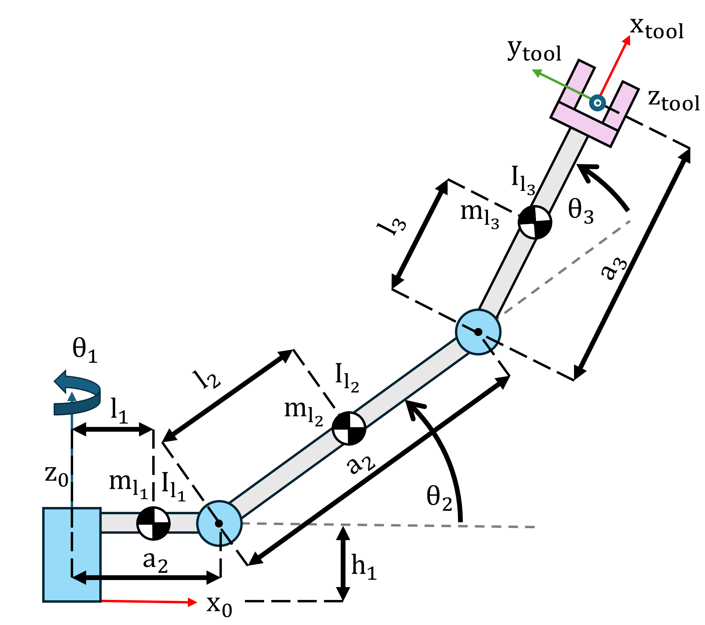
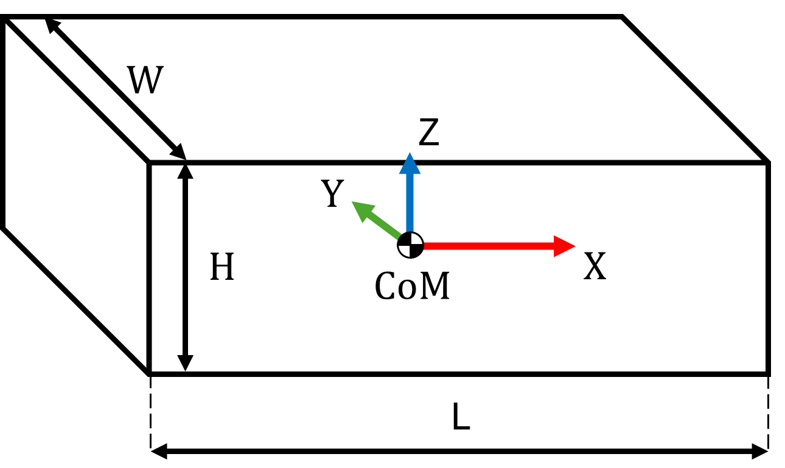

# Exercise 4.1 \- Dynamic Term Computations

In this exercise you will setup functions to compute the dynamics terms of the lagrange formulation for a threelink manipulator. 




|||||||
| :-- | :-- | :-- | :-- | :-- | :-- |
| Link  | Mass \[kg\]  | Link width \[m\]  | Link height \[m\]  | Link length \[m\]  | Center of mass \[m\]   |
| 1  | 5  | 0.1  | 0.1  | 0.3  | 0.15   |
| 2  | 3  | 0.1  | 0.1  | 0.5  | 0.25   |
| 3  | 3  | 0.1  | 0.1  | 0.5  | 0.25   |


The manipulator can be modeled using these DH parameters: 

||||||
| :-: | :-: | :-- | :-: | :-- |
| Link  | a \[m\]  | alpha  | d \[m\]  | theta   |
| 1  | 0.3  | $\displaystyle \frac{\pi }{2}$  | 0.2  | $\displaystyle q_1$   |
| 2  | 0.5  | 0  | 0  | $\displaystyle q_2$   |
| 3  | 0.5  | 0  | 0  | $\displaystyle q_3$   |


For this tutorial only consider the three bar links. 


You can compute their inertia as follows: 




 $$ I_{\textrm{xx}} =\frac{1}{12}\cdot \;m\cdot \left(w^2 +h^2 \right) $$ 

 $$ I_{\textrm{yy}} =I =\frac{1}{12}\cdot \;m\cdot \left(w^2 +h^2 \right) $$ 

 $$ I_{\textrm{zz}} =\frac{1}{12}\cdot \;m\cdot \left(w^2 +L^2 \right) $$ 
# Task 1: Setup

Calculate the inertias for the links in their Center of Mass and store them in the variables: 

-  I1 
-  I2 
-  I3 

Setup a symbolic array q containing the following **real** symbolic variables for the joint angles

-  q1 
-  q2 
-  q3 

Setup a symbolic array qd containing the following **real** symbolic variables for the joint velocities

-  qd1 
-  qd2 
-  qd3 
```matlab

I1 = [];
I2 = []; 
I3 = []; 
q  = []; 
qd = []; 

```

You can check your work by clicking the Run: 

```matlab
 
check_exercise('4-1-1')
```
# Task 2: Setup the Robot 

Load the urdf file for the threelink manipulator by using

-  importrobot("threelink\_noInertia.urdf") 

Store it in the variable

-  threelink 
-  Set set the gravity to $\left\lbrack \begin{array}{c} 0\newline 0\newline -9\ldotp 81 \end{array}\right\rbrack$ 
-  Set the Inertias in the correct frame 
-  Set the center of mass for each body 

*hint: remember to use the parallel axis shift*

```matlab
threelink = []; 

```

You can check your work by clicking the Run: 

```matlab
 
check_exercise('4-1-2')
```
# Task 3: Inertia Matrix

Build the Inertia matrix for the three link manipulator using the symbolic toolbox. 


Store the matrix in the variable

-  B ( B should depend on q1, q2, q3) 
```matlab
B = 0;
```

You can check your work by clicking the Run: 

```matlab
 
check_exercise('4-1-3')
```
# Task 3: Coriolis Matrix 

Build the Coriolis matrix for the three link manipulator using the symbolic toolbox. 


Store the matrix in the variable

-  C ( C should depend on q1, q2, q3, qd1, qd2, qd3) 
```matlab
C = 0; 
```

*hint: in Case you verify your matrice yourself, remember that the toolbox function velocityProduct returns C\*qd*


You can check your work by clicking the Run: 

```matlab
 
check_exercise('4-1-4')
```
# Task 5: Gravity Compensation 

Build the Gravity compensation term for the three link manipulator using the symbolic toolbox. 


Store the matrix in the variable

-  G (G should depend on q1, q2, q3) 
```matlab
G = 0; 
```

You can check your work by clicking the Run: 

```matlab
 
check_exercise('4-1-5')

```

