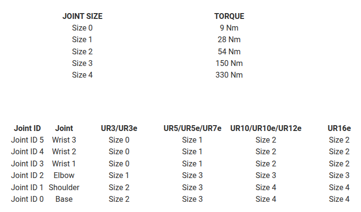

# Exercici 4.2 \- Control basat en esforç fent servir el model dinàmic 

En aquest exercici, implementaràs un **controlador PD en l’espai articular** amb **compensació de gravetat i dinàmica** per a un manipulador UR. L’objectiu és portar totes les articulacions del robot suaument cap a una configuració desitjada (`qd`) respectant els límits de parell articular.

# Tasca

El teu controlador operarà en el **mode de control d’esforç**, és a dir, enviarà directament **parells articulars** al robot simulat.


A cada pas de control, hauràs de:

1.  Llegir les posicions i velocitats articulars actuals del simulador.
2. Calcular el model dinàmic del robot (matriu de masses, termes de Coriolis/centrífugs i parells de gravetat).
3. Calcular els parells de control fent servir una llei PD en l’espai articular.
4. Aplicar **saturació de parell** per mantenir-se dins dels límits físics dels actuadors.
5. Enviar els parells calculats de nou al simulador.
# Importa el robot

En lloc de fer servir la biblioteca estàndard de MATLAB, per a aquest exercici importa el robot fent servir el fitxer URDF en brut. 

-  importrobot($begin:math:display$\"robotics\/Resources\/urdf\/ur5e\.urdf\"$end:math:display$); 

Pista: recorda configurar la gravetat i l’estructura de dades. Tot i que pots definir l’estructura de dades durant la importació, la gravetat s’ha de definir després. 

# Funcions per connectar amb la simulació

Fes servir les funcions auxiliars següents per comunicar-te amb el simulador:

-   **`[q, q_dot, ~] = GetJointValues('All')`** Llegeix les **posicions articulars** actuals (`q`, en radians) i les **velocitats articulars** (`q_dot`, en radians/segon) de la xarxa ROS. Totes dues es retornen com a vectors columna 6×1. 
-  **`SendJointTorques(tau\_sat)`** Envia un vector 6×1 de parells (en **Nm**) a les articulacions del robot. La comanda ha de respectar els límits de parell del robot. 
# **Estructura del controlador**

El controlador PD implementat amb compensació dinàmica té la forma general següent:

 $$ \tau =M\left(q\right)\cdot v+C\left(q,\dot{q} \right)\cdot \;\dot{q} +g\left(q\right) $$ 

amb l’entrada v: 

 $$ v=\left(\textrm{Kp}\cdot e+\textrm{Kd}\cdot \dot{e} \right) $$ 

i els errors: 

 $$ e=q_{\textrm{desired}} -q $$ 

 $\dot{e} =\dot{q_{\textrm{desired}} } -\dot{q}$ en el nostre cas $\dot{q_{\textrm{desired}} } =0$ 


i una gravetat de $\left\lbrack \begin{array}{c} 0\newline 0\newline -9\ldotp 81 \end{array}\right\rbrack$ 

# Disseny dels guanys

Aquest esquema no requereix guanys alts, ja que les no-linealitats es cancel·len amb els termes dinàmics i l’entrada s’escala amb la matriu d’inèrcia. Comença definint les matrius diagonals de guanys fent servir aquest enfocament: 

 $$ {\textrm{Kp}}_i \;=\;\omega_i^2 $$ 

 $$ {\textrm{Kd}}_i \;=\;2\cdot \;\zeta \cdot \omega_{i\;} $$ 

amb 

 $$ \zeta =0\ldotp 7 $$ 

i

 $$ \omega_i =\frac{4}{\;\zeta \cdot T_{s,i} } $$ 

fent servir $T_{s,i} \in \left\lbrack 0\ldotp 8,1\ldotp 5\right\rbrack$. Dona un temps d’assentament més gran a les articulacions amb límits de parell més alts. 

## Ajust dels guanys 

Analitza el comportament de Kp i Kd i el seu impacte en el comportament del robot. Escala gradualment Kp i/o Kd per estabilitzar el robot en la seva posició home $q=\left\lbrack 0,-\frac{\pi }{2},0,-\frac{\pi }{2},0,0\right\rbrack$ 

# Saturació de parell

Els robots reals no poden produir un parell infinit.


Per evitar comandes irreals, has d’aplicar **saturació de parell**. 

 $$ \tau_{\textrm{sat}} \le \tau_{\max } $$ 

Fes servir la figura següent per construir el vector de límits de parell específic del teu robot. 


(Si simules un robot diferent, assegura’t d’actualitzar els límits de parell)




# Temporització

Pots controlar la freqüència del teu controlador fent servir les funcions: 

-  r = rateControl(frequency) 
-  waitfor(r) 
# Altres propietats: 

Aquest controlador ha de ser ràpid. Intenta assolir una freqüència de 50 - 200 Hz per a una simulació estable. Si el teu maquinari no és capaç d’això, pots reduir la velocitat de simulació fent servir la funció:

-  SetSimulationSpeed(Speedfactor) amb Speedfactor $\in \left(\left\lbrack 0,1\right\rbrack \right)$ 
-  o SetSimulationSpeed(Speedfactor, 'docker',false) per a Ubuntu natiu  
# Visualització opcional: 

Pots desar els estats articulars, les velocitats i els parells i visualitzar-los fent servir la funció: 

-  plotTrajectory(qstorage, qdstorage, tau_storage) 

Inicia la simulació executant: 

```matlab
%StartTutorialApplication('Simulation','Controller', 'Effort', 'Model','ur3e');
%Si fas servir ROS en un sistema Ubuntu natiu, fes servir: 
StartTutorialApplication('Simulation','Controller', 'Effort', 'Model','ur3e', 'Docker', false);
```

Per veure la trajectòria de l’efector final pots executar: 

```matlab
%StartTutorialApplication('Trajectory'); 
%Si fas servir ROS en un sistema Ubuntu natiu, fes servir: 
StartTutorialApplication('Trajectory', 'Docker', false);
StartTutorialApplication('Safety_nodes','docker',false); %envia un parell 0 quan no s’ha enviat cap altra comanda
```
### Carrega el robot i configura el vector de gravetat
```matlab
robot = []; 
robot.Gravity = []; 

```
### Configura aquí els teus paràmetres
```matlab
tau_lim = [];
Kp = []
Kd = []; 
q_desired = []; 
qd_desired = []; 
```
### Configura el teu bucle de control

pots fer servir tic i toc per executar el bucle while durant un temps desitjat. 


comprova el rendiment del teu maquinari i analitza la teva taxa de publicació. Per fer-ho, incrementa un comptador a cada execució del bucle i, un cop el bucle hagi acabat, divideix pel temps transcorregut. 

```matlab

qstorage = []; 
qdstorage = []; 
tau_storage = []; 
time = []; 
Execution_time = 10; 
count = 0; 
t0 = tic; 

while toc(t0)<Execution_time

end

```
### Representa gràficament la teva trajectòria 
```matlab
plotTrajectory(qstorage,qdstorage,tau_storage)
```
# Prova un model diferent 

Inspecciona els efectes d’un model dinàmic incorrecte carregant el robot ur3e al teu espai de treball de MATLAB mentre simules un model ur5e.

```matlab
StopTutorialApplications('docker',false); 
clear SendJointTorques GetJointValues
```

```matlab
StartTutorialApplication('Simulation','Controller', 'Effort', 'Model','ur5e', 'Docker', false);
StartTutorialApplication('Trajectory', 'Docker', false);
StartTutorialApplication('Safety_nodes','docker',false); %envia un parell 0 quan no s’ha enviat cap altra comanda
```

```matlab
tau_lim = [150 150 150 28 28 28]'; %UR5e
robot = importrobot(["robotics/Resources/urdf/ur3e.urdf"], DataFormat="column");
g = [0,0,-9.81]';
robot.Gravity=g;

```