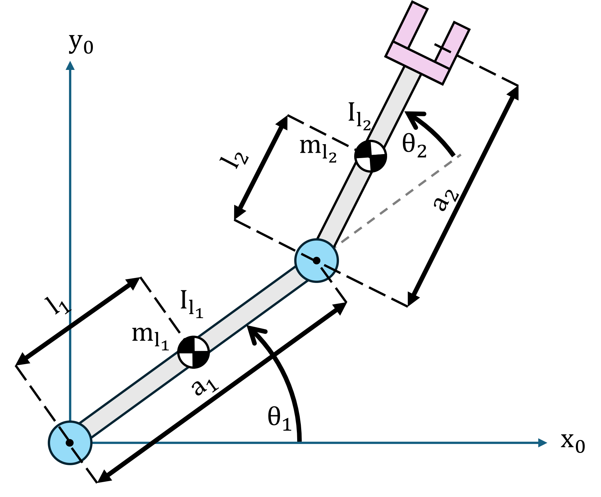

# Dinàmica 

En robòtica, entendre la dinàmica d’un manipulador és essencial per al control precís del moviment, la planificació de trajectòries i la interacció amb l’entorn. La dinàmica descriu la relació entre forces, parells i el moviment resultant del robot, capturant la influència de la inèrcia, les forces de Coriolis i centrífugues, i la gravetat.


Un enfocament àmpliament utilitzat per derivar les equacions de moviment és la **formulació de Lagrange**, que proporciona un marc sistemàtic basat en principis d’energia. Expressant l’energia cinètica i potencial del sistema, el mètode de Lagrange dona lloc a un conjunt d’equacions diferencials que descriuen l’evolució de les posicions i velocitats articulars sota parells aplicats. Aquesta formulació és particularment convenient per a robots amb cinemàtica complexa o múltiples graus de llibertat, ja que evita calcular explícitament les forces a cada articulació degudes a reaccions de restricció.

# Formulació de Lagrange 

L’equació:

 $$ B\left(q\right)\cdot \ddot{\;q} +C\left(q,\dot{q} \right)\cdot \dot{q} +F\cdot \dot{q} +g\left(q\right)=\tau $$ 

amb la matriu d’inèrcia $B\left(q\right)$, la matriu de Coriolis $C\left(q,\dot{q} \right)$, la matriu de fricció $F$ i el terme de gravetat $g\left(q\right)$, descriu el parell $\tau$ exercit sobre les articulacions per a una configuració q donada i la seva velocitat $\dot{q}$. 


Aquesta formulació de Lagrange es pot reescriure per obtenir l’equació de **dinàmica directa**:

 $$ \ddot{q} =B^{-1} \left(q\right)\cdot \left(\tau -C\left(q,\dot{q} \right)\cdot \dot{q} -F\cdot \dot{q} -g\left(q\right)\right) $$ 

que calcula les acceleracions articulars resultants d’un conjunt donat de parells articulars.

### Exemple

Considera aquest manipulador de dos enllaços





amb les propietats següents dels enllaços: 

||||||
| :-- | :-- | :-- | :-- | :-- |
| Enllaç  | Massa $begin:math:display$kg$end:math:display$  | Radi $begin:math:display$m$end:math:display$  | Longitud de l’enllaç $begin:math:display$m$end:math:display$  | Centre de massa $begin:math:display$m$end:math:display$   |
| 1  | 0.5   | 0.04  | 0.5  | 0.25   |
| 2  | 0.7  | 0.04  | 0.7  | 0.35   |


El manipulador es pot modelar fent servir aquests paràmetres DH: 

||||||
| :-: | :-: | :-: | :-: | :-- |
| Enllaç  | a $begin:math:display$m$end:math:display$  | alpha  | d $begin:math:display$m$end:math:display$  | theta   |
| 1  | 0.5  | 0  | 0  | $\displaystyle q_1$   |
| 2  | 0.7  | 0  | 0  | $\displaystyle q_2$   |

```matlab
        %a      alpha   d       theta
DH = [0.5,     0,       0,       0;
      0.7,     0,       0,       0];

mass1 = 0.5; 
radius1 = 0.04; 
center_of_mass1 = [DH(1,1)/2,0,0]; 

mass2 = 0.7;
radius2 = 0.04; 
center_of_mass2 = [DH(2,1)/2,0,0]; 

config = [pi/3;pi/2];
```
## Matriu d’inèrcia $B\left(q\right)$ 

La matriu d’inèrcia d’un manipulador robòtic captura com la massa i la geometria del robot influeixen en la seva resistència al moviment. És una matriu simètrica i definida positiva que depèn de la configuració articular $q$, i relaciona les acceleracions articulars $\ddot{q}$ amb els parells articulars requerits $\tau \;$ en les equacions dinàmiques.

 $$ B(q)=\sum_{i=1}^n \Big(m_{l_i } \cdot J_p^{l_i ~T} (q)\cdot J_p^{l_i } (q)+J_{\Theta }^{l_i ~T} (q)\cdot R_i (q)\cdot I_{l_i } \cdot R_i^T (q)\cdot J_{\Theta }^{l_i } (q)\Big) $$ 

amb 

-  $m_{l_i }$: massa de l’enllaç i 
-  $J_P^{l_i }$: part lineal del jacobià de l’enllaç i 
-  $J_{\Theta }^{l_i }$: part rotacional del jacobià de l’enllaç i 
-  $R_i$: matriu de rotació del marc de l’enllaç i al marc base 
-  $I_{l_i }$: tensor d’inèrcia de l’enllaç i en el seu marc local 
-  $B\left(q\right)$: matriu d’inèrcia total del manipulador 

Per calcular la matriu d’inèrcia per al manipulador d’exemple, has de determinar: 

 $$ B(q)=\sum_{i=1}^2 \Big(m_{l_i } \cdot J_p^{l_i ~T} (q)\cdot J_p^{l_i } (q)+J_{\Theta }^{l_i ~T} (q)\cdot R_i (q)\cdot I_{l_i } \cdot R_i^T (q)\cdot J_{\Theta }^{l_i } (q)\Big) $$ 

Els jacobians del centre de massa de cada enllaç són: 

 $$ J_P^{l_1 } =\left\lbrack \begin{array}{cc} -l_1 \cdot \sin \left(\theta_1 \right) & 0\newline l_1 \cdot \cos \left(\theta_1 \right) & 0\newline 0 & 0 \end{array}\right\rbrack $$ 

 $$ J_P^{l_2 } =\left\lbrack \begin{array}{cc} -a_1 \cdot \sin \left(\theta_1 \right)-l_2 \cdot \sin \left(\theta_1 +\theta_2 \right) & -l_2 \cdot \sin \left(\theta_1 +\theta_2 \right)\newline a_1 \cdot \cos \left(\theta_1 \right)+l_2 \cdot \cos \left(\theta_1 +\theta_2 \right) & l_2 \cdot \cos \left(\theta_1 +\theta_2 \right)\newline 0 & 0 \end{array}\right\rbrack $$ 

 $$ J_{\Theta }^{l_1 } =\left\lbrack \begin{array}{cc} 0 & 0\newline 0 & 0\newline 1 & 0 \end{array}\right\rbrack $$ 

 $$ J_{\Theta }^{l_2 } =\left\lbrack \begin{array}{cc} 0 & 0\newline 0 & 0\newline 1 & 1 \end{array}\right\rbrack $$ 

Observa com els jacobians per a l’enllaç 1 només consideren el primer enllaç i tenen 0 a les columnes corresponents als enllaços següents. 

## Càlcul d’inèrcia

Considera els braços com a cilindres. El tensor d’inèrcia per a un cilindre sòlid, amb radi r, longitud a i el seu eix principal en x, es calcula com: 

 $$ I_{\textrm{xx}} =\frac{1}{2}\cdot m\cdot r^2 $$ 

 $$ I_{\textrm{yy}} =I_{\textrm{zz}} =\frac{1}{12}\cdot m\cdot a^2 +\frac{1}{4}\cdot m\cdot r^2 $$ 

donant lloc al tensor d’inèrcia $I$ (situat al voltant del centre de massa)

 $$ I=\left\lbrack \begin{array}{ccc} I_{\textrm{xx}}  & 0 & 0\newline 0 & I_{\textrm{yy}}  & 0\newline 0 & 0 & I_{\textrm{zz}}  \end{array}\right\rbrack $$ 
### Implementació en Matlab \- Symbolic Toolbox

Aquest codi calcula la matriu d’inèrcia per al manipulador robòtic d’exemple de dos enllaços. 

```matlab
syms a1 a2 l1 l2 q1 q2 m1 m2 theta_i alpha_i a_i d_i m_i r_i l_i r1 r2 real 

p0 = [0,0,0]';
z0 = [0,0,1]'; 
origin = [0,0,0,1]'; 
Ai = [cos(theta_i), -sin(theta_i)*cos(alpha_i), sin(theta_i)*sin(alpha_i), a_i*cos(theta_i);
    sin(theta_i), cos(theta_i)*cos(alpha_i), -cos(theta_i)*sin(alpha_i), a_i*sin(theta_i);
    0, sin(alpha_i), cos(alpha_i), d_i;
    0, 0, 0, 1];

Ixx=0.5*m_i*r_i^2; 
Iyy=1/4*m_i*(1/3 * a_i^2 +r_i^2 );
Izz=Iyy;
LinkInertiaMatrix=diag([Ixx,Iyy,Izz]);

%% MATRIU D’INÈRCIA
A01_l = subs(Ai,{a_i,d_i,alpha_i,theta_i},{ l1, 0, 0, q1});
A01 = subs(Ai,{a_i,d_i,alpha_i,theta_i},{a1,0,0,q1}); 
R1 = A01(1:3,1:3);
z1 = R1*z0; 
p1 = A01*origin; 

A12_l = subs(Ai,{a_i,d_i,alpha_i,theta_i},{ l2, 0, 0, q2});

A02_l = A01*A12_l;
R2 = A02_l(1:3,1:3);

pl1 = A01_l*origin;
pl2 = A02_l*origin;
JP_l1 = [cross(z0,pl1(1:3)-p0(1:3)), [0 0 0]'];
JP_l2 = [cross(z0,pl2(1:3)-p0(1:3)), cross(z1,pl2(1:3)-p1(1:3))];
Jtheta_l1 = [z0 [0 0 0]'];
Jtheta_l2 = [z0 z1];
B1 = simplify(m1*JP_l1'*JP_l1);
B2 = simplify(m2*JP_l2'*JP_l2);


I_1 = subs(LinkInertiaMatrix,{a_i, m_i, r_i},{a1, m1, r1});
Il1 = R1*I_1*R1';

I_2 = subs(LinkInertiaMatrix,{a_i, m_i,r_i},{a2, m2,r2});
Il2 = R2*I_2*R2';

B3 = Jtheta_l1'*Il1*Jtheta_l1;
B4 = Jtheta_l2'*Il2*Jtheta_l2;

B = simplify(B1+B2+B3+B4);

B_twolink = (subs(B, [a1, m1, r1, l1, a2, m2, r2, l2], [DH(1,1), mass1, radius1, center_of_mass1(1), DH(2,1), mass2, radius2, center_of_mass2(1)]));
B_twolink_subs = double(subs(B_twolink, [q1 q2], config.'))
```

```matlabTextOutput
B_twolink_subs = 2x2
    0.3315    0.1146
    0.1146    0.1146

```

#
## Robotic System Toolbox 

El Robotic System Toolbox ens permet calcular la matriu d’inèrcia. 


El centre de massa es configura com una propietat estructural d’un cos com un vector $\left\lbrack \begin{array}{ccc} x & y & z \end{array}\right\rbrack$ relatiu al marc del cos en $\left\lbrack \mathrm{m}\right\rbrack$. Això vol dir que, per al nostre manipulador, la distància en x és negativa!


la matriu d’inèrcia es passa com un vector de la forma: $\left\lbrack \begin{array}{cccccc} I_{\textrm{xx}}  & I_{\textrm{yy}}  & I_{\textrm{zz}}  & I_{\textrm{yz}}  & I_{\textrm{xz}}  & I_{\textrm{xy}}  \end{array}\right\rbrack \;\textrm{en}\;\left\lbrack \frac{\textrm{kg}}{{\mathrm{m}}^2 }\right\rbrack$, tanmateix la inèrcia utilitzada pel RS Toolbox és respecte del marc de l’articulació. Per convertir la inèrcia calculada prèviament, has d’aplicar el teorema dels eixos paral·lels. 


Per a aquest cilindre, només $I_{\textrm{yy}}$ i $I_{\textrm{zz}}$ es veuran alterats com: 

 $$ I_{\textrm{yy}}^{\prime } =I_{\textrm{zz}}^{\prime } =I_{\textrm{yy}} +m\cdot l_i^2 $$ 

com que x es troba en l’eix de l’articulació, $I_{\textrm{xx}}$ no canvia.  

```matlab
twolink = rigidBodyTree("DataFormat","column"); 
bodies = cell(2,1);
joints = cell(2,1);

bodies{1} = rigidBody('body_1');
bodies{2} = rigidBody('body_2');

joints{1} = rigidBodyJoint('joint_1', 'revolute');
joints{2} = rigidBodyJoint('joint_2', 'revolute');

% 1) Inèrcia respecte del CoM (cilindre sòlid de longitud a al llarg de x)
Ixx1_C = 0.5*mass1*radius1^2;
Iyy1_C = (1/12)*mass1*(3*radius1^2 + DH(1,1)^2);
Izz1_C = Iyy1_C;

Ixx2_C = 0.5*mass2*radius2^2;
Iyy2_C = (1/12)*mass2*(3*radius2^2 + DH(2,1)^2);
Izz2_C = Iyy2_C;

% 2) Desplaçament per eixos paral·lels fins a l’origen del marc del cos (r = [lc,0,0])
lc1 = center_of_mass1(1); lc2 = center_of_mass2(1);

Ixx1_O = Ixx1_C;
Iyy1_O = Iyy1_C + mass1*lc1^2;
Izz1_O = Izz1_C + mass1*lc1^2;

Ixx2_O = Ixx2_C;
Iyy2_O = Iyy2_C + mass2*lc2^2;
Izz2_O = Izz2_C + mass2*lc2^2;

Inertia_1 = [Ixx1_O, Iyy1_O, Izz1_O, 0, 0, 0];
Inertia_2 = [Ixx2_O, Iyy2_O, Izz2_O, 0, 0, 0];

% 3) Assigna-ho als cossos rígids
bodies{1}.Mass = mass1; 
bodies{2}.Mass = mass2;

bodies{1}.CenterOfMass = -center_of_mass1;
bodies{2}.CenterOfMass = -center_of_mass2;

bodies{1}.Inertia = Inertia_1;
bodies{2}.Inertia = Inertia_2;

% 4) Continua fent servir DH estàndard:
setFixedTransform(joints{1}, DH(1,:), 'dh');
setFixedTransform(joints{2}, DH(2,:), 'dh');

% Afegeix cossos i articulacions a l’arbre de cossos rígids
bodies{1}.Joint = joints{1}; 
bodies{2}.Joint = joints{2}; 

twolink.addBody(bodies{1}, 'base');
twolink.addBody(bodies{2}, 'body_1');
B_toolbox = massMatrix(twolink, config) 
```

```matlabTextOutput
B_toolbox = 2x2
    0.3315    0.1146
    0.1146    0.1146

```

## Matriu de Coriolis $C\left(q,\dot{q} \right)$ 

La matriu de Coriolis captura les forces dependents de la velocitat que apareixen quan les articulacions del manipulador es mouen simultàniament. Aquestes forces, conegudes com a forces de Coriolis i centrífugues, poden afectar significativament el moviment, especialment a velocitats altes o en robots amb enllaços llargs o pesants. 


Els termes centrípets són proporcionals a ${\dot{q_j } }^2$ i els termes de Coriolis són proporcionals a $\dot{q_i } \cdot \dot{q_j }$ 

 $$ C\left(q,\dot{q} \right)=\left\lbrack \begin{array}{cccc} c_{11}  & c_{12}  & \cdots  & c_{1n} \newline c_{21}  & c_{22}  & \cdots  & c_{2n} \newline \vdots  & \vdots  & \ddots  & \vdots \newline c_{\textrm{n1}}  & c_{\textrm{n2}}  & \cdots  & c_{\textrm{nn}}  \end{array}\right\rbrack $$ 

 $$ c_{\textrm{ij}} =\sum_{k=1}^n c_{\textrm{ijk}} \cdot \dot{q_k } $$ 

 $$ c_{ijk} (q,\dot{q} )=\frac{1}{2}\left(\frac{\partial b_{ij} }{\partial q_k }+\frac{\partial b_{ik} }{\partial q_j }-\frac{\partial b_{kj} }{\partial q_i }\right) $$ 

amb 

 $$ B\left(q\right)=\left\lbrack \begin{array}{cccc} b_{11}  & b_{12}  & \cdots  & b_{1n} \newline b_{21}  & b_{22}  & \cdots  & b_{2n} \newline \vdots  & \vdots  & \ddots  & \vdots \newline b_{\textrm{n1}}  & b_{\textrm{n2}}  & \cdots  & b_{\textrm{nn}}  \end{array}\right\rbrack $$ 

on $C\left(q,\dot{q} \right)\in {\mathbb{R}}^{\textrm{nxn}}$ on $\dot{q} \in {\mathbb{R}}^{\textrm{nx1}}$ 

### Implementació en Matlab \- Symbolic Toolbox

Per a l’exemple del manipulador de dos enllaços, s’han de resoldre les equacions següents: 

 $$ C\left(q,\dot{q} \right)=\left\lbrack \begin{array}{cc} c_{11}  & c_{12} \newline c_{21}  & c_{22}  \end{array}\right\rbrack $$ 

 $$ c_{\textrm{ij}} =\sum_{k=1}^2 c_{\textrm{ijk}} \cdot \dot{q_k } $$ 
```matlab
jointVel = [pi/4; pi/10]; 
%% MATRIU DE CORIOLIS
syms qdot1 qdot2 real 
%Termes de Coriolis i centrífugs
b11 = B_twolink(1,1);
b12 = B_twolink(1,2);
b21 = B_twolink(2,1);
b22 = B_twolink(2,2);

%cijk = simplify(0.5*(diff(bij,qk) + diff(bik,qj)-diff(bjk,qi)))
c111 = simplify(0.5*(diff(b11,q1) + diff(b11,q1)-diff(b11,q1)));
c112 = simplify(0.5*(diff(b11,q2) + diff(b12,q1)-diff(b12,q1)));
c121 = c112;
c122 = simplify(0.5*(diff(b12,q2) + diff(b12,q2)-diff(b22,q1)));
c211 = simplify(0.5*(diff(b21,q1) + diff(b21,q1)-diff(b11,q2)));
c212 = simplify(0.5*(diff(b21,q2) + diff(b22,q1)-diff(b12,q2)));
c221 = c212;
c222 = simplify(0.5*(diff(b22,q2) + diff(b22,q2)-diff(b22,q2)));
c11 = c111*qdot1+c112*qdot2;
c12 = c121*qdot1+c122*qdot2;
c21 = c211*qdot1+c212*qdot2;
c22 = c221*qdot1+c222*qdot2;

C = [c11 c12; c21 c22]
```
C = 

  $$ \displaystyle \left(\begin{array}{cc} -\frac{49\,{\textrm{qdot}}_2 \,\sin \left(q_2 \right)}{400} & -\frac{49\,{\textrm{qdot}}_1 \,\sin \left(q_2 \right)}{400}-\frac{49\,{\textrm{qdot}}_2 \,\sin \left(q_2 \right)}{400}\newline \frac{49\,{\textrm{qdot}}_1 \,\sin \left(q_2 \right)}{400} & 0 \end{array}\right) $$ 
 

```matlab
C_product = double(subs(C, [q1,q2, qdot1, qdot2],[config', jointVel']))*jointVel    
```

```matlabTextOutput
C_product = 2x1
   -0.0725
    0.0756

```


## Robotic System Toolbox 

La funció velocityProduct retorna el producte de $C\left(q,\dot{q} \right)\cdot \dot{q}$ en lloc de només la matriu en si. 

```matlab
C_toolbox = velocityProduct(twolink, config, jointVel)
```

```matlabTextOutput
C_toolbox = 2x1
   -0.0725
    0.0756

```

# Terme de gravetat $g\left(q\right)$ 

En manipuladors robòtics, el terme de gravetat representa els parells requerits a cada articulació per contrarestar l’efecte de la gravetat sobre els enllaços. Depèn de la configuració del robot, de la distribució de massa de cada enllaç i de la posició dels seus centres de massa. Aquest terme és crucial per al control del moviment, ja que permet al robot mantenir posicions estàtiques o seguir trajectòries compensant les forces gravitacionals. En aplicacions pràctiques, un càlcul precís de les forces gravitatòries garanteix un funcionament estable i eficient, especialment en manipuladors lleugers o flexibles on els efectes de la gravetat són significatius.


Comença identificant la direcció de la gravetat en el marc zero. En el manipulador d’exemple de dos enllaços, l’eix y és la direcció d’influència. 

 $$ g_0 =\left\lbrack \begin{array}{c} 0\newline -g\newline 0 \end{array}\right\rbrack $$ 

amb $g=9\ldotp 81\;\frac{\mathrm{m}}{{\mathrm{s}}^2 }$ 


forma el terme de gravetat com: 

 $$ g\left(q\right)=\left\lbrack \begin{array}{cccc} g_1 \left(q\right) & g_2 \left(q\right) & \cdots  & g_n \left(q\right) \end{array}\right\rbrack $$ 

amb $g_i \left(q\right)=-\sum_{j=1}^n m_{l_j } \cdot g_0^T \cdot J_{P_i }^{l_j }$ 

## Implementació en Matlab \- Symbolic Toolbox
```matlab
syms g real
g0 = [0 -g 0]';
g1 = simplify(-m1*g0'*JP_l1(:,1) - m2*g0'*JP_l2(:,1))
```
g1 = 
 $\displaystyle g\,m_2 \,{\left(l_2 \,\cos \left(q_1 +q_2 \right)+a_1 \,\cos \left(q_1 \right)\right)}+g\,l_1 \,m_1 \,\cos \left(q_1 \right)$
 

```matlab
g2 = simplify(-m1*g0'*JP_l1(:,2) - m2*g0'*JP_l2(:,2))
```
g2 = 
 $\displaystyle g\,l_2 \,m_2 \,\cos \left(q_1 +q_2 \right)$
 

```matlab
G = [g1 g2]'
```
G = 

  $$ \displaystyle \left(\begin{array}{c} g\,m_2 \,{\left(l_2 \,\cos \left(q_1 +q_2 \right)+a_1 \,\cos \left(q_1 \right)\right)}+g\,l_1 \,m_1 \,\cos \left(q_1 \right)\newline g\,l_2 \,m_2 \,\cos \left(q_1 +q_2 \right) \end{array}\right) $$ 
 

```matlab
G_subs = double(subs(G, [m1,m2,a1,a2,l1,l2,g, q1,q2], [mass1, mass2, DH(1,1), DH(2,1), center_of_mass1(1), center_of_mass2(1), 9.81, config']))
```

```matlabTextOutput
G_subs = 2x1
    0.2484
   -2.0814

```


## Robotic System Toolbox 
```matlab
twolink.Gravity = [0,-9.81,0]; 
G_toolbox = gravityTorque(twolink, config)
```

```matlabTextOutput
G_toolbox = 2x1
    0.2484
   -2.0814

```

# Terme de fricció $F$ 

El terme de fricció en la dinàmica del robot té en compte els parells resistents a les articulacions deguts a la fricció interna en motors, engranatges i coixinets. A diferència dels termes d’inèrcia, Coriolis o gravetat, la fricció és no conservativa i depèn del moviment de les articulacions més que no pas de la seva configuració.


El terme de fricció consta de dues parts: la fricció viscosa dependent de $B_m$ escalada pel quadrat de la relació de transmissió $G^2$ i la fricció de Coulomb $T_c$ escalada per $G$.

 $$ F\cdot \dot{q} =B_m \cdot G^2 \cdot \dot{q} +T_c \cdot \textrm{sign}\left(\dot{q} \right) $$ 
## Implementació en Matlab \- Symbolic Toolbox
```matlab
syms bm1 bm2 Tc1 Tc2 G1 G2 qdot real 
F = [bm1, bm2].*[G1, G2].^2
```
F = 

  $$ \displaystyle \left(\begin{array}{cc} {G_1 }^2 \,{\textrm{bm}}_1  & {G_2 }^2 \,{\textrm{bm}}_2  \end{array}\right) $$ 
 

```matlab

F_torque = F * qdot + sign(qdot)* [Tc1, Tc2]
```
F_torque = 

  $$ \displaystyle \left(\begin{array}{cc} {\textrm{bm}}_1 \,\textrm{qdot}\,{G_1 }^2 +{\textrm{Tc}}_1 \,\textrm{sign}\left(\textrm{qdot}\right) & {\textrm{bm}}_2 \,\textrm{qdot}\,{G_2 }^2 +{\textrm{Tc}}_2 \,\textrm{sign}\left(\textrm{qdot}\right) \end{array}\right) $$ 
 

Ara com ara, el Robotic System Toolbox no ofereix cap funció per calcular el terme de fricció. Si els paràmetres són coneguts, els has d’afegir al parell calculat per les funcions del toolbox.

# Funcions de dinàmica del Robotic System Toolbox

 El Robotic System Toolbox ofereix altres funcions per calcular els termes dinàmics en conjunt. 


La funció de dinàmica del toolbox exclou el terme de fricció; per tant, l’equació esdevé: 

 $$ B\left(q\right)\cdot \;\ddot{\;q} +C\left(q,\dot{q} \right)\cdot \dot{q} +g\left(q\right)=\tau $$ 

La funció externalForce() retorna la matriu de força externa per a una força desitjada sobre un marc especificat del manipulador: 

```matlab
                                  % Mx My Mz Fx Fy Fz
                               %en [Nm Nm Nm N  N  N] 
desired_endeffector_forces_body1 = [0, 0, 0, 0, 1, 0];
desired_endeffector_forces_body2 = [0, 0, 0, 5, 0, 0];

fext1 = externalForce(twolink,'body_1', desired_endeffector_forces_body1', config)
```

```matlabTextOutput
fext1 = 6x2
         0         0
         0         0
    0.5000         0
   -0.8660         0
    0.5000         0
         0         0

```

```matlab
fext2 = externalForce(twolink,'body_2', desired_endeffector_forces_body2', config)
```

```matlabTextOutput
fext2 = 6x2
         0         0
         0         0
         0    2.5000
         0   -4.3301
         0    2.5000
         0         0

```


Sumar matrius de forces externes combina les forces externes. Això es pot fer servir per a un robot amb múltiples efectors finals: 

```matlab
total_external_forces = fext1 + fext2
```

```matlabTextOutput
total_external_forces = 6x2
         0         0
         0         0
    0.5000    2.5000
   -0.8660   -4.3301
    0.5000    2.5000
         0         0

```


Per calcular les acceleracions articulars requerides pots fer servir la funció forwardDynamics() amb la matriu de forces externes com a entrada: 

```matlab
q_dot_dot = forwardDynamics(twolink, config, [],[], total_external_forces)
```

```matlabTextOutput
q_dot_dot = 2x1
    3.0900
   15.0706

```


La sortida d’aquesta funció és un vector que conté les acceleracions articulars requerides per complir el requisit d’entrada (aquí són les forces externes). 


 La funció forwardDynamics també permet la velocitat articular com a entrada: 

```matlab
q_dot = [-pi/2; pi/5]; 
q_dot_dot_vel = forwardDynamics(twolink, config, q_dot)
```

```matlabTextOutput
q_dot_dot_vel = 2x1
  -10.2416
   25.7650

```


 o parells articulars: 

```matlab
tau = [5; 5]; 
q_dot_dot_torque = forwardDynamics(twolink, config, [], tau) 
```

```matlabTextOutput
q_dot_dot_torque = 2x1
  -10.7434
   72.5289

```


Per calcular els parells articulars requerits, fes servir la funció inverseDynamics(): 

```matlab
tau_vel = inverseDynamics(twolink, config, q_dot)
```

```matlabTextOutput
tau_vel = 2x1
    0.4419
   -1.7792

```

```matlab
tau_accel = inverseDynamics(twolink, config, [], q_dot_dot)
```

```matlabTextOutput
tau_accel = 2x1
     3
     0

```

```matlab
tau_force = inverseDynamics(twolink, config, [],[], fext1)
```

```matlabTextOutput
tau_force = 2x1
   -0.2516
   -2.0814

```


La sortida d’aquesta funció és un vector que conté els parells articulars requerits per complir el requisit d’entrada. 

# Parametrització i identificació 

Una propietat important del model dinàmic és la linealitat respecte dels paràmetres dinàmics. Això ens permet reescriure l’equació dinàmica: 

 $$ B\left(q\right)\cdot \;\ddot{\;q} +C\left(q,\dot{q} \right)\cdot \dot{q} +F\cdot \dot{q} +g\left(q\right)=\tau $$ 

en forma de regressor: 

 $$ \tau =Y\left(q,\dot{q} ,\ddot{q} \right)\cdot \Pi \left(m,I\right) $$ 

Intentem estimar els valors rellevants del tensor d’inèrcia i la massa de l’enllaç. 


Configura els termes dinàmics perquè depenguin d’aquestes variables. Assumint que els enllaços són homogenis pel que fa a la distribució de massa, el seu centre de massa estarà situat a $0\ldotp 5\cdot \;\textrm{longitud}\;\textrm{de l’enllaç}$.

## Configura els termes dinàmics
```matlab
syms m1 Ixx1 Iyy1 Izz1 m2 Ixx2 Iyy2 Izz2 %paràmetres dinàmics
syms q1 q2 qdot1 qdot2 qdotdot1 qdotdot2 %valors articulars

a1 = 0.5; 
l1 = a1/2;
a2 = 0.7; 
l2 = a2/2; 

I_1 = diag([Ixx1, Iyy1, Izz1]); 
I_2 = diag([Ixx2, Iyy2, Izz2]);

```

Configura la matriu B

```matlab
A01_l = subs(Ai,{a_i,d_i,alpha_i,theta_i},{ l1, 0, 0, q1});
A01 = subs(Ai,{a_i,d_i,alpha_i,theta_i},{a1,0,0,q1}); 
R1 = A01(1:3,1:3);
z1 = R1*z0; 
p1 = A01*origin; 

A12_l = subs(Ai,{a_i,d_i,alpha_i,theta_i},{ l2, 0, 0, q2});

A02_l = A01*A12_l;
R2 = A02_l(1:3,1:3);

pl1 = A01_l*origin;
pl2 = A02_l*origin;
JP_l1 = [cross(z0,pl1(1:3)-p0(1:3)), [0 0 0]'];
JP_l2 = [cross(z0,pl2(1:3)-p0(1:3)), cross(z1,pl2(1:3)-p1(1:3))];
Jtheta_l1 = [z0 [0 0 0]'];
Jtheta_l2 = [z0 z1];
B1 = simplify(m1*JP_l1'*JP_l1);
B2 = simplify(m2*JP_l2'*JP_l2);

Il1 = R1*I_1*R1';

Il2 = R2*I_2*R2';

B3 = Jtheta_l1'*Il1*Jtheta_l1;
B4 = Jtheta_l2'*Il2*Jtheta_l2;

B = simplify(B1+B2+B3+B4);
```

Configura la matriu de Coriolis: 

```matlab
b11 = B(1,1);
b12 = B(1,2);
b21 = B(2,1);
b22 = B(2,2);

%cijk = simplify(0.5*(diff(bij,qk) + diff(bik,qj)-diff(bjk,qi)))
c111 = simplify(0.5*(diff(b11,q1) + diff(b11,q1)-diff(b11,q1)));
c112 = simplify(0.5*(diff(b11,q2) + diff(b12,q1)-diff(b12,q1)));
c121 = c112;
c122 = simplify(0.5*(diff(b12,q2) + diff(b12,q2)-diff(b22,q1)));
c211 = simplify(0.5*(diff(b21,q1) + diff(b21,q1)-diff(b11,q2)));
c212 = simplify(0.5*(diff(b21,q2) + diff(b22,q1)-diff(b12,q2)));
c221 = c212;
c222 = simplify(0.5*(diff(b22,q2) + diff(b22,q2)-diff(b22,q2)));
c11 = c111*qdot1+c112*qdot2;
c12 = c121*qdot1+c122*qdot2;
c21 = c211*qdot1+c212*qdot2;
c22 = c221*qdot1+c222*qdot2;

C = [c11 c12; c21 c22]
```
C = 

  $$ \displaystyle \begin{array}{l} \left(\begin{array}{cc} -\frac{7\,m_2 \,{\textrm{qdot}}_2 \,\sigma_3 }{80} & -\frac{7\,m_2 \,{\textrm{qdot}}_2 \,\sigma_4 }{40}-\sigma_1 \newline \sigma_1 -\frac{7\,m_2 \,{\textrm{qdot}}_2 \,\sigma_2 }{80} & -\frac{7\,m_2 \,{\textrm{qdot}}_1 \,\sigma_2 }{80} \end{array}\right)\\\mathrm{}\\\textrm{where}\\\mathrm{}\\\;\;\sigma_1 =\frac{7\,m_2 \,{\textrm{qdot}}_1 \,\sigma_3 }{80}\\\mathrm{}\\\;\;\sigma_2 =\sin \left(\overline{q_1 } -q_1 +\overline{q_2 } \right)-\sigma_4 \\\mathrm{}\\\;\;\sigma_3 =\sin \left(\overline{q_1 } -q_1 +\overline{q_2 } \right)+\sigma_4 \\\mathrm{}\\\;\;\sigma_4 =\sin \left(q_1 +q_2 -\overline{q_1 } \right)\end{array} $$ 
 


Configura el terme de gravetat: 

```matlab
g0 = [0 -9.81 0]';
g1 = simplify(-m1*g0'*JP_l1(:,1) - m2*g0'*JP_l2(:,1))
```
g1 = 
 $\displaystyle \frac{981\,m_2 \,{\left(\frac{7\,\cos \left(q_1 +q_2 \right)}{20}+\frac{\cos \left(q_1 \right)}{2}\right)}}{100}+\frac{981\,m_1 \,\cos \left(q_1 \right)}{400}$
 

```matlab
g2 = simplify(-m1*g0'*JP_l1(:,2) - m2*g0'*JP_l2(:,2))
```
g2 = 
 $\displaystyle \frac{6867\,m_2 \,\cos \left(q_1 +q_2 \right)}{2000}$
 

```matlab
G = [g1 g2]'
```
G = 

  $$ \displaystyle \left(\begin{array}{c} \frac{981\,\cos \left(\overline{q_1 } \right)\,\overline{m_1 } }{400}+\frac{981\,\overline{m_2 } \,{\left(\frac{\cos \left(\overline{q_1 } \right)}{2}+\frac{7\,\cos \left(\overline{q_1 } +\overline{q_2 } \right)}{20}\right)}}{100}\newline \frac{6867\,\cos \left(\overline{q_1 } +\overline{q_2 } \right)\,\overline{m_2 } }{2000} \end{array}\right) $$ 
 
## Analitza els termes dinàmics i construeix el regressor
```matlab
q = [q1; q2]; 
qdot = [qdot1; qdot2]; 
qdotdot = [qdotdot1; qdotdot2];
tau = B*qdotdot + C*qdot + G
```
tau = 

  $$ \displaystyle \begin{array}{l} \left(\begin{array}{c} \frac{981\,\cos \left(\overline{q_1 } \right)\,\overline{m_1 } }{400}-{\textrm{qdot}}_2 \,{\left(\frac{7\,m_2 \,{\textrm{qdot}}_2 \,\sigma_7 }{40}+\sigma_5 \right)}+{\textrm{qdotdot}}_1 \,{\left({\textrm{Izz}}_1 +{\textrm{Izz}}_2 +\frac{m_1 \,\cos \left(q_1 -\overline{q_1 } \right)}{16}+m_2 \,\sigma_2 \,\sigma_6 +m_2 \,\sigma_1 \,{\left(\frac{\sin \left(\overline{q_1 } \right)}{2}+\frac{7\,\sigma_4 }{20}\right)}\right)}+\frac{981\,\overline{m_2 } \,\sigma_6 }{100}+{\textrm{qdotdot}}_2 \,{\left({\textrm{Izz}}_2 +\frac{7\,m_2 \,\cos \left(q_1 +q_2 -\overline{q_1 } \right)}{40}+\sigma_3 \right)}-\frac{7\,m_2 \,{\textrm{qdot}}_1 \,{\textrm{qdot}}_2 \,{\left(\sigma_8 +\sigma_7 \right)}}{80}\newline {\textrm{qdotdot}}_1 \,{\left({\textrm{Izz}}_2 +\frac{7\,m_2 \,\sigma_9 \,\sigma_2 }{20}+\frac{7\,m_2 \,\sigma_4 \,\sigma_1 }{20}\right)}-{\textrm{qdot}}_1 \,{\left(\frac{7\,m_2 \,{\textrm{qdot}}_2 \,{\left(\sigma_8 -\sigma_7 \right)}}{80}-\sigma_5 \right)}+{\textrm{qdotdot}}_2 \,{\left({\textrm{Izz}}_2 +\sigma_3 \right)}+\frac{6867\,\sigma_9 \,\overline{m_2 } }{2000}-\frac{7\,m_2 \,{\textrm{qdot}}_1 \,{\textrm{qdot}}_2 \,{\left(\sigma_8 -\sigma_7 \right)}}{80} \end{array}\right)\\\mathrm{}\\\textrm{where}\\\mathrm{}\\\;\;\sigma_1 =\frac{7\,\sin \left(q_1 +q_2 \right)}{20}+\frac{\sin \left(q_1 \right)}{2}\\\mathrm{}\\\;\;\sigma_2 =\frac{7\,\cos \left(q_1 +q_2 \right)}{20}+\frac{\cos \left(q_1 \right)}{2}\\\mathrm{}\\\;\;\sigma_3 =\frac{49\,m_2 \,\cos \left(q_1 +q_2 -\overline{q_1 } -\overline{q_2 } \right)}{400}\\\mathrm{}\\\;\;\sigma_4 =\sin \left(\overline{q_1 } +\overline{q_2 } \right)\\\mathrm{}\\\;\;\sigma_5 =\frac{7\,m_2 \,{\textrm{qdot}}_1 \,{\left(\sigma_8 +\sigma_7 \right)}}{80}\\\mathrm{}\\\;\;\sigma_6 =\frac{\cos \left(\overline{q_1 } \right)}{2}+\frac{7\,\sigma_9 }{20}\\\mathrm{}\\\;\;\sigma_7 =\sin \left(q_1 +q_2 -\overline{q_1 } \right)\\\mathrm{}\\\;\;\sigma_8 =\sin \left(\overline{q_1 } -q_1 +\overline{q_2 } \right)\\\mathrm{}\\\;\;\sigma_9 =\cos \left(\overline{q_1 } +\overline{q_2 } \right)\end{array} $$ 
 

```matlab

vars = symvar(tau);   % totes les variables simbòliques

% variables cinemàtiques
kin_vars = [q1 q2 qdot1 qdot2 qdotdot1 qdotdot2];

% paràmetres dinàmics que s’han d’estimar 
param_pi = setdiff(vars, kin_vars)
```
param_pi = 

  $$ \displaystyle \left(\begin{array}{cccc} {\textrm{Izz}}_1  & {\textrm{Izz}}_2  & m_1  & m_2  \end{array}\right) $$ 
 


observa com param\_pi només depèn d’Izz i de les masses

```matlab
[c1 ,t1]= coeffs(tau(1),param_pi)
```
c1 = 

  $$ \displaystyle \begin{array}{l} \left(\begin{array}{ccccc} {\textrm{qdotdot}}_1  & {\textrm{qdotdot}}_1 +{\textrm{qdotdot}}_2  & \frac{{\textrm{qdotdot}}_1 \,\cos \left(q_1 -\overline{q_1 } \right)}{16} & {\textrm{qdotdot}}_2 \,{\left(\frac{49\,\cos \left(q_1 +q_2 -\overline{q_1 } -\overline{q_2 } \right)}{400}+\frac{7\,\cos \left(q_1 +q_2 -\overline{q_1 } \right)}{40}\right)}-{\textrm{qdot}}_2 \,{\left(\frac{7\,{\textrm{qdot}}_1 \,\sigma_2 }{80}+\frac{7\,{\textrm{qdot}}_2 \,\sigma_3 }{40}\right)}+{\textrm{qdotdot}}_1 \,{\left({\left(\frac{7\,\cos \left(q_1 +q_2 \right)}{20}+\frac{\cos \left(q_1 \right)}{2}\right)}\,\sigma_1 +{\left(\frac{7\,\sin \left(q_1 +q_2 \right)}{20}+\frac{\sin \left(q_1 \right)}{2}\right)}\,{\left(\frac{\sin \left(\overline{q_1 } \right)}{2}+\frac{7\,\sin \left(\overline{q_1 } +\overline{q_2 } \right)}{20}\right)}\right)}-\frac{7\,{\textrm{qdot}}_1 \,{\textrm{qdot}}_2 \,\sigma_2 }{80} & \frac{981\,\cos \left(\overline{q_1 } \right)\,\overline{m_1 } }{400}+\frac{981\,\overline{m_2 } \,\sigma_1 }{100} \end{array}\right)\\\mathrm{}\\\textrm{where}\\\mathrm{}\\\;\;\sigma_1 =\frac{\cos \left(\overline{q_1 } \right)}{2}+\frac{7\,\cos \left(\overline{q_1 } +\overline{q_2 } \right)}{20}\\\mathrm{}\\\;\;\sigma_2 =\sin \left(\overline{q_1 } -q_1 +\overline{q_2 } \right)+\sigma_3 \\\mathrm{}\\\;\;\sigma_3 =\sin \left(q_1 +q_2 -\overline{q_1 } \right)\end{array} $$ 
 
t1 = 

  $$ \displaystyle \left(\begin{array}{ccccc} {\textrm{Izz}}_1  & {\textrm{Izz}}_2  & m_1  & m_2  & 1 \end{array}\right) $$ 
 

```matlab
[c2, t2] = coeffs(tau(2),param_pi)
```
c2 = 

  $$ \displaystyle \begin{array}{l} \left(\begin{array}{ccc} {\textrm{qdotdot}}_1 +{\textrm{qdotdot}}_2  & {\textrm{qdotdot}}_1 \,{\left(\frac{7\,\sigma_2 \,{\left(\frac{7\,\cos \left(q_1 +q_2 \right)}{20}+\frac{\cos \left(q_1 \right)}{2}\right)}}{20}+\frac{7\,\sin \left(\overline{q_1 } +\overline{q_2 } \right)\,{\left(\frac{7\,\sin \left(q_1 +q_2 \right)}{20}+\frac{\sin \left(q_1 \right)}{2}\right)}}{20}\right)}+{\textrm{qdot}}_1 \,{\left(\frac{7\,{\textrm{qdot}}_1 \,{\left(\sigma_1 +\sigma_3 \right)}}{80}-\frac{7\,{\textrm{qdot}}_2 \,{\left(\sigma_1 -\sigma_3 \right)}}{80}\right)}+\frac{49\,{\textrm{qdotdot}}_2 \,\cos \left(q_1 +q_2 -\overline{q_1 } -\overline{q_2 } \right)}{400}-\frac{7\,{\textrm{qdot}}_1 \,{\textrm{qdot}}_2 \,{\left(\sigma_1 -\sigma_3 \right)}}{80} & \frac{6867\,sigma_2 \,\overline{m_2 } }{2000} \end{array}\right)\\\mathrm{}\\\textrm{where}\\\mathrm{}\\\;\;\sigma_1 =\sin \left(\overline{q_1 } -q_1 +\overline{q_2 } \right)\\\mathrm{}\\\;\;\sigma_2 =\cos \left(\overline{q_1 } +\overline{q_2 } \right)\\\mathrm{}\\\;\;\sigma_3 =\sin \left(q_1 +q_2 -\overline{q_1 } \right)\end{array} $$ 
 
t2 = 

  $$ \displaystyle \left(\begin{array}{ccc} {\textrm{Izz}}_2  & m_2  & 1 \end{array}\right) $$ 
 

observa com c2 només depèn de $I_{\textrm{zz},2} \;\textrm{i}\;m_2$. Això serà important a l’hora de construir el regressor. Assegura’t que els índexs de les variables desitjades coincideixin en tots dos casos:  

```matlab
Y_sym = [c1(1), c1(2), c1(3), c1(4); 
            0,  c2(1), 0 ,    c2(2)]; 
```
## Estima els paràmetres

Carrega identification\_ex i fes servir els valors articulars enregistrats

```matlab
%load("identification_ex.mat"); 
load("Resources/identification_ex.mat");

%Identifica paràmetres dinàmics fent servir dades d’execucions simulades
% Regressor
N = size(qout,1);         % nombre d’instants de temps
d = size(q,1);                    % nombre d’articulacions
P = size(Y_sym,2);        % nombre de paràmetres dinàmics

% --- Inicialitza contenidors buits -----------------------------------------
YY = [];               % regressor gran (2N x P)
Tau = [];              % parells apilats (2N x 1)

% --- Recorre totes les mostres i concatena ------------------------------------
for i = 1:N

    % Avalua el regressor per a aquest instant de temps
    Yi = double(subs(Y_sym, ...
        {qdotdot1, qdotdot2, qdot1, qdot2, q1, q2}, ...
        {qddout(i,1), qddout(i,2), ...
         qdout(i,1),  qdout(i,2), ...
         qout(i,1),   qout(i,2)}));

    % Afegeix les files del regressor
    YY = [YY; Yi];

    % Obtén els parells en aquest instant i afegeix-los
    tau_i = tauout(i, 1:d).';   % converteix a columna
    Tau = [Tau; tau_i];
end

% Estimació dels paràmetres per mínims quadrats
pi_hat = pinv(YY) * Tau
```

```matlabTextOutput
pi_hat = 4x1
    0.5229
    0.0294
    0.0327
    2.3543

```