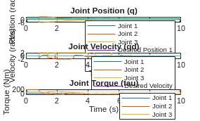
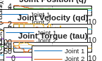

# Exercici 5.1 \- Control d’esforç del manipulador de tres enllaços fent servir matrius simbòliques

En aquest exercici faràs servir les matrius calculades a l’Exercici 4.1 per controlar el manipulador de tres enllaços en simulació fent servir Simulink. 

# Inicia la simulació
```matlab

StartTutorialApplication('Simulation','Controller', 'Effort', 'Model','threelink', 'Docker', false);
StartTutorialApplication('Trajectory', 'Docker', false);
StartTutorialApplication('Safety_nodes','docker',false, 'model','threelink'); %envia un parell 0 quan no s’ha enviat cap altra comanda
```

Recorda que pots alentir la simulació així: 


SetSimulationSpeed( SpeedFactor, 'docker', false)

# Converteix les matrius simbòliques en funcions 

Per fer servir variables simbòliques dins de Simulink les hem de convertir en una funció. 

```matlab
syms symbolic1 symbolic2 real
my_sym_variable = [symbolic1^-1, symbolic2*4];
my_sym_vec = [symbolic1, symbolic2]
```
my_sym_vec = 

  $$ \displaystyle \left(\begin{array}{cc} {\textrm{symbolic}}_1  & {\textrm{symbolic}}_2  \end{array}\right) $$ 
 

```matlab
matlabFunction(my_sym_variable, 'vars',{my_sym_vec}, 'File','my_test_subs_function');
```

Per fer servir aquesta funció: 

```matlab
test_configuration = [2,2]
```

```matlabTextOutput
test_configuration = 1x2
     2     2

```

```matlab
my_sym_variable_subsituted = my_test_subs_function(test_configuration)
```

```matlabTextOutput
my_sym_variable_subsituted = 1x2
    0.5000    8.0000

```


*pista: Això es pot fer fent servir el bloc MatlabFunction a Simulink*

# Converteix aquí les teves matrius simbòliques


```matlabTextOutput
Funció o variable 'B' no reconeguda.
```

# Paràmetres

Configura el límit de parell com: 

 $$ {\textrm{tau}}_{\lim } =\left\lbrack \begin{array}{c} 120\newline 120\newline 60 \end{array}\right\rbrack \left\lbrack \textrm{Nm}\right\rbrack $$ 

i la configuració desitjada (tant velocitat com posició)


prova les configuracions 

 $$ q\in \left\lbrace \left\lbrack \begin{array}{c} -\frac{\pi }{3}\newline \frac{\pi }{3}\newline \frac{\pi }{10} \end{array}\right\rbrack ,\left\lbrack \begin{array}{c} -\pi \;\newline \frac{\pi }{5}\newline \frac{\pi }{6}\; \end{array}\right\rbrack ,\left\lbrack \begin{array}{c} \frac{\pi }{8}\newline -\frac{\textrm{pi}}{2}\newline \frac{\textrm{pi}}{3} \end{array}\right\rbrack \right\rbrace $$ 

desa-les com: 

-  q\_desired\_1 
-  q\_desired\_2 
-  q\_desired\_3 
-  qd\_desired 
```matlab
taulim = [120,120,60]';
q_desired_1 = [-pi/3, pi/3, pi/10]'; 
q_desired_2 = [-pi,pi/5,pi/6]'; 
q_desired_3 = [pi/8,-pi/2,pi/3]'; 
qd_desired = [0,0,0]'; 
```

per visualitzar les transformacions objectiu a Rviz:

```matlab
load("5.Control/Resources/targetTransform_threelink.mat");
StaticFrameBroadcaster(targetTransform_threelink_1, 'target1');
```

```matlabTextOutput
Transformació estàtica publicada: base_link → target1
```

```matlab
StaticFrameBroadcaster(targetTransform_threelink_2, 'target2');
```

```matlabTextOutput
Transformació estàtica publicada: base_link → target2
```

```matlab
StaticFrameBroadcaster(targetTransform_threelink_3, 'target3');
```

```matlabTextOutput
Transformació estàtica publicada: base_link → target3
```

# Guanys

Selecciona els guanys per al teu sistema; com que aquest és un esquema de dinàmica inversa, segueix l’enfocament de l’Exercici 4.2. Encara no escalis els guanys, ja que ho podràs fer durant la simulació. 


```matlabTextOutput
w_i = 1x3
    3.8095    4.9689    7.1429

```

# Dashboard

Al fitxer de Simulink trobaràs la secció dashboard que et permet canviar entre les configuracions, veure la sortida de parell actual i escalar les matrius Kp i Kd durant la simulació. 

### Selector de configuració 

Marca una d’aquestes caselles per seleccionar la configuració desitjada. 


aquest bloc de selecció està enllaçat amb: 


### Escala Kd i Kp

Fent servir els controls lliscants pots modificar el valor de guany dels seus blocs K\_scale corresponents: 


### Visualitza la trajectòria de parell

El scope del Dashboard et permet veure els parells actuals en directe durant la simulació (com un scope). 


# Tasca 1

Obre el fitxer Exercise\_5\_1\_1.slx; hi trobaràs una configuració per fer servir en aquest exercici. De les sortides q i qd (subsistema esquerre) rebràs la posició i velocitat actuals de les articulacions com a vector columna. 


L’entrada del subsistema dret accepta un vector columna i envia els parells a la simulació. 


Per importar els resultats de la teva simulació a matlab: 

```matlab
q_data_1 = out.position; 
qd_data_1 = out.velocity; 
tau_data_1 = out.tau; 
t_data_1 = out.tout; 
```

Representa gràficament els teus resultats a matlab. 





# Tasca 2 

Redueix la càrrega computacional considerant només els termes diagonals de la matriu B i C i analitza el comportament i compara’ls amb els resultats de la Tasca 1. 

## Tasca 2.1 

Configura la nova matriu simbòlica i converteix-la en una funció.


## Tasca 2.2 

Obre el fitxer Exercise 5\_1\_2.slx i configura la planta amb les noves matrius B' i C'. 


Per importar els resultats de la teva simulació a matlab: 


