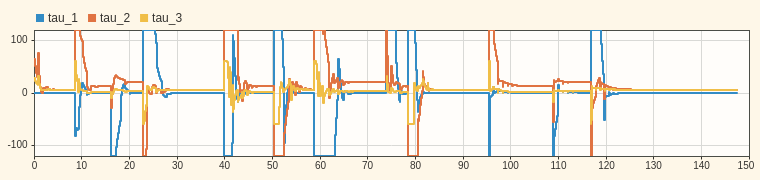
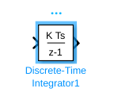
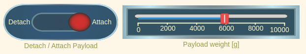
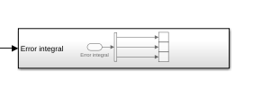

# Exercici 5.2 \- Control d’esforç del manipulador de tres enllaços fent servir control PD i extensions

En aquest exercici faràs servir un esquema de control PD per controlar el manipulador de tres enllaços en simulació fent servir Simulink. 

# Inicia la simulació
```matlab
StartTutorialApplication('Simulation','Controller', 'Effort', 'Model','threelink', 'Docker', false);
StartTutorialApplication('Trajectory', 'Docker', false);
StartTutorialApplication('Safety_nodes','docker',false, 'model','threelink'); %envia un parell 0 quan no s’ha enviat cap altra comanda
```

Recorda que pots alentir la simulació així: 


SetSimulationSpeed( SpeedFactor, 'docker', false)

# Paràmetres

Configura el límit de parell com: 

 $$ {\textrm{tau}}_{\lim } =\left\lbrack \begin{array}{c} 120\newline 120\newline 60 \end{array}\right\rbrack \left\lbrack \textrm{Nm}\right\rbrack $$ 

i la configuració desitjada (tant velocitat com posició)


prova les configuracions 

 $$ q\in \left\lbrace \left\lbrack \begin{array}{c} -\frac{\pi }{3}\newline \frac{\pi }{3}\newline \frac{\pi }{10} \end{array}\right\rbrack ,\left\lbrack \begin{array}{c} -\pi \;\newline \frac{\pi }{5}\newline \frac{\pi }{6}\; \end{array}\right\rbrack ,\left\lbrack \begin{array}{c} \frac{\pi }{8}\newline -\frac{\textrm{pi}}{2}\newline \frac{\textrm{pi}}{3} \end{array}\right\rbrack \right\rbrace $$ 

desa-les com: 

-  q\_desired\_1 
-  q\_desired\_2 
-  q\_desired\_3 
-  qd\_desired 
```matlab
taulim = [120,120,60]';
q_desired_1 = [-pi/3, pi/3, pi/10]'; 
q_desired_2 = [-pi,pi/5,pi/6]'; 
q_desired_3 = [pi/8,-pi/2,pi/3]'; 
qd_desired = [0,0,0]'; 
```

per visualitzar les transformacions objectiu a Rviz:

```matlab
load("5.Control/Resources/targetTransform_threelink.mat");
StaticFrameBroadcaster(targetTransform_threelink_1, 'target1');
```

```matlabTextOutput
Transformació estàtica publicada: base_link → target1
```

```matlab
StaticFrameBroadcaster(targetTransform_threelink_2, 'target2');
```

```matlabTextOutput
Transformació estàtica publicada: base_link → target2
```

```matlab
StaticFrameBroadcaster(targetTransform_threelink_3, 'target3');
```

```matlabTextOutput
Transformació estàtica publicada: base_link → target3
```


Per provar qualsevol altra configuració pots fer:

```matlab
syms q1 q2 q3 real 
DH =    [3/10, pi/2, 1/5, q1;
         1/2,    0,   0,  q2;
         1/2,    0,   0,  q3]; 
T03 = dh2tf(DH); 

q_desired_3 = [pi/8,-pi/2,pi/3]'; % insereix aquí la teva configuració
targetTransform = double(subs(T03, [q1,q2,q3], q_desired_3')); 
StaticFrameBroadcaster(targetTransform, 'target3');
```

```matlabTextOutput
Transformació estàtica publicada: base_link → Target_frame
```

# Tasca 1 Esquema de control PD
## Tasca 1.1 \- Selecció de guanys

L’esquema de control PD no cancel·la les no-linealitats com l’esquema de control per dinàmica inversa dels Exercicis 4.2 i 5.1. Mentre que l’esquema de dinàmica inversa escala els guanys seleccionats amb la matriu d’inèrcia, aquí no és així. 


Per tenir un punt de partida per ajustar els guanys, fes servir els guanys calculats a l’Exercici 4.2 i escala’ls de la manera següent: 


estima els valors màxims dels termes diagonals de la matriu d’inèrcia B. 


Per estimar-ho sense fer servir un algorisme d’optimització, substitueix totes les funcions sin/cos per $\pm 1$ de manera que el valor resultant sigui maximitzat. 

### Exemple:
### $$ f\left(x_1 ,x_2 \right)=5\cdot \sin \left(x_1 \right)-2\cdot \cos \left(x_2 \right)+5\cdot \sin \left(\frac{x_1 }{x_2 }\right) $$
### $$ \max \;\hat{\;f} \left(x_1 ,x_2 \right)=5\cdot 1-2\cdot -1+5\cdot 1=12 $$

Aleshores multiplica els teus guanys anteriors per aquesta estimació com:

 $$ {\textrm{Kp}}_{\textrm{PD}} =\max \hat{\;B} \left(q_1 ,q_2 ,q_3 \right)*{\textrm{Kp}}_{\textrm{inverseDynamic}} $$ 

i

 $$ {\textrm{Kd}}_{\textrm{PD}} =\max \hat{\;B} \left(q_1 ,q_2 ,q_3 \right)*{\textrm{Kd}}_{\textrm{inverseDynamic}} $$ 

(podràs escalar els guanys durant la simulació) 


Fes servir la matriu d’inèrcia simbòlica de l’Exercici 4.1 per calcular aquí els teus guanys: 


```matlabTextOutput
w_i = 1x3
    3.8095    4.9689    7.1429

```

# Dashboard

Al fitxer de Simulink trobaràs la secció dashboard que et permet canviar entre les configuracions, veure la sortida de parell actual i escalar les matrius Kp i Kd durant la simulació. 

### Selector de configuració 

Marca una d’aquestes caselles per seleccionar la configuració desitjada. 


aquest bloc de selecció està enllaçat amb: 


### Escala Kd i Kp

Fent servir els controls lliscants pots modificar el valor de guany dels seus blocs K\_scale corresponents: 


### Visualitza la trajectòria de parell

El scope del Dashboard et permet veure els parells actuals en directe durant la simulació (com un scope). 




## Tasca 1.2

Configura un esquema de control PD. Obre el fitxer Exercise\_5\_2\_1.slx i configura la planta. 


Analitza el comportament i comprova si el manipulador arriba a la seva configuració. 


pots carregar els resultats de la simulació a matlab amb: 

```matlab
q_data_1 = out.position; 
qd_data_1 = out.velocity; 
tau_data_1 = out.tau; 
t_data_1 = out.tout; 
```

Representa gràficament els teus resultats a matlab. 


# Tasca 2 PD + compensació de gravetat

Per reduir l’error en règim estacionari podem millorar el model introduint la compensació de gravetat. 

## Tasca 2.1 Terme de gravetat

converteix la teva matriu simbòlica de gravetat de l’Exercici 4.1 en una funció tal com has fet a l’Exercici 5.1 (o fes servir el fitxer existent). 

## Tasca 2.2 Actualitza la planta

Obre el fitxer Exercise\_5\_2\_2.slx i insereix la teva planta de la Tasca 1. Ara afegeix un bloc MatlabFunction i fes servir la funció de la matriu de gravetat. 


L’esquema de control resultant ha de ser (abans d’aplicar la saturació) 

 $$ \textrm{tau}={\textrm{Kp}}_{\textrm{PD}} \cdot e+{\textrm{Kd}}_{\textrm{PD}} \cdot \dot{\;e} +G\left(q\right) $$ 

Analitza el comportament d’aquest esquema de control millorat. 


# Tasca 3 Terme integral 

Aquest esquema funciona bé quan només t’importa el manipulador buit o quan el pes de la càrrega útil és negligible. Si aquest no és el cas, podem millorar el comportament introduint un terme d’integració que creixi sempre que el robot sigui a prop de la configuració. 

## Guany de l’integrador Ki 

Comença definint el guany Ki com: 

 $$ K_i =\left\lbrack \begin{array}{ccc} 1 & 0 & 0\newline 0 & 1 & 0\newline 0 & 0 & 1 \end{array}\right\rbrack $$ 

Després el pots escalar durant la simulació fent servir el control lliscant designat al dashboard. 


## Anti-windup

És important que el terme d’error integral no creixi quan el desplaçament és molt gran. Una manera d’implementar una lògica anti-windup és fent servir un bloc de funció matlab. 


Escriu una funció que prengui les velocitats articulars i l’error de posició com a entrada i retorni un vector d’increment d’error integral. 


El vector d’error de sortida només hauria de contenir valors no nuls als índexs que tinguin una velocitat articular baixa (les articulacions han assolit el seu parell basant-se en els termes no integrals). Els altres valors han de ser 0. 

## Bloc integrador

Fes servir el bloc integrador de temps discret. 





Selecciona: 

-  'Integration: Trapezoidal' com a mètode de l’integrador 
-  Defineix el valor de Gain a 1.0  
-  'either' com a External reset 

Has de reiniciar el bloc integrador quan canviïs la configuració de referència. 


Pots fer servir un bloc Detect Change:


com a entrada pots fer servir el bloc Selector del selector de configuració articular. Així, sempre que canviïs la configuració objectiu, reinicies la integral. 


## Afegeix una càrrega útil

Pots afegir una càrrega útil a l’efector final activant l’interruptor Attach. 


Pots definir el pes de la càrrega útil en grams.


 


Per adjuntar una nova càrrega útil, primer desadjunta l’antiga, canvia el pes i torna-la a adjuntar. 


Quan adjuntis una càrrega útil, assegura’t que l’efector final no s’estigui movent; si no, la càrrega útil pot tenir un desplaçament (no visible a Rviz). 

## Visualitza l'error integral

Connecta el teu error integral al subsistema Error integral per veure’l al dashboard


