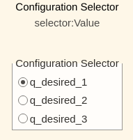
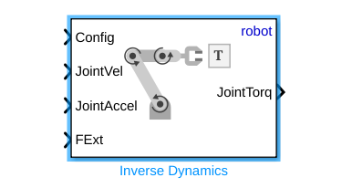

# Exercici 5.3 \- Control d’esforç d’un UR fent servir Robotic System Toolbox

En aquest exercici controlaràs un manipulador Universal Robots fent servir Simulink. 

# Inicia la simulació
```matlab
urmodel = 'ur3e'
StartTutorialApplication('Simulation','Controller', 'Effort', 'Model',urmodel, 'Docker', false);
StartTutorialApplication('Trajectory', 'Docker', false);
StartTutorialApplication('Safety_nodes','docker',false, 'model','threelink'); %envia un parell 0 quan no s’ha enviat cap altra comanda
```

Recorda que pots alentir la simulació així: 


SetSimulationSpeed( SpeedFactor, 'docker', false)

# Carrega el robot

importa el robot Universal de la teva elecció fent servir fitxers urdf i defineix la gravetat en direcció \-z. 


# Paràmetres

Configura els teus paràmetres com a l’Exercici 4.2.


Defineix: 

-  Kp (es pot escalar durant la simulació) 
-  Kd (es pot escalar durant la simulació) 
-  taulim segons el teu robot 

# Configuracions 

Prova diferents configuracions


desa-les com: 

-  q\_desired\_1 
-  q\_desired\_2 
-  q\_desired\_3 
-  qd\_desired 
# Visualització

calcula la transformació de les configuracions desitjades i visualitza-la a rviz. 


# Dashboard

Al fitxer de Simulink trobaràs la secció dashboard que et permet canviar entre les configuracions, veure la sortida de parell actual i escalar les matrius Kp i Kd durant la simulació. 

### Selector de configuració 

Marca una d’aquestes caselles per seleccionar la configuració desitjada. 





aquest bloc de selecció està enllaçat amb: 


### Escala Kd i Kp

Fent servir els controls lliscants pots modificar el valor de guany dels seus blocs K\_scale corresponents: 


### Visualitza la trajectòria de parell

El scope del Dashboard et permet veure els parells actuals en directe durant la simulació (com un scope). 


# Tasca 1 

Obre el fitxer Exercise\_5\_3\_1.slx i completa l’esquema de control amb els blocs que falten del Robotic System Toolbox. 


Fes servir els blocs següents: 


especifica: 

-  'robot' com a Rigid body tree 
# Tasca 2

Obre el fitxer Exercise\_5\_3\_2.slx i completa l’esquema de control fent servir el bloc següent: 





especifica: 

-  'robot' com a Rigid body tree 

Les entrades són idèntiques a les explicades al Tutorial 4 per a la funció "inverseDynamics()".