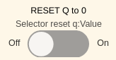
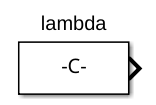
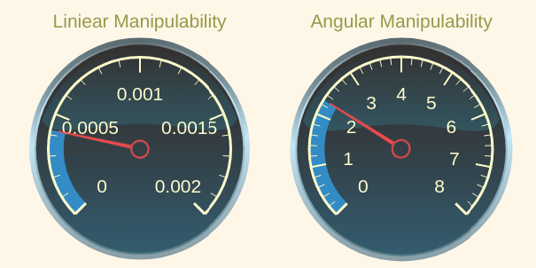
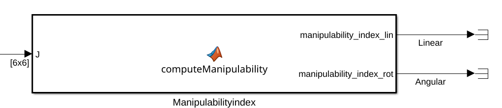

# Exercici 5.4 \- Universal Robots en l’espai de tasca fent servir control de velocitat

Fins ara totes les implementacions de control s’han fet en l’espai articular.


En aquest exercici configuraràs un controlador de velocitat que opera en l’espai de tasca. 

# Carrega el robot

Selecciona un UR de la teva elecció i carrega’l ja sigui mitjançant els fitxers urdf o des del Robotic System Toolbox. 

```matlab
urmodel = 'universalUR3e';
robot = loadrobot(robotmodel, DataFormat="column"); 
```
# Inicia la simulació

No oblidis seleccionar el mateix robot com a model. 

```matlab
StartTutorialApplication('simulation','model', urmodel, 'controller','velocity', 'docker',false)
StartTutorialApplication('safety_nodes', 'docker',false)
StartTutorialApplication('trajectory','docker',false) %envia un parell 0 quan no s’ha enviat cap altra comanda
```

Recorda que pots alentir la simulació així: 


SetSimulationSpeed( SpeedFactor, 'docker', false)

# Límits articulars

Configura el límit de velocitat com: 

 $$ {\dot{\;q} }_{\lim } =\left\lbrack \begin{array}{c} 0\ldotp 7\newline 0\ldotp 7\newline 0\ldotp 7\newline 0\ldotp 7\newline 0\ldotp 7\newline 0\ldotp 7 \end{array}\right\rbrack \left\lbrack \frac{\textrm{rad}}{s}\right\rbrack $$ 
# Configuracions objectiu

Prova diferents configuracions i converteix-les en una matriu de transformació homogènia. Fes servir configuracions que no donin lloc a una singularitat. 


Desa-les com: 

-  T\_desired\_1 
-  T\_desired\_2 
-  T\_desired\_3 

Fer servir configuracions articulars i la cinemàtica directa garanteix que les transformacions resultants siguin assolibles pel robot.

 $$ T_{\textrm{desired},i} \left(q_{\textrm{config},i} \right)=\textrm{forward}_\textrm{kinematics}\left(q_{\textrm{config},i} \right) $$ 

o fent servir la funció del Robotic System Toolbox com


 $T_{\textrm{desired},i}$ = getTransform(robot, config\_i, "tool0", "base\_link");


Tanmateix, també pots provar altres matrius de transformació. Les pots construir fent servir les funcions transl() i trotm(angle, 'axis'). 


visualitza les configuracions a rviz: 


```matlabTextOutput
Transformació estàtica publicada: base_link → target_1
Transformació estàtica publicada: base_link → target_2
Transformació estàtica publicada: base_link → target_3
```

### Configuracions singulars

A continuació configurarem algunes configuracions singulars. 

```matlab
singular_configuration1 = [0,-pi/2,0,-pi/2,0,0]'; 
Singular_1 = getTransform(robot, singular_configuration1, "tool0", "base_link");
StaticFrameBroadcaster(Singular_1, 'singular_1');
```

```matlabTextOutput
Transformació estàtica publicada: base_link → singular_1
```

```matlab

singular_configuration2 = [pi/3,0,0,-pi/2,0,0]'; 
Singular_2 = getTransform(robot, singular_configuration2, "tool0", "base_link");
StaticFrameBroadcaster(Singular_2, 'singular_2');
```

```matlabTextOutput
Transformació estàtica publicada: base_link → singular_2
```

# Càlcul de l’error

Aquest controlador opera en **l’espai de tasca**, és a dir, els errors es calculen directament a partir de les **matrius de transformació homogènia** desitjada i actual.


Sigui

 $$ T_{\textrm{desired}} =\left\lbrack \begin{array}{cc} R_{\textrm{desired}}  & t_{\textrm{desired}} \newline 0 & 1 \end{array}\right\rbrack $$ 

 $$ T_{\textrm{current}} \left(q\right)=\left\lbrack \begin{array}{cc} R_{\textrm{current}}  & t_{\textrm{current}} \newline 0 & 1 \end{array}\right\rbrack $$ 

amb la matriu de rotació $R_i \in \mathbb{R}{\;}^{3\textrm{x3}} \;$ i el vector de posició $t_i \in {\mathbb{R}}^{3\textrm{x1}}$ 

## Error de posició (espai de tasca)

el càlcul de l’error de posició és directe: 

 $$ e_{\textrm{pos}} =t_{\textrm{desired}} -t_{\textrm{current}} $$ 
## Error d’orientació (espai de tasca)

L’error d’orientació **no** és tan directe.


Les representacions amb angles d’Euler no són adequades perquè pateixen **bloqueig de gimbal** i discontinuïtats.


Per calcular un error d’orientació **lliure de singularitats**, les matrius de rotació es converteixen primer en **quaternions unitaris**.


El quaternion d’error es calcula com un producte de quaternions: 

 $$ q_{\textrm{error}} =q_{\textrm{desired}} \otimes q_{\textrm{current}}^{-1} $$ 

Tingues en compte que l’operand $\otimes$ no és una multiplicació normal. 

### Quaternions

Recorda que un quaternion unitari està format per 4 valors: 

 $$ q=\left\lbrack \begin{array}{c} w\newline v \end{array}\right\rbrack =\left\lbrack \begin{array}{c} w\newline x\newline y\newline z \end{array}\right\rbrack $$ 

on

-  w és la part escalar 
-  v la part vectorial  
-  i $||q||=1$ 

El conjugat d’un quaternion es pot construir com: 

 $$ q^{-1} =\left\lbrack \begin{array}{c} w\newline -v \end{array}\right\rbrack $$ 
## Error de quaternion

Calcula l’error d’orientació de la manera següent. 


sigui 


 $q_{\textrm{desired}} =\left\lbrack \begin{array}{c} w_d \newline v_d  \end{array}\right\rbrack$ i $q_{\textrm{current}}^{-1} =\left\lbrack \begin{array}{c} w_{\textrm{current}} \newline -v_{\textrm{current}}  \end{array}\right\rbrack =\left\lbrack \begin{array}{c} w_c \newline v_c  \end{array}\right\rbrack$ 


calcula el quaternion d’error com: 

 $$ q_{\textrm{error}} =\left\lbrack \begin{array}{c} w_e \newline v_e  \end{array}\right\rbrack $$ 

amb 

 $$ w_e =w_d \cdot w_c -v_d^T \cdot v_c $$ 

i

 $$ v_e =w_d \cdot v_c +w_c \cdot v_d +v_d \times v_c $$ 

(L’operand $\times$ és un producte vectorial)


Un quaternion q i \-q representen la mateixa orientació. 


Per garantir que fem servir la rotació més curta per alinear les orientacions, has de definir el quaternion d’error com: 

 $ $ \left\lbrace \begin{array}{ll} q_e =\left\lbrack \begin{array}{c} w_e \newline v_e  \end{array}\right\rbrack  & \textrm{si}\;w_e >0\\
q_e =\left\lbrack \begin{array}{c} -w_e \newline -v_e  \end{array}\right\rbrack  & \textrm{si}\;w_e <0
\end{array}\right. $ $ 

### Calcula el vector d’error $e_{\textrm{ori}}$ 

sigui 

 $$ \textrm{nv}=||v_e || $$ 

aleshores pots calcular l’angle $\theta$ com: 

 $$ \theta =2\cdot \textrm{atan2}\left(\textrm{nv},w_e \right) $$ 

finalment calcula $e_{\textrm{ori}}$ depenent de l’angle com: 

 $ $ \left\lbrace \begin{array}{ll} e_{\textrm{ori}} =\left\lbrack \begin{array}{c} 0\newline 0\newline 0 \end{array}\right\rbrack  & \textrm{si}\;\theta <{10}^{-10} \\
e_{\textrm{ori}} =\theta \cdot \frac{v_e }{||v_e ||}=\theta \cdot \frac{v_e }{\textrm{nv}} & \textrm{si}\;\theta >{10}^{-10} 
\end{array}\right. $ $ 

## Error ponderat

Com que la manipulabilitat de la posició generalment és més petita que la manipulabilitat de l’orientació, hem d’aplicar pesos a l’error per tenir-ho en compte. 


Inicialitza amb aquests pesos i actualitza’ls si cal:

 $ K_{\textrm{position}} = $ $ \left\lbrack \begin{array}{ccc} 1 & 0 & 0\newline 0 & 1 & 0\newline 0 & 0 & 1 \end{array}\right\rbrack $ 

 $ K_{\textrm{orientation}} = $ $ \left\lbrack \begin{array}{ccc} 0\ldotp 5 & 0 & 0\newline 0 & 0\ldotp 5 & 0\newline 0 & 0 & 0\ldotp 5 \end{array}\right\rbrack $ 

 $$ e_{\textrm{position}} =K_{\textrm{position}} \cdot e_{\textrm{pos}} $$ 

 $$ e_{\textrm{orientation}} =K_{\textrm{orientation}} \cdot e_{\textrm{ori}} $$ 

Inicialitza aquí els teus pesos


construeix l’error respecte del teu jacobià: 

 $ $ e=\left\lbrace \begin{array}{ll} \left\lbrack \begin{array}{c} e_{\textrm{position}} \newline e_{\textrm{orientation}}  \end{array}\right\rbrack  & \textrm{si}\;J=\left\lbrack \begin{array}{c} J_p \newline J_{\theta \;}  \end{array}\right\rbrack \;\\
\left\lbrack \begin{array}{c} e_{\textrm{orientation}} \newline e_{\textrm{position}}  \end{array}\right\rbrack  & \textrm{si}\;J=\left\lbrack \begin{array}{c} J_{\theta \;} \newline J_p  \end{array}\right\rbrack \;
\end{array}\right. $ $ 
# Pseudoinversa del jacobià amb amortiment de mínims quadrats

Podem millorar el comportament del robot prop de singularitats fent servir una pseudoinversa del jacobià amb amortiment de mínims quadrats.


Calcula-la de la manera següent: 

 $$ J_{\lambda \;}^{\dagger} =J^T \cdot {\left({J\cdot \;J}^T +2\cdot \lambda^2 \cdot I\right)}^{-1} $$ 
# Dashboard

Un cop obris el fitxer de Simulink, veuràs un dashboard amb múltiples opcions d’entrada i monitoratge. 

## Selector de transformació

Et permet canviar entre les transformacions definides prèviament.


 seleccionar una transformació canviarà l’entrada de: 


assegura’t que totes les transformacions estiguin carregades al teu espai de treball. 

## Reinicia la configuració

Algunes velocitats articulars requerides poden fer que les articulacions del robot arribin als seus límits ( $\pm 2\pi$ per a totes les articulacions excepte l’última articulació del canell). Pots activar l’interruptor durant la simulació per moure totes les articulacions a 0. 




## Selecció de lambda 

pots ajustar la teva lambda durant la simulació fent servir el control lliscant.


El valor del control lliscant es pot fer servir al bloc constant: 




## Monitoratge d’estats

Tens dos gràfics en directe que et mostren la configuració articular q i les velocitats articulars qd. 


## Monitoratge de manipulabilitat

Tens dos indicadors que et mostren l’índex de manipulabilitat actual. Els seus límits estan configurats per a un model UR3e. 


Si fas servir un model més gran, potser hauràs d’ajustar els límits. 





Les mesures estan enllaçades amb la sortida d’aquest bloc de funció matlab: 




# Blocs de Simulink

Pots resoldre aquest exercici fent servir els blocs de Simulink següents (nous). 

## Get Jacobian (Robotic System Toolbox)

selecciona:

-  'robot' com a robot  
-  'tool0' com a End Effector.  


### Entrades: 

Introdueix una configuració articular obtinguda del subsistema GetJointValues com $q\in \mathbb{R}{\;}^{6\textrm{x1}}$ 

### Sortides: 

El jacobià com $J\left(q\right)=\left\lbrack \begin{array}{c} J_{\theta \;} \newline J_p  \end{array}\right\rbrack$ 

## Get Transform (Robotic System Toolbox)

especifica: 

-  'robot' com a Ridged body tree  
-  'tool0' com a Source body 
-  'base\_link' com a Target body 


## Coordinate Transformation Conversion (Robotic System Toolbox)

especifica: 

-  'Homogeneous Transformation' com a Input Representation 
-  'Quaternion' com a Output Representation 
-  marca 'Show TrVec output port' 


# Tasca
## Esquema de control

Configura l’esquema de control per controlar el robot fent servir la comanda de velocitat. 

## Blocs de funció Matlab

Per completar l’esquema hauràs d’escriure els blocs de funció matlab següents: 

-  Pseudoinversa del jacobià amb amortiment de mínims quadrats 
-  Càlcul de l’error fent servir error d’orientació amb quaternions 
-  Càlcul de l’índex de manipulabilitat (bloc específic ja col·locat, vegeu més amunt)  
## Analitza 
-  Analitza el comportament per a diferents valors de $\lambda$.  
-  Quan $\lambda =0$ no hi ha amortiment.  
-  Analitza específicament com modifica el comportament prop de configuracions singulars.  
-  Analitza el comportament de diferents pesos sobre l’error de rotació i l’error de posició  