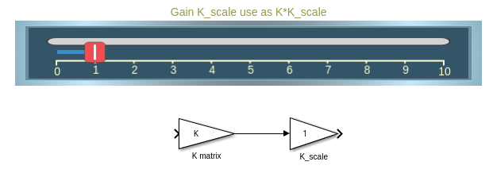
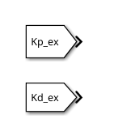
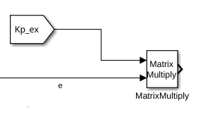

# Exercici 5.5 \- Universal Robots en l’espai de tasca fent servir control d’esforç

En aquest exercici controlaràs un manipulador Universal Robots fent servir una solució de cinemàtica inversa que es controla mitjançant la comanda d’esforç. 

# Inicia la simulació
```matlab
urmodel = 'ur3e'
StartTutorialApplication('Simulation','Controller', 'Effort', 'Model',urmodel, 'Docker', false);
StartTutorialApplication('Trajectory', 'Docker', false);
StartTutorialApplication('Safety_nodes','docker',false, 'model','threelink'); %envia un parell 0 quan no s’ha enviat cap altra comanda
```

Recorda que pots alentir la simulació així: 


SetSimulationSpeed( SpeedFactor, 'docker', false)

# Carrega el robot

importa el robot Universal de la teva elecció fent servir fitxers urdf i defineix la gravetat en direcció \-z. 


# Paràmetres

Configura els teus paràmetres com a l’Exercici 4.2.


Defineix: 

-  Kp (es pot escalar durant la simulació) 
-  Kd (es pot escalar durant la simulació) 
-  taulim segons el teu robot 

# Configuracions 

Prova diferents configuracions


desa-les com: 

-  T\_desired\_1 
-  T\_desired\_2 
-  T\_desired\_3 
-  qd\_desired 

Fer servir configuracions articulars i la cinemàtica directa garanteix que les transformacions resultants siguin assolibles pel robot.

 $$ T_{\textrm{desired},i} \left(q_{\textrm{config},i} \right)=\textrm{forward}_\textrm{kinematics}\left(q_{\textrm{config},i} \right) $$ 

o fent servir la funció del Robotic System Toolbox com


 $T_{\textrm{desired},i}$ = getTransform(robot, config\_i, "tool0", "base\_link");


Tanmateix, també pots provar altres matrius de transformació. Les pots construir fent servir les funcions transl() i trotm(angle, 'axis'). 

```matlab
config_example1 = [0,-pi/4,pi/2,-pi/3,pi/7,pi/5]';
T_desired_1 = getTransform(robot, config_example1, "tool0", "base_link");

config_example2 = [pi/3,-pi/4,pi/4,-pi/2,pi/9,pi/2]';
T_desired_2 = getTransform(robot, config_example2, "tool0", "base_link");

config_example3 = [pi/3,pi/3,-pi/1.5,pi/9,pi/8,0]';
T_desired_3 = getTransform(robot, config_example3, "tool0", "base_link");

```
# Visualització

Visualitza-ho a rviz. 

```matlab
StaticFrameBroadcaster(T_desired_1, 'target_1');
```

```matlabTextOutput
Transformació estàtica publicada: base_link → target_1
```

```matlab
StaticFrameBroadcaster(T_desired_2, 'target_2');
```

```matlabTextOutput
Transformació estàtica publicada: base_link → target_2
```

```matlab
StaticFrameBroadcaster(T_desired_3, 'target_3');
```

```matlabTextOutput
Transformació estàtica publicada: base_link → target_3
```

# Dashboard

Al fitxer de Simulink trobaràs la secció dashboard que et permet canviar entre les configuracions, veure la sortida de parell actual i escalar les matrius Kp i Kd durant la simulació. 

### Selector de configuració 

Marca una d’aquestes caselles per seleccionar les transformacions objectiu. 


aquest bloc de selecció està enllaçat amb: 


### Escala Kd i Kp

Fent servir els controls lliscants pots modificar el valor de guany dels seus blocs K\_scale corresponents: 




### Visualitza la trajectòria de parell

El scope del Dashboard et permet veure els parells actuals en directe durant la simulació (com un scope). 


# Tasca 1 

Obre el fitxer Exercise\_5\_5\_1.slx i configura un esquema de control que operi fent servir una matriu de transformació com a entrada. 

## Tasca 1.1

Per obtenir una configuració articular vàlida que satisfaci la postura desitjada, fes servir el bloc "inverse Kinematic"


Especifica: 

-  'robot' com a Ridgid body tree 
-  'tool0' com a EE 
### Entrades: 
-  Transformació desitjada com a Pose 
-  Configuració articular actual com a InitalGuess 
-  $\displaystyle \textrm{weights}\in {\mathbb{R}}^{6\textrm{x1}}$ 

Les entrades weights són les toleràncies permeses. Defineix la tolerància a ${10}^{-3}$ per a la posició i ${10}^{-2}$ per a l’orientació. 

## Tasca 1.2

Fes servir un esquema de control per dinàmica inversa (com a l’Exercici 5.4) per moure l’efector final fins a la solució del bloc de cinemàtica inversa. 

# Tasca 2

Obre el fitxer Exercise\_5\_5\_2.slx i configura un esquema de control que operi fent servir una matriu de transformació com a entrada. 

## Tasca 2.1

Idèntica a la Tasca 1.1 

## Tasca 1.2

Fes servir un esquema de control PID amb compensació de gravetat per arribar a la configuració articular calculada. 

### Ajust dels guanys 

Pots seguir l’enfocament d’estimar els guanys fent servir la matriu d’inèrcia o provar de determinar experimentalment uns bons guanys. 


Pots ajustar els guanys fent servir els controls lliscants verticals; a la dreta veuràs la matriu de guany resultant. 


Per fer-los servir pots utilitzar els blocs "From": 





Pots fer càlculs amb les matrius, per exemple, fent servir un bloc de multiplicació de matrius: 


