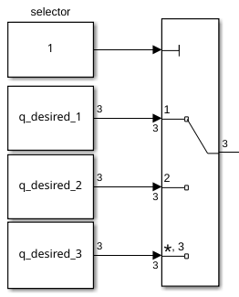
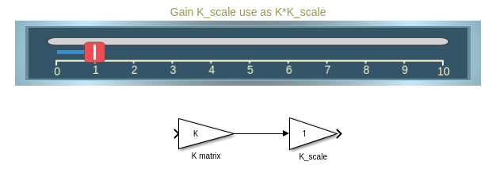
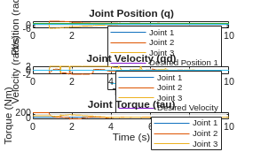
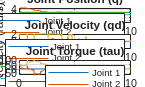

# Exercise 5.1 \- Threelink effort control using Symbolic Matrices

In this exercise you will use the matrices computed in Exercise 4.1 to control the Threelink manipulator in simulation using Simulink. 

# Start the Simulation
```matlab

StartTutorialApplication('Simulation','Controller', 'Effort', 'Model','threelink', 'Docker', false);
StartTutorialApplication('Trajectory', 'Docker', false);
StartTutorialApplication('Safety_nodes','docker',false, 'model','threelink'); %sends a 0 torque when no other command has been sent
```

Remember that you can slow down the simulation as: 


SetSimulationSpeed( SpeedFactor, 'docker', false)

# Convert Symbolic Matrices to Functions 

To use symbolic variables inside Simulink we have to convert them to a function. 

```matlab
syms symbolic1 symbolic2 real
my_sym_variable = [symbolic1^-1, symbolic2*4];
my_sym_vec = [symbolic1, symbolic2]
```
my_sym_vec = 

  $$ \displaystyle \left(\begin{array}{cc} {\textrm{symbolic}}_1  & {\textrm{symbolic}}_2  \end{array}\right) $$ 
 

```matlab
matlabFunction(my_sym_variable, 'vars',{my_sym_vec}, 'File','my_test_subs_function');
```

To use this function: 

```matlab
test_configuration = [2,2]
```

```matlabTextOutput
test_configuration = 1x2
     2     2

```

```matlab
my_sym_variable_subsituted = my_test_subs_function(test_configuration)
```

```matlabTextOutput
my_sym_variable_subsituted = 1x2
    0.5000    8.0000

```


*hint: This can be done using the MatlabFunction block in Simulink*

# Convert your Symbolic Matrices here


```matlabTextOutput
Unrecognized function or variable 'B'.
```

# Parameters

Setup the tau limit as: 

 $$ {\textrm{tau}}_{\lim } =\left\lbrack \begin{array}{c} 120\newline 120\newline 60 \end{array}\right\rbrack \left\lbrack \textrm{Nm}\right\rbrack $$ 

and the desired configuration (both speed and position)


try the configurations 

 $$ q\in \left\lbrace \left\lbrack \begin{array}{c} -\frac{\pi }{3}\newline \frac{\pi }{3}\newline \frac{\pi }{10} \end{array}\right\rbrack ,\left\lbrack \begin{array}{c} -\pi \;\newline \frac{\pi }{5}\newline \frac{\pi }{6}\; \end{array}\right\rbrack ,\left\lbrack \begin{array}{c} \frac{\pi }{8}\newline -\frac{\textrm{pi}}{2}\newline \frac{\textrm{pi}}{3} \end{array}\right\rbrack \right\rbrace $$ 

store them as: 

-  q\_desired\_1 
-  q\_desired\_2 
-  q\_desired\_3 
-  qd\_desired 
```matlab
taulim = [120,120,60]';
q_desired_1 = [-pi/3, pi/3, pi/10]'; 
q_desired_2 = [-pi,pi/5,pi/6]'; 
q_desired_3 = [pi/8,-pi/2,pi/3]'; 
qd_desired = [0,0,0]'; 
```

to visualize the target transforms in Rviz:

```matlab
load("5.Control/Resources/targetTransform_threelink.mat");
StaticFrameBroadcaster(targetTransform_threelink_1, 'target1');
```

```matlabTextOutput
Published static transform: base_link → target1
```

```matlab
StaticFrameBroadcaster(targetTransform_threelink_2, 'target2');
```

```matlabTextOutput
Published static transform: base_link → target2
```

```matlab
StaticFrameBroadcaster(targetTransform_threelink_3, 'target3');
```

```matlabTextOutput
Published static transform: base_link → target3
```

# Gains

Select the gains for your system, as this is an inverse dynamic scheme, follow the approach from Exercise 4.2. Don't scale the gains yet, you will be able to do so during simulation. 


```matlabTextOutput
w_i = 1x3
    3.8095    4.9689    7.1429

```

# Dashboard

In the Simulink file you will find the dashboard section that allows you to switch between the configurations, see the current torque output and scale the Kp and Kd matrix during simulation. 

### Configuration Selector 

Check one of these boxes to select the desired configuration. 


this selection block is linked to: 




### Scale Kd and Kp

By using the sliders you can alter the gain value of their corresponding K\_scale blocks: 




### View Torque Trajectory

The Dashboard scope allows you to see the current torques live during simulation (like a scope). 


# Task 1

Open the File Exercise\_5\_1\_1.slx you will find a setup to be used for this exercise. From the outputs q and qd (left Subsystem) you will receive the current position and velocity of the joints as a column vector. 


The input to the right subsystem accepts a column vector and sends the torques to the simulation. 


To import the results of your simulation into matlab: 

```matlab
q_data_1 = out.position; 
qd_data_1 = out.velocity; 
tau_data_1 = out.tau; 
t_data_1 = out.tout; 
```

Plot your results in matlab. 





# Task 2 

Reduce the computational load by only considering the diagonal terms of the B and C matrix and analyze the behavior and compare them to the results of Task 1. 

## Task 2.1 

Setup the new symbolic matrix and convert them to a function.


## Task 2.2 

Open the File Exercise 5\_1\_2.slx and setup the plant with the new matrices B' and C'. 


To import the results of your simulation into matlab: 




