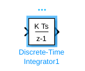
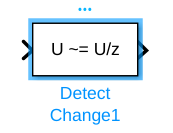
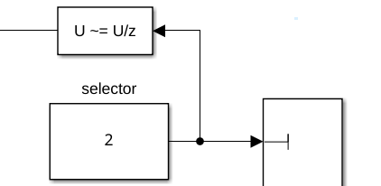
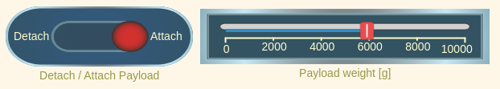
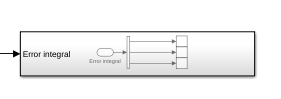

# Exercise 5.2 \- Threelink effort control using PD control and extenstions

In this exercise you will use a PD to control scheme the Threelink manipulator in simulation using Simulink. 

# Start the Simulation
```matlab
StartTutorialApplication('Simulation','Controller', 'Effort', 'Model','threelink', 'Docker', false);
StartTutorialApplication('Trajectory', 'Docker', false);
StartTutorialApplication('Safety_nodes','docker',false, 'model','threelink'); %sends a 0 torque when no other command has been sent
```

Remember that you can slow down the simulation as: 


SetSimulationSpeed( SpeedFactor, 'docker', false)

# Parameters

Setup the tau limit as: 

 $$ {\textrm{tau}}_{\lim } =\left\lbrack \begin{array}{c} 120\newline 120\newline 60 \end{array}\right\rbrack \left\lbrack \textrm{Nm}\right\rbrack $$ 

and the desired configuration (both speed and position)


try the configurations 

 $$ q\in \left\lbrace \left\lbrack \begin{array}{c} -\frac{\pi }{3}\newline \frac{\pi }{3}\newline \frac{\pi }{10} \end{array}\right\rbrack ,\left\lbrack \begin{array}{c} -\pi \;\newline \frac{\pi }{5}\newline \frac{\pi }{6}\; \end{array}\right\rbrack ,\left\lbrack \begin{array}{c} \frac{\pi }{8}\newline -\frac{\textrm{pi}}{2}\newline \frac{\textrm{pi}}{3} \end{array}\right\rbrack \right\rbrace $$ 

store them as: 

-  q\_desired\_1 
-  q\_desired\_2 
-  q\_desired\_3 
-  qd\_desired 
```matlab
taulim = [120,120,60]';
q_desired_1 = [-pi/3, pi/3, pi/10]'; 
q_desired_2 = [-pi,pi/5,pi/6]'; 
q_desired_3 = [pi/8,-pi/2,pi/3]'; 
qd_desired = [0,0,0]'; 
```

to visualize the target transforms in Rviz:

```matlab
load("5.Control/Resources/targetTransform_threelink.mat");
StaticFrameBroadcaster(targetTransform_threelink_1, 'target1');
```

```matlabTextOutput
Published static transform: base_link → target1
```

```matlab
StaticFrameBroadcaster(targetTransform_threelink_2, 'target2');
```

```matlabTextOutput
Published static transform: base_link → target2
```

```matlab
StaticFrameBroadcaster(targetTransform_threelink_3, 'target3');
```

```matlabTextOutput
Published static transform: base_link → target3
```


To try any other configuration you can: 

```matlab
syms q1 q2 q3 real 
DH =    [3/10, pi/2, 1/5, q1;
         1/2,    0,   0,  q2;
         1/2,    0,   0,  q3]; 
T03 = dh2tf(DH); 

q_desired_3 = [pi/8,-pi/2,pi/3]'; % insert your configuration here
targetTransform = double(subs(T03, [q1,q2,q3], q_desired_3')); 
StaticFrameBroadcaster(targetTransform, 'target3');
```

```matlabTextOutput
Published static transform: base_link → Target_frame
```

# Task 1 PD Control scheme
## Task 1.1 \- Gain Selection

The PD control scheme does not cancel the non linearities as the inverse dynamic control scheme from Exercise 4.2 and 5.1. While the inverse dynamic scheme scales the selected gains with the inertia matrix, this is not the case here. 


To have a starting point for your gain tuning, use the gains computed in Exercise 4.2 and scale them in the following way: 


estimate the maximum values of the diagonal terms of the Inertia matrix B. 


To estimate it without using an optimization algorithm, substitute all sin/cos functions with $\pm 1$ so that the resulting value will be maximized. 

### Example:
### $$ f\left(x_1 ,x_2 \right)=5\cdot \sin \left(x_1 \right)-2\cdot \cos \left(x_2 \right)+5\cdot \sin \left(\frac{x_1 }{x_2 }\right) $$
### $$ \max \;\hat{\;f} \left(x_1 ,x_2 \right)=5\cdot 1-2\cdot -1+5\cdot 1=12 $$

Then multiply your previous gains with this estimation as:

 $$ {\textrm{Kp}}_{\textrm{PD}} =\max \hat{\;B} \left(q_1 ,q_2 ,q_3 \right)*{\textrm{Kp}}_{\textrm{inverseDynamic}} $$ 

and

 $$ {\textrm{Kd}}_{\textrm{PD}} =\max \hat{\;B} \left(q_1 ,q_2 ,q_3 \right)*{\textrm{Kd}}_{\textrm{inverseDynamic}} $$ 

(you will be able to scale the gains during simulation) 


Use the symbolic Inertia matrix from Exercise 4.1 to compute your gains here: 


```matlabTextOutput
w_i = 1x3
    3.8095    4.9689    7.1429

```

# Dashboard

In the Simulink file you will find the dashboard section that allows you to switch between the configurations, see the current torque output and scale the Kp and Kd matrix during simulation. 

### Configuration Selector 

Check one of these boxes to select the desired configuration. 


this selection block is linked to: 


### Scale Kd and Kp

By using the sliders you can alter the gain value of their corresponding K\_scale blocks: 


### View Torque Trajectory

The Dashboard scope allows you to see the current torques live during simulation (like a scope). 


## Task 1.2

Setup a PD control scheme. Open the file Exercise\_5\_2\_1.slx and setup the plant. 


Analyze the behavior and see if the manipulator reaches its configuration. 


you can load the simulation results into matlab with: 

```matlab
q_data_1 = out.position; 
qd_data_1 = out.velocity; 
tau_data_1 = out.tau; 
t_data_1 = out.tout; 
```

Plot your results in matlab. 


# Task 2 PD + Gravity Compensation

To reduce the steady state error we can improve the model by introducing the gravity compensation. 

## Task 2.1 Gravity term

convert your symbolic gravity matrix from Exercise 4.1 into a function as you did in Exercise 5.1 (or use the existing file). 

## Task 2.2 Update the plant

Open the file Exercise\_5\_2\_2.slx and insert your plant from Task 1. Now add a MatlabFunction block and use the gravity matrix function. 


The resulting control scheme should be (before applying saturation) 

 $$ \textrm{tau}={\textrm{Kp}}_{\textrm{PD}} \cdot e+{\textrm{Kd}}_{\textrm{PD}} \cdot \dot{\;e} +G\left(q\right) $$ 

Analyze the behavior of this improved control scheme. 


# Task 3 Integral Term 

This scheme works well when you only care about the empty manipulator or the weight of the payload is neglectable. If this is not the case we can improve the behavior by introducing an integration term that grows whenever the robot is close to the configuration. 

## Integrator Gain Ki 

Start by defining the Ki gain as: 

 $$ K_i =\left\lbrack \begin{array}{ccc} 1 & 0 & 0\newline 0 & 1 & 0\newline 0 & 0 & 1 \end{array}\right\rbrack $$ 

You can then scale it during simulation using the designated slider on the dashboard. 


## Anti Windup

It is important that the integral error term does not grow when the displacement is very large. One way of implementing an anti windup logic is using a matlab function block. 


Write a function that takes the joint velocities and the position error as an input and output an integral error increment vector. 


The output error vector should only contain non zero values in indices that have low joint velocity (The joints have reached their torque based on the non integral terms). Other values should be 0. 

## Integrator Block

Use the discrete\-time integrator block. 





Select: 

-  'Integration: Trapezoidal' as the Integrator method 
-  Set Gain value to 1.0  
-  'either' as External reset 

You have to reset the Integrator block when changing the reference configuration. 


You can use a Detect Change block:





as an input you can use the Selector block from from the joint configuration selector. Thus whenever you change the goal configuration, you reset the integral. 




## Add a payload

You can add a payload to the endeffector by flipping the switch to Attach. 


You can define the weight of the payload in grams.


 


To attach a new payload first detach the old one, change the weight and attach it again. 


When attaching a payload, make sure your endeffector is not moving, otherwise the payload may have an offset (not visible in Rviz). 

## Visualize the error integral 

Connect your integral error to the subsystem Error integral to view it on the dashboard





