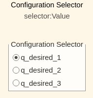
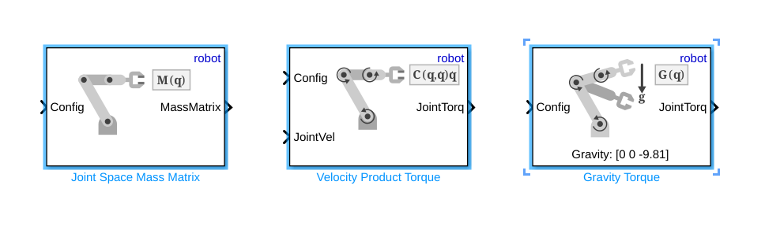
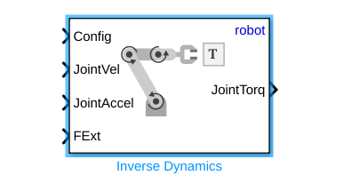

# Exercise 5.3 \- UR effort control using Robotic System Toolbox

In this exercise you will control a Universal Robots manipulator using Simulink. 

# Start the Simulation
```matlab
urmodel = 'ur3e'
StartTutorialApplication('Simulation','Controller', 'Effort', 'Model',urmodel, 'Docker', false);
StartTutorialApplication('Trajectory', 'Docker', false);
StartTutorialApplication('Safety_nodes','docker',false, 'model','threelink'); %sends a 0 torque when no other command has been sent
```

Remember that you can slow down the simulation as: 


SetSimulationSpeed( SpeedFactor, 'docker', false)

# Load the Robot

import your Universal robot of choice using urdf files and set gravity in \-z direction. 


# Parameters

Setup your parameters as in Exercise 4.2.


Set: 

-  Kp (can be scale during simulation) 
-  Kd (can be scale during simulation) 
-  taulim according to your robot 

# Configurations 

Try different configurations


store them as: 

-  q\_desired\_1 
-  q\_desired\_2 
-  q\_desired\_3 
-  qd\_desired 
# Visualization

compute the transform of the desired configurations and visualize it in rviz. 


# Dashboard

In the Simulink file you will find the dashboard section that allows you to switch between the configurations, see the current torque output and scale the Kp and Kd matrix during simulation. 

### Configuration Selector 

Check one of these boxes to select the desired configuration. 





this selection block is linked to: 


### Scale Kd and Kp

By using the sliders you can alter the gain value of their corresponding K\_scale blocks: 


### View Torque Trajectory

The Dashboard scope allows you to see the current torques live during simulation (like a scope). 


# Task 1 

Open the file Exercise\_5\_3\_1.slx and complete the control scheme the missing blocks from the Robotic System toolbox. 


Use the following blocks: 





specify: 

-  'robot' as Rigid body tree 
# Task 2

Open the file Exercise\_5\_3\_2.slx and complete the control scheme using the following block: 





specify: 

-  'robot' as Rigid body tree 

The inputs are identical to those explained in Tutorial 4 for the function "inverseDynamics()".


