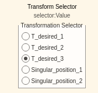
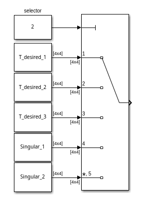
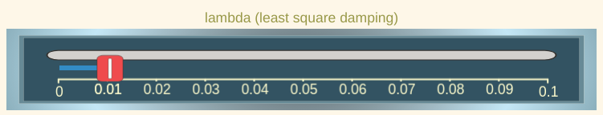
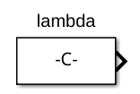
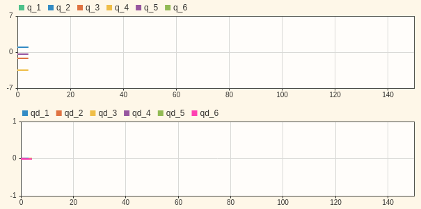
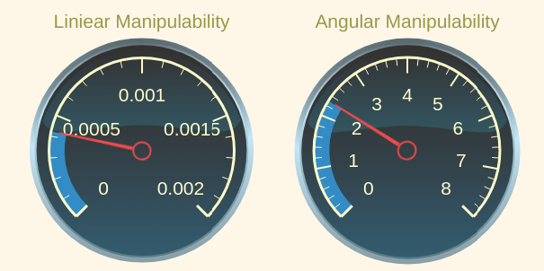
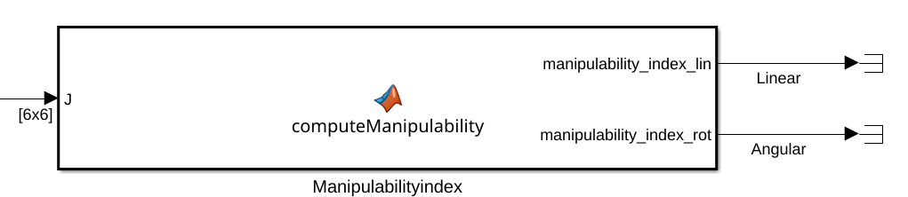
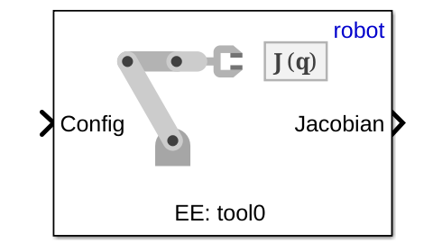
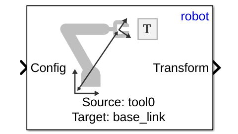
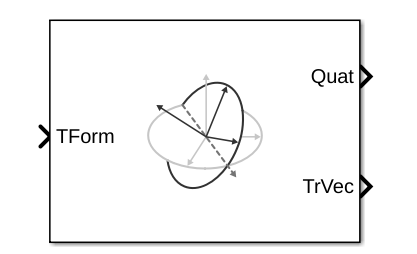

# Exercise 5.4 \- Universal Robots in task space using velocity control

So far all control implementation have been made in joint space.


In this exercise you will setup a velocity controller operating in task space. 

# Load the Robot

Select a UR of your choice and load it either via the urdf files or from the robotic system toolbox. 

```matlab
urmodel = 'universalUR3e';
robot = loadrobot(robotmodel, DataFormat="column"); 
```
# Start the Simulation

Don't forget to select the same robot as the model. 

```matlab
StartTutorialApplication('simulation','model', urmodel, 'controller','velocity', 'docker',false)
StartTutorialApplication('safety_nodes', 'docker',false)
StartTutorialApplication('trajectory','docker',false) %sends a 0 torque when no other command has been sent
```

Remember that you can slow down the simulation as: 


SetSimulationSpeed( SpeedFactor, 'docker', false)

# Joint Limits

Setup the velocity limit as: 

 $$ {\dot{\;q} }_{\lim } =\left\lbrack \begin{array}{c} 0\ldotp 7\newline 0\ldotp 7\newline 0\ldotp 7\newline 0\ldotp 7\newline 0\ldotp 7\newline 0\ldotp 7 \end{array}\right\rbrack \left\lbrack \frac{\textrm{rad}}{s}\right\rbrack $$ 
# Goal Configurations

Try different configuration and convert it into a homogeneous transform matrix. Use configurations that do not result in a singularity. 


Store them as: 

-  T\_desired\_1 
-  T\_desired\_2 
-  T\_desired\_3 

Using joint configurations and the forward kinematics ensures the resulting transforms are reachable by the robot.

 $$ T_{\textrm{desired},i} \left(q_{\textrm{config},i} \right)=\textrm{forward}_\textrm{kinematics}\left(q_{\textrm{config},i} \right) $$ 

or using the Robotic System Toolbox function as


 $T_{\textrm{desired},i}$ = getTransform(robot, config\_i, "tool0", "base\_link");


However you can also try other transform matrices. You can build them by using the transl() and trotm(angle, 'axis') functions. 


visualize the configurations in rviz: 


```matlabTextOutput
Published static transform: base_link → target_1
Published static transform: base_link → target_2
Published static transform: base_link → target_3
```

### Singular Configurations

Below we will setup some singular configurations. 

```matlab
singular_configuration1 = [0,-pi/2,0,-pi/2,0,0]'; 
Singular_1 = getTransform(robot, singular_configuration1, "tool0", "base_link");
StaticFrameBroadcaster(Singular_1, 'singular_1');
```

```matlabTextOutput
Published static transform: base_link → singular_1
```

```matlab

singular_configuration2 = [pi/3,0,0,-pi/2,0,0]'; 
Singular_2 = getTransform(robot, singular_configuration2, "tool0", "base_link");
StaticFrameBroadcaster(Singular_2, 'singular_2');
```

```matlabTextOutput
Published static transform: base_link → singular_2
```

# Error computation

This controller operates in **task space**, meaning that errors are computed directly from the desired and current **homogeneous transformation matrices**.


Let

 $$ T_{\textrm{desired}} =\left\lbrack \begin{array}{cc} R_{\textrm{desired}}  & t_{\textrm{desired}} \newline 0 & 1 \end{array}\right\rbrack $$ 

 $$ T_{\textrm{current}} \left(q\right)=\left\lbrack \begin{array}{cc} R_{\textrm{current}}  & t_{\textrm{current}} \newline 0 & 1 \end{array}\right\rbrack $$ 

with the rotation matrix $R_i \in \mathbb{R}{\;}^{3\textrm{x3}} \;$ and the position vector $t_i \in {\mathbb{R}}^{3\textrm{x1}}$ 

## Position Error (task space)

the position error computation is straight forward: 

 $$ e_{\textrm{pos}} =t_{\textrm{desired}} -t_{\textrm{current}} $$ 
## Orientation Error (task space)

The orientation error is **not** as straightforward.


Euler angle representations are unsuitable because they suffer from **gimbal lock** and discontinuities.


To compute a **singularity\-free** orientation error, the rotation matrices are first converted to **unit quaternions**.


The error quaternion is computed as a quaternion product: 

 $$ q_{\textrm{error}} =q_{\textrm{desired}} \otimes q_{\textrm{current}}^{-1} $$ 

Note that the operand $\otimes$ is not a normal multiplication. 

### Quaternions

Remember a unit quaternion is made up of 4 values: 

 $$ q=\left\lbrack \begin{array}{c} w\newline v \end{array}\right\rbrack =\left\lbrack \begin{array}{c} w\newline x\newline y\newline z \end{array}\right\rbrack $$ 

where

-  w is the scalar part 
-  v the vector part  
-  and $||q||=1$ 

The conjugate of a quaternion can be build as: 

 $$ q^{-1} =\left\lbrack \begin{array}{c} w\newline -v \end{array}\right\rbrack $$ 
## Quaternion Error

Compute the orientation error as follows. 


let 


 $q_{\textrm{desired}} =\left\lbrack \begin{array}{c} w_d \newline v_d  \end{array}\right\rbrack$ and $q_{\textrm{current}}^{-1} =\left\lbrack \begin{array}{c} w_{\textrm{current}} \newline -v_{\textrm{current}}  \end{array}\right\rbrack =\left\lbrack \begin{array}{c} w_c \newline v_c  \end{array}\right\rbrack$ 


compute the error quaternion as: 

 $$ q_{\textrm{error}} =\left\lbrack \begin{array}{c} w_e \newline v_e  \end{array}\right\rbrack $$ 

with 

 $$ w_e =w_d \cdot w_c -v_d^T \cdot v_c $$ 

and

 $$ v_e =w_d \cdot v_c +w_c \cdot v_d +v_d \times v_c $$ 

(The operand $\times$ is a cross product)


A quaternion q and \-q represent the same orientation. 


To ensure that we use the shortest rotation to align the orientations, you must set the error quaternion as: 

 $ $ \left\lbrace \begin{array}{ll} q_e =\left\lbrack \begin{array}{c} w_e \newline v_e  \end{array}\right\rbrack  & \textrm{if}\;w_e >0\\
q_e =\left\lbrack \begin{array}{c} -w_e \newline -v_e  \end{array}\right\rbrack  & \textrm{if}\;w_e <0
\end{array}\right. $ $ 

### Compute error vector $e_{\textrm{ori}}$ 

let 

 $$ \textrm{nv}=||v_e || $$ 

then you can compute the angle $\theta$ as: 

 $$ \theta =2\cdot \textrm{atan2}\left(\textrm{nv},w_e \right) $$ 

finally compute $e_{\textrm{ori}}$ depending on the angle as: 

 $ $ \left\lbrace \begin{array}{ll} e_{\textrm{ori}} =\left\lbrack \begin{array}{c} 0\newline 0\newline 0 \end{array}\right\rbrack  & \textrm{if}\;\theta <{10}^{-10} \\
e_{\textrm{ori}} =\theta \cdot \frac{v_e }{||v_e ||}=\theta \cdot \frac{v_e }{\textrm{nv}} & \textrm{if}\;\theta >{10}^{-10} 
\end{array}\right. $ $ 

## Weighted Error

As the manipulability of the position is generally smaller than the manipulability of the orientation, we have to apply a weights to the error to account for this. 


Initialize with these weights and update them if you have to:

 $ K_{\textrm{position}} = $ $ \left\lbrack \begin{array}{ccc} 1 & 0 & 0\newline 0 & 1 & 0\newline 0 & 0 & 1 \end{array}\right\rbrack $ 

 $ K_{\textrm{orientation}} = $ $ \left\lbrack \begin{array}{ccc} 0\ldotp 5 & 0 & 0\newline 0 & 0\ldotp 5 & 0\newline 0 & 0 & 0\ldotp 5 \end{array}\right\rbrack $ 

 $$ e_{\textrm{position}} =K_{\textrm{position}} \cdot e_{\textrm{pos}} $$ 

 $$ e_{\textrm{orientation}} =K_{\textrm{orientation}} \cdot e_{\textrm{ori}} $$ 

Initialize your weights here


build the error with respect to your jacobian: 

 $ $ e=\left\lbrace \begin{array}{ll} \left\lbrack \begin{array}{c} e_{\textrm{position}} \newline e_{\textrm{orientation}}  \end{array}\right\rbrack  & \textrm{if}\;J=\left\lbrack \begin{array}{c} J_p \newline J_{\theta \;}  \end{array}\right\rbrack \;\\
\left\lbrack \begin{array}{c} e_{\textrm{orientation}} \newline e_{\textrm{position}}  \end{array}\right\rbrack  & \textrm{if}\;J=\left\lbrack \begin{array}{c} J_{\theta \;} \newline J_p  \end{array}\right\rbrack \;
\end{array}\right. $ $ 
# Pseudoinverse Jacobian with least square damping

We can improve the behavior of the robot near singularities by using a least square damping jacobian pseudo inverse.


Compute it as follows: 

 $$ J_{\lambda \;}^{\dagger} =J^T \cdot {\left({J\cdot \;J}^T +2\cdot \lambda^2 \cdot I\right)}^{-1} $$ 
# Dashboard

Once you open the simulink file, you'll see a dashboard with multiple input and monitoring options. 

## Transform selector

Allows you to switch between your previously defined transformations.





 selecting a transform will switch the input from: 





make sure all Transformations are loaded in your workspace. 

## Reset configuration

Some required joint velocities may result in your robot joints reaching their limits ( $\pm 2\pi$ for all joints except the last wrist joint). You can flip the switch while in simulation to move all joints to 0. 


## Lambda selection 

you can tune your lambda during simulation by using the slider.





The slider value can be used in the constant block: 




## Monitoring States

You have two live plots showing your the joint configuration q and the joint velocities qd. 




## Monitoring Manipulability

You have two gauges showing you the current manipulability index. Their limits are setup for a UR3e model. 


If you use a larger model, you may have to adjust the limits. 





The measurements are linked to the output of this matlab function block: 




# Simulink Blocks

You can solve this exercise by using the following (new) Simulink Blocks. 

## Get Jacobian (Robotic System Toolbox)

select:

-  'robot' as the robot  
-  'tool0' as the End Effector.  



### Inputs: 

Input a joint configuration obtained from the GetJointValues subsystem as $q\in \mathbb{R}{\;}^{6\textrm{x1}}$ 

### Outputs: 

The Jacobian as $J\left(q\right)=\left\lbrack \begin{array}{c} J_{\theta \;} \newline J_p  \end{array}\right\rbrack$ 

## Get Transform (Robotic System Toolbox)

specify: 

-  'robot' as Ridged body tree  
-  'tool0' as the Source body 
-  'base\_link' as the Target body 



## Coordinate Transformation Conversion (Robotic System Toolbox)

specify: 

-  'Homogeneous Transformation' as Input Representation 
-  'Quaternion' as Output Representation 
-  check 'Show TrVec output port' 



# Task
## Control Scheme

Setup the control scheme to control the robot using the velocity command. 

## Matlab function blocks

To complete the scheme you will have to write the following matlab function blocks: 

-  Pseudoinverse Jacobian with least square damping 
-  Error computation using quaternion orientation error 
-  Manipulability index computation (specific block already in place, see above)  
## Analyze 
-  Analyze the behavior for different values of $\lambda$.  
-  When $\lambda =0$ there is no damping.  
-  Specifically analyze how it modifies the behavior near singular configurations.  
-  Analyze the behavior of different weights on rotation error and position error  


