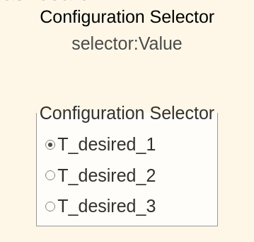
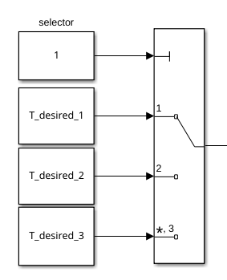
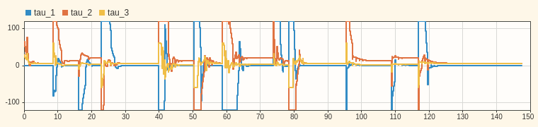
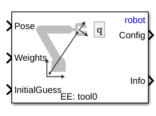
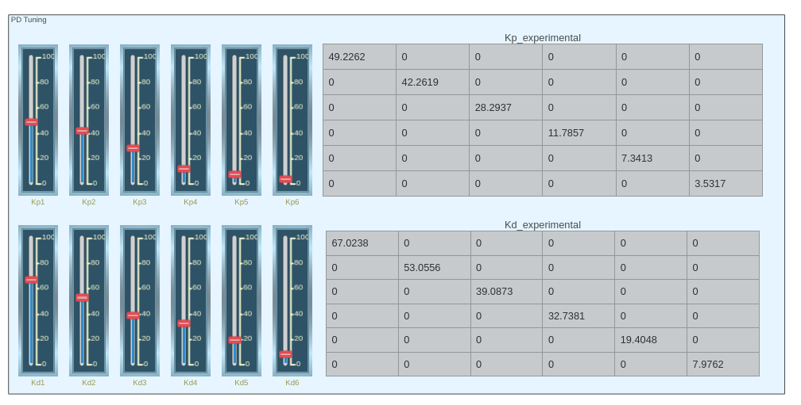
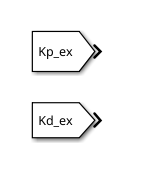
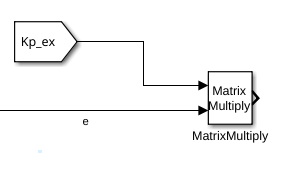

# Exercise 5.5 \- Universal Robots in task space using effort control

In this exercise you will control a Universal Robots manipulator using an inverse kinematic solution that is controller using the effort command. 

# Start the Simulation
```matlab
urmodel = 'ur3e'
StartTutorialApplication('Simulation','Controller', 'Effort', 'Model',urmodel, 'Docker', false);
StartTutorialApplication('Trajectory', 'Docker', false);
StartTutorialApplication('Safety_nodes','docker',false, 'model','threelink'); %sends a 0 torque when no other command has been sent
```

Remember that you can slow down the simulation as: 


SetSimulationSpeed( SpeedFactor, 'docker', false)

# Load the Robot

import your Universal robot of choice using urdf files and set gravity in \-z direction. 


# Parameters

Setup your parameters as in Exercise 4.2.


Set: 

-  Kp (can be scale during simulation) 
-  Kd (can be scale during simulation) 
-  taulim according to your robot 

# Configurations 

Try different configurations


store them as: 

-  T\_desired\_1 
-  T\_desired\_2 
-  T\_desired\_3 
-  qd\_desired 

Using joint configurations and the forward kinematics ensures the resulting transforms are reachable by the robot.

 $$ T_{\textrm{desired},i} \left(q_{\textrm{config},i} \right)=\textrm{forward}_\textrm{kinematics}\left(q_{\textrm{config},i} \right) $$ 

or using the Robotic System Toolbox function as


 $T_{\textrm{desired},i}$ = getTransform(robot, config\_i, "tool0", "base\_link");


However you can also try other transform matrices. You can build them by using the transl() and trotm(angle, 'axis') functions. 

```matlab
config_example1 = [0,-pi/4,pi/2,-pi/3,pi/7,pi/5]';
T_desired_1 = getTransform(robot, config_example1, "tool0", "base_link");

config_example2 = [pi/3,-pi/4,pi/4,-pi/2,pi/9,pi/2]';
T_desired_2 = getTransform(robot, config_example2, "tool0", "base_link");

config_example3 = [pi/3,pi/3,-pi/1.5,pi/9,pi/8,0]';
T_desired_3 = getTransform(robot, config_example3, "tool0", "base_link");

```
# Visualization

Visualize it in rviz. 

```matlab
StaticFrameBroadcaster(T_desired_1, 'target_1');
```

```matlabTextOutput
Published static transform: base_link → target_1
```

```matlab
StaticFrameBroadcaster(T_desired_2, 'target_2');
```

```matlabTextOutput
Published static transform: base_link → target_2
```

```matlab
StaticFrameBroadcaster(T_desired_3, 'target_3');
```

```matlabTextOutput
Published static transform: base_link → target_3
```

# Dashboard

In the Simulink file you will find the dashboard section that allows you to switch between the configurations, see the current torque output and scale the Kp and Kd matrix during simulation. 

### Configuration Selector 

Check one of these boxes to select the goal transforms. 





this selection block is linked to: 




### Scale Kd and Kp

By using the sliders you can alter the gain value of their corresponding K\_scale blocks: 


### View Torque Trajectory

The Dashboard scope allows you to see the current torques live during simulation (like a scope). 




# Task 1 

Open the file Exercise\_5\_5\_1.slx and setup a control scheme that operates using a transformation matrix as an input. 

## Task 1.1

To obtain a valid joint configuration that satisfies the desired pose use the "inverse Kinematic" block





Specify: 

-  'robot' as Ridgid body tree 
-  'tool0' as EE 
### Inputs: 
-  Desired Transform as Pose 
-  Current Joint Configuration as InitalGuess 
-  $\displaystyle \textrm{weights}\in {\mathbb{R}}^{6\textrm{x1}}$ 

The weights input are the tolerances permitted. Set the tolerance to ${10}^{-3}$ for position and ${10}^{-2}$ for orientation. 

## Task 1.2

Use an inverse dynamic control scheme (as in Exercise 5.4) to move the endeffector to the solution of the inverse kinematic block. 

# Task 2

Open the file Exercise\_5\_5\_2.slx and setup a control scheme that operates using a transformation matrix as an input. 

## Task 2.1

Identical as Task 1.1 

## Task 1.2

Use a PID with gravity compensation control scheme to reach the computed joint configuration. 

### Tuning of Gains 

You can follow the approach of estimating the gains using the Inertia matrix or you try to experimentally determine good gains. 


You can tune the gains by using the vertical sliders, on the right side you will see the resulting gain matrix. 





To use them you can use the "From" blocks: 





You can do calculations with the matrices by e.g. using a matrix multiply block: 





