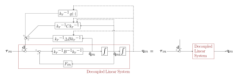

# Control 

In this tutorial, we will study two important control strategies for robot manipulators: **centralized** and **decentralized control**.

The goal is to understand when each approach is appropriate, what assumptions they rely on, and how they affect performance.

# Motivation

Robotic manipulators are nonlinear and highly coupled systems.

This means that the motion of one joint often influences the forces and torques acting on the others. For example, moving the shoulder of a robotic arm changes the torque required at the elbow, even if the elbow itself does not move.

The task of the controller is to ensure that the manipulator follows a desired trajectory despite these couplings and nonlinear effects. There are two general philosophies to approach this problem:

-  In **decentralized control**, each joint is controlled separately, almost as if it were an independent system. The dynamic couplings with the other joints are not explicitly modeled, but instead treated as disturbances. This makes the controller simpler, but performance may degrade if the couplings are strong. 
-  In **centralized control**, the full dynamics of the manipulator are taken into account. The inertia matrix, Coriolis and centrifugal terms, and gravity are explicitly included in the control law, so that the couplings are actively compensated. This generally leads to more precise trajectory tracking, at the cost of requiring an accurate model and more computation. 
# Decentralized Control

In a decentralized control scheme, each joint of the manipulator is treated as an independent system. The idea is to design a simple controller, such as a PD controller, for each joint separately. The interactions between joints, which in reality exist due to the coupled dynamics, are not modeled explicitly. Instead, they are regarded as external disturbances that the local controller should reject as best as possible.

This approach has the advantage of simplicity: it requires only local joint measurements and basic modeling of each actuator. Moreover, decentralized control is robust in the sense that it does not depend on precise knowledge of the complete robot dynamics. However, it also has a clear drawback: when the manipulator executes fast or complex motions, the coupling effects become significant, and the performance of purely decentralized control degrades.

A common improvement is to include **feedforward terms** based on approximate knowledge of the dynamics. For example, adding gravity compensation or partial torque predictions helps reduce the effect of couplings. This way, decentralized controllers can achieve good performance without becoming overly complex.

## Gravity\-Compensated PD Control

One of the simplest ways to improve decentralized control is to add **gravity compensation**. The idea is that, without compensation, the controller must fight against the constant gravitational torques acting on the joints. This can lead to large steady\-state errors, especially when holding the manipulator in a fixed posture.

By explicitly including a feedforward term equal to the gravity vector g(q), we can cancel the static gravitational effect. The controller then only needs to handle the deviations from the desired trajectory.

The control law:

 $$ u=g\left(q\right)+k_p \cdot \left(q_d -q\right)-k_d \cdot \left(\dot{q_d } -\dot{q} \right) $$ 

simplifies to 

 $$ u=g\left(q\right)+k_p \cdot \left(q_d -q\right)-k_d \cdot \dot{\;q} $$ 

for $\dot{q_d } =0$ 

Resulting in the control scheme: 

# Centralized Control

In contrast, centralized control explicitly incorporates the coupled dynamics of the robot into the control law. Instead of treating joint interactions as disturbances, they are modeled and compensated using the full dynamic equations of the manipulator.

The robot dynamics can be written in the standard form:

 $$ B\left(q\right)\cdot \;\ddot{\;q} +C\left(q,\dot{q} \right)\cdot \dot{q} +F\cdot \dot{q} +g\left(q\right)=\tau $$ 

In a centralized scheme, the controller uses this model to compute torques that cancel out the nonlinear terms. This results in a simpler, often linear, closed\-loop behavior. The advantage is much better tracking accuracy, especially in tasks involving multiple joints moving simultaneously. The drawback is that centralized control requires a reasonably accurate model of the robot. If the parameters are uncertain or change over time, performance may deteriorate.

