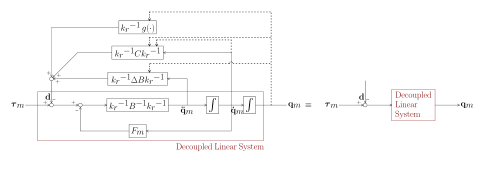

# Control 

En aquest tutorial, estudiarem dues estratègies de control importants per a manipuladors robòtics: **control centralitzat** i **control descentralitzat**.

L’objectiu és entendre quan és apropiat cada enfocament, en quines hipòtesis es basen i com afecten el rendiment.

# Motivació

Els manipuladors robòtics són sistemes no lineals i altament acoblats.

Això vol dir que el moviment d’una articulació sovint influeix en les forces i els parells que actuen sobre les altres. Per exemple, moure l’espatlla d’un braç robòtic canvia el parell requerit al colze, encara que el colze mateix no es mogui.

La tasca del controlador és garantir que el manipulador segueixi una trajectòria desitjada malgrat aquests acoblaments i efectes no lineals. Hi ha dues filosofies generals per abordar aquest problema:

-  En el **control descentralitzat**, cada articulació es controla per separat, gairebé com si fos un sistema independent. Els acoblaments dinàmics amb les altres articulacions no es modelen explícitament, sinó que es tracten com a pertorbacions. Això fa que el controlador sigui més senzill, però el rendiment pot degradar-se si els acoblaments són forts. 
-  En el **control centralitzat**, es tenen en compte les dinàmiques completes del manipulador. La matriu d’inèrcia, els termes de Coriolis i centrífugs, i la gravetat s’inclouen explícitament en la llei de control, de manera que els acoblaments es compensen activament. Això generalment dona lloc a un seguiment de trajectòria més precís, a costa de requerir un model acurat i més càlcul. 
# Control descentralitzat

En un esquema de control descentralitzat, cada articulació del manipulador es tracta com un sistema independent. La idea és dissenyar un controlador senzill, com ara un controlador PD, per a cada articulació per separat. Les interaccions entre articulacions, que en realitat existeixen a causa de la dinàmica acoblada, no es modelen explícitament. En canvi, es consideren pertorbacions externes que el controlador local hauria de rebutjar tan bé com sigui possible.

Aquest enfocament té l’avantatge de la simplicitat: només requereix mesures articulars locals i un modelatge bàsic de cada actuador. A més, el control descentralitzat és robust en el sentit que no depèn d’un coneixement precís de la dinàmica completa del robot. Tanmateix, també té un inconvenient clar: quan el manipulador executa moviments ràpids o complexos, els efectes d’acoblament esdevenen significatius i el rendiment d’un control purament descentralitzat es degrada.

Una millora habitual és incloure **termes feedforward** basats en un coneixement aproximat de la dinàmica. Per exemple, afegir compensació de gravetat o prediccions parcials de parell ajuda a reduir l’efecte dels acoblaments. D’aquesta manera, els controladors descentralitzats poden assolir un bon rendiment sense esdevenir massa complexos.

## Control PD amb compensació de gravetat

Una de les maneres més senzilles de millorar el control descentralitzat és afegir **compensació de gravetat**. La idea és que, sense compensació, el controlador ha de lluitar contra els parells gravitatoris constants que actuen sobre les articulacions. Això pot provocar grans errors en règim estacionari.

Incloent explícitament un terme feedforward igual al vector de gravetat g(q), podem cancel·lar l’efecte gravitatori estàtic.

La llei de control:

 $$ u=g\left(q\right)+k_p \cdot \left(q_d -q\right)-k_d \cdot \left(\dot{q_d } -\dot{q} \right) $$ 

se simplifica a 

 $$ u=g\left(q\right)+k_p \cdot \left(q_d -q\right)-k_d \cdot \dot{\;q} $$ 

per a $\dot{q_d } =0$ 

donant lloc a l’esquema de control: 

# Control PID

Una altra manera de millorar el control descentralitzat i eliminar l’error en règim estacionari és introduir un terme d’integració. És important afegir algun mecanisme anti-windup per evitar que el terme d’integració s’acumuli quan la posició és molt llunyana. La idea és moure les articulacions tan a prop com sigui possible de la posició desitjada fent servir un esquema feedforward PD + compensació de gravetat. El terme integral eliminarà qualsevol error en règim estacionari. 

# Control centralitzat

En canvi, el control centralitzat incorpora explícitament la dinàmica acoblada del robot a la llei de control. En lloc de tractar les interaccions entre articulacions com a pertorbacions, es modelen i es compensen fent servir les equacions dinàmiques completes del manipulador.

La dinàmica del robot es pot escriure en la forma estàndard:

 $$ B\left(q\right)\cdot \;\ddot{\;q} +C\left(q,\dot{q} \right)\cdot \dot{q} +F\cdot \dot{q} +g\left(q\right)=\tau $$ 

En un esquema centralitzat, el controlador fa servir aquest model per calcular parells que cancel·len els termes no lineals. Això dona lloc a un comportament en bucle tancat més senzill, sovint lineal. L’avantatge és una precisió de seguiment molt millor, especialment en tasques que impliquen múltiples articulacions movent-se simultàniament. L’inconvenient és que el control centralitzat requereix un model del robot raonablement acurat. Si els paràmetres són incerts o canvien amb el temps, el rendiment pot deteriorar-se.