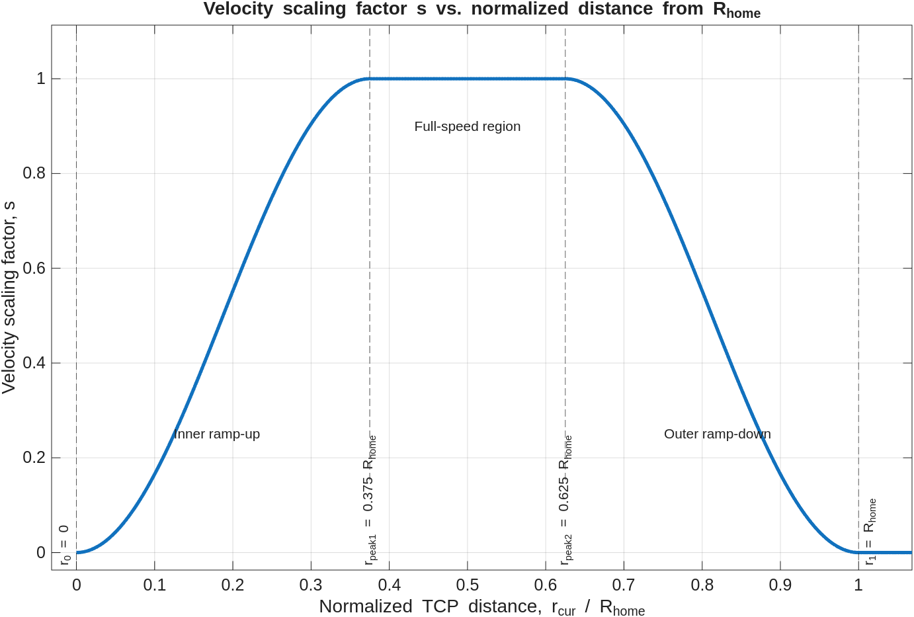

<a id="TMP_7ab2"></a>

# Capstone Project \- Advanced Teleoperation ROS 

In this capstone exercise, you will combine computer vision and robot motion control to create a simple vision\-based interaction with a Universal Robots UR3e manipulator. The goal is to detect selected fruits in a camera image, track their movement, and use this visual information to command Cartesian motion of the robot TCP.


The exercise connects several important robotics concepts into one practical workflow. First, you will use a YOLO object detector to identify fruits in the camera image and extract useful image features such as the object centroid and bounding box size. These features are then used to estimate how the fruit moves in the image and whether it moves closer to or farther away from the camera.


Based on the detected fruit type, two different control modes are implemented. In the first mode, the fruit motion is mapped to a Cartesian velocity command in the robot base frame, so that the TCP follows the perceived fruit movement. In the second mode, the fruit motion is interpreted in the TCP frame, so that the robot moves along its own tool axis, for example when the fruit moves toward or away from the camera.


The commanded Cartesian velocity is then converted into joint velocities using the robot Jacobian. To improve robustness near singular configurations, a damped least\-squares pseudoinverse is used. Additional safety measures are included, such as Cartesian velocity saturation, joint velocity scaling, and dynamic workspace\-based velocity scaling. The dynamic scaling reduces the robot velocity when the TCP approaches less desirable regions of the workspace and allows full speed only inside a preferred operating region.


By the end of this exercise, you should understand how image\-based measurements can be transformed into robot motion commands, how Cartesian velocity control can be implemented using the Jacobian, and why safety mechanisms such as velocity limits, damping, and workspace\-dependent scaling are necessary when controlling a real robot.

<!-- Begin Toc -->

## Table of Contents
&emsp;[Computer Vision](#TMP_2b2a)
 
&emsp;&emsp;[Fruit Detection Function](#TMP_3c3e)
 
&emsp;&emsp;[Video output](#TMP_28fb)
 
&emsp;&emsp;[Testing](#TMP_4c68)
 
&emsp;[Robotics](#TMP_8cce)
 
&emsp;&emsp;[Interprete fruit motion](#TMP_672e)
 
&emsp;&emsp;&emsp;[Base Fruit](#TMP_140a)
 
&emsp;&emsp;&emsp;[TCP Fruit](#TMP_6528)
 
&emsp;&emsp;[Velocity Scaling](#TMP_764c)
 
&emsp;&emsp;&emsp;[Basic Control gains](#TMP_02c1)
 
&emsp;&emsp;&emsp;[Dynamic velocity scaling](#TMP_934d)
 
&emsp;&emsp;&emsp;[Derivation of the velocity regions](#TMP_87df)
 
&emsp;&emsp;[Joint Velocity Computation](#TMP_148f)
 
&emsp;&emsp;[Cartesian Velocity Saturation](#TMP_4355)
 
&emsp;&emsp;[Damped Jacobian Pseudoinverse](#TMP_7373)
 
&emsp;&emsp;&emsp;[Compute Joint Velocities](#TMP_5307)
 
&emsp;&emsp;&emsp;[Scale/saturate the Joint Velocities](#TMP_0853)
 
&emsp;&emsp;&emsp;[Apply joint velocities to the real robot](#TMP_6c62)
 
&emsp;&emsp;[Control Loop](#TMP_3f49)
 
&emsp;[Implementation](#TMP_6a3d)
 
&emsp;&emsp;[Robotics Setup](#TMP_52eb)
 
&emsp;&emsp;[Visualize the Regions](#TMP_6301)
 
<!-- End Toc -->
<a id="TMP_2b2a"></a>

# Computer Vision

In the vision part of this exercise, you will use a camera and a YOLO object detector to identify selected fruits in the camera image. The detector returns bounding boxes, confidence scores, and class labels for the detected objects. From these detections, the exercise extracts the fruit with the highest confidence and computes two simple image features: the normalized centroid position and the normalized bounding box size.


These features are later used as input for the robot control loop. Changes in the centroid indicate how the fruit moves in the image plane, while changes in the bounding box size are used as a rough estimate of whether the fruit moves closer to or farther away from the camera. The output image is also annotated with the selected bounding box and centroid, so that the detection result can be visually checked during the experiment.


Setup the camera and load Yolo Classifier 

```matlab
cam = webcam(); 
det = yolov8ObjectDetector2('yolov8s');
```
<a id="TMP_3c3e"></a>

## Fruit Detection Function

Setup the detection function below. 


The function should have the following inputs: 

-  cam object 
-  yolo model 
-  required confidence  
-  video quality scaling  

The fucntion should have the following outputs: 

-  centroid 
-  Bounding box size (as hight and width) 
-  detected fruit with the highest confidence  
-  output image with bounding box and centroid drawn into it 

Behavior of the function, implement: 

-  scaling of image quality using the function imresize() 
-  filter the detected categories, only return fruits 
-  only output fruits that have a confidence level above the threshold 
-  only output the fruit with the highest confidence level 
-  normalize the centroid position and bounding box size based on the image size (hight and width)  
```matlab
function [centroid, BB_size, best_match_fruit, Iout] = Capstone_Fruit_Detection(cam, yolo_model, minConf, video_scale)
   
end

```
<a id="TMP_28fb"></a>

## Video output

You can create a figure to view the video feed using the function createCapstoneFigure(). The function will return the axis handle, which can be used to plot the image in the created window figure. 

```matlab
axis_handle = createCapstoneFigure(); 
```

To show an image in this figure window use the following syntax: 

```matlab
imshow(Image, 'Parent', axis_handle); 
```
<a id="TMP_4c68"></a>

## Testing

Test the classifier and tune the video scaling and confidence threshold. Aim to balance detection quality and computation time. 

```matlab
video_scale = 1; 
min_confidence = 0.99; 

[centroid, BB_size, best_match_fruit, Iout] = Capstone_Fruit_Detection(cam, det, min_confidence, video_scale);
% Display the output image with annotations
imshow(Iout, 'Parent', axis_handle)

```
<a id="TMP_8cce"></a>

# Robotics

In the robotics part of this exercise, the visual information from the fruit detector is converted into motion commands for the UR3e robot. The detected fruit movement is first mapped to a Cartesian velocity command, either in the robot base frame or in the TCP frame, depending on the selected control mode. This allows the robot to react differently to different fruit classes.


The Cartesian velocity command is then limited for safety and scaled based on the current TCP position inside the robot workspace. This dynamic workspace scaling reduces the commanded velocity near less desirable regions and allows full velocity only inside a preferred operating band. The final Cartesian velocity is converted into joint velocities using the robot Jacobian and a damped least\-squares pseudoinverse, which improves robustness near singular configurations.


Before sending the command to the robot, the joint velocities are checked against predefined velocity limits and scaled if necessary. This ensures that the robot follows the visual command while respecting both Cartesian and joint\-level safety constraints.

<a id="TMP_672e"></a>

## Interprete fruit motion

Receive the centroid position and the bounding box dimensions from the detection function, and compute the changes in the position and the change in the area of the bounding box and converts these changes to Cartesian velocity of the robot, either in the base frame (Base fruit control mode) or in the TCP frame (TCP fruit control mode).


 ***1. Compute the deltas as:*** 

&nbsp;&nbsp;&nbsp;&nbsp;&nbsp;&nbsp;&nbsp;&nbsp; $$ \Delta \textrm{Centroid}\left(t\right)=\left\lbrack \begin{array}{c} {\textrm{centroid}}_1 \left(t\right)-{\textrm{centroid}}_1 \left(t-1\right)\newline {\textrm{centroid}}_2 \left(t\right)-{\textrm{centroid}}_2 \left(t-1\right) \end{array}\right\rbrack $$ 

&nbsp;&nbsp;&nbsp;&nbsp;&nbsp;&nbsp;&nbsp;&nbsp; $$ {\textrm{BB}}_{\textrm{area}} ={\textrm{BB}}_x \cdot {\textrm{BB}}_y $$ 

&nbsp;&nbsp;&nbsp;&nbsp;&nbsp;&nbsp;&nbsp;&nbsp; $$ \Delta {\textrm{BB}}_{\textrm{area}} \left(t\right)={\textrm{BB}}_{\textrm{area}} \left(t\right)-{\textrm{BB}}_{\textrm{area}} \left(t-1\right) $$ 

&nbsp;&nbsp;&nbsp;&nbsp;&nbsp;&nbsp;&nbsp;&nbsp; $$ \Delta {\textrm{BB}}_{\textrm{area}-\textrm{scaled}} =\frac{\Delta {\textrm{BB}}_{\textrm{area}} \left(t\right)}{{\textrm{BB}}_{\textrm{area}} \left(t-1\right)} $$ 

***2. Compute de error:***


Two control modes should be implemented based on the tracked fruit. You need to map $\Delta \textrm{Centroid}\;$ and $\Delta {\textrm{BB}}_{\textrm{area}-\textrm{scaled}}$ to the error vector. 

<a id="TMP_140a"></a>

### Base Fruit

Map $\Delta \textrm{Centroid}\;$ and $\Delta {\textrm{BB}}_{\textrm{area}-\textrm{scaled}}$ to the baseframe coordinates of your robot. The movement fruit movement should result in the same TCP movement. 


This could result in a error vector of: $e=\left\lbrack \begin{array}{c} \Delta {\textrm{Centroid}}_1 \newline \Delta {\textrm{BB}}_{\textrm{area}-\textrm{scale}} \newline -\Delta {\textrm{Centroid}}_2  \end{array}\right\rbrack$ 

<a id="TMP_6528"></a>

### TCP Fruit

When the TCP fruit it detected the TCP should move only along its Z\-axis. Moving the fruit towards the camera should result in positive TCP Z movement. 


Map the fruit detection to single axis linear motion: 

-  Choose the index with the largest absolute value and set the mapped error vector index to $\pm 1$ 

e.g. for a error vector of $e=\left\lbrack \begin{array}{c} -0\ldotp 2\newline -0\ldotp 5\newline 0\ldotp 4 \end{array}\right\rbrack$ the mapped error vector should be $e_{\textrm{mapped}} \left\lbrack \begin{array}{c} 0\newline -1\newline 0 \end{array}\right\rbrack$ 


***3. Compute de robot velocities:***


Convert the error vector to velocities. 


You need to measure the amount of time between detections as dt, additionally you have to scale the raw\_error with a velocity scaling as the resulting velocity could be too small or too large depending on your setup (computation time and camera image size)

 $$ v_{\textrm{cartesian}} =\frac{e_{\textrm{mapped}} }{\textrm{dt}}\cdot {\textrm{velocity}}_{\textrm{scaling}} $$ 
<a id="TMP_764c"></a>

## Velocity Scaling
<a id="TMP_02c1"></a>

### Basic Control gains

Scale the cartesian velocity with the gain matrix K to obtain the control signal. 

&nbsp;&nbsp;&nbsp;&nbsp;&nbsp;&nbsp;&nbsp;&nbsp; $$ v_{\textrm{input}} \;=K\cdot \;v_{\textrm{cartesian}} $$ 
<a id="TMP_934d"></a>

### Dynamic velocity scaling

Implement a **dynamic velocity scaling** based on the current TCP position inside the robot workspace. The goal is to reduce commanded Cartesian velocity when the TCP approaches regions that are considered unsafe or less desirable, and to allow full velocity only inside a preferred workspace band.


The scaling is based on the current TCP distance from the robot shoulder frame:

```matlab
T_cur_reach = getTransform(ur, q, "tool0", "shoulder_link");
r_cur = norm(tform2trvec(T_cur_reach));
```

So the scalar value `r_cur` is the radial distance between the shoulder frame and the TCP. This distance is then used to compute a velocity scaling factor `s`, where:


&nbsp;&nbsp;&nbsp;&nbsp; s = 0


means the robot stops, and


&nbsp;&nbsp;&nbsp;&nbsp; s = 1


means the full commanded velocity is allowed. 

<a id="TMP_87df"></a>

### Derivation of the velocity regions

The workspace regions are derived from the robot’s home configuration. First, the TCP distance at the home pose is computed:

```matlab
ur_home = [0,-pi/2,0,-pi/2,0,0]';
T_home = getTransform(ur, ur_home, "tool0", "shoulder_link");
R_home = norm(tform2trvec(T_home));
```

This value is used as the outer workspace limit:

```matlab
r1 = R_home;
```

A preferred safe radius is defined as half of the home radius:

```matlab
R_safe = 0.5 * R_home;
```

Around this safe radius, a velocity plateau is created. The width of this plateau transition region is:

```matlab
band_width = 0.25 * R_home;
```

The two peak boundaries are then defined as:

```matlab
r_peak1 = R_safe - band_width/2;
r_peak2 = R_safe + band_width/2;
```

The implemented radial regions are therefore:

```matlab
r0      = 0;
r_peak1 = R_safe - band_width/2;
r_peak2 = R_safe + band_width/2;
r1      = R_home;
```

 

| **Region**  | **TCP radius**  | **Scaling behavior**   |
| :-- | :-- | :-- |
| Inner stop region  | `r_cur <= r0`  | velocity scale `s = 0`   |
| Inner ramp\-up region  | `r0 < r_cur < r_peak1`  | smoothly increases from `0` to `1`   |
| Full\-speed region  | `r_peak1 <= r_cur <= r_peak2`  | velocity scale `s = 1`   |
| Outer ramp\-down region  | `r_peak2 < r_cur < r1`  | smoothly decreases from `1` to `0`   |
| Outer stop region  | `r_cur >= r1`  | velocity scale `s = 0`   |


**Inner ramp\-up region**


Between `r0` and `r_peak1`, the velocity is smoothly increased from zero to full speed:


&nbsp;&nbsp;&nbsp;&nbsp; x = (r\_cur \- r0) / (r\_peak1 \- r0);


&nbsp;&nbsp;&nbsp;&nbsp; s = 0.5 \* (1 \- cos(pi \* x));


&nbsp;&nbsp;&nbsp;&nbsp; At `r_cur = r0`, this gives `s = 0`.


&nbsp;&nbsp;&nbsp;&nbsp; At `r_cur = r_peak1`, this gives `s = 1`.


**Outer ramp\-down region**


Between `r_peak2` and `r1`, the velocity is gradually reduced from full speed to zero:


&nbsp;&nbsp;&nbsp;&nbsp; x = (r\_cur \- r\_peak2) / (r1 \- r\_peak2);


&nbsp;&nbsp;&nbsp;&nbsp; s = 0.5 \* (1 + cos(pi \* x));


&nbsp;&nbsp;&nbsp;&nbsp; At `r_cur = r_peak2`, this gives `s = 1`.


&nbsp;&nbsp;&nbsp;&nbsp; At `r_cur = r1`, this gives `s = 0`.


**Scale the input velocity**


Finally scale the input velocity with the dynamic velocity scaling factor s

&nbsp;&nbsp;&nbsp;&nbsp; $$ v_{\textrm{input}-\textrm{scaled}} =s\left(q\right)\cdot v_{\textrm{input}} $$ 

resulting in the following velocity profile




<a id="TMP_148f"></a>

## Joint Velocity Computation

Use the following functions to get the robot state.


Depending on the detected fruit you need to transform the TCP velocity into baseframe coordinates.

&nbsp;&nbsp;&nbsp;&nbsp; $$ v_{\textrm{base}} \left\lbrace \begin{array}{ll} v & \textrm{if}\;\textrm{detected}\;\textrm{fruit}=\textrm{Base}\;\textrm{fruit}\newline R\cdot v & \textrm{if}\;\textrm{detected}\;\textrm{fruit}=\textrm{TCP}\;\textrm{fruit} \end{array}\right. $$ 
<a id="TMP_4355"></a>

## Cartesian Velocity Saturation

Saturate the cartesian velocity by defining a maximum velocity of $v_{\textrm{linear}-\max } =0\ldotp 25\;\frac{m}{s}$ be aware of the velocity direction. 

<a id="TMP_7373"></a>

## Damped Jacobian Pseudoinverse

Compute the Jacobian, remember that the robotic system toolbox returns $J=\left\lbrack \begin{array}{c} J_{\Theta \;} \newline J_p  \end{array}\right\rbrack$ 


We now want to damp the jacobian based on its minimum singular value decomposition. You can obtain it using svd\_min = min(svd(J))

-  define a thereshhold when the damping starts svd\_thresh = 0.2 
-  define a maximum damping factor e.g. lambda\_max = 1 

Compute the damping factor lambda as follows: 

&nbsp;&nbsp;&nbsp;&nbsp; $$ \lambda =\left\lbrace \begin{array}{ll} \lambda =0 & \textrm{when}\;\sigma_{\min } \ge \sigma_{\textrm{thresh}} \newline \lambda =\lambda_{\max } \cdot \left(1-\min \left(1,{\textrm{sigma}}_{\min } \;/{\textrm{sigma}}_{\textrm{thresh}} \right)\right) & \textrm{when}\;\sigma_{\min } <\sigma_{\textrm{thresh}}  \end{array}\right. $$ 

compute the damped pseudoinverse of the jacobian as: 

&nbsp;&nbsp;&nbsp;&nbsp; $$ J_{\textrm{damped}}^{\dagger} =J^T \cdot {\left(J\cdot J^T +\lambda^2 \cdot I\right)}^{-1} $$ 
<a id="TMP_7c5a"></a>
<a id="TMP_5307"></a>

### Compute Joint Velocities 

Compute the joint velocities using the damped pseudoinverse jacobian as: 

&nbsp;&nbsp;&nbsp;&nbsp; $ \dot{\;q} = $ $ J_{\textrm{damped}}^{\dagger} \cdot v_{\textrm{base}-\textrm{saturated}} $ 

set the angular velocity part to 0. 

<a id="TMP_3ebd"></a>
<a id="TMP_0853"></a>

### Scale/saturate the Joint Velocities 

Check if any of the previously defined joint velocity limits are violated, if so scale the entire $\dot{\;q}$ vector down so their relative velocities stay perserved. 

<a id="TMP_0f01"></a>
<a id="TMP_6c62"></a>

### Apply joint velocities to the real robot

use the function SendJointSpeeds(q\_dot) and send the velocities to the robot driver. 

<a id="TMP_3f49"></a>

## Control Loop

To obtain the current joint state use:

-   = GetJointStates(); 

Dont query the detection at each timestep as the detection is compuationally expensive, instead implement a minimum time between image detections. 


For the overall loop use: 

-  rate = rateControl(freq)  
-  waitfor(rate) for the control loop  

Depending on your hardware you can display more things such as the manipulability elipsoid using 

-  JointStatesToRviz(q, ur\_model, \[ \], 'Ellipsoid', true, 'EllipsoidResolution', 15, 'SendJointStates', false); 

you can display the detection image in the previously created window using 

-  imshow(Iout, 'Parent', axis\_handle) 
<a id="TMP_6a3d"></a>

# Implementation

Move the robot in a non singular position to start use the freedrive mode on the teach pendant to reposition the TCP. 


Setup the following constants here: 

-  frequency and rate 
-  velocity scaling  
-  Base fruit (string)  
-  TCP fruit (string) 
-  sigma\_thresh 
-  lambda\_max 
-  v\_linear\_max 
-  minimum time between detections  
-  load the ur model  
-  define joint velocity limits 
-  gain matrix K 

<a id="TMP_52eb"></a>
#
# Robotics Setup

Start The ROS applicatons to connect to the real robot

```matlab
ur_model="universalUR3e"; 
robot_ip="10.5.20.84";
computer_ip = "10.5.20.90"; 
StartTutorialApplication('Hardware', 'Model', ur_model, 'controller','velocity','robot_ip',robot_ip, 'reverse_ip',computer_ip, 'docker',false); 
%StartTutorialApplication('Simulation','Model', ur_model, 'controller','velocity')
StartTutorialApplication('Trajectory', 'num_points',500, 'docker',false); 
StartTutorialApplication('safety_nodes', 'docker',false); 
```
<a id="TMP_6301"></a>

## Visualize the Regions 

you can use the function VisualizeWorkspace(R\_home) to display the workspace.

```matlab
VisualizeWorkspace(R_home)
```

Initialize the variables and write the control loop below: 

```matlab
% Initialize empty/zero states

%control loop 
while true

end
```

