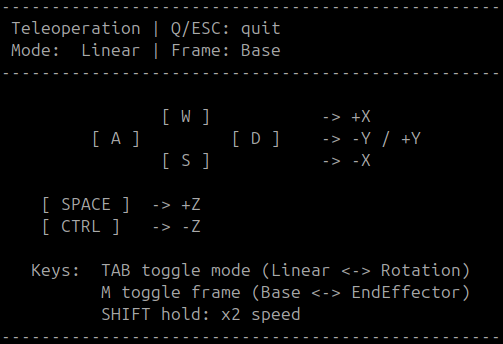

```matlab
clear all
```
# Exercise 3.3 \- Velocity Teleoperation

In this exercise you will write a code to teleoperate a universal robot of your choice. 


When using a teleoperation interface, you will use your keyboard to control a simulated robot. 

# Task: 

Write a code that maps the desired cartesian velocity to the joint space and sends the joint speeds to the simulation environment. The cartesian velocity to be controlled is either w.r.t. the Base frame or the EndEffector frame. 

# Tools: 

You can use predefined functions to retrieve information from the simulation environment. 

-  GetJointStates() returns a vector containing the current configuration as $\vec{q} \in {\mathbb{R}}^{6\textrm{x1}}$ 
-  GetTeleoperation() returns a vector containing the cartesian velocity as $\vec{v} =\left\lbrack \begin{array}{c} \dot{x} \newline \dot{y} \newline \dot{z} \newline \omega_x \newline \omega_y \newline \omega_z  \end{array}\right\rbrack$ and  

&nbsp;&nbsp;&nbsp;&nbsp;&nbsp;&nbsp;&nbsp;&nbsp;&nbsp;&nbsp;&nbsp;&nbsp;&nbsp;&nbsp;&nbsp; a string containing the current reference frame as $\textrm{Mode}\in \left\lbrack \textrm{"Base"},\textrm{"EndEffector"}\right\rbrack$ 

-  SendJointSpeeds(q\_dot) will publish the computed joint velocities to the simulation environment 
# Implementation Tips: 
-  You may choose to model the robot using the Robotic System Toolbox or the Symbolic Toolbox.  
-  Use the function waitfor(time) to implement a delay between broadcasting, start with a frequency of 50 Hz.  
### Hints: 
-  Remember that the Robotic System Toolbox returns the Jacobian as $J=\left\lbrack \begin{array}{c} J_{\Theta \;} \newline J_p  \end{array}\right\rbrack$ 
-  If norm(q\_dot) > 1 you should normalize the velocities as $q_{\textrm{dot},\textrm{norm}} =\frac{q_{\textrm{dot}} }{\textrm{norm}\left(q_{\textrm{dot}} \right)}$ this allows you to better analyze the behaviour near singularities.  
-  Depending on your computers processing power you may be able to plot the manipulability ellipsoid by calling JointStatesToRviz(q, ur\_model, \[ \], 'Ellipsoid', true, 'SendJointStates', false) with the current configuration. If you are using a windows operating system with the docker, this may get slow. You can try to decrease the resolution of the ellipsoid with JointStatesToRviz(q, ur\_model, \[ \], 'Ellipsoid', true, 'EllipsoidResolution', 15, 'SendJointStates', false) or only broadcast it every n steps.  
# Teleoperation Interface

The teleoperation program gives the following input options: 


Desired Velocity (linear or angular) controller by keys W\-A\-S\-D\-SPACE\-CTRL, see the terminal for more information)

-  W for ${\dot{x} }^+ \;\textrm{or}\;\omega_x^+$ 
-  S for ${\dot{x} }^- \;\textrm{or}\;\omega_x^-$ 
-  D for ${\dot{y} }^+ \;\textrm{or}\;\omega_y^+$ 
-  A for ${\dot{y} }^- \;\textrm{or}\;\omega_y^-$ 
-  SPACE for ${\dot{z} }^+ \;\textrm{or}\;\omega_z^+$ 
-  CTRL (Control) for  ${\dot{z} }^- \;\textrm{or}\;\omega_z^-$ 

You can toggle between angular or linear velocity by pressing: 

-  TAB  

You can toggle the reference frame from "Base" to "EndEffector" by pressing: 

-  M 

You can double the speed command by holding: 

-  SHIFT 

To stop the program press: 

-  q or ESC 

You can see the controls in the terminal: 




# Start Applications: 

To start the required programs and simulations execute (once): 

```matlab
% StartTutorialApplication('Simulation', 'Controller','Speed'); 
% StartTutorialApplication('Teleoperation');
```

If you run this on a native ubuntu system (no docker): 

```matlab
StartTutorialApplication('Simulation', 'Controller', 'Speed', 'Docker',false); 
StartTutorialApplication('Teleoperation', 'Docker', false);
```

To see the path of the end\-effector you can run: 

```matlab
% StartTutorialApplication('Trajectory'); 
% If you use ROS on a native Ubuntu system use: 
StartTutorialApplication('Trajectory', 'Docker', false);
```
# Code here: 
```matlab
%%add your setup code here: 

while true
    try %%try helps to avoid the code crashing when starting it before the programs are running
        %%add your loop code here: 


    end
end
```

